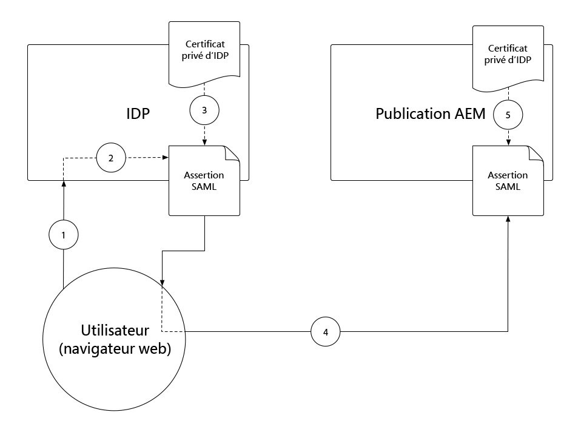
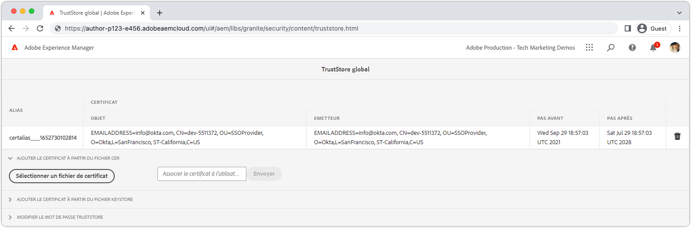
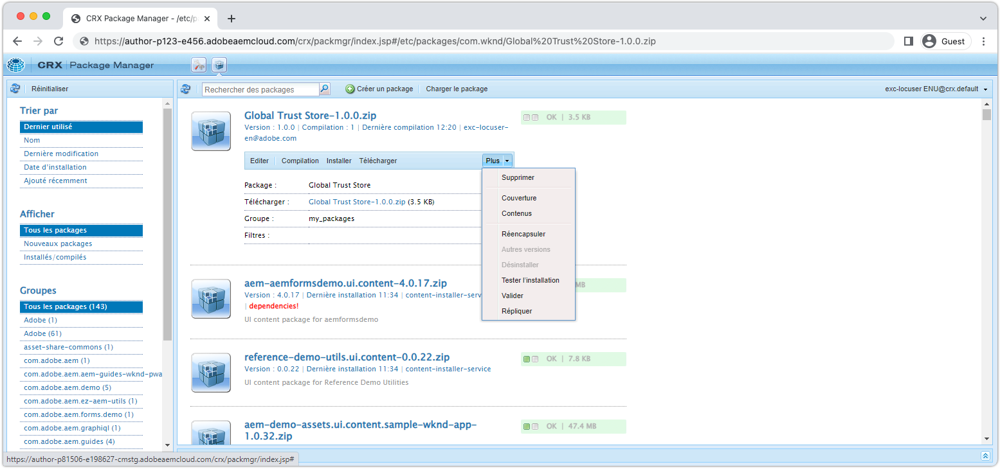
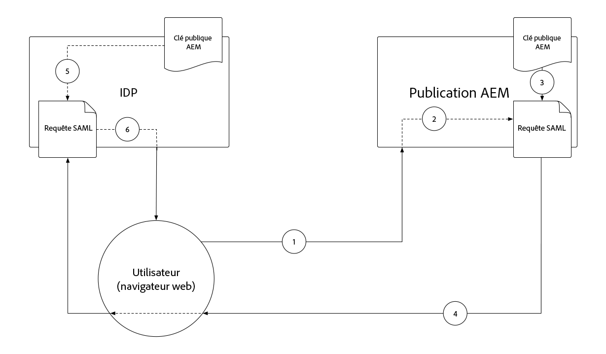
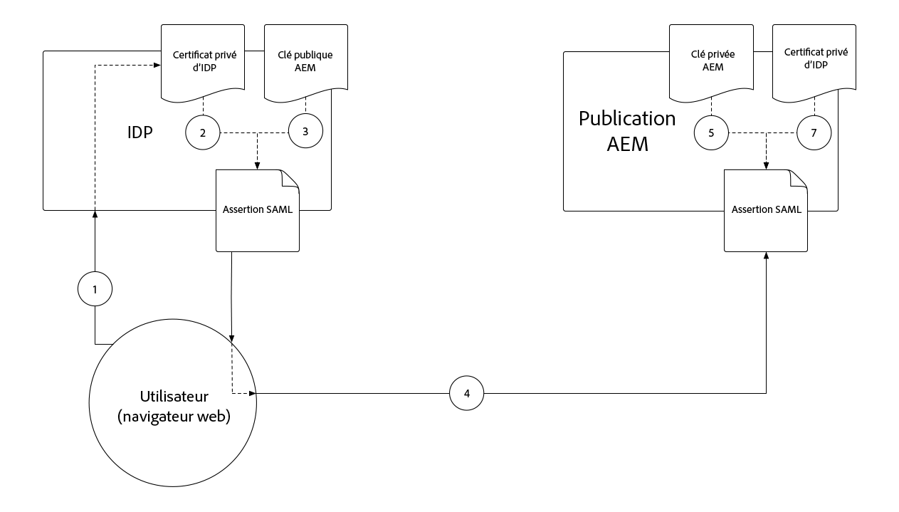
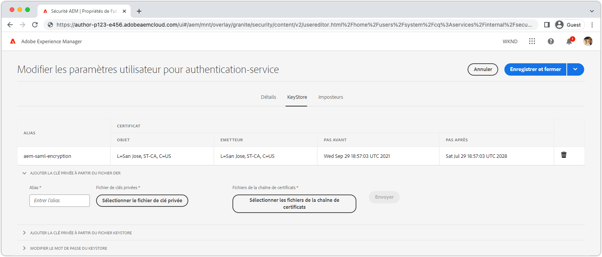

# Authentification SAML 2.0{#saml-2-0-authentication}

Découvrez comment configurer et authentifier les utilisateurs finaux (et non les auteurs et autrices AEM) sur le fournisseur d’identité compatible avec SAML 2.0 de votre choix.

## Quel SAML pour AEM as a Cloud Service ?

L’intégration de SAML 2.0 au service de publication (ou de prévisualisation) AEM permet aux utilisateurs et utilisatrices finaux d’une expérience web basée sur AEM de s’authentifier auprès d’un fournisseur d’identité hors Adobe et d’accéder à AEM en tant qu’utilisateur autorisé et nommé.

|                       | Création AEM | Publication AEM |
|-----------------------|:----------:|:-----------:|
| Prise en charge de SAML 2.0 | ✘ | ✔ |

+++ Comprendre le flux SAML 2.0 avec AEM

Le flux type d’une intégration SAML de publication AEM est le suivant :

1. L’utilisateur ou l’utilisatrice envoie une requête au service de publication AEM indiquant que l’authentification est requise.
   + L’utilisateur ou utilisatrice demande une ressource protégée par CUG/ACL.
   + L’utilisateur ou utilisatrice demande une ressource soumise à une exigence d’authentification.
   + L’utilisateur ou utilisatrice suit un lien vers le point d’entrée de connexion AEM (c.-à-d. `/system/sling/login`) qui demande explicitement l’action de connexion.
1. AEM envoie une requête AuthnRequest au fournisseur d’identité, demandant au fournisseur d’identité de démarrer le processus d’authentification.
1. L’utilisateur ou utilisatrice s’authentifie auprès du fournisseur d’identité.
   + Le fournisseur d’identité demande à l’utilisateur ou l’utilisatrice ses informations d’identification.
   + L’utilisateur ou l’utilisatrice est déjà authentifié(e) auprès du fournisseur d’identité et n’a pas à fournir d’informations d’identification supplémentaires.
1. Le fournisseur d’identité génère une assertion SAML contenant les données de l’utilisateur ou de l’utilisatrice et la signe à l’aide du certificat privé du fournisseur d’identité.
1. Le fournisseur d’identité envoie l’assertion SAML via une HTTP POST, par le biais du navigateur web de l’utilisateur ou de l’utilisatrice, au service de publication AEM.
1. Le service de publication AEM reçoit l’assertion SAML et valide l’intégrité et l’authenticité de l’assertion SAML à l’aide du certificat public du fournisseur d’identité.
1. Le service de publication AEM gère l’enregistrement de l’utilisateur ou de l’utilisatrice AEM en fonction de la configuration OSGi SAML 2.0 et du contenu de l’assertion SAML.
   + Crée un utilisateur ou une utilisatrice
   + Synchronise les attributs utilisateur
   + Met à jour l’appartenance à un groupe d’utilisateurs AEM
1. Le service de publication AEM définit le cookie `login-token` AEM sur la réponse HTTP, qui est utilisée pour authentifier les requêtes suivantes vers le service de publication AEM.
1. Le service de publication AEM redirige l’utilisateur ou utilisatrice vers l’URL sur l’instance de publication AEM, comme indiqué par le cookie `saml_request_path`.

+++

## Présentation de la configuration

>[!VIDEO](https://video.tv.adobe.com/v/343040?quality=12&learn=on)

Cette vidéo décrit comment configurer l’intégration SAML 2.0 au service de publication AEM as a Cloud Service et utiliser Okta comme fournisseur d’identité.

## Conditions préalables

Les éléments suivants sont requis lors de la configuration de l’authentification SAML 2.0 :

+ Un accès responsable de déploiement à Cloud Manager.
+ Un accès administratif AEM à l’environnement AEM as a Cloud Service.
+ Accès de l’administrateur ou de l’administratrice au fournisseur d’identité
+ Éventuellement, l’accès à une paire de clés publique/privée utilisée pour le chiffrement des payloads SAML.

SAML 2.0 est uniquement pris en charge pour authentifier les utilisateurs et utilisatrices dans le service de publication ou de prévisualisation AEM. Pour gérer l’authentification du service de création AEM à l’aide d’un fournisseur d’identité, [intégrez le fournisseur d’identité à Adobe IMS](https://helpx.adobe.com/fr/enterprise/using/set-up-identity.html).


## Installer le certificat public du fournisseur d’identité sur AEM

Le certificat public du fournisseur d’identité est ajouté à AEM Global Trust Store et utilisé pour vérifier que l’assertion SAML envoyée par le fournisseur d’identité est valide.

+++Flux de signature d’assertion SAML



1. L’utilisateur ou utilisatrice s’authentifie auprès du fournisseur d’identité.
1. Ce dernier génère une assertion SAML contenant les données de la personne.
1. Le fournisseur d’identité signe l’assertion SAML à l’aide du certificat privé du fournisseur d’identité.
1. Le fournisseur d’identité effectue une requête POST HTTP côté client au point d’entrée SAML de l’instance de publication AEM (`.../saml_login`), qui inclut l’assertion SAML signée.
1. L’instance de publication AEM reçoit la requête POST HTTP contenant l’assertion SAML signée et peut valider la signature à l’aide du certificat public du fournisseur d’identité.

+++

.

1. Récupérez le fichier de __certificat public__ à partir du fournisseur d’identité. Ce certificat permet à AEM de valider l’assertion SAML transmise à AEM par le fournisseur d’identité.

   Le certificat, au format PEM, ressemble à ceci :

   ```
   -----BEGIN CERTIFICATE-----
   MIIC4jCBAcoCCQC33wnybT5QZDANBgkqhkiG9w0BAQsFADAyMQswCQYDVQQGEwJV
   ...
   m0eo2USlSRTVl7QHRTuiuSThHpLKQQ==
   -----END CERTIFICATE-----
   ```

1. Connectez-vous à l’instance de création AEM en tant qu’administrateur ou administratrice AEM.
1. Accédez à __Outils > Sécurité > Trust Store__.
1. Créez ou ouvrez le Trust Store global. Si vous créez un Trust Store global, stockez le mot de passe en lieu sûr.
1. Développez __Ajouter le certificat à partir du fichier CER__.
1. Sélectionnez __Sélectionner le fichier de certificat__ et chargez le fichier de certificat fourni par le fournisseur d’identité.
1. Laisser le champ __Mapper le certificat à l’utilisateur__ vide.
1. Sélectionnez __Envoyer__.
1. Le certificat nouvellement ajouté s’affiche au-dessus de la section __Ajouter un certificat à partir du fichier CRT__.
1. Prenez note de la valeur de l’__alias__, car celle-ci est utilisée dans la [Configuration OSGi du gestionnaire d’authentification SAML 2.0](#saml-2-0-authentication-handler-osgi-configuration).
1. Sélectionnez __Enregistrer et fermer__.

Le Trust Store global est configuré avec le certificat public du fournisseur d’identité sur l’instance de création AEM, mais comme SAML est utilisé uniquement sur l’instance de publication AEM, le Trust Store global doit être répliqué dans l’instance de publication AEM pour que le certificat public du fournisseur d’identité y soit accessible.

.

1. Accédez à __Outils > Déploiement > Packages__.
1. Créez un package.
   + Nom du package : `Global Trust Store`
   + Version : `1.0.0`
   + Groupe : `com.your.company`
1. Modifiez le nouveau package __Trust Store global__.
1. Sélectionnez l’onglet __Filtres__ et ajoutez un filtre pour le chemin d’accès racine `/etc/truststore`.
1. Sélectionnez __Terminé__, puis __Enregistrer__.
1. Cliquez sur le bouton __Créer__ pour le package __Trust Store global__.
1. Une fois créé, sélectionnez __Plus__ > __Répliquer__ pour activer le nœud Trust Store global (`/etc/truststore`) vers l’instance de publication AEM.

## Créer un KeyStore pour le service d’authentification{#authentication-service-keystore}

_La création d’un KeyStore pour le service d’authentification est requise lorsque la [Propriété de configuration OSGi du gestionnaire d’authentification SAML 2.0 `handleLogout` est définie sur `true`](#saml-20-authenticationsaml-2-0-authentication) ou lorsque la [signature de la demande d’autorisation/le chiffrement de l’assertion SAML](#install-aem-public-private-key-pair) est requis(e)_.

1. Connectez-vous à l’instance de création AEM en tant qu’administrateur ou administratrice AEM pour charger la clé privée.
1. Accédez à __Outils > Sécurité > Utilisateurs et utilisatrices__, puis sélectionnez __authentication-service__ et choisissez __Propriétés__ dans la barre d’actions supérieure.
1. Sélectionnez l’onglet __KeyStore__.
1. Créez ou ouvrez le KeyStore. Si vous créez un KeyStore, assurez-vous de conserver le mot de passe en lieu sûr.
   + Un [KeyStore public/privé est installé dans ce KeyStore](#install-aem-public-private-key-pair) uniquement si la signature de la demande d’authentification/le chiffrement de l’assertion SAML est requis(e).
   + Si cette intégration SAML prend en charge la déconnexion, mais pas la signature de la demande d’authentification/l’assertion SAML, alors un KeyStore vide est suffisant.
1. Sélectionnez __Enregistrer et fermer__.
1. Créez un package contenant l’utilisateur ou l’utilisatrice de l’__authentication-service__ mis à jour.

   _Utilisez la solution de contournement temporaire suivante à l’aide de packages :_

   1. Accédez à __Outils > Déploiement > Packages__.
   1. Créez un package.
      + Nom du package : `Authentication Service`
      + Version : `1.0.0`
      + Groupe : `com.your.company`
   1. Modifiez le nouveau package __KeyStore du service d’authentification__.
   1. Sélectionnez l’onglet __Filtres__ et ajoutez un filtre pour le chemin racine `/home/users/system/cq:services/internal/security/<AUTHENTICATION SERVICE UUID>/keystore`.
      + L’`<AUTHENTICATION SERVICE UUID>` est accessible en accédant à __Outils > Sécurité > Utilisateurs et utilisatrices__ et en sélectionnant l’utilisateur ou l’utilisatrice d’__authentication-service__. L’UUID est la dernière partie de l’URL.
   1. Sélectionnez __Terminé__, puis __Enregistrer__.
   1. Sélectionnez le bouton __Créer__ pour le package __KeyStore du service d’authentification__.
   1. Une fois créé, sélectionnez __Plus__ > __Répliquer__ pour activer le KeyStore du service d’authentification dans le service de publication AEM.

## Installer la paire de clés publique/privée AEM{#install-aem-public-private-key-pair}

_L’installation de la paire de clés publique/privée AEM est facultative._

Le service de publication AEM peut être configuré pour signer les requêtes AuthnRequests (pour le fournisseur d’identité) et chiffrer les assertions SAML (pour AEM). Pour ce faire, vous devez fournir une clé privée au service de publication AEM et faire correspondre la clé publique au fournisseur d’identité.

+++ Comprendre le flux de signature AuthnRequest (facultatif)

La requête AuthnRequest (la requête au fournisseur d’identité du service de publication AEM qui initie le processus de connexion) peut être signée par le service de publication AEM. Pour ce faire, le service de publication AEM signe la requête AuthnRequest à l’aide de la clé privée, puis le fournisseur d’identité valide la signature à l’aide de la clé publique. Cela garantit au fournisseur d’identité que la requête AuthnRequest a été lancée et demandée par le service de publication AEM, et non un tiers malveillant.



1. L’utilisateur ou l’utilisatrice envoie une requête HTTP au service de publication AEM qui entraîne une requête d’authentification SAML au fournisseur d’identité.
1. Le service de publication AEM génère la requête SAML à envoyer au fournisseur d’identité.
1. Le service de publication AEM signe la requête SAML à l’aide de la clé privée AEM.
1. Le service de publication AEM lance la requête AuthnRequest, une redirection HTTP côté client vers le fournisseur d’identité qui contient la requête SAML signée.
1. Le fournisseur d’identité reçoit la requête AuthnRequest et valide la signature à l’aide de la clé publique AEM, ce qui garantit que le servie de publication AEM a lancé la requête AuthnRequest.
1. Le service de publication AEM valide ensuite l’intégrité et l’authenticité de l’assertion SAML déchiffrée à l’aide du certificat public du fournisseur d’identité.

+++

+++ Comprendre le flux de chiffrement de l’assertion SAML (facultatif)

Toutes les communications HTTP entre le fournisseur d’identité et le service de publication AEM doivent se faire via HTTPS, et sont donc sécurisées par défaut. Cependant, si nécessaire, les assertions SAML peuvent être chiffrées si une confidentialité supplémentaire est requise en plus de celle fournie par HTTPS. Pour ce faire, le fournisseur d’identité chiffre les données d’assertion SAML à l’aide de la clé privée et le service de publication AEM déchiffre l’assertion SAML à l’aide de la clé privée.



1. L’utilisateur ou utilisatrice s’authentifie auprès du fournisseur d’identité.
1. Le fournisseur d’identité génère une assertion SAML contenant les données de l’utilisateur ou de l’utilisatrice et la signe à l’aide du certificat privé du fournisseur d’identité.
1. Le fournisseur d’identité chiffre ensuite l’assertion SAML avec la clé publique AEM, qui nécessite la clé privée AEM pour être déchiffrée.
1. L’assertion SAML chiffrée est envoyée par le biais du navigateur web de l’utilisateur ou de l’utilisatrice au service de publication AEM.
1. Le service de publication AEM reçoit l’assertion SAML et la déchiffre à l’aide de la clé privée AEM.
1. Le fournisseur d’identité invite l’utilisateur ou l’utilisatrice à s’authentifier.

+++

La signature de la requête AuthnRequest et le chiffrement de l’assertion SAML sont facultatifs. Toutefois, ils sont tous deux activés à l’aide de la [propriété de configuration OSGi du gestionnaire d’authentification SAML 2.0`useEncryption`](#saml-20-authenticationsaml-2-0-authentication), ce qui signifie qu’il est possible d’utiliser les deux ou aucun des deux.



1. Procurez-vous la clé publique, la clé privée (PKCS#8 au format DER) et le fichier de chaîne de certificats (il peut s’agir de la clé publique) utilisés pour signer la requête AuthnRequest et chiffrer l’assertion SAML. Les clés sont généralement fournies par l’équipe de sécurité du service informatique.

   + Une paire de clés auto-signée peut être générée à l’aide de __openssl__ :

   ```
   $ openssl req -x509 -sha256 -days 365 -newkey rsa:4096 -keyout aem-private.key -out aem-public.crt
   
   # Provide a password (keep in safe place), and other requested certificate information
   
   # Convert the keys to AEM's required format 
   $ openssl rsa -in aem-private.key -outform der -out aem-private.der
   $ openssl pkcs8 -topk8 -inform der -nocrypt -in aem-private.der -outform der -out aem-private-pkcs8.der
   ```

1. Chargez la clé publique vers le fournisseur d’identité.
   + En utilisant la méthode `openssl` ci-dessus, la clé publique est le fichier `aem-public.crt`.
1. Connectez-vous à l’instance de création AEM en tant qu’administrateur ou administratrice AEM pour charger la clé privée.
1. Accédez à __Outils > Sécurité > Trust Store__, puis sélectionnez la personne qui utilise __authentication-service__ et sélectionnez __Propriétés__ dans la barre d’actions supérieure.
1. Accédez à __Outils > Sécurité > Utilisateurs et utilisatrices__, puis sélectionnez la personne qui utilise __authentication-service__ et sélectionnez __Propriétés__ dans la barre d’actions supérieure.
1. Sélectionnez l’onglet __KeyStore__.
1. Créez ou ouvrez le KeyStore. Si vous créez un KeyStore, assurez-vous de conserver le mot de passe en lieu sûr.
1. Sélectionner __Ajouter une clé privée à partir du fichier DER__, puis ajoutez la clé privée et le fichier de chaîne à AEM :
   + __Alias__ : indiquez un nom significatif, souvent le nom du fournisseur d’identité.
   + __Fichier de clé privée__ : chargez le fichier de clé privée (PKCS#8 au format DER).
      + En utilisant la méthode `openssl` ci-dessus, il s’agit du fichier `aem-private-pkcs8.der`.
   + __Sélectionner le fichier de chaîne de certificats__ : chargez le fichier de chaîne associé (il peut s’agir de la clé publique).
      + Avec la méthode `openssl` ci-dessus, il s’agit du fichier `aem-public.crt`.
   + Sélectionnez __Envoyer__.
1. Le certificat nouvellement ajouté s’affiche au-dessus de la section __Ajouter un certificat à partir d’un fichier CRT__.
   + Prenez note de l’__alias__, car il est utilisé dans la [Configuration OSGi du gestionnaire d’authentification SAML 2.0](#saml-20-authentication-handler-osgi-configuration).
1. Sélectionnez __Enregistrer et fermer__.
1. Créez un package contenant l’utilisateur ou l’utilisatrice de l’__authentication-service__ mis à jour.

   _Utilisez la solution de contournement temporaire suivante à l’aide de packages :_

   1. Accédez à __Outils > Déploiement > Packages__.
   1. Créez un package.
      + Nom du package : `Authentication Service`
      + Version : `1.0.0`
      + Groupe : `com.your.company`
   1. Modifiez le nouveau package __KeyStore du service d’authentification__.
   1. Sélectionnez l’onglet __Filtres__ et ajoutez un filtre pour le chemin racine `/home/users/system/cq:services/internal/security/<AUTHENTICATION SERVICE UUID>/keystore`.
      + L’`<AUTHENTICATION SERVICE UUID>` est accessible en accédant à __Outils > Sécurité > Utilisateurs et utilisatrices__ et en sélectionnant l’utilisateur ou l’utilisatrice d’__authentication-service__. L’UUID est la dernière partie de l’URL.
   1. Sélectionnez __Terminé__, puis __Enregistrer__.
   1. Sélectionnez le bouton __Créer__ pour le package __KeyStore du service d’authentification__.
   1. Une fois créé, sélectionnez __Plus__ > __Répliquer__ pour activer le KeyStore du service d’authentification dans l’instance de publication AEM.

## Configurer le gestionnaire d’authentification SAML 2.0.{#configure-saml-2-0-authentication-handler}

La configuration SAML d’AEM est effectuée via la configuration OSGi du __gestionnaire d’authentification SAML 2.0 Adobe Granite__.
La configuration est une configuration d’usine OSGi, ce qui signifie qu’un service de publication AEM as a Cloud Service unique peut avoir plusieurs configurations SAML couvrant des arborescences de ressources discrètes du référentiel ; cela est utile pour les déploiements AEM de plusieurs sites.

+++ Glossaire de configuration OSGi du gestionnaire d’authentification SAML 2.0.

### Configuration OSGi du gestionnaire d’authentification SAML 2.0 Adobe Granite{#configure-saml-2-0-authentication-handler-osgi-configuration}

|                                   | Propriété OSGi | Requis | Format de la valeur | Valeur par défaut | Description |
|-----------------------------------|-------------------------------|:--------:|:---------------------:|---------------------------|-------------|
| Chemins d’accès | `path` | ✔ | Tableau de chaînes | `/` | Chemins d’accès AEM pour lesquels ce gestionnaire d’authentification est utilisé. |
| URL du fournisseur d’identité | `idpUrl` | ✔ | Chaîne |                           | URL du fournisseur d’identité vers lequel la demande d’authentification SAML est envoyée. |
| Alias du certificat du fournisseur d’identité | `idpCertAlias` | ✔ | Chaîne |                           | Alias du certificat du fournisseur d’identité trouvé dans le Trust Store global d’AEM. |
| Redirection HTTP du fournisseur d’identité | `idpHttpRedirect` | ✘ | Booléen | `false` | Indique s’il existe une redirection du HTTP vers l’URL du fournisseur d’identité au lieu d’envoyer une demande d’authentification. Définissez `true` pour l’authentification initiée par fournisseur d’identité. |
| Identifiant du fournisseur d’identité | `idpIdentifier` | ✘ | Chaîne |                           | Identifiant du fournisseur d’identité unique pour garantir l’unicité des utilisateurs et utilisatrices ainsi que des groupes. Si le champ est vide, la valeur de `serviceProviderEntityId` est utilisée à la place. |
| URL du service client d’assertion | `assertionConsumerServiceURL` | ✘ | Chaîne |                           | Attribut d’URL `AssertionConsumerServiceURL` dans la requête d’authentification spécifiant où le message `<Response>` doit être envoyé à AEM. |
| Identifiant d’entité SP | `serviceProviderEntityId` | ✔ | Chaîne |                           | Identifie de manière unique AEM auprès du fournisseur d’identité. Il s’agit généralement du nom d’hôte d’AEM. |
| Chiffrement SP | `useEncryption` | ✘ | Booléen | `true` | Indique si le fournisseur d’identité chiffre les assertions SAML. Nécessite la définition des valeurs pour `spPrivateKeyAlias` et `keyStorePassword`. |
| Alias de clé privée SP | `spPrivateKeyAlias` | ✘ | Chaîne |                           | Alias de la clé privée dans le KeyStore de l’utilisateur ou de l’utilisatrice d’`authentication-service`. Obligatoire si `useEncryption` est défini sur `true`. |
| Mot de passe du KeyStore SP | `keyStorePassword` | ✘ | Chaîne |                           | Mot de passe du KeyStore de l’utilisateur ou de l’utilisatrice d’« authentication-service ». Obligatoire si `useEncryption` est défini sur `true`. |
| Redirection par défaut | `defaultRedirectUrl` | ✘ | Chaîne | `/` | URL de redirection par défaut après une authentification réussie. Il peut s’agir de l’hôte d’AEM (par exemple, `/content/wknd/us/en/html`). |
| Attribut d’identifiant d’utilisation | `userIDAttribute` | ✘ | Chaîne | `uid` | Nom de l’attribut d’assertion SAML contenant l’identifiant d’utilisation de l’utilisateur ou de l’utilisatrice AEM. Laissez vide pour utiliser l’`Subject:NameId`. |
| Créer automatiquement des utilisateurs et des utilisatrices AEM | `createUser` | ✘ | Booléen | `true` | Indique si les utilisateurs et utilisatrices AEM sont créés lorsque l’authentification aboutit. |
| Chemin intermédiaire de l’utilisateur ou de l’utilisatrice AEM | `userIntermediatePath` | ✘ | Chaîne |                           | Lors de la création d’utilisateurs et d’utilisatrices AEM, cette valeur est utilisée comme chemin intermédiaire (par exemple, `/home/users/<userIntermediatePath>/jane@wknd.com`). Nécessite que `createUser` soit défini sur `true`. |
| Attributs d’utilisateur ou d’utilisatrice AEM | `synchronizeAttributes` | ✘ | Tableau de chaînes |                           | Liste des mappages d’attributs SAML à stocker sur l’utilisateur ou l’utilisatrice AEM, au format `[ "saml-attribute-name=path/relative/to/user/node" ]` (par exemple, `[ "firstName=profile/givenName" ]`). Consultez la [liste complète des attributs AEM natifs](#aem-user-attributes). |
| Ajouter un utilisateur ou une utilisatrice aux groupes AEM | `addGroupMemberships` | ✘ | Booléen | `true` | Indique si une personne qui utilise AEM est automatiquement ajoutée aux groupes d’utilisateurs et d’utilisatrices AEM après une authentification réussie. |
| Attribut d’appartenance à un groupe AEM | `groupMembershipAttribute` | ✘ | Chaîne | `groupMembership` | Le nom de l’attribut d’assertion SAML contenant une liste des groupes d’utilisateurs et d’utilisatrices AEM auxquels la personne doit être ajoutée. Nécessite que `addGroupMemberships` soit défini sur `true`. |
| Groupes AEM par défaut | `defaultGroups` | ✘ | Tableau de chaînes |                           | Une liste de groupes d’utilisateurs et d’utilisatrices AEM auxquels des personnes authentifiées sont toujours ajoutées (par exemple : `[ "wknd-user" ]`). Nécessite que `addGroupMemberships` soit défini sur `true`. |
| Format NameIDPolicy | `nameIdFormat` | ✘ | Chaîne | `urn:oasis:names:tc:SAML:2.0:nameid-format:transient` | La valeur du paramètre de format NameIDPolicy à envoyer dans le message AuthnRequest. |
| Stocker la réponse SAML | `storeSAMLResponse` | ✘ | Booléen | `false` | Indique si la valeur `samlResponse` est stockée sur le nœud `cq:User` d’AEM. |
| Gérer la déconnexion | `handleLogout` | ✘ | Booléen | `false` | Indique si la demande de déconnexion est gérée par ce gestionnaire d’authentification SAML. Nécessite que `logoutUrl` soit défini. |
| URL de déconnexion | `logoutUrl` | ✘ | Chaîne |                           | URL du fournisseur d’identité vers laquelle la requête de déconnexion SAML est envoyée. Obligatoire si `handleLogout` est défini sur `true`. |
| Tolérance de l’horloge | `clockTolerance` | ✘ | Entier | `60` | Tolérance de décalage de l’horloge du fournisseur d’identité et AEM (SP) lors de la validation des assertions SAML. |
| Méthode de prétraitement | `digestMethod` | ✘ | Chaîne | `http://www.w3.org/2001/04/xmlenc#sha256` | Algorithme de prétraitement (Digest) utilisé par le fournisseur d’identité lors de la signature d’un message SAML. |
| Méthode de signature | `signatureMethod` | ✘ | Chaîne | `http://www.w3.org/2001/04/xmldsig-more#rsa-sha256` | Algorithme de signature utilisé par le fournisseur d’identité lors de la signature d’un message SAML. |
| Type de synchronisation des identités | `identitySyncType` | ✘ | `default` ou `idp` | `default` | Ne pas modifier la valeur par défaut `from` pour AEM as a Cloud Service. |
| Classement de service | `service.ranking` | ✘ | Entier | `5002` | Les configurations de classement supérieur sont préférées pour le même `path`. |

### Attributs d’utilisateur ou d’utilisatrice AEM{#aem-user-attributes}

AEM utilise les attributs d’utilisateur ou d’utilisatrice suivants, qui peuvent être renseignés via la propriété `synchronizeAttributes` dans la configuration OSGi du gestionnaire d’authentification SAML 2.0 Granite Adobe.  Tous les attributs de fournisseur d’identité peuvent être synchronisés avec n’importe quelle propriété d’utilisateur ou d’utilisatrice AEM. Toutefois, le mappage aux propriétés d’attribut d’utilisation AEM (répertoriées ci-dessous) permet à AEM de les utiliser naturellement.

| Attribut d’utilisateur ou d’utilisatrice | Chemin de propriété relatif depuis le nœud `rep:User` |
|--------------------------------|--------------------------|
| Titre (par exemple, `Mrs`) | `profile/title` |
| Prénom | `profile/givenName` |
| Nom de famille | `profile/familyName` |
| Fonction | `profile/jobTitle` |
| Adresse e-mail | `profile/email` |
| Adresse | `profile/street` |
| Ville | `profile/city` |
| Code postal | `profile/postalCode` |
| Pays | `profile/country` |
| Numéro de téléphone | `profile/phoneNumber` |
| À propos de moi | `profile/aboutMe` |

+++

1. Créez un fichier de configuration OSGi dans votre projet à l’emplacement `/ui.config/src/main/content/jcr_root/wknd-examples/osgiconfig/config.publish/com.adobe.granite.auth.saml.SamlAuthenticationHandler~saml.cfg.json` et ouvrez-le dans votre IDE.
   + Remplacez `/wknd-examples/` par votre `/<project name>/`.
   + L’identifiant après le `~` dans le nom de fichier doit identifier de manière unique cette configuration. Il peut donc s’agir du nom du fournisseur d’identité, tel que `...~okta.cfg.json`. La valeur doit être alphanumérique avec des tirets.
1. Collez le code JSON suivant dans le fichier `com.adobe.granite.auth.saml.SamlAuthenticationHandler~...cfg.json` et mettez à jour les références `wknd` selon les besoins.

   ```json
   {
       "path": [ "/content/wknd", "/content/dam/wknd" ], 
       "idpCertAlias": "$[env:SAML_IDP_CERT_ALIAS;default=certalias___1652125559800]",
       "idpIdentifier": "$[env:SAML_IDP_ID;default=http://www.okta.com/exk4z55r44Jz9C6am5d7]",
       "idpUrl": "$[env:SAML_IDP_URL;default=https://dev-5511372.okta.com/app/dev-5511372_aemasacloudservice_1/exk4z55r44Jz9C6am5d7/sso/saml]",
       "serviceProviderEntityId": "$[env:SAML_AEM_ID;default=https://publish-p123-e456.adobeaemcloud.com]",
       "useEncryption": false,
       "createUser": true,
       "userIntermediatePath": "wknd/idp",
       "synchronizeAttributes":[
           "firstName=profile/givenName"
       ],
       "addGroupMemberships": true,
       "defaultGroups": [ 
           "wknd-users"
       ]
   }
   ```

1. Mettez à jour les valeurs en fonction de votre projet. Consultez le __glossaire de configuration OSGi du gestionnaire d’authentification SAML 2.0__ ci-dessus pour les descriptions des propriétés de configuration.
1. Il est recommandé, mais non obligatoire, d’utiliser les variables d’environnement et les secrets OSGi lorsque les valeurs peuvent ne pas être synchronisées avec le cycle de publication de la version ou lorsque les valeurs diffèrent entre des types d’environnements/niveaux de service similaires. Les valeurs par défaut peuvent être définies à l’aide de la syntaxe `$[env:..;default=the-default-value]"` comme illustré ci-dessus.

Les configurations OSGi par environnement (`config.publish.dev`, `config.publish.stage`, et `config.publish.prod`) peuvent être définies avec des attributs spécifiques si la configuration SAML varie entre les environnements.

### Utiliser le chiffrement

Lors du [chiffrement de l’assertion SAML et de la requête AuthnRequest](#encrypting-the-authnrequest-and-saml-assertion), les propriétés suivantes sont requises : `useEncryption`, `spPrivateKeyAlias`, et `keyStorePassword`. Le `keyStorePassword` contient un mot de passe. Par conséquent, la valeur ne doit pas être stockée dans le fichier de configuration OSGi, mais plutôt injectée à l’aide des [valeurs de configuration secrètes](https://experienceleague.adobe.com/docs/experience-manager-cloud-service/content/implementing/deploying/configuring-osgi.html?lang=fr#secret-configuration-values).

+++Vous pouvez éventuellement mettre à jour la configuration OSGi pour utiliser le chiffrement.

1. Ouvrez `/ui.config/src/main/content/jcr_root/wknd-examples/osgiconfig/config.publish/com.adobe.granite.auth.saml.SamlAuthenticationHandler~saml.cfg.json` dans votre IDE.
1. Ajoutez les trois propriétés `useEncryption`, `spPrivateKeyAlias`, et `keyStorePassword` comme illustré ci-dessous.

   ```json
   {
   "path": [ "/content/wknd", "/content/dam/wknd" ], 
   "idpCertAlias": "$[env:SAML_IDP_CERT_ALIAS;default=certalias___1234567890]",
   "idpIdentifier": "$[env:SAML_IDP_ID;default=http://www.okta.com/abcdef1235678]",
   "idpUrl": "$[env:SAML_IDP_URL;default=https://dev-5511372.okta.com/app/dev-123567890_aemasacloudservice_1/abcdef1235678/sso/saml]",
   "serviceProviderEntityId": "$[env:SAML_AEM_ID;default=https://publish-p123-e456.adobeaemcloud.com]",
   "useEncryption": true,
   "spPrivateKeyAlias": "$[env:SAML_AEM_KEYSTORE_ALIAS;default=aem-saml-encryption]",
   "keyStorePassword": "$[secret:SAML_AEM_KEYSTORE_PASSWORD]",
   "createUser": true,
   "userIntermediatePath": "wknd/idp"
   "synchronizeAttributes":[
       "firstName=profile/givenName"
   ],
   "addGroupMemberships": true,
   "defaultGroups": [ 
       "wknd-users"
   ]
   }
   ```

1. Les trois propriétés de configuration OSGi requises pour le chiffrement sont les suivantes :

+ `useEncryption` défini sur `true`
+ `spPrivateKeyAlias` contient l’alias d’entrée du KeyStore pour la clé privée utilisée par l’intégration SAML.
+ `keyStorePassword` contient une [variable de configuration de secret OSGi](https://experienceleague.adobe.com/docs/experience-manager-cloud-service/content/implementing/deploying/configuring-osgi.html?lang=fr#secret-configuration-values) contenant le mot de passe du KeyStore de l’utilisateur ou de l’utilisatrice d’`authentication-service`.

+++

## Configurer le filtre de référent

Pendant le processus d’authentification SAML, le fournisseur d’identité lance une requête HTTP POST côté client vers le point d’entrée `.../saml_login` du service de publication AEM. Si le fournisseur d’identité et le service de publication AEM existent sur une origine différente, le __Filtre de référent__ du service de publication AEM est configuré via la configuration OSGi pour autoriser les requêtes HTTP POST à partir de l’origine du fournisseur d’identité.

1. Créez (ou modifiez) un fichier de configuration OSGi dans votre projet à l’emplacement `/ui.config/src/main/content/jcr_root/wknd-examples/osgiconfig/config.publish/org.apache.sling.security.impl.ReferrerFilter.cfg.json`.
   + Remplacez `/wknd-examples/` par votre `/<project name>/`.
1. Assurez-vous que la valeur `allow.empty` est définie sur `true`, `allow.hosts` (ou si vous préférez, `allow.hosts.regexp`) contient l’origine du fournisseur d’identité, et `filter.methods` inclut `POST`. La configuration OSGi doit être similaire à ce qui suit :

   ```json
   {
       "allow.empty": true,
       "allow.hosts.regexp": [ ],
       "allow.hosts": [ 
           "$[env:SAML_IDP_REFERRER;default=dev-123567890.okta.com]"
       ],
       "filter.methods": [
           "POST",
       ],
       "exclude.agents.regexp": [ ]
   }
   ```

Le service de publication AEM prend en charge une configuration de filtre de référent unique. Par conséquent, fusionnez les exigences de configuration SAML avec toutes les configurations existantes.

Les configurations OSGi par environnement (`config.publish.dev`, `config.publish.stage`, et `config.publish.prod`) peuvent être définies avec des attributs spécifiques si `allow.hosts` (ou `allow.hosts.regex`) varie selon les environnements.

## Configurer le partage des ressources entre origines multiples (CORS)

Pendant le processus d’authentification SAML, le fournisseur d’identité lance une requête HTTP POST côté client vers le point d’entrée `.../saml_login` du service de publication AEM. Si le fournisseur d’identité et le service de publication AEM existent sur différents hôtes/domaines, le __partage de ressources entre origines multiples (CORS)__ du service de publication AEM doit être configuré pour autoriser les requêtes HTTP POST à partir de l’hôte/du domaine du fournisseur d’identité.

L’en-tête `Origin` de cette requête HTTP POST a généralement une valeur différente de celle de l’hôte du service de publication AEM, ce qui nécessite une configuration CORS.

Lors du test de l’authentification SAML sur le SDK AEM local (`localhost:4503`), le fournisseur d’identité peut définir l’en-tête `Origin` sur `null`. Si c’est le cas, ajoutez `"null"` à la liste `alloworigin`.

1. Créez un fichier de configuration OSGi dans votre projet à l’adresse `/ui.config/src/main/content/jcr_root/wknd-examples/osgiconfig/config.publish/com.adobe.granite.cors.impl.CORSPolicyImpl~saml.cfg.json`.
   + Modifiez `/wknd-examples/` en indiquant le nom du projet.
   + L’identifiant après `~` dans le nom de fichier doit identifier de manière unique cette configuration. Il peut donc s’agir du nom du fournisseur d’identité, tel que `...CORSPolicyImpl~okta.cfg.json`. La valeur doit être alphanumérique avec des tirets.
1. Collez le JSON suivant dans le fichier `com.adobe.granite.cors.impl.CORSPolicyImpl~...cfg.json`.

```json
{
    "alloworigin": [ 
        "$[env:SAML_IDP_ORIGIN;default=https://dev-1234567890.okta.com]", 
        "null"
    ],
    "allowedpaths": [ 
        ".*/saml_login"
    ],
    "supportedmethods": [ 
        "POST"
    ]
}
```

Les configurations OSGi par environnement (`config.publish.dev`, `config.publish.stage` et `config.publish.prod`) peuvent être définies avec des attributs spécifiques si `alloworigin` et `allowedpaths` varient entre les environnements.

## Configurer le Dispatcher AEM pour autoriser les requêtes POST HTTP SAML

Une fois l’authentification au fournisseur d’identité réussie, le fournisseur d’identité orchestre une requête POST HTTP vers le point d’entrée `/saml_login` enregistré AEM (configuré dans le fournisseur d’identité). Cette requête POST HTTP vers `/saml_login` est bloqué par défaut sur Dispatcher. Elle doit donc être autorisée explicitement à l’aide de la règle Dispatcher suivante :

1. Ouvrez `dispatcher/src/conf.dispatcher.d/filters/filters.any` dans votre IDE.
1. Ajoutez au bas du fichier une règle permettant d’autoriser les publications HTTP aux URL se terminant par `/saml_login`.

```
...

# Allow SAML HTTP POST to ../saml_login end points
/0190 { /type "allow" /method "POST" /url "*/saml_login" }
```

Si la réécriture de l’URL sur le serveur web Apache est configurée (`dispatcher/src/conf.d/rewrites/rewrite.rules`), assurez-vous que les requêtes vers les points d’entrée `.../saml_login` ne sont pas accidentellement tronquées.

## Activer la synchronisation des données et encapsuler les jetons

Une fois que le flux d’authentification SAML crée un utilisateur ou une utilisatrice dans l’instance de publication AEM, le nœud utilisateur AEM devient authentifiable au niveau du service de publication d’AEM.
Cela nécessite que la [synchronisation des données](https://experienceleague.adobe.com/docs/experience-manager-cloud-service/content/sites/authoring/personalization/user-and-group-sync-for-publish-tier.html?lang=fr#data-synchronization) et les [jetons encapsulés](https://experienceleague.adobe.com/docs/experience-manager-cloud-service/content/sites/authoring/personalization/user-and-group-sync-for-publish-tier.html?lang=fr#sticky-sessions-and-encapsulated-tokens) soient activés par l’assistance Adobe sur le service de publication AEM.

Envoyez une demande au service clientèle d’Adobe (via [Admin Console](https://adminconsole.adobe.com) > Assistance) exigeant :

> que la synchronisation des données et les jetons encapsulés soient activés sur le service de publication d’AEM pour le programme X et l’environnement Y.

## Déployer la configuration SAML

Les configurations OSGi doivent être validées dans Git et déployées vers AEM as a Cloud Service à l’aide de Cloud Manager.

```
$ git remote -v            
adobe   https://git.cloudmanager.adobe.com/myOrg/myCloudManagerGit/ (fetch)
adobe   https://git.cloudmanager.adobe.com/myOrg/myCloudManagerGit/ (push)
$ git add .
$ git commit -m "SAML 2.0 configurations"
$ git push adobe saml-auth:develop
```

Déployez la branche Git Cloud Manager cible (dans cet exemple, `develop`), à l’aide d’un pipeline de déploiement full stack.
