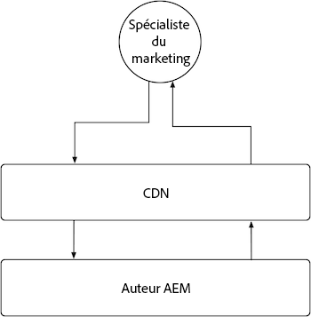
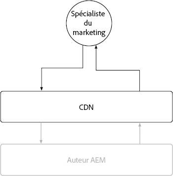

# Instance de création AEM

L’instance de création AEM dispose d’un cache limité en raison de la nature très dynamique et sensible aux autorisations du contenu qu’elle diffuse. En règle générale, il n’est pas recommandé de personnaliser le cache pour l’instance de création AEM, mais plutôt de s’appuyer sur les configurations de cache fournies par Adobe pour garantir une expérience performante.

{align="center"}

Bien que la personnalisation du cache de l’instance de création AEM soit déconseillée, il est utile de comprendre que l’instance de création AEM dispose d’un réseau CDN géré par Adobe, mais pas d’un Dispatcher AEM. N’oubliez pas que toutes les configurations du Dispatcher d’AEM sont ignorées sur l’instance de création AEM, car elle ne dispose pas d’un Dispatcher.

## Réseau de diffusion de contenu (CDN)

Le service de création AEM utilise un réseau CDN, mais son objectif est d’améliorer la diffusion des ressources de produit. Il ne doit pas être entièrement configuré, il est préférable de le laisser fonctionner tel quel.

{align="center"}

Le réseau CDN de l’instance de création AEM se trouve entre l’utilisateur final ou l’utilisatrice finale, généralement une personne spécialisée dans le marketing ou la création de contenu, et l’instance de création AEM. Il met en cache les fichiers non modifiables, tels que les ressources statiques qui alimentent l’expérience de création AEM, et non le contenu créé.

Le réseau CDN de l’instance de création AEM met en cache plusieurs types de ressources susceptibles d’être intéressantes, y compris une [TTL personnalisable sur les requêtes persistantes](https://experienceleague.adobe.com/docs/experience-manager-cloud-service/content/headless/graphql-api/persisted-queries.html?lang=fr?author-instances) et une [longue TTL sur les bibliothèques clientes personnalisées](https://experienceleague.adobe.com/docs/experience-manager-cloud-service/content/implementing/content-delivery/caching.htm?lang=frl#client-side-libraries).

### Durée de vie du cache par défaut

Les ressources suivantes destinées à la clientèle sont mises en cache par le réseau CDN de l’instance de création AEM et ont une durée de vie de cache par défaut :

| Type de contenu | Durée de vie du cache du réseau CDN par défaut |
|:------------ |:---------- |
| [Requêtes persistantes (JSON)](https://experienceleague.adobe.com/docs/experience-manager-cloud-service/content/headless/graphql-api/persisted-queries.html?lang=fr?author-instances) | 1 minute |
| [Bibliothèques clientes (JS/CSS)](https://experienceleague.adobe.com/docs/experience-manager-cloud-service/content/implementing/content-delivery/caching.htm?lang=frl#client-side-libraries) | 30 jours |
| [Tout le reste](https://experienceleague.adobe.com/docs/experience-manager-cloud-service/content/implementing/content-delivery/caching.html?lang=fr#other-content) | Non mis en cache |

## AEM Dispatcher

L’instance de création AEM n’inclut pas le Dispatcher d’AEM et utilise uniquement le [réseau CDN](#cdn) pour le cache.
