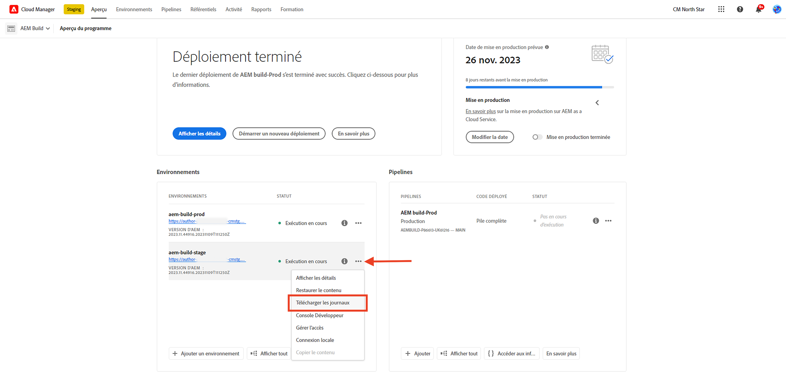
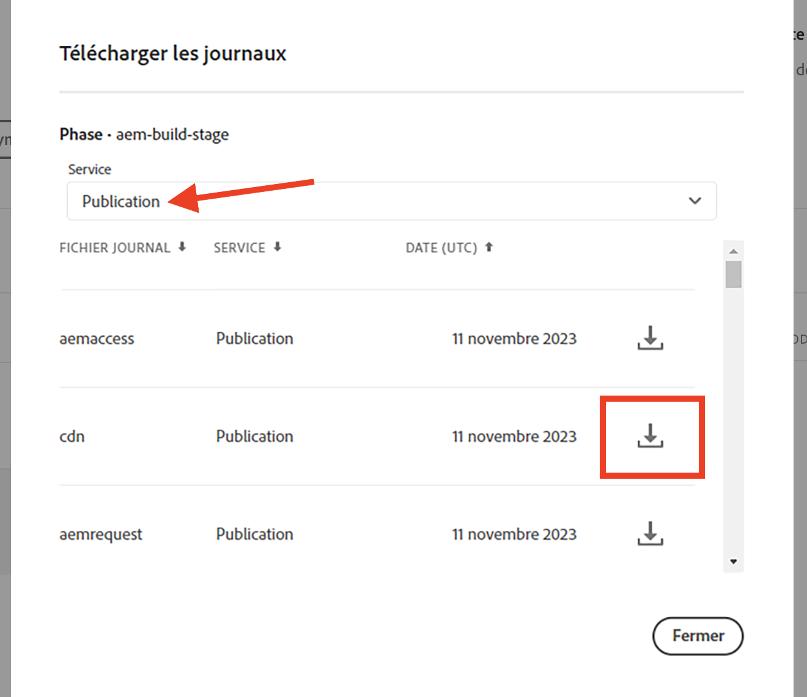
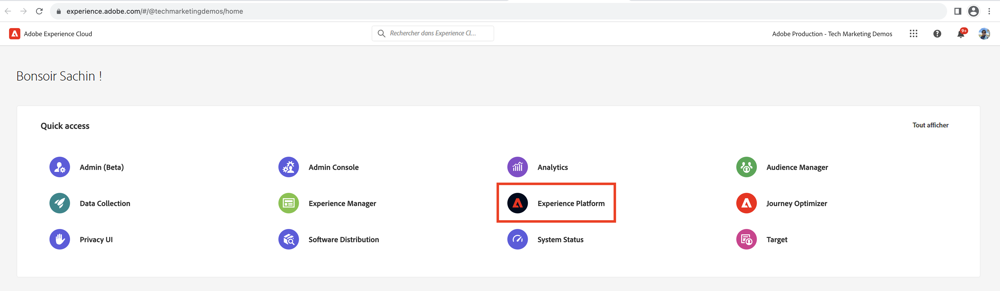
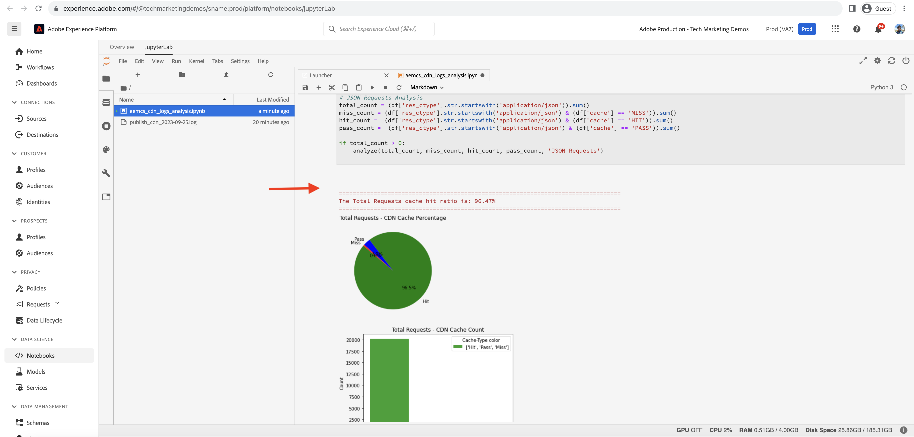

# Analyse du taux d’accès du cache CDN

Le contenu mis en cache sur le réseau de diffusion de contenu réduit la latence vécue par les utilisateurs du site web, qui n’ont pas besoin d’attendre que la demande revienne vers Apache/dispatcher ou AEM publication. Dans ce contexte, il est utile d’optimiser le taux d’accès au cache du réseau CDN pour maximiser la quantité de contenu pouvant être mise en cache sur le réseau CDN.

Découvrez comment analyser l’AEM as a Cloud Service fournie **Journaux CDN** et obtenir des informations telles que **taux d’accès au cache**, et **URL principales de _MISS_ et _PASS_ types de cache**, à des fins d’optimisation.

Les journaux CDN sont disponibles au format JSON, qui contient divers champs, y compris `url`, `cache`. Pour plus d’informations, voir [Format de journal CDN](https://experienceleague.adobe.com/docs/experience-manager-cloud-service/content/implementing/developing/logging.html?lang=en#cdn-log:~:text=Toggle%20Text%20Wrapping-,Log%20Format,-The%20CDN%20logs). La variable `cache` fournit des informations sur _état du cache_ et ses valeurs possibles sont HIT, MISS ou PASS. Examinons les détails des valeurs possibles.

| État du cache   Valeur possible | Description |
|------------------------------------|:-----------------------------------------------------:|
| ACCÈS | Les données demandées sont : _trouvé dans le cache CDN et ne nécessite pas d’extraction_ demande au serveur AEM. |
| MISS | Les données demandées sont : _introuvable dans le cache du réseau de diffusion de contenu et doit être demandé_ à partir du serveur AEM. |
| PASS | Les données demandées sont : _explicitement défini pour ne pas être mis en cache_ et toujours récupéré à partir du serveur AEM. |

Pour les besoins de ce tutoriel, le [AEM projet WKND](https://github.com/adobe/aem-guides-wknd) est déployé dans l’environnement as a Cloud Service AEM et un petit test de performance est déclenché à l’aide de [Apache JMeter](https://jmeter.apache.org/).

Ce tutoriel est structuré de manière à vous guider dans le processus suivant :
1. Téléchargement des journaux CDN via Cloud Manager
1. L’analyse de ces journaux CDN, qui peuvent être réalisés avec deux méthodes : un tableau de bord installé localement ou un notebook Jupityer accessible à distance (pour ceux qui disposent d’une licence Adobe Experience Platform)
1. Optimisation de la configuration du cache CDN

## Téléchargement des journaux CDN

Pour télécharger les journaux CDN, procédez comme suit :

1. Connectez-vous à Cloud Manager à l’adresse [my.cloudmanager.adobe.com](https://my.cloudmanager.adobe.com/) et sélectionnez votre organisation et votre programme.

1. Pour un environnement AEM souhaité, sélectionnez **Journaux de téléchargement** dans le menu points de suspension.

   {width="500" zoomable="yes"}

1. Dans le **Journaux de téléchargement** , sélectionnez **Publier** Service dans le menu déroulant, puis cliquez sur l’icône de téléchargement en regard du **cdn** ligne.

   {width="500" zoomable="yes"}

Si le fichier journal téléchargé provient de _aujourd’hui_ l’extension de fichier est `.log` sinon, pour les fichiers journaux précédents, l’extension est `.log.gz`.

## Analyse des journaux CDN téléchargés

Pour obtenir des informations telles que le taux d’accès au cache et les URL principales des types de cache MISS et PASS, analysez le fichier de journal CDN téléchargé. Ces informations permettent d’optimiser les [Configuration du cache CDN](https://experienceleague.adobe.com/docs/experience-manager-cloud-service/content/implementing/content-delivery/caching.html?lang=fr) et d’améliorer les performances du site.

Pour analyser les journaux CDN, cet article présente deux options : **Elasticsearch, Logstash et Kibana (ELK)** [Outils du tableau de bord](https://github.com/adobe/AEMCS-CDN-Log-Analysis-ELK-Tool) et [Notebook Jupyter](https://jupyter.org/). L’outil de tableau de bord ELK peut être installé localement sur votre ordinateur portable, tandis que l’outil Notebook Jupityr est accessible à distance. [dans Adobe Experience Platform](https://experienceleague.adobe.com/docs/experience-platform/data-science-workspace/jupyterlab/analyze-your-data.html?lang=en) sans installer de logiciel supplémentaire, pour ceux qui disposent d’une licence Adobe Experience Platform.

### Option 1 : utilisation des outils de tableau de bord ELK

La variable [Pile ELK](https://www.elastic.co/elastic-stack) est un ensemble d’outils qui fournit une solution évolutive permettant de rechercher, d’analyser et de visualiser les données. Il se compose de Elasticsearch, Logstash et Kibana.

Pour identifier les détails clés, nous allons utiliser la variable [AEMCS-CDN-Log-Analysis-ELK-Tool](https://github.com/adobe/AEMCS-CDN-Log-Analysis-ELK-Tool) projet d’outils de tableau de bord. Ce projet fournit un conteneur Docker de la pile ELK et un tableau de bord Kibana préconfiguré pour analyser les journaux CDN.

1. Suivez les étapes de [Configuration du conteneur ELK Docker](https://github.com/adobe/AEMCS-CDN-Log-Analysis-ELK-Tool#how-to-set-up-the-elk-docker-container) et veillez à importer la variable **Taux d’accès au cache du réseau CDN** Tableau de bord de Kibana.

1. Pour identifier le taux d’accès au cache CDN et les URL principales, procédez comme suit :

   1. Copiez le ou les fichiers journaux CDN téléchargés dans le dossier spécifique à l’environnement.

   1. Ouvrez le **Taux d’accès au cache du réseau CDN** en cliquant sur le coin supérieur gauche du menu de navigation > Analytics > Tableau de bord > Rapport d’accès au cache CDN.

      {width="500" zoomable="yes"}

   1. Sélectionnez la période souhaitée dans le coin supérieur droit.

      {width="500" zoomable="yes"}

   1. La variable **Taux d’accès au cache du réseau CDN** Le tableau de bord est explicite.

   1. La variable _Analyse totale des requêtes_ affiche les détails suivants :
      - Taux de cache par type de cache
      - Nombre de mises en cache par type de cache

      {width="500" zoomable="yes"}

   1. La variable _Analyse par type de requête ou MIME_ affiche les détails suivants :
      - Taux de cache par type de cache
      - Nombre de mises en cache par type de cache
      - Principales URL MISS et PASS

      {width="500" zoomable="yes"}

#### Filtrage par nom d’environnement ou identifiant de programme

Pour filtrer les journaux ingérés par nom d’environnement, procédez comme suit :

1. Dans le tableau de bord Rapport d’accès au cache du réseau CDN, cliquez sur le bouton **Ajouter un filtre** Icône

   {width="500" zoomable="yes"}

1. Dans le **Ajouter un filtre** modal, sélectionnez `aem_env_name.keyword` dans le menu déroulant, et `is` nom de l’opérateur et de l’environnement de votre choix pour le champ suivant, puis cliquez sur _Ajouter un filtre_.

   {width="500" zoomable="yes"}

#### Filtrage par nom d’hôte

Pour filtrer les journaux ingérés par nom d’hôte, procédez comme suit :

1. Dans le tableau de bord Rapport d’accès au cache du réseau CDN, cliquez sur le bouton **Ajouter un filtre** Icône

   {width="500" zoomable="yes"}

1. Dans le **Ajouter un filtre** modal, sélectionnez `host.keyword` dans le menu déroulant, et `is` l’opérateur et le nom d’hôte souhaité pour le champ suivant, puis cliquez sur _Ajouter un filtre_.

   {width="500" zoomable="yes"}

De même, ajoutez d’autres filtres au tableau de bord en fonction des exigences d’analyse.

### Option 2 : utilisation du notebook Jupyter

Pour ceux qui préfèrent ne pas installer de logiciel localement (c’est-à-dire l’outil de tableau de bord ELK de la section précédente), il existe une autre option, mais elle nécessite une licence pour Adobe Experience Platform.

La variable [Notebook Jupyter](https://jupyter.org/) est une application web open source qui vous permet de créer des documents contenant du code, du texte et des visualisations. Il est utilisé pour la transformation des données, la visualisation et la modélisation statistique. Il est accessible à distance [dans Adobe Experience Platform](https://experienceleague.adobe.com/docs/experience-platform/data-science-workspace/jupyterlab/analyze-your-data.html?lang=en).

#### Téléchargement du fichier notebook Python interactif

Tout d’abord, téléchargez le [AEM-as-a-CloudService - Analyse des journaux CDN - notebook Jupyter](./assets/cdn-logs-analysis/aemcs_cdn_logs_analysis.ipynb) qui facilite l’analyse des journaux CDN. Ce fichier &quot;Interactive Python Notebook&quot; s’explique parfaitement, cependant, les points forts de chaque section sont les suivants :

- **Installation de bibliothèques supplémentaires**: installe la variable `termcolor` et `tabulate` Bibliothèques Python.
- **Chargement des journaux CDN**: charge le fichier journal du réseau de diffusion de contenu à l’aide de `log_file` de la variable. Veillez à mettre à jour sa valeur. Il transforme également ce journal CDN en [pandas DataFrame](https://pandas.pydata.org/docs/reference/frame.html).
- **Exécution de l’analyse**: le premier bloc de code est _Afficher le résultat de l’analyse pour les demandes totales, de HTML, JS/CSS et d’image_; il fournit des graphiques en pourcentage du taux d’accès au cache, en barres et en secteurs.
Le second bloc de code est _5 premières URL de demande MISS et PASS pour HTML, JS/CSS et image_; il affiche les URL et leur nombre au format tableau.

#### Exécution du notebook Jupyter

Exécutez ensuite le notebook Jupyter dans Adobe Experience Platform en procédant comme suit :

1. Connectez-vous au [Adobe Experience Cloud](https://experience.adobe.com/), dans la page d’accueil > **Accès rapide** > cliquez sur l’icône **Experience Platform**

   {width="500" zoomable="yes"}

1. Dans la page d’accueil de Adobe Experience Platform > section Science des données >, cliquez sur le bouton **Notebooks** de menu. Pour démarrer l’environnement Jupyter Notebooks, cliquez sur le bouton **JupyterLab** .

   {width="500" zoomable="yes"}

1. Dans le menu de JupyterLab, à l’aide de la fonction **Chargement de fichiers** , téléchargez le fichier journal téléchargé sur le réseau de diffusion de contenu et `aemcs_cdn_logs_analysis.ipynb` fichier .

   {width="500" zoomable="yes"}

1. Ouvrez le `aemcs_cdn_logs_analysis.ipynb` en double-cliquant dessus.

1. Dans le **Chargement du fichier journal CDN** du notebook, mettez à jour la variable `log_file` .

   {width="500" zoomable="yes"}

1. Pour exécuter la cellule sélectionnée et avancer, cliquez sur le bouton **Play** Icône

   {width="500" zoomable="yes"}

1. Après avoir exécuté la variable **Afficher le résultat de l’analyse pour les demandes de total, de HTML, JS/CSS et d’image** , la sortie affiche les graphiques en pourcentage, en barres et en secteurs du taux d’accès au cache.

   {width="500" zoomable="yes"}

1. Après avoir exécuté la variable **5 premières URL de demande MISS et PASS pour HTML, JS/CSS et image** , la sortie affiche les 5 premières URL de requête MISS et PASS.

   {width="500" zoomable="yes"}

Vous pouvez améliorer le notebook Jupyter pour analyser les journaux CDN en fonction de vos besoins.

## Optimisation de la configuration du cache CDN

Après avoir analysé les journaux CDN, vous pouvez optimiser la configuration du cache CDN pour améliorer les performances du site. La bonne pratique AEM consiste à obtenir un taux d’accès au cache de 90 % ou plus.

Pour plus d’informations, voir [Optimisation de la configuration du cache CDN](https://experienceleague.adobe.com/docs/experience-manager-cloud-service/content/implementing/content-delivery/caching.html#caching).

Le projet AEM WKND comporte une configuration de réseau de diffusion de contenu de référence. Pour plus d’informations, voir [Configuration du réseau CDN](https://github.com/adobe/aem-guides-wknd/blob/main/dispatcher/src/conf.d/available_vhosts/wknd.vhost#L137-L190) de la `wknd.vhost` fichier .
