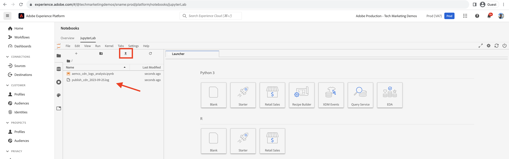

# Analyse du taux d’accès au cache du réseau CDN

Le contenu mis en cache sur le réseau CDN réduit la latence subie par les utilisateurs et les utilisatrices du site web, qui n’ont pas besoin d’attendre que la requête revienne vers Apache/Dispatcher ou l’instance de publication AEM. Dans ce contexte, il est utile d’optimiser le taux d’accès au cache du réseau CDN pour maximiser la quantité de contenu pouvant être mise en cache sur le réseau CDN.

Découvrez comment analyser les **journaux de réseau CDN** fournis par AEM as a Cloud Service et comment obtenir des informations telles que le **taux d’accès au cache** et les **URL principales de types de cache _MISS_ et _PASS_** à des fins d’optimisation.

Les journaux de réseau CDN sont disponibles au format JSON, qui contient divers champs, y compris `url` et `cache`. Pour plus d’informations, voir [Format des journaux de réseau CDN](https://experienceleague.adobe.com/docs/experience-manager-cloud-service/content/implementing/developing/logging.html?lang=fr#cdn-log:~:text=Toggle%20Text%20Wrapping-,Log%20Format,-The%20CDN%20logs). Le champ `cache` fournit des informations sur l’_état du cache_. Ses valeurs possibles sont HIT, MISS ou PASS. Examinons les détails des valeurs possibles.

| État du cache   Valeur possible | Description |
|------------------------------------|:-----------------------------------------------------:|
| HIT | Les données demandées sont _récupérées dans le cache du réseau CDN et ne nécessitent pas d’effectuer une requête de récupération_ auprès du serveur AEM. |
| MISS | Les données requises sont _introuvables dans le cache du réseau CDN et doivent faire l’objet d’une requête_ au serveur AEM. |
| PASS | Les données demandées sont : _défini explicitement pour ne pas être mis en cache_ et toujours récupéré à partir du serveur AEM. |

Pour les besoins de ce tutoriel, le [projet AEM WKND](https://github.com/adobe/aem-guides-wknd) est déployé dans l’environnement AEM as a Cloud Service et un petit test de performance est déclenché à l’aide d’[Apache JMeter](https://jmeter.apache.org/).

Ce tutoriel est structuré de manière à vous guider dans le processus suivant :

1. Téléchargement des journaux de réseau CDN via Cloud Manager
1. L’analyse de ces journaux CDN peut être effectuée avec deux méthodes : un tableau de bord installé localement ou un notebook Splunk ou Jupityer accessible à distance (pour ceux qui disposent d’une licence Adobe Experience Platform).
1. Optimisation de la configuration du cache de réseau CDN

## Télécharger les journaux de réseau CDN

Pour télécharger les journaux de réseau CDN, procédez comme suit :

1. Connectez-vous à Cloud Manager à l’adresse [my.cloudmanager.adobe.com](https://my.cloudmanager.adobe.com/) et sélectionnez votre organisation et votre programme.

1. Pour un environnement AEMCS souhaité, sélectionnez **Télécharger les journaux** dans le menu représentant des points de suspension.

   {width="500" zoomable="yes"}

1. Dans la boîte de dialogue **Télécharger les journaux**, sélectionnez le service de **Publication** dans le menu déroulant, puis cliquez sur l’icône de téléchargement en regard de la ligne **cdn**.

   {width="500" zoomable="yes"}

Si le fichier journal téléchargé date d’_aujourd’hui_, l’extension de fichier est `.log`. Sinon, pour les fichiers journaux précédents, l’extension est `.log.gz`.

## Analyser les journaux de réseau CDN téléchargés

Pour obtenir des informations telles que le taux d’accès au cache et les URL principales des types de cache MISS et PASS, analysez le fichier journal de réseau CDN téléchargé. Ces informations permettent d’optimiser la [Configuration du cache de réseau CDN](https://experienceleague.adobe.com/fr/docs/experience-manager-cloud-service/content/implementing/content-delivery/caching) et d’améliorer les performances du site.

Pour analyser les journaux CDN, ce tutoriel présente trois options :

1. **Elasticsearch, Logstash et Kibana (ELK)**: la variable [Outils de tableau de bord ELK](https://github.com/adobe/AEMCS-CDN-Log-Analysis-Tooling/blob/main/ELK/README.md) peut être installé localement.
1. **Splunk**: la variable [Outils du tableau de bord Splunk](https://github.com/adobe/AEMCS-CDN-Log-Analysis-Tooling/blob/main/Splunk/READEME.md) nécessite l’accès à Splunk et [Transfert de journal AEMCS activé](https://experienceleague.adobe.com/fr/docs/experience-manager-cloud-service/content/implementing/developing/logging#splunk-logs) pour ingérer les journaux CDN.
1. [Notebook Jupyter](https://jupyter.org/): accessible à distance dans le cadre de [Adobe Experience Platform](https://experienceleague.adobe.com/en/docs/experience-platform/data-science-workspace/jupyterlab/analyze-your-data) sans installer de logiciel supplémentaire, pour les clients qui disposent d’une licence Adobe Experience Platform.

### Option 1 : utilisation des outils de tableau de bord ELK

La [pile ELK](https://www.elastic.co/elastic-stack) est un ensemble d’outils fournissant une solution évolutive et permettant de rechercher, d’analyser et de visualiser les données. Elle se compose d’Elasticsearch, de Logstash et de Kibana.

Pour identifier les détails clés, nous allons utiliser la variable [AEMCS-CDN-Log-Analysis-Tooling](https://github.com/adobe/AEMCS-CDN-Log-Analysis-Tooling) projet. Ce projet fournit un conteneur Docker de la pile ELK et un tableau de bord Kibana préconfiguré pour analyser les journaux de réseau CDN.

1. Suivez les étapes de [Configuration du conteneur ELK Docker](https://github.com/adobe/AEMCS-CDN-Log-Analysis-Tooling/blob/main/ELK/README.md#how-to-set-up-the-elk-docker-containerhow-to-setup-the-elk-docker-container) et veillez à importer la variable **Taux d’accès au cache du réseau CDN** Tableau de bord de Kibana.

1. Pour identifier le taux d’accès au cache du réseau CDN et aux URL principales, procédez comme suit :

   1. Copiez le ou les fichiers journaux CDN téléchargés dans le dossier des journaux spécifiques à l’environnement, par exemple : `ELK/logs/stage`.

   1. Ouvrez le **Taux d’accès au cache du réseau CDN** tableau de bord en cliquant sur le coin supérieur gauche _Menu de navigation > Analytics > Tableau de bord > Rapport d’accès au cache du réseau CDN_.

      {width="500" zoomable="yes"}

   1. Sélectionnez la période souhaitée dans le coin supérieur droit.

      {width="500" zoomable="yes"}

   1. Le tableau de bord **Taux d’accès au cache du réseau CDN** est explicite.

   1. La section _Analyse totale des requêtes_ affiche les détails suivants :
      - Taux de cache par type de cache
      - Nombre de mises en cache par type de cache

      {width="500" zoomable="yes"}

   1. L’_analyse par type de requête ou MIME_ affiche les détails suivants :
      - Taux de cache par type de cache
      - Nombre de mises en cache par type de cache
      - Principales URL MISS et PASS

      {width="500" zoomable="yes"}

#### Filtrage par nom d’environnement ou identifiant de programme

Pour filtrer les journaux ingérés par nom d’environnement, procédez comme suit :

1. Dans le tableau de bord Taux d’accès au cache du réseau CDN, cliquez sur l’icône **Ajouter un filtre**.

   {width="500" zoomable="yes"}

1. Dans la boîte de dialogue modale **Ajouter un filtre**, sélectionnez le champ `aem_env_name.keyword` dans le menu déroulant, puis l’opérateur `is` et le nom de l’environnement de votre choix pour le champ suivant. Cliquez ensuite sur _Ajouter un filtre_.

   {width="500" zoomable="yes"}

#### Filtrage par nom d’hôte

Pour filtrer les journaux ingérés par nom d’hôte, procédez comme suit :

1. Dans le tableau de bord Taux d’accès au cache du réseau CDN, cliquez sur l’icône **Ajouter un filtre**.

   {width="500" zoomable="yes"}

1. Dans la boîte de dialogue modale **Ajouter un filtre**, sélectionnez le champ `host.keyword` dans le menu déroulant, puis l’opérateur `is` et le nom d’hôte souhaité pour le champ suivant. Cliquez ensuite sur _Ajouter un filtre_.

   {width="500" zoomable="yes"}

De même, ajoutez d’autres filtres au tableau de bord en fonction des exigences d’analyse.

### Option 2 : utilisation des outils du tableau de bord Splunk

La variable [Splunk](https://www.splunk.com/) est un outil d’analyse des journaux populaire qui permet d’agréger, d’analyser les journaux et de créer des visualisations à des fins de surveillance et de dépannage.

Pour identifier les détails clés, nous allons utiliser la variable [AEMCS-CDN-Log-Analysis-Tooling](https://github.com/adobe/AEMCS-CDN-Log-Analysis-Tooling) projet. Ce projet fournit un tableau de bord Splunk pour analyser les journaux CDN.

1. Suivez les étapes de [Tableaux de bord Splunk pour l’analyse des journaux de réseau de diffusion de contenu AEM](https://github.com/adobe/AEMCS-CDN-Log-Analysis-Tooling/blob/main/Splunk/READEME.md) et veillez à importer la variable **Taux d’accès au cache du réseau CDN** Tableau de bord Splunk.
1. Si nécessaire, mettez à jour la variable _Index, type de source et autres_ filtrer les valeurs dans le tableau de bord Splunk.

   {width="500" zoomable="yes"}

### Option 3 : utilisation de Jupyter Notebook

Pour ceux qui préfèrent ne pas installer de logiciel localement (c’est-à-dire l’outil de tableau de bord ELK de la section précédente), il existe une autre option, mais elle nécessite une licence pour Adobe Experience Platform.

[Jupyter Notebook](https://jupyter.org/) est une application web open source qui permet de créer des documents contenant du code, du texte et des visualisations. Elle est utilisée pour la transformation, la visualisation et la modélisation statistique des données. Elle est accessible à distance [dans le cadre d’Adobe Experience Platform](https://experienceleague.adobe.com/en/docs/experience-platform/data-science-workspace/jupyterlab/analyze-your-data).

#### Télécharger le fichier Interactive Python Notebook

Téléchargez d’abord le fichier [AEM-as-a-CloudService - CDN Logs Analysis - Jupyter Notebook](./assets/cdn-logs-analysis/aemcs_cdn_logs_analysis.ipynb) qui facilite l’analyse des journaux CDN. Le fichier « Interactive Python Notebook » est explicite, mais les points forts de chaque section sont les suivants :

- **Installation de bibliothèques supplémentaires** : installe les bibliothèques Python `termcolor` et `tabulate`.
- **Chargement des journaux de réseau CDN** : charge le fichier journal de réseau CDN à l’aide de la valeur de variable `log_file`. Veillez à mettre à jour sa valeur. Il transforme également ce journal de réseau CDN en [pandas DataFrame](https://pandas.pydata.org/docs/reference/frame.html).
- **Exécution de l’analyse** : le premier bloc de code est _Afficher le résultat de l’analyse pour les requêtes totales, HTML, JS/CSS et Image_. Il fournit le pourcentage, des diagrammes à barres et des diagrammes circulaires pour le taux d’accès au cache.
Le second bloc de code est _5 principales URL de requête MISS et PASS pour HTML, JS/CSS et Image_. Il affiche les URL et leur nombre au format tableau.

#### Exécution de Jupyter Notebook

Exécutez ensuite Jupyter Notebook dans Adobe Experience Platform, en suivant les étapes ci-dessous :

1. Connectez-vous à [Adobe Experience Cloud](https://experience.adobe.com/). Sur la page d’accueil > **Accès rapide** > cliquez sur l’icône **Experience Platform**.

   {width="500" zoomable="yes"}

1. Sur la page d’accueil d’Adobe Experience Platform > section Science des données, cliquez sur l’élément de menu **Notebooks**. Pour démarrer l’environnement Jupyter Notebooks, cliquez sur le bouton **JupyterLab**.

   {width="500" zoomable="yes"}

1. Dans le menu JupyterLab, à l’aide de l’icône **Chargement de fichiers**, chargez le fichier journal de réseau CDN et le fichier `aemcs_cdn_logs_analysis.ipynb` téléchargés.

   {width="500" zoomable="yes"}

1. Ouvrez le fichier `aemcs_cdn_logs_analysis.ipynb` en double-cliquant dessus.

1. Dans la section **Charger le fichier journal de réseau CDN** du Notebook, mettez à jour la valeur `log_file`.

   {width="500" zoomable="yes"}

1. Pour exécuter la cellule sélectionnée et avancer, cliquez sur l’icône de **lecture**.

   {width="500" zoomable="yes"}

1. Après avoir exécuté la cellule de code **Afficher le résultat de l’analyse pour les requêtes totales, HTML, JS/CSS et Image**, le résultat affiche le pourcentage, des diagrammes à barres et des diagrammes circulaires pour le taux d’accès au cache.

   {width="500" zoomable="yes"}

1. Après avoir exécuté la cellule de code **5 principales URL de requêtes MISS et PASS pour HTML, JS/CSS et Image**, la sortie affiche les 5 principales URL de requêtes MISS et PASS.

   {width="500" zoomable="yes"}

Vous pouvez améliorer Jupyter Notebook de sorte à analyser les journaux de réseau CDN en fonction de vos besoins.

## Optimisation de la configuration du cache de réseau CDN

Après avoir analysé les journaux de réseau CDN, vous pouvez optimiser la configuration du cache de réseau CDN pour améliorer les performances du site. La bonne pratique AEM consiste à obtenir un taux d’accès au cache de 90 % ou plus.

Pour plus d’informations, voir [Optimisation de la configuration du cache de réseau CDN](https://experienceleague.adobe.com/fr/docs/experience-manager-cloud-service/content/implementing/content-delivery/caching).

Le projet AEM WKND comporte une configuration de réseau CDN de référence. Pour plus d’informations, voir [Configuration du réseau CDN](https://github.com/adobe/aem-guides-wknd/blob/main/dispatcher/src/conf.d/available_vhosts/wknd.vhost#L137-L190) dans le fichier `wknd.vhost`.
