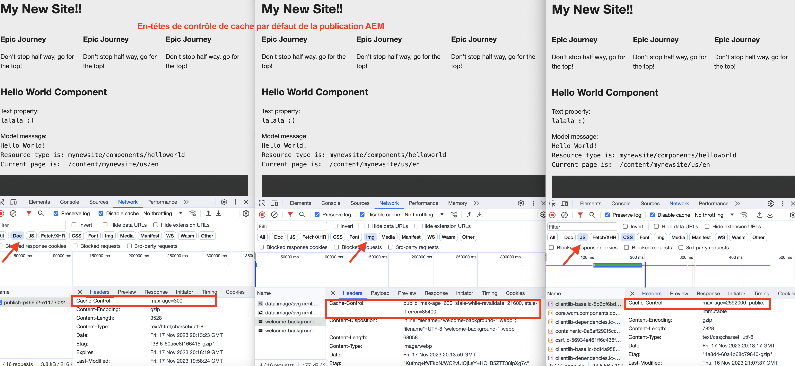

# Comment activer la mise en cache du réseau CDN

Découvrez comment activer la mise en cache des réponses HTTP dans le réseau de diffusion de contenu d’AEM as a Cloud Service. La mise en cache des réponses est contrôlée par `Cache-Control`, `Surrogate-Control`, ou `Expires` En-têtes de cache de réponse HTTP.

Ces en-têtes de cache sont généralement définis dans les configurations vhost du Dispatcher d’AEM à l’aide de `mod_headers`, mais peut également être défini dans du code Java™ personnalisé s’exécutant dans l’instance de publication AEM directement.

## Comportement de mise en cache par défaut

Lorsque des configurations personnalisées NE sont PAS présentes, les valeurs par défaut sont utilisées. Dans la capture d’écran suivante, vous pouvez voir le comportement de mise en cache par défaut pour AEM Publier et créer lorsqu’une [AEM Archétype de projet](https://github.com/adobe/aem-project-archetype) based `mynewsite` AEM projet est déployé.

{width="800" zoomable="yes"}

Consultez la section [Publication AEM - Durée de vie du cache par défaut](https://experienceleague.adobe.com/docs/experience-manager-learn/cloud-service/caching/publish.html#cdn-cache-life) et [AEM Auteur - Durée de vie du cache par défaut](https://experienceleague.adobe.com/docs/experience-manager-learn/cloud-service/caching/author.html?#default-cache-life) pour plus d’informations.

En résumé, AEM as a Cloud Service met en cache la plupart des types de contenu (HTML, JSON, JS, CSS et Assets) dans AEM Publish et quelques types de contenu (JS, CSS) dans l’instance d’auteur d’Adobe.

## Activation de la mise en cache

Pour modifier le comportement de mise en cache par défaut, vous pouvez mettre à jour les en-têtes de cache de deux manières différentes.

1. **Configuration vhost de Dispatcher :** Disponible uniquement pour AEM publication.
1. **Code Java™ personnalisé :** Disponible pour AEM Publication et création.

Examinons chacune de ces options.

### Configuration du vhost de Dispatcher

Cette option est l’approche recommandée pour activer la mise en cache, mais elle n’est disponible que pour AEM Publier. Pour mettre à jour les en-têtes de cache, utilisez le `mod_headers` module et `<LocationMatch>` dans le fichier vhost du serveur HTTP Apache. La syntaxe générale est la suivante :

    &quot;conf
    &lt;locationmatch url=&quot;&quot; url_regex=&quot;&quot;>
    # Supprime l’en-tête de réponse de ce nom, s’il existe. S’il existe plusieurs en-têtes du même nom, tous sont supprimés.
    Contrôle de cache non défini de l’en-tête
    Contrôle de substitution d’en-tête non défini
    Expire l’en-tête non défini
    
    # Indique au navigateur web et au réseau de diffusion de contenu de mettre en cache la réponse pour la valeur &quot;max-age&quot; (XXX) secondes. Les attributs &#39;stale-while-revalidate&#39; et &#39;stale-if-error&#39; contrôlent le traitement de l’état obsolète sur la couche CDN.
    Jeu d’en-têtes Cache-Control &quot;max-age=XXX,stale-while-revalidate=XXX,stale-if-error=XXX&quot;
    
    # Indique au réseau de diffusion de contenu de mettre en cache la réponse pour la valeur &quot;max-age&quot; (XXX) secondes. Les attributs &#39;stale-while-revalidate&#39; et &#39;stale-if-error&#39; contrôlent le traitement de l’état obsolète sur la couche CDN.
    Ensemble d’en-têtes Surrogate-Control &quot;max-age=XXX,stale-while-revalidate=XXX,stale-if-error=XXX&quot;
    
    # Indique au navigateur web et au réseau de diffusion de contenu de mettre en cache la réponse jusqu’à la date et l’heure spécifiées.
    Header set Expire &quot;Sun, 31 décembre 2023 23:59:59 GMT&quot;
    &lt;/locationmatch>
    &quot;

Le tableau suivant résume l’objectif de chaque **header** et applicable **Attributs** pour l’en-tête .

|                     | Navigateur web | Réseau de diffusion de contenu (CDN) | Description |
|---------------------|:-----------:|:---------:|:-----------:|
| Cache-Control | ✔ | ✔ | Cet en-tête contrôle la durée de vie du navigateur web et du cache CDN. |
| Contrôle des substituts | ✘ | ✔ | Cet en-tête contrôle la durée de vie du cache CDN. |
| Date d’expiration | ✔ | ✔ | Cet en-tête contrôle la durée de vie du navigateur web et du cache CDN. |

- **max-age**: cet attribut contrôle le délai d’activation (TTL) ou le &quot;temps d’activation&quot; du contenu de la réponse en secondes.
- **stale-while-revalidate**: cet attribut contrôle la variable _état obsolète_ le traitement du contenu de la réponse sur la couche CDN lors de la réception d’une requête se trouve dans la période spécifiée en secondes. La variable _état obsolète_ est la période qui suit l’expiration du délai d’activation et avant que la réponse ne soit revalidée.
- **stale-if-error**: cet attribut contrôle la variable _état obsolète_ traitement du contenu de la réponse sur la couche CDN lorsque le serveur d’origine n’est pas disponible et que la demande reçue est comprise dans la période spécifiée en secondes.

Consultez la section [l&#39;intégrité et la revalidation](https://developer.fastly.com/learning/concepts/edge-state/cache/stale/) détails pour plus d’informations.

#### Exemple

Pour augmenter la durée de vie du navigateur web et du cache CDN de la variable **Type de contenu du HTML** to _10 minutes_ sans traitement d’état obsolète, procédez comme suit :

1. Dans votre projet AEM, recherchez le fichier vhost souhaité à partir de `dispatcher/src/conf.d/available_vhosts` répertoire .
1. Mettez à jour le vhost (par ex. `wknd.vhost`) comme suit :

       &quot;conf
       &lt;locationmatch content=&quot;&quot;>*\.(html)$&quot;>
       # Supprime l’en-tête de réponse s’il est présent
       Contrôle de cache non défini de l’en-tête
       
       # Indique au navigateur web et au réseau de diffusion de contenu de mettre en cache la réponse pour la valeur max-age (600) seconds.
       Jeu d’en-têtes Cache-Control &quot;max-age=600&quot;
       &lt;/locationmatch>
       &quot;
   Les fichiers vhost dans `dispatcher/src/conf.d/enabled_vhosts` sont **symlinks** aux fichiers dans `dispatcher/src/conf.d/available_vhosts` , veillez donc à créer des liens symboliques s’ils ne sont pas présents.
1. Déployez les modifications vhost dans l’environnement as a Cloud Service AEM souhaité à l’aide de la fonction [Cloud Manager - Pipeline de configuration de niveau web](https://experienceleague.adobe.com/docs/experience-manager-cloud-service/content/implementing/using-cloud-manager/cicd-pipelines/introduction-ci-cd-pipelines.html?#web-tier-config-pipelines) ou [Commandes RDE](https://experienceleague.adobe.com/docs/experience-manager-learn/cloud-service/developing/rde/how-to-use.html?lang=en#deploy-apache-or-dispatcher-configuration).

Cependant, pour avoir des valeurs différentes pour la durée de vie du navigateur web et du cache CDN, vous pouvez utiliser la variable `Surrogate-Control` dans l’exemple ci-dessus. De même, pour que le cache arrive à expiration à une date et une heure spécifiques, vous pouvez utiliser la variable `Expires` en-tête . En outre, l’utilisation de la variable `stale-while-revalidate` et `stale-if-error` , vous pouvez contrôler le traitement de l’état obsolète du contenu de la réponse. Le projet AEM WKND comporte une [traitement de l’état obsolète de référence](https://github.com/adobe/aem-guides-wknd/blob/main/dispatcher/src/conf.d/available_vhosts/wknd.vhost#L150-L155) Configuration du cache CDN.

De même, vous pouvez mettre à jour les en-têtes de cache d’autres types de contenu (JSON, JS, CSS et Assets).

### Code Java™ personnalisé

Cette option est disponible pour AEM Publication et Auteur. Toutefois, il n’est pas recommandé d’activer la mise en cache dans AEM Auteur et de conserver le comportement de mise en cache par défaut.

Pour mettre à jour les en-têtes de cache, utilisez le `HttpServletResponse` dans le code Java™ personnalisé (servlet Sling, filtre de servlet Sling). La syntaxe générale est la suivante :

    &quot;java
    // Indique au navigateur web et au réseau de diffusion de contenu de mettre en cache la réponse pour la valeur &quot;max-age&quot; (XXX) secondes. Les attributs &#39;stale-while-revalidate&#39; et &#39;stale-if-error&#39; contrôlent le traitement de l’état obsolète sur la couche CDN.
    response.setHeader(&quot;Cache-Control&quot;, &quot;max-age=XXX,stale-while-revalidate=XXX,stale-if-error=XXX&quot;);
    
    // Indique au réseau de diffusion de contenu de mettre en cache la réponse pour la valeur &quot;max-age&quot; (XXX) secondes. Les attributs &#39;stale-while-revalidate&#39; et &#39;stale-if-error&#39; contrôlent le traitement de l’état obsolète sur la couche CDN.
    response.setHeader(&quot;Surrogate-Control&quot;, &quot;max-age=XXX,stale-while-revalidate=XXX,stale-if-error=XXX&quot;);
    
    // Indique au navigateur web et au réseau de diffusion de contenu de mettre en cache la réponse jusqu’à la date et l’heure spécifiées.
    response.setHeader(&quot;Expires&quot;, &quot;Sun, 31 décembre 2023 23:59:59 GMT&quot;);
    &quot;
