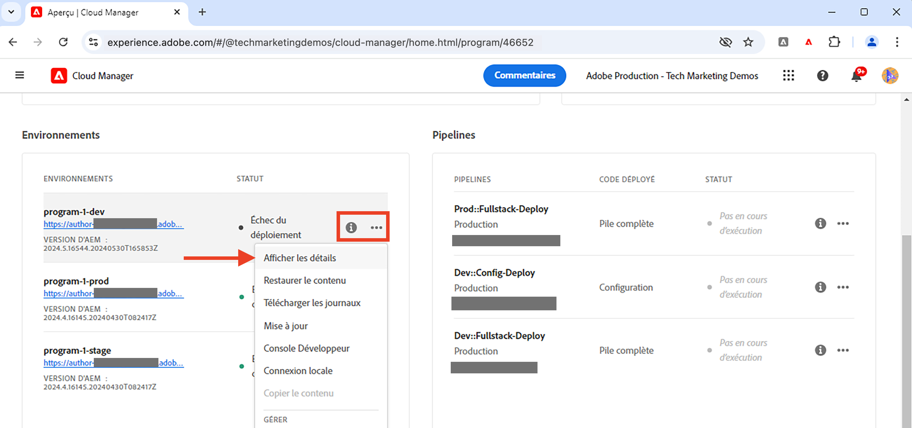
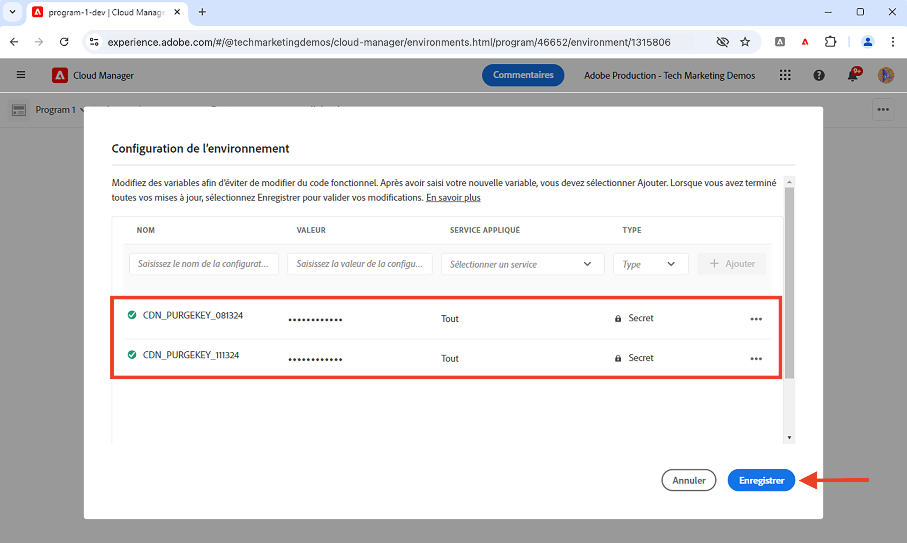
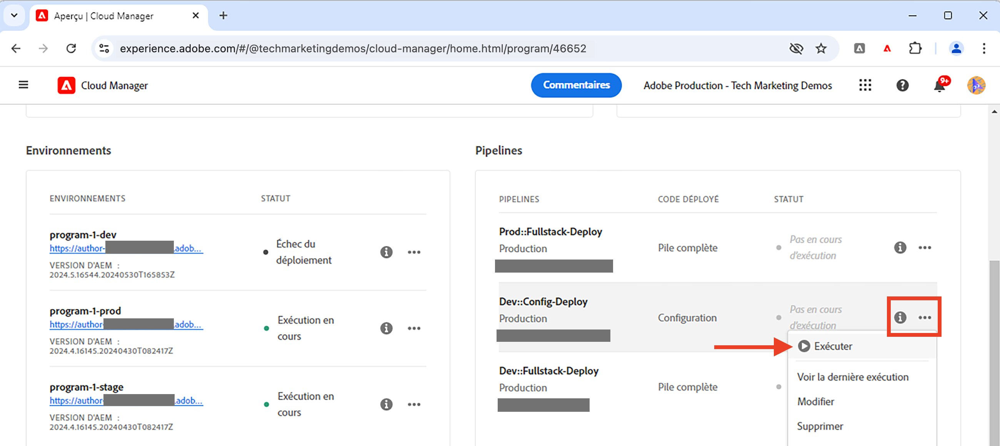

# Purge du cache du réseau CDN

Découvrez comment purger ou supprimer la réponse HTTP mise en cache du réseau CDN d’AEM as a Cloud Service. À l’aide de la fonctionnalité en libre-service appelée **Purger le jeton API**, vous pouvez purger le cache d’une ressource spécifique, d’un groupe de ressources et de l’ensemble du cache.

Dans ce tutoriel, découvrez comment configurer et utiliser la fonctionnalité Purger le jeton API pour purger le cache du réseau CDN de l’exemple de site [AEM WKND](https://github.com/adobe/aem-guides-wknd) à l’aide de la fonctionnalité de libre-service.

>[!VIDEO](https://video.tv.adobe.com/v/3436927?quality=12&learn=on&captions=fre_fr)

## Invalidation du cache et purge explicite

Il existe deux façons de supprimer les ressources mises en cache du réseau CDN :

1. **Invalidation du cache :** il s’agit du processus de suppression des ressources mises en cache du réseau CDN en fonction des en-têtes de cache tels que `Cache-Control`, `Surrogate-Control` ou `Expires`. La valeur d’attribut `max-age` de l’en-tête du cache est utilisée pour déterminer la durée de vie du cache des ressources, également appelée TTL (délai d’expiration) du cache. À l’expiration de la durée de vie du cache, les ressources mises en cache sont automatiquement supprimées du cache du réseau CDN.

1. **Purge explicite :** il s’agit du processus de suppression manuelle des ressources mises en cache du cache du réseau CDN avant l’expiration du TTL. La purge explicite est utile lorsque vous souhaitez supprimer immédiatement les ressources mises en cache. Cependant, cela augmente le trafic vers le serveur d’origine.

Lorsque des ressources mises en cache sont supprimées du cache du réseau CDN, la requête suivante pour la même ressource récupère la dernière version du serveur d’origine.

## Configurer la purge du jeton API

Découvrez comment configurer la purge du jeton API pour purger le cache du réseau CDN.

### Configurer la règle du réseau CDN

Le jeton d’API de purge est créé en configurant la règle du réseau CDN dans le code de votre projet AEM.

1. Ouvrez le fichier `cdn.yaml` dans le dossier `config` principal de votre projet AEM. Par exemple, le fichier [cdn.yaml du projet WKND](https://github.com/adobe/aem-guides-wknd/blob/main/config/cdn.yaml).

1. Ajoutez les règles de réseau CDN suivantes au fichier `cdn.yaml` :

```yaml
kind: "CDN"
version: "1"
metadata:
  envTypes: ["dev", "stage", "prod"]
data:  
  authentication: # The main authentication configuration
    authenticators: # The list of authenticators
       - name: purge-auth # The name of the authenticator
         type: purge  # The type of the authenticator, must be purge
         purgeKey1: ${{CDN_PURGEKEY_081324}} # The first purge key, must be referenced by the Cloud Manager secret-type environment variable name ${{CDN_EDGEKEY_073124}}
         purgeKey2: ${{CDN_PURGEKEY_111324}} # The second purge key, must be referenced by the Cloud Manager secret-type environment variable name ${{CDN_EDGEKEY_111324}}. It is used for the rotation of secrets without any interruptions.
    rules: # The list of authentication rules
       - name: purge-auth-rule # The name of the rule
         when: { reqProperty: tier, equals: "publish" } # The condition when the rule should be applied
         action: # The action to be taken when the rule is applied
           type: authenticate # The type of the action, must be authenticate
           authenticator: purge-auth # The name of the authenticator to be used, must match the name from the above authenticators list               
```

Dans la règle ci-dessus, `purgeKey1` et `purgeKey2` sont ajoutés depuis le début pour prendre en charge la rotation des secrets sans interruption. Cependant, vous pouvez commencer avec uniquement `purgeKey1` et ajouter `purgeKey2` ultérieurement lors de la rotation des secrets.

1. Enregistrez, validez et publiez les modifications dans le référentiel Adobe en amont.

### Créer une variable d’environnement Cloud Manager

Créez ensuite les variables d’environnement Cloud Manager pour stocker la valeur Purger le jeton API.

1. Connectez-vous à Cloud Manager à l’adresse [my.cloudmanager.adobe.com](https://my.cloudmanager.adobe.com/) et sélectionnez votre organisation et votre programme.

1. Dans la section __Environnements__, cliquez sur les **points de suspension** (…) en regard de l’environnement souhaité, puis sélectionnez **Afficher les détails**.

   

1. Sélectionnez ensuite l’onglet **Configuration** et cliquez sur le bouton **Ajouter la configuration**.

1. Dans la boîte de dialogue **Configuration de l’environnement**, indiquez ce qui suit :
   - **Nom** : saisissez le nom de la variable d’environnement. Elle doit correspondre à la valeur `purgeKey1` ou `purgeKey2` du fichier `cdn.yaml`.
   - **Valeur** : saisissez la valeur Purger le jeton API.
   - **Service appliqué** : sélectionnez l’option **Tous**.
   - **Type** : sélectionnez l’option **Secret**.
   - Cliquez sur le bouton **Ajouter**.

   

1. Répétez les étapes ci-dessus pour créer la seconde variable d’environnement pour la valeur `purgeKey2`.

1. Cliquez sur **Enregistrer** pour enregistrer les modifications.

### Déployer la règle du réseau CDN

Enfin, déployez la règle du réseau CDN configurée sur l’environnement AEM as a Cloud Service à l’aide du pipeline Cloud Manager.

1. Dans Cloud Manager, accédez à la section **Pipelines**.

1. Créez un pipeline ou sélectionnez le pipeline existant qui déploie uniquement les fichiers **Config**. Pour obtenir des instructions détaillées, voir [Créer un pipeline de configuration](https://experienceleague.adobe.com/fr/docs/experience-manager-learn/cloud-service/security/traffic-filter-and-waf-rules/how-to-setup#deploy-rules-through-cloud-manager).

1. Cliquez sur le bouton **Exécuter** pour déployer la règle CDN.

   

## Utiliser le jeton API de purge

Pour purger le cache CDN, appelez l’URL de domaine spécifique au service AEM avec le jeton API de purge. La syntaxe pour purger le cache se présente comme suit :

```
PURGE <URL> HTTP/1.1
Host: <AEM_SERVICE_SPECIFIC_DOMAIN>
X-AEM-Purge-Key: <PURGE_API_TOKEN>
X-AEM-Purge: <PURGE_TYPE>
Surrogate-Key: <SURROGATE_KEY>
```

Où :

- **PURGE`<URL>`** : la méthode `PURGE` est suivie du chemin URL de la ressource que vous souhaitez purger.
- **Host:`<AEM_SERVICE_SPECIFIC_DOMAIN>`** : il spécifie le domaine du service AEM.
- **X-AEM-Purge-Key:`<PURGE_API_TOKEN>`** : un en-tête personnalisé qui contient la valeur du jeton API de purge.
- **X-AEM-Purge:`<PURGE_TYPE>`** : un en-tête personnalisé qui spécifie le type d’opération de purge. La valeur peut être `hard`, `soft` ou `all`. Le tableau suivant décrit chaque type de purge :

  | Type de purge | Description |
  |:------------:|:-------------:|
  | hard (par défaut) | Supprime immédiatement la ressource mise en cache. Évitez-le, car cela augmente le trafic vers le serveur d’origine. |
  | soft | Marque la ressource mise en cache comme obsolète et récupère la dernière version du serveur d’origine. |
  | tout | Supprime toutes les ressources mises en cache du cache CDN. |

- **Surrogate-Key:`<SURROGATE_KEY>`** : (facultatif) en-tête personnalisé qui spécifie les clés de substitution (séparées par un espace) des groupes de ressources à purger. La clé de substitution est utilisée pour regrouper les ressources et doit être définie dans l’en-tête de réponse de la ressource.

>[!TIP]
>
>Dans les exemples ci-dessous, `X-AEM-Purge: hard` est utilisé à des fins de démonstration. Vous pouvez le remplacer par `soft` ou `all` en fonction de vos besoins. Faites preuve de prudence lorsque vous utilisez le type de purge `hard`, car cela augmente le trafic vers le serveur d’origine.

### Purger le cache d’une ressource spécifique

Dans cet exemple, la commande `curl` purge le cache de la ressource `/us/en.html` sur le site WKND déployé dans un environnement AEM as a Cloud Service.

```bash
curl -X PURGE "https://publish-p46652-e1315806.adobeaemcloud.com/us/en.html" \
-H "X-AEM-Purge-Key: 123456789" \
-H "X-AEM-Purge: hard"
```

Une fois la purge terminée, une réponse `200 OK` est renvoyée avec du contenu JSON.

```json
{ "status": "ok", "id": "1000098-1722961031-13237063" }
```

### Purger le cache d’un groupe de ressources

Dans cet exemple, la commande `curl` purge le cache du groupe de ressources avec la clé de substitution `wknd-assets`. L’en-tête de réponse `Surrogate-Key` est défini dans [`wknd.vhost`](https://github.com/adobe/aem-guides-wknd/blob/main/dispatcher/src/conf.d/available_vhosts/wknd.vhost#L176), par exemple :

```http
<VirtualHost *:80>
    ...

    # Core Component Image Component: long-term caching (30 days) for immutable URLs, background refresh to avoid MISS
    <LocationMatch "^/content/.*\.coreimg.*\.(?i:jpe?g|png|gif|svg)$">
        Header set Cache-Control "max-age=2592000,stale-while-revalidate=43200,stale-if-error=43200,public,immutable" "expr=%{REQUEST_STATUS} < 400"
        # Set Surrogate-Key header to group the cache of WKND assets, thus it can be flushed independtly
        Header set Surrogate-Key "wknd-assets"
        Header set Age 0
    </LocationMatch>

    ...
</VirtualHost>
```

```bash
curl -X PURGE "https://publish-p46652-e1315806.adobeaemcloud.com" \
-H "Surrogate-Key: wknd-assets" \
-H "X-AEM-Purge-Key: 123456789" \
-H "X-AEM-Purge: hard"
```

Une fois la purge terminée, une réponse `200 OK` est renvoyée avec du contenu JSON.

```json
{ "wknd-assets": "10027-1723478994-2597809-1" }
```

### Purger l’intégralité du cache

Dans cet exemple, à l’aide de la commande `curl`, l’intégralité du cache est purgée de l’exemple de site WKND déployé sur l’environnement AEM as a Cloud Service.

```bash
curl -X PURGE "https://publish-p46652-e1315806.adobeaemcloud.com/" \
-H "X-AEM-Purge-Key: 123456789" \
-H "X-AEM-Purge: all"
```

Une fois la purge terminée, une réponse `200 OK` est renvoyée avec du contenu JSON.

```json
{"status":"ok"}
```

### Vérifier la purge du cache

Pour vérifier la purge du cache, accédez à l’URL de la ressource dans le navigateur web et passez en revue les en-têtes de réponse. La valeur de l’en-tête `X-Cache` doit être `MISS`.


