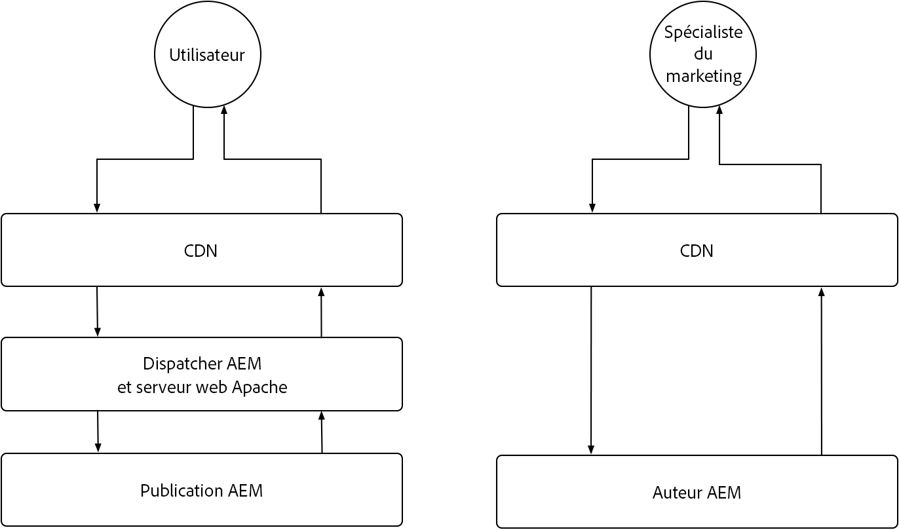
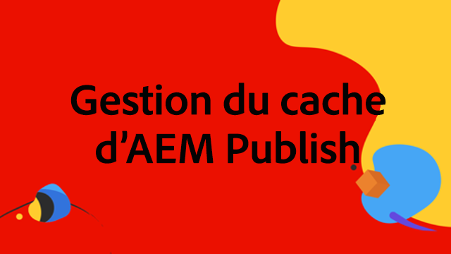
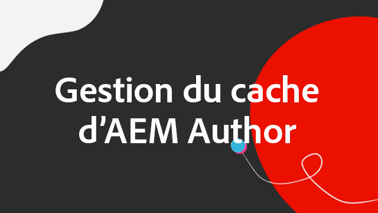

# Cache d’AEM as a Cloud Service

Dans AEM as a Cloud Service, il est essentiel de comprendre le cache. Le cache implique le stockage et la réutilisation des données récupérées précédemment afin d’améliorer l’efficacité du système et de réduire les temps de chargement. Ce mécanisme accélère considérablement la diffusion de contenu, améliore les performances du site web et optimise l’expérience client.

AEM as a Cloud Service comporte plusieurs couches de cache et des stratégies qui diffèrent entre les services de création et de publication.

{align="center"}

## Cache AEM

AEM as a Cloud Service dispose d’une stratégie de cache multi-couche robuste et configurable, comprenant un réseau CDN, le Dispatcher d’AEM et éventuellement un réseau CDN géré côté client. Il est possible d’affiner les couches du cache afin d’optimiser les performances, en s’assurant qu’AEM offre uniquement les meilleures expériences. AEM a des préoccupations différentes concernant le cache pour les services de création et de publication. Explorez les stratégies de cache pour chaque service ci-dessous.

    

    

        

          <figure class="image is-16by9">
            
          </figure>
        

        

          

            
<a href="./publish.md" title="Mise en cache du service de publication d’AEM">Mise en cache du service de publication d’AEM</a>

            
Le service de publication AEM utilise un réseau CDN géré et le Dispatcher d’AEM pour optimiser les expériences web des personnes finales.

            <a href="./publish.md" class="spectrum-Button spectrum-Button--outline spectrum-Button--primary spectrum-Button--sizeM">
Apprendre
</a>
          

        

      

    

    

        

            

            <figure class="image is-16by9">
                
            </figure>
            

            

            

                
<a href="./author.md" title="Cache du service de création AEM">Cache du service de création AEM</a>

                
Le service de création AEM utilise un réseau CDN géré pour fournir des expériences de création optimisées.

                <a href="./author.md" class="spectrum-Button spectrum-Button--outline spectrum-Button--primary spectrum-Button--sizeM">
Apprendre
</a>
            

            

        

    

