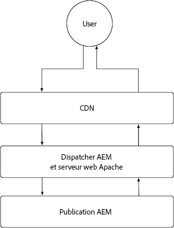
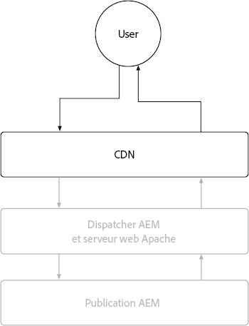
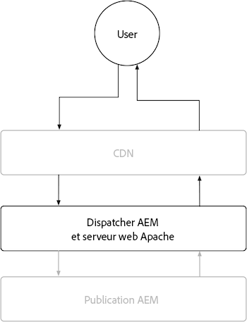

# Publication AEM

Le service de publication d’AEM dispose de deux couches de mise en cache principales, le réseau CDN d’AEM as a Cloud Service et le Dispatcher d’AEM. Un réseau CDN géré par le client ou la cliente peut éventuellement être placé devant le réseau CDN d’AEM as a Cloud Service. Le réseau CDN d’AEM as a Cloud Service fournit une diffusion Edge Delivery, ce qui garantit que les expériences sont diffusées avec une faible latence aux utilisateurs et aux utilisatrices dans le monde entier. Le Dispatcher d’AEM fournit la mise en cache directement devant l’instance de publication AEM et est utilisé pour atténuer la charge inutile sur l’instance de publication AEM.

{align="center"}

## Réseau de diffusion de contenu (CDN)

La mise en cache du réseau CDN d’AEM as a Cloud Service est contrôlée par les en-têtes de cache de réponse HTTP et est conçue pour mettre en cache le contenu afin d’optimiser l’équilibre entre l’actualisation et les performances. Le réseau CDN se trouve entre l’utilisateur finalou l’utilisatrice finale et le Dispatcher d’AEM. Il est utilisé pour mettre en cache le contenu aussi près que possible de l’utilisateur final ou l’utilisatrice finale, assurant ainsi une expérience performante.

{align="center"}

La configuration du mode de mise en cache du contenu par le réseau CDN se limite à la définition des en-têtes de cache sur les réponses HTTP. Ces en-têtes de cache sont généralement définis dans les configurations vhost du Dispatcher d’AEM à l’aide de `mod_headers`, mais peut également être défini dans du code Java™ personnalisé s’exécutant dans l’instance de publication AEM directement.

### Quand les requêtes/réponses HTTP sont-elles mises en cache ?

Le réseau CDN d’AEM as a Cloud Service met en cache uniquement les réponses HTTP, et tous les critères suivants doivent être satisfaits :

+ Le statut de la requête HTTP est `2xx` ou `3xx`.
+ La méthode de requête HTTP est `GET` ou `HEAD`.
+ Au moins un des en-têtes de réponse HTTP suivants est présent : `Cache-Control`, `Surrogate-Control` ou `Expires`.
+ La réponse HTTP peut être n’importe quel type de contenu, y compris les fichiers HTML, JSON, CSS, JS et binaires.

Par défaut, les réponses HTTP qui ne sont pas mises en cache par le [Dispatcher d’AEM](#aem-dispatcher) verront tous les en-têtes de cache de réponse HTTP automatiquement supprimés pour éviter la mise en cache sur le réseau CDN. Ce comportement peut être soigneusement remplacé à l’aide de `mod_headers` avec la directive `Header always set ...` le cas échéant.

### Qu’est-ce qui est mis en cache ?

Le réseau CDN d’AEM as a Cloud Service met en cache les éléments suivants :

+ Corps de réponse HTTP
+ En-têtes de réponse HTTP

En règle générale, une requête/réponse HTTP pour une seule URL est mise en cache en tant qu’objet unique. Cependant, le réseau CDN peut gérer la mise en cache de plusieurs objets pour une seule URL, lorsque l’en-tête `Vary` est défini sur la réponse HTTP. Évitez de spécifier `Vary` sur les en-têtes dont les valeurs n’ont pas de jeu de valeurs étroitement contrôlé, car cela peut entraîner de nombreuses pertes de cache, ce qui réduit le taux d’accès au cache. Pour prendre en charge la mise en cache de requêtes variées dans le Dispatcher d’AEM, [consultez la documentation sur la mise en cache des variantes](https://experienceleague.adobe.com/docs/experience-manager-learn/cloud-service/developing/advanced/variant-caching.html?lang=fr).

### Durée de mise en cache{#cdn-cache-life}

Le réseau CDN de l’instance de publication AEM est basé sur la durée de vie (TTL), ce qui signifie que la durée de vie du cache est déterminée par les en-têtes de réponse HTTP `Cache-Control`, `Surrogate-Control` ou `Expires`. Si les en-têtes de mise en cache de la réponse HTTP ne sont pas définis par le projet, et que les [critères d’éligibilité](#when-are-http-requestsresponses-cached) sont remplis, Adobe définit une durée de vie par défaut du cache de 10 minutes (600 secondes).

Voici comment les en-têtes influencent la durée de vie du cache du réseau CDN :

+ [`Cache-Control`](https://developer.fastly.com/reference/http/http-headers/Cache-Control/) L’en-tête de réponse HTTP indique au navigateur web et au réseau CDN la durée de mise en cache de la réponse. La valeur est en secondes. Par exemple, `Cache-Control: max-age=3600` indique au navigateur web de mettre en cache la réponse pendant une heure. Cette valeur est ignorée par le réseau CDN si l’en-tête de réponse HTTP `Surrogate-Control` est également présent.
+ [`Surrogate-Control`](https://developer.fastly.com/reference/http/http-headers/Surrogate-Control/) L’en-tête de réponse HTTP indique au réseau CDN d’AEM la durée de mise en cache de la réponse. La valeur est en secondes. Par exemple, `Surrogate-Control: max-age=3600` indique au réseau CDN de mettre en cache la réponse pendant une heure.
+ [`Expires`](https://developer.fastly.com/reference/http/http-headers/Expires/) L’en-tête de réponse HTTP indique au réseau CDN (et au navigateur web) d’AEM combien de temps la réponse mise en cache reste valide. La valeur est une date. Par exemple, `Expires: Sat, 16 Sept 2023 09:00:00 EST` indique au navigateur web de mettre en cache la réponse jusqu’à la date et l’heure spécifiées.

Utilisez `Cache-Control` pour contrôler la durée de vie du cache lorsqu’elle est identique pour le navigateur et le réseau CDN. Utilisez `Surrogate-Control` lorsque le navigateur web doit mettre en cache la réponse pour une durée différente de celle du réseau CDN.

#### Durée de vie du cache par défaut

Si une réponse HTTP est admissible pour la mise en cache du Dispatcher d’AEM [selon les qualificateurs ci-dessus](#when-are-http-requestsresponses-cached), les valeurs suivantes sont les valeurs par défaut, sauf si une configuration personnalisée est présente.

| Type de contenu | Durée de vie du cache du réseau CDN par défaut |
|:------------ |:---------- |
| [HTML/JSON/XML](https://experienceleague.adobe.com/docs/experience-manager-cloud-service/content/implementing/content-delivery/caching.html?lang=fr#html-text) | 5 minutes |
| [Ressources (images, vidéos, documents, etc.)](https://experienceleague.adobe.com/docs/experience-manager-cloud-service/content/implementing/content-delivery/caching.html?lang=fr#images) | 10 minutes |
| [Requêtes persistantes (JSON)](https://experienceleague.adobe.com/docs/experience-manager-cloud-service/content/headless/graphql-api/persisted-queries.html?lang=fr?publish-instances) | 2 heures |
| [Bibliothèques clientes (JS/CSS)](https://experienceleague.adobe.com/docs/experience-manager-cloud-service/content/implementing/content-delivery/caching.htm?lang=frl#client-side-libraries) | 30 jours |
| [Autres](https://experienceleague.adobe.com/docs/experience-manager-cloud-service/content/implementing/content-delivery/caching.html?lang=fr#other-content) | Non mis en cache |

### Personnaliser les règles de cache

La [configuration du mode de mise en cache du contenu par le réseau CDN](https://experienceleague.adobe.com/docs/experience-manager-cloud-service/content/implementing/content-delivery/caching.html?lang=fr#disp) se limite à la définition des en-têtes de cache sur les réponses HTTP. Ces en-têtes de cache sont généralement définis dans les configurations `vhost` du Dispatcher d’AEM à l’aide de `mod_headers`, mais peut également être défini dans du code Java™ personnalisé s’exécutant dans l’instance de publication AEM directement.

## AEM Dispatcher

{align="center"}

### Quand les requêtes/réponses HTTP sont-elles mises en cache ?

Les réponses HTTP pour les requêtes HTTP correspondantes sont mises en cache lorsque tous les critères suivants sont satisfaits :

+ La méthode de requête HTTP est `GET` ou `HEAD`.
   + Les requêtes HTTP `HEAD` mettent uniquement en cache les en-têtes de réponse HTTP. Elles n’ont pas de corps de réponse.
+ L’état de réponse HTTP est `200`.
+ La réponse HTTP n’est PAS pour un fichier binaire.
+ Le chemin d’accès de l’URL de requête HTTP se termine par une extension, par exemple : `.html`, `.json`, `.css`, `.js`, etc.
+ La requête HTTP ne contient pas d’autorisation et n’est pas authentifiée par AEM.
   + Toutefois, la mise en cache des requêtes authentifiées [peut être activée globalement](https://experienceleague.adobe.com/docs/experience-manager-dispatcher/using/configuring/dispatcher-configuration.html?lang=fr#caching-when-authentication-is-used) ou sélectivement via la [mise en cache sensible aux autorisations](https://experienceleague.adobe.com/docs/experience-manager-dispatcher/using/configuring/permissions-cache.html?lang=fr).
+ La requête HTTP ne contient pas de paramètres de requête.
   + Toutefois, la configuration des [paramètres de requête ignorés](https://experienceleague.adobe.com/docs/experience-manager-dispatcher/using/configuring/dispatcher-configuration.html?lang=fr#ignoring-url-parameters) permet aux requêtes HTTP avec les paramètres de requête ignorés d’être mises en cache/diffusées à partir du cache.
+ Le chemin d’accès de la requête HTTP [correspond à une règle d’autorisation du Dispatcher et ne correspond pas à une règle de refus](https://experienceleague.adobe.com/docs/experience-manager-dispatcher/using/configuring/dispatcher-configuration.html?lang=fr#specifying-the-documents-to-cache).
+ La réponse HTTP ne comporte aucun des en-têtes de réponse HTTP suivants définis par l’instance de publication AEM :

   + `no-cache`
   + `no-store`
   + `must-revalidate`

### Qu’est-ce qui est mis en cache ?

Le Dispatcher d’AEM met en cache les éléments suivants :

+ Corps de réponse HTTP
+ En-têtes de réponse HTTP spécifiés dans la [configuration des en-têtes de cache](https://experienceleague.adobe.com/docs/experience-manager-dispatcher/using/configuring/dispatcher-configuration.html?lang=fr#caching-http-response-headers) du Dispatcher. Voir la configuration par défaut fournie avec l’[Archétype de projet AEM](https://github.com/adobe/aem-project-archetype/blob/develop/src/main/archetype/dispatcher.cloud/src/conf.dispatcher.d/available_farms/default.farm#L106-L113).
   + `Cache-Control`
   + `Content-Disposition`
   + `Content-Type`
   + `Expires`
   + `Last-Modified`
   + `X-Content-Type-Options`

### Durée de mise en cache

Le Dispatcher d’AEM met en cache les réponses HTTP à l’aide des méthodes suivantes :

+ Jusqu’à ce que l’invalidation soit déclenchée par des mécanismes tels que la publication ou la dépublication du contenu.
+ Durée de vie (TTL) lorsqu’elle est explicitement [configurée dans le Dispatcher](https://experienceleague.adobe.com/docs/experience-manager-dispatcher/using/configuring/dispatcher-configuration.html?lang=fr#configuring-time-based-cache-invalidation-enablettl). Voir la configuration par défaut dans l’[Archétype de projet AEM](https://github.com/adobe/aem-project-archetype/blob/develop/src/main/archetype/dispatcher.cloud/src/conf.dispatcher.d/available_farms/default.farm#L122-L127) en examinant la configuration `enableTTL`.

#### Durée de vie du cache par défaut

Si une réponse HTTP est admissible pour la mise en cache du Dispatcher d’AEM [selon les qualificateurs ci-dessus](#when-are-http-requestsresponses-cached-1), les valeurs suivantes sont les valeurs par défaut, sauf si une configuration personnalisée est présente.

| Type de contenu | Durée de vie du cache du réseau CDN par défaut |
|:------------ |:---------- |
| [HTML/JSON/XML](https://experienceleague.adobe.com/docs/experience-manager-cloud-service/content/implementing/content-delivery/caching.html?lang=fr#html-text) | Jusqu’à invalidation |
| [Ressources (images, vidéos, documents, etc.)](https://experienceleague.adobe.com/docs/experience-manager-cloud-service/content/implementing/content-delivery/caching.html?lang=fr#images) | Jamais |
| [Requêtes persistantes (JSON)](https://experienceleague.adobe.com/docs/experience-manager-cloud-service/content/headless/graphql-api/persisted-queries.html?lang=fr?publish-instances) | 1 minute |
| [Bibliothèques clientes (JS/CSS)](https://experienceleague.adobe.com/docs/experience-manager-cloud-service/content/implementing/content-delivery/caching.htm?lang=frl#client-side-libraries) | 30 jours |
| [Autres](https://experienceleague.adobe.com/docs/experience-manager-cloud-service/content/implementing/content-delivery/caching.html?lang=fr#other-content) | Jusqu’à invalidation |

### Personnaliser les règles de cache

Le cache de Dispatcher AEM peut être configuré via la [configuration de Dispatcher](https://experienceleague.adobe.com/docs/experience-manager-dispatcher/using/configuring/dispatcher-configuration.html?lang=fr#configuring-the-dispatcher-cache-cache), notamment :

+ Éléments mis en cache
+ Parties du cache invalidées lors de la publication ou de l’annulation de la publication
+ Paramètres de requête HTTP ignorés lors de l’évaluation du cache
+ En-têtes de réponse HTTP mis en cache
+ Activation ou désactivation de la mise en cache TTL
+ … et bien plus encore.

En utilisant `mod_headers` pour définir les en-têtes de cache, la configuration `vhost` n’affecte pas la mise en cache de Dispatcher (basée sur TTL), car ces en-têtes sont ajoutés à la réponse HTTP après le traitement de la réponse par le Dispatcher d’AEM. Pour affecter la mise en cache de Dispatcher par le biais d’en-têtes de réponse HTTP, le code Java™ personnalisé qui s’exécute dans l’instance de publication d’AEM et qui définit les en-têtes de réponse HTTP appropriés est requis.
