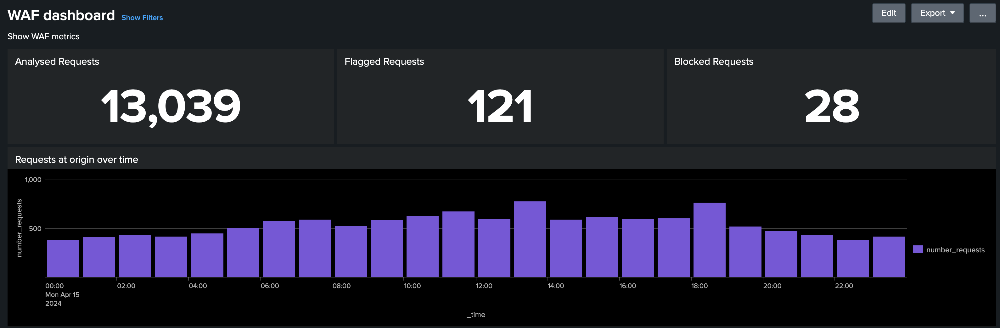

# Outil d’analyse des journaux de réseau CDN

Découvrez l’_outil d’analyse des journaux de réseau CDN AEM Cloud Service_ fourni par Adobe et la manière dont il permet d’obtenir des informations sur les performances de votre réseau CDN et l’implémentation d’AEM.
>[!VIDEO](https://video.tv.adobe.com/v/3429177?quality=12&learn=on)

## Vue d’ensemble

L’[outil d’analyse des journaux de réseau CDN AEM as a Cloud Service](https://github.com/adobe/AEMCS-CDN-Log-Analysis-Tooling) offre des tableaux de bord préconfigurés que vous pouvez intégrer à la pile [Splunk](https://www.splunk.com/en_us/products/observability-cloud.html) ou [ELK](https://www.elastic.co/elastic-stack) pour la surveillance et l’analyse en temps réel de vos journaux de réseau CDN.

Grâce à cet outil, vous pouvez effectuer une surveillance en temps réel et une détection proactive des problèmes. Il s’agit donc d’assurer une diffusion de contenu optimisée et des mesures de sécurité appropriées contre les attaques par déni de service (DoS) et par déni de service distribué (DDoS).

## Fonctions clés

- Analyse de journal optimisée
- Surveillance en temps réel
- Intégration transparente
- Tableaux de bord pour
   - Identifier les menaces potentielles de sécurité
   - Expérience plus rapide pour les utilisateurs et utilisatrices finaux

## Vue d’ensemble du tableau de bord

Pour lancer rapidement l’analyse des journaux, Adobe fournit des tableaux de bord préconfigurés pour la pile Splunk et ELK.

- **Taux d’accès au cache de réseau CDN** : fournit des informations sur le taux d’accès au cache total et le nombre total de requêtes par statut HIT, PASS et MISS. Il indique également les principales URL de statut HIT, PASS et MISS.

  

- **Tableau de bord du trafic de réseau CDN** : fournit des informations sur le trafic via les taux de demande de réseau CDN et d’origine, les taux d’erreur 4xx et 5xx, et les demandes non mises en cache. Il indique également le nombre maximal de demandes de réseau CDN et d’origine par seconde par adresse IP cliente et des informations supplémentaires pour optimiser les configurations de réseau CDN.

  

- **Tableau de bord WAF** : fournit des informations par le biais de requêtes analysées, signalées et bloquées. Il fournit également les principales attaques par identifiant d’indicateur WAF, les 100 premiers attaquants par adresse IP cliente, pays et agent utilisateur, ainsi que des informations supplémentaires pour optimiser les configurations WAF.

  

## Intégration Splunk

Les organisations qui utilisent [Splunk](https://www.splunk.com/en_us/products/observability-cloud.html) et qui ont activé le transfert de journal AEMCS vers leurs instances Splunk peuvent rapidement importer des tableaux de bord préconfigurés. Cette configuration facilite l’analyse accélérée des journaux, fournissant ainsi des informations exploitables pour optimiser les implémentations d’AEM et atténuer les menaces de sécurité telles que les attaques DOS.

Vous pouvez commencer à utiliser le guide [Tableau de bord Splunk pour l’analyse de journaux de réseau CDN AEMCS](https://github.com/adobe/AEMCS-CDN-Log-Analysis-Tooling/blob/main/Splunk/README.md#splunk-dashboards-for-aemcs-cdn-log-analysis).

## Intégration ELK

La [pile ELK](https://www.elastic.co/elastic-stack), composée d’Elasticsearch, de Logstash et de Kibana, est une autre option puissante pour l’analyse des journaux. Elle est utile pour les organisations qui n’ont pas accès à une configuration Splunk ou à des fonctionnalités de transfert de journal. La configuration locale de la pile ELK est simple, l’outil fournit le fichier Docker Compose pour démarrer rapidement. Vous pouvez ensuite importer les tableaux de bord préconfigurés et ingérer les journaux de réseau CDN téléchargés à l’aide d’Adobe Cloud Manager.

Vous pouvez commencer à l’aide du guide [Tableau de bord ELK pour l’analyse de journaux de réseau CDN AEMCS](https://github.com/adobe/AEMCS-CDN-Log-Analysis-Tooling/blob/main/ELK/README.md#elk-docker-container-for-aemcs-cdn-log-analysis).
