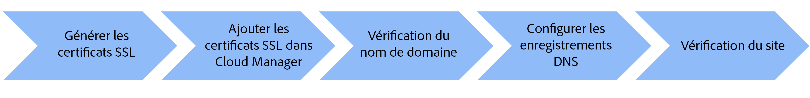

# Nom de domaine personnalisé avec le réseau CDN géré par Adobe

Découvrez comment mettre en œuvre un nom de domaine personnalisé pour un site web AEM as a Cloud Service qui utilise le réseau de diffusion de contenu (CDN) Adobe.

Dans ce tutoriel, le branding de l’exemple de site [AEM WKND](https://github.com/adobe/aem-guides-wknd) est amélioré en ajoutant un nom de domaine personnalisé adressable HTTPS `wknd.enablementadobe.com` avec Transport Layer Security (TLS).

>[!VIDEO](https://video.tv.adobe.com/v/3427903?quality=12&learn=on)

Les étapes détaillées sont les suivantes :

{width="800" zoomable="yes"}

## Conditions préalables

>[!VIDEO](https://video.tv.adobe.com/v/3427909?quality=12&learn=on)

- [OpenSSL](https://www.openssl.org/) et [dig](https://www.isc.org/blogs/dns-checker/) sont installés sur votre ordinateur local.
- Accès à des services tiers :
   - Autorité de certification (CA) : pour demander le certificat signé pour votre domaine de site, comme [DigitCert](https://www.digicert.com/).
   - Service d’hébergement DNS (Domain Name System) : pour ajouter des enregistrements DNS à votre domaine personnalisé, comme Azure DNS ou AWS Route 53.
- Accédez à [Adobe Cloud Manager](https://my.cloudmanager.adobe.com/) avec un rôle de personne **propriétaire d’entreprise** ou **responsable de déploiement**.
- L’exemple de site [AEM WKND](https://github.com/adobe/aem-guides-wknd) est déployé dans l’environnement AEM as a Cloud Service de type [programme de production](https://experienceleague.adobe.com/fr/docs/experience-manager-cloud-service/content/implementing/using-cloud-manager/programs/introduction-production-programs).

Si vous n’avez pas accès à des services tiers, _collaborez avec votre équipe en charge de la sécurité ou de l’hébergement pour mener à bien les étapes_.

## Générer un certificat SSL

>[!VIDEO](https://video.tv.adobe.com/v/3427908?quality=12&learn=on)

Vous disposez de deux options :

1. Utilisez l’outil de ligne de commande `openssl` pour générer une clé privée et une demande de signature de certificat (CSR) pour votre domaine de site. Pour demander un certificat signé, envoyez la demande de signature de certificat à une autorité de certification (CA).
1. Votre équipe en charge de l’hébergement fournit la clé privée requise et le certificat signé pour votre site.

Examinons les étapes de la première option.

Pour générer une clé privée et une demande de signature de certificat, exécutez les commandes suivantes et fournissez les informations requises lorsque celles-ci vous sont demandées :

```bash
# Generate a private key and a CSR
$ openssl req -newkey rsa:2048 -keyout <YOUR-SITE-NAME>.key -out <YOUR-SITE-NAME>.csr -nodes
```

Pour demander un certificat signé, fournissez la demande de signature de certificat générée à l’autorité de certification en consultant sa documentation. Une fois que l’autorité de certification a signé la demande de signature de certificat, vous recevez le fichier de certificat signé.

### Vérifier le certificat signé

Vérifiez le certificat signé avant de l’ajouter à Cloud Manager. Vous pouvez vérifier les détails du certificat à l’aide de la commande suivante :

```bash
# Review the certificate details
$ openssl crl2pkcs7 -nocrl -certfile <YOUR-SIGNED-CERT>.crt | openssl pkcs7 -print_certs -noout
```

Le certificat signé peut contenir la chaîne de certificats, qui inclut les certificats racine et intermédiaire ainsi que le certificat d’entité finale.

Adobe Cloud Manager accepte le certificat d’entité finale et la chaîne de certificat _dans des champs de formulaire distincts_, vous devez donc extraire le certificat d’entité finale et la chaîne de certificat à partir du certificat signé.

Dans ce tutoriel, le certificat signé [DigitCert](https://www.digicert.com/) émis pour le domaine `*.enablementadobe.com` est utilisé comme exemple. Le certificat d’entité finale et la chaîne de certificat sont extraits en ouvrant le certificat signé dans un éditeur de texte et en copiant le contenu situé entre les marqueurs `-----BEGIN CERTIFICATE-----` et `-----END CERTIFICATE-----`.

## Ajouter un certificat SSL dans Cloud Manager

>[!VIDEO](https://video.tv.adobe.com/v/3427906?quality=12&learn=on)

Pour ajouter le certificat SSL dans Cloud Manager, consultez la documentation [Ajouter un certificat SSL](https://experienceleague.adobe.com/fr/docs/experience-manager-cloud-service/content/implementing/using-cloud-manager/manage-ssl-certificates/add-ssl-certificate).

## Vérification du nom de domaine

>[!VIDEO](https://video.tv.adobe.com/v/3427905?quality=12&learn=on)

Pour vérifier le nom de domaine, procédez comme suit :

- Ajoutez un nom de domaine dans Cloud Manager en consultant la documentation [Ajouter un nom de domaine personnalisé](https://experienceleague.adobe.com/fr/docs/experience-manager-cloud-service/content/implementing/using-cloud-manager/custom-domain-names/add-custom-domain-name).
- Ajoutez un [enregistrement TXT](https://experienceleague.adobe.com/fr/docs/experience-manager-cloud-service/content/implementing/using-cloud-manager/custom-domain-names/add-text-record) spécifique à AEM dans votre service d’hébergement DNS.
- Vérifiez les étapes ci-dessus en interrogeant les serveurs DNS à l’aide de la commande `dig`.

```bash
# General syntax, the `_aemverification` is prefix provided by Adobe
$ dig _aemverification.[YOUR-DOMAIN-NAME] -t txt

# This tutorial specific example, as the subdomain `wknd.enablementadobe.com` is used
$ dig _aemverification.wknd.enablementadobe.com -t txt
```

Voici l’exemple de réponse en cas de réussite :

```bash
; <<>> DiG 9.10.6 <<>> _aemverification.wknd.enablementadobe.com -t txt
;; global options: +cmd
;; Got answer:
;; ->>HEADER<<- opcode: QUERY, status: NOERROR, id: 8636
;; flags: qr rd ra; QUERY: 1, ANSWER: 1, AUTHORITY: 0, ADDITIONAL: 1

;; OPT PSEUDOSECTION:
; EDNS: version: 0, flags:; udp: 1220
;; QUESTION SECTION:
;_aemverification.wknd.enablementadobe.com. IN TXT

;; ANSWER SECTION:
_aemverification.wknd.enablementadobe.com. 3600    IN TXT "adobe-aem-verification=wknd.enablementadobe.com/105881/991000/bef0e843-9280-4385-9984-357ed9a4217b"

;; Query time: 81 msec
;; SERVER: 153.32.14.247#53(153.32.14.247)
;; WHEN: Tue Mar 12 15:54:25 EDT 2024
;; MSG SIZE  rcvd: 181
```

Ce tutoriel utilise Azure DNS, mais tout fournisseur DNS peut être utilisé. Pour ajouter l’enregistrement TXT, vous devez consulter la documentation de votre service d’hébergement DNS.

Consultez la documentation [Vérifier le statut du nom de domaine](https://experienceleague.adobe.com/fr/docs/experience-manager-cloud-service/content/implementing/using-cloud-manager/custom-domain-names/check-domain-name-status) en cas de problème.

## Configurer l’enregistrement DNS

>[!VIDEO](https://video.tv.adobe.com/v/3427907?quality=12&learn=on)

Pour configurer l’enregistrement DNS pour votre domaine personnalisé, procédez comme suit :

1. Déterminez le type d’enregistrement DNS (CNAME ou APEX) en fonction du type de domaine, tel que domaine racine (APEX) ou sous-domaine (CNAME), puis consultez la documentation [Configurer les paramètres de DNS](https://experienceleague.adobe.com/fr/docs/experience-manager-cloud-service/content/implementing/using-cloud-manager/custom-domain-names/configure-dns-settings).
1. Ajouter l’enregistrement DNS dans votre service d’hébergement DNS.
1. Déclenchez la validation de l’enregistrement DNS en consultant la documentation [Vérification du statut de l’enregistrement DNS](https://experienceleague.adobe.com/fr/docs/experience-manager-cloud-service/content/implementing/using-cloud-manager/custom-domain-names/check-dns-record-status).

Dans ce tutoriel, étant donné qu’un **sous-domaine** `wknd.enablementadobe.com` est utilisé, le type d’enregistrement CNAME qui dirige vers `cdn.adobeaemcloud.com` est ajouté.

Cependant, si vous utilisez le **domaine racine**, vous devez ajouter un type d’enregistrement APEX (aussi appelé A, ALIAS ou ANAME) qui dirige vers les adresses IP spécifiques fournies par Adobe.

## Vérification du site

>[!VIDEO](https://video.tv.adobe.com/v/3427904?quality=12&learn=on)

Pour vérifier que le site est accessible via le nom de domaine personnalisé, ouvrez un navigateur web et accédez à l’URL du domaine personnalisé. Assurez-vous que le site est accessible et que le navigateur indique une connexion sécurisée avec l’icône de cadenas.

## Vidéo de bout en bout

Vous pouvez également regarder la vidéo de présentation complète qui détaille la vue d’ensemble, les conditions préalables et les étapes ci-dessus pour ajouter un nom de domaine personnalisé à un site hébergé AEM as a Cloud Service.

>[!VIDEO](https://video.tv.adobe.com/v/3427817?quality=12&learn=on)
