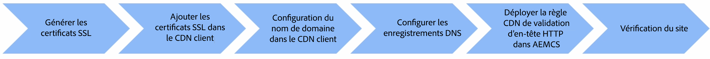

# Nom de domaine personnalisé avec le réseau CDN géré par le client ou la cliente

Découvrez comment ajouter un nom de domaine personnalisé à un site web AEM as a Cloud Service qui utilise un **réseau CDN géré par le client ou la cliente**.

Dans ce tutoriel, l’image de marque de l’exemple de site [AEM WKND](https://github.com/adobe/aem-guides-wknd) est améliorée en ajoutant un nom de domaine personnalisé adressable HTTPS `wkndviaawscdn.enablementadobe.com` avec Transport Layer Security (TLS) à l’aide d’un réseau CDN géré par le client ou la cliente. Dans ce tutoriel, AWS CloudFront est utilisé comme réseau CDN géré par le client ou la cliente, mais tout fournisseur de réseau CDN doit être compatible avec AEM as a Cloud Service.

>[!VIDEO](https://video.tv.adobe.com/v/3432561?quality=12&learn=on)

Les étapes détaillées sont les suivantes :

{width="800" zoomable="yes"}

## Conditions préalables

>[!VIDEO](https://video.tv.adobe.com/v/3432562?quality=12&learn=on)

- [OpenSSL](https://www.openssl.org/) et [dig](https://www.isc.org/blogs/dns-checker/) sont installés sur votre ordinateur local.
- Accès à des services tiers :
   - Autorité de certification (CA) : pour demander le certificat signé pour votre domaine de site, comme [DigitCert](https://www.digicert.com/).
   - Réseau CDN géré par le client ou la cliente : pour configurer le réseau CDN géré par le client ou la cliente et ajouter des certificats SSL et des détails de domaine, comme AWS CloudFront, Azure CDN ou Akamai.
   - Service d’hébergement DNS (Domain Name System) : pour ajouter des enregistrements DNS à votre domaine personnalisé, comme Azure DNS ou AWS Route 53.
- Accédez à [Adobe Cloud Manager](https://my.cloudmanager.adobe.com/) pour déployer la règle de réseau CDN de validation d’en-tête HTTP dans l’environnement AEM as a Cloud Service.
- L’exemple de site [AEM WKND](https://github.com/adobe/aem-guides-wknd) est déployé dans l’environnement AEM as a Cloud Service de type [programme de production](https://experienceleague.adobe.com/fr/docs/experience-manager-cloud-service/content/implementing/using-cloud-manager/programs/introduction-production-programs).

Si vous n’avez pas accès à des services tiers, _collaborez avec votre équipe en charge de la sécurité ou de l’hébergement pour mener à bien les étapes_.

## Générer un certificat SSL

>[!VIDEO](https://video.tv.adobe.com/v/3441473?quality=12&learn=on&captions=fre_fr)

Vous disposez de deux options :

1. En utilisant l’outil de ligne de commande `openssl` : vous pouvez générer une clé privée et une demande de signature de certificat (CSR) pour votre domaine de site. Pour demander un certificat signé, envoyez la demande de signature de certificat à une autorité de certification (CA).
1. Votre équipe en charge de l’hébergement fournit la clé privée requise et le certificat signé pour votre site.

Examinons les étapes de la première option.

Pour générer une clé privée et une demande de signature de certificat, exécutez les commandes suivantes et fournissez les informations requises lorsque celles-ci vous sont demandées :

```bash
# Generate a private key and a CSR
$ openssl req -newkey rsa:2048 -keyout <YOUR-SITE-NAME>.key -out <YOUR-SITE-NAME>.csr -nodes
```

Pour demander un certificat signé, fournissez la demande de signature de certificat générée à l’autorité de certification en consultant leur documentation. Une fois que l’autorité de certification a signé la demande de signature de certificat, vous recevez le fichier de certificat signé.

### Vérifier le certificat signé

Vérifier le certificat signé avant de l’ajouter à Cloud Manager constitue une bonne pratique. Vous pouvez vérifier les détails du certificat à l’aide de la commande suivante :

```bash
# Review the certificate details
$ openssl crl2pkcs7 -nocrl -certfile <YOUR-SIGNED-CERT>.crt | openssl pkcs7 -print_certs -noout
```

Le certificat signé peut contenir la chaîne de certificats, qui inclut les certificats racine et intermédiaire ainsi que le certificat d’entité finale.

Adobe Cloud Manager accepte le certificat d’entité finale et la chaîne de certificat _dans des champs de formulaire distincts_, vous devez donc extraire le certificat d’entité finale et la chaîne de certificat à partir du certificat signé.

Dans ce tutoriel, le certificat signé [DigitCert](https://www.digicert.com/) émis pour le domaine `*.enablementadobe.com` est utilisé comme exemple. Le certificat d’entité finale et la chaîne de certificat sont extraits en ouvrant le certificat signé dans un éditeur de texte et en copiant le contenu situé entre les marqueurs `-----BEGIN CERTIFICATE-----` et `-----END CERTIFICATE-----`.

## Configurer un réseau CDN géré par le client ou la cliente

>[!VIDEO](https://video.tv.adobe.com/v/3432563?quality=12&learn=on)

Configurez le réseau CDN géré par le client ou la cliente, comme AWS CloudFront, Azure CDN ou Akamai, et ajoutez le certificat SSL et les détails du domaine. Dans ce tutoriel, Azure DNS est utilisé comme exemple. Toutefois, selon le fournisseur de réseau CDN, les étapes peuvent varier. Les éléments clés sont les suivants :

- Ajoutez le certificat SSL au réseau CDN.
- Ajoutez le nom de domaine personnalisé au réseau CDN.
- Configurez le réseau CDN pour mettre en cache le contenu, comme les images, les fichiers CSS et JavaScript.
- Ajoutez l’en-tête HTTP `X-Forwarded-Host` aux paramètres du réseau CDN afin que votre réseau CDN inclue cet en-tête dans toutes les requêtes qu’il envoie à l’origine AEMCD.
- Assurez-vous que la valeur de l’en-tête `Host` est définie sur le domaine AEM as a Cloud Service par défaut contenant l’identifiant de programme et d’environnement et se terminant par `adobeaemcloud.com`. La valeur d’en-tête d’hôte HTTP transmise du réseau CDN géré par le client ou la cliente au réseau CDN géré par Adobe doit être le domaine AEM as a Cloud Service par défaut, toute autre valeur ayant pour résultat un état d’erreur.

## Configurer les enregistrements DNS

>[!VIDEO](https://video.tv.adobe.com/v/3432564?quality=12&learn=on)

Pour configurer l’enregistrement DNS pour votre domaine personnalisé, procédez comme suit :

1. Ajoutez un enregistrement CNAME pour le domaine personnalisé pointant vers le nom de domaine du réseau CDN.

Ce tutoriel ajoute un enregistrement CNAME au DNS Azure pour le domaine personnalisé `wkndviaawscdn.enablementadobe.com` et le pointe vers le nom de domaine de distribution AWS CloudFront.

### Vérification du site

Vérifiez le nom de domaine personnalisé en accédant au site à l’aide du nom de domaine personnalisé.
Cela peut ou non fonctionner selon la configuration vhhost dans l’environnement AEM as a Cloud Service.

Une étape de sécurité essentielle consiste à déployer la règle de réseau CDN de validation d’en-tête HTTP dans l’environnement AEM as a Cloud Service. La règle garantit que la demande provient du réseau CDN du client ou de la cliente et non d’une autre source.

## État de fonctionnement actuel sans règle de réseau CDN de validation d’en-tête HTTP

>[!VIDEO](https://video.tv.adobe.com/v/3432565?quality=12&learn=on)

Sans la règle de réseau CDN de validation d’en-tête HTTP, la valeur d’en-tête `Host` est définie sur le domaine AEM as a Cloud Service par défaut contenant l’identifiant de programme et d’environnement et se terminant par `adobeaemcloud.com`. Le réseau CDN Adobe transforme la valeur d’en-tête `Host` en valeur de `X-Forwarded-Host` reçue du réseau CDN du client ou de la cliente uniquement si la règle de réseau CDN de validation d’en-tête HTTP est déployée. Dans le cas contraire, la valeur de l’en-tête `Host` est transmise telle quelle à l’environnement AEM as a Cloud Service et l’en-tête `X-Forwarded-Host` n’est pas utilisé.

### Exemple de code de servlet pour imprimer la valeur de l’en-tête d’hôte

Le code de servlet suivant imprime les valeurs d’en-tête HTTP `Host`, `X-Forwarded-*`, `Referer` et `Via` dans la réponse JSON.

```java
package com.adobe.aem.guides.wknd.core.servlets;

import java.io.IOException;
import java.util.Enumeration;

import javax.servlet.Servlet;
import javax.servlet.ServletException;

import org.apache.sling.api.SlingHttpServletRequest;
import org.apache.sling.api.SlingHttpServletResponse;
import org.apache.sling.api.resource.ResourceResolverFactory;
import org.apache.sling.api.servlets.HttpConstants;
import org.apache.sling.api.servlets.ServletResolverConstants;
import org.apache.sling.api.servlets.SlingSafeMethodsServlet;
import org.osgi.service.component.annotations.Component;
import org.osgi.service.component.annotations.Reference;

@Component(service = Servlet.class, property = {
        ServletResolverConstants.SLING_SERVLET_PATHS + "=/bin/verify-headers",
        ServletResolverConstants.SLING_SERVLET_METHODS + "=" + HttpConstants.METHOD_GET
})
public class VerifyHeadersServlet extends SlingSafeMethodsServlet {

    @Reference
    private ResourceResolverFactory resourceResolverFactory;

    @Override
    protected void doGet(SlingHttpServletRequest request, SlingHttpServletResponse response)
            throws ServletException, IOException {
        response.setContentType("application/json");
        response.setCharacterEncoding("UTF-8");

        // Create JSON response
        StringBuilder jsonResponse = new StringBuilder();
        jsonResponse.append("{");

        Enumeration<String> headerNames = request.getHeaderNames();
        boolean firstHeader = true;

        while (headerNames.hasMoreElements()) {
            String headerName = headerNames.nextElement();

            if (headerName.startsWith("X-Forwarded-") || headerName.startsWith("Host")
                    || headerName.startsWith("Referer") || headerName.startsWith("Via")) {
                if (!firstHeader) {
                    jsonResponse.append(",");
                }
                jsonResponse.append("\"").append(headerName).append("\": \"").append(request.getHeader(headerName))
                        .append("\"");
                firstHeader = false;
            }
        }

        jsonResponse.append("}");

        response.getWriter().write(jsonResponse.toString());
    }
}
```

Pour tester le servlet, mettez à jour le fichier `../dispatcher/src/conf.dispatcher.d/filters/filters.any` avec la configuration suivante. Assurez-vous également que le réseau CDN est configuré pour **ne PAS mettre en cache** sur le chemin `/bin/*`.

```plaintext
# Testing purpose bin
/0300 { /type "allow" /extension "json" /path "/bin/*"}
/0301 { /type "allow" /path "/bin/*"}
/0302 { /type "allow" /url "/bin/*"}
```

## Configurer et déployer la règle de réseau CDN de validation d’en-tête HTTP

>[!VIDEO](https://video.tv.adobe.com/v/3432566?quality=12&learn=on)

Pour configurer et déployer la règle de réseau CDN de validation d’en-tête HTTP, procédez comme suit :

- Ajoutez la règle de réseau CDN de validation d’en-tête HTTP dans le fichier `cdn.yaml`. Vous trouverez un exemple ci-dessous.

  ```yaml
  kind: "CDN"
  version: "1"
  metadata:
    envTypes: ["prod"]
  data:
    authentication:
      authenticators:
        - name: edge-auth
          type: edge
          edgeKey1: ${{CDN_EDGEKEY_080124}}
          edgeKey2: ${{CDN_EDGEKEY_110124}}
      rules:
        - name: edge-auth-rule
          when: { reqProperty: tier, equals: "publish" }
          action:
            type: authenticate
            authenticator: edge-auth
  ```

- Créez des variables d’environnement de type secret (CDN_EDGEKEY_080124, CDN_EDGEKEY_110124) à l’aide de l’interface d’utilisation de Cloud Manager.
- Déployez la règle du réseau CDN configurée sur l’environnement AEM as a Cloud Service à l’aide du pipeline Cloud Manager.

## Transmettre le secret dans l’en-tête HTTP X-AEM-Edge-Key

>[!VIDEO](https://video.tv.adobe.com/v/3445047?quality=12&learn=on&captions=fre_fr)

Mettez à jour le réseau CDN du client ou de la cliente pour transmettre le secret dans l’en-tête HTTP `X-AEM-Edge-Key`. Le secret est utilisé par le réseau CDN Adobe pour valider que la demande provient du réseau CDN du client ou de la cliente et transformer la valeur d’en-tête `Host` en valeur de `X-Forwarded-Host` reçue du réseau CDN du client ou de la cliente.

## Vidéo de présentation complète

Vous pouvez également regarder la vidéo de bout en bout qui présente les étapes ci-dessus pour ajouter un nom de domaine personnalisé avec un réseau CDN géré par le client ou la cliente à un site hébergé par AEM as a Cloud Service.

>[!VIDEO](https://video.tv.adobe.com/v/3432568?quality=12&learn=on)
