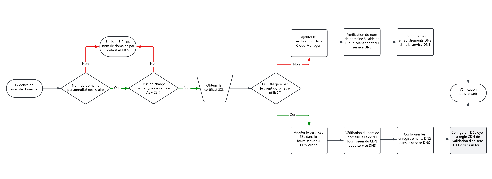

# Options de nom de domaine personnalisé

Découvrez comment gérer et implémenter des noms de domaine pour votre site web hébergé AEM as a Cloud Service.

>[!VIDEO](https://video.tv.adobe.com/v/3432632?quality=12&learn=on)

## Avant de commencer

Avant de commencer à implémenter des noms de domaine personnalisés, veillez à comprendre les concepts suivants :

### Présentation d’un nom de domaine

Un nom de domaine est le nom convivial du site web, tel que adobe.com, qui pointe vers un emplacement spécifique (adresse IP du type 170.2.14.16) sur Internet.

### Noms de domaine par défaut dans AEM as a Cloud Service

Par défaut, AEM as a Cloud Service est fourni avec un nom de domaine par défaut, se terminant par `*.adobeaemcloud.com`. Le certificat SSL de caractères génériques émis contre `*.adobeaemcloud.com` est automatiquement appliqué à tous les environnements et ce certificat de caractères génériques est de la responsabilité de l’Adobe.

Les noms de domaine par défaut sont au format `https://<SERVICE-TYPE>-p<PROGRAM-ID>-e<ENVIRONMENT-ID>.adobeaemcloud.com`.

- `<SERVICE-TYPE>` peut être **author**, **publish** ou **preview**.
- `<PROGRAM-ID>` est l’identifiant unique du programme. Une organisation peut avoir plusieurs programmes.
- `<ENVIRONMENT-ID>` est l’identifiant unique de l’environnement et chaque programme contient quatre environnements : **Développement rapide (RDE)**, **dev**, **stage** et **prod**. Chaque environnement contient les trois types de service mentionnés ci-dessus, à l’exception de **RDE** qui n’a pas d’environnement de prévisualisation.

En résumé, une fois tous les environnements AEM as a Cloud Service configurés, vous disposez d’URL uniques **11** (RDE n’a pas d’environnement de prévisualisation) combinées avec le nom de domaine par défaut.

### Réseau de diffusion de contenu géré par l’Adobe et réseau de diffusion de contenu géré par le client

Pour réduire la latence et améliorer les performances du site web, AEM as a Cloud Service est intégré à un réseau de diffusion de contenu (CDN) géré par l’Adobe. Le réseau de diffusion de contenu géré par Adobe est automatiquement activé pour tous les environnements. Pour plus d’informations, voir [Mise en cache d’AEM as a Cloud Service](../caching/overview.md) .

Cependant, les clients peuvent également utiliser leur propre réseau de diffusion de contenu, appelé **réseau de diffusion de contenu géré par le client**. Elle n’est pas nécessaire, mais peu de clients l’utilisent pour des stratégies d’entreprise ou pour d’autres raisons. Dans ce cas, le client est responsable de la gestion des configurations et des paramètres du réseau de diffusion de contenu.

### Noms de domaine personnalisés

Les noms de domaine personnalisés sont toujours préférés aux noms de domaine par défaut à des fins de branding, d’authenticité et de développement commercial. Cependant, elles peuvent uniquement être appliquées aux types de services **publish** et **preview**, et non **author**.

Lors de l’ajout de noms de domaine personnalisés, vous devez fournir un certificat SSL valide pour le domaine personnalisé donné. Le certificat SSL doit être un certificat valide signé par une autorité de certification approuvée.

En règle générale, les clients utilisent un nom de domaine personnalisé pour les environnements Prod (site web AEM as a Cloud Service) et parfois pour les environnements inférieurs comme **stage** ou **dev**.

| Type de service AEM | Domaine personnalisé pris en charge ? |
|---------------------|:-----------------------:|
| Création | ✘ |
| Prévisualisation | ✔ |
| Publier | ✔ |

## Implémentation des noms de domaine

Pour implémenter des noms de domaine à l’aide d’un réseau de diffusion de contenu géré par l’Adobe ou d’un réseau de diffusion de contenu géré par le client, l’organigramme suivant vous guide tout au long du processus :

{width="800" zoomable="yes"}

Le tableau suivant vous indique également où gérer les configurations spécifiques :

| Nom de domaine personnalisé avec | Ajout d’un certificat SSL à | Ajouter le nom de domaine à | Configurer les enregistrements DNS à l’adresse | Vous avez besoin d’une règle CDN de validation d’en-tête HTTP ? |
|---------------------|:-----------------------:|-----------------------:|-----------------------:|-----------------------:|
| Réseau de diffusion de contenu géré par Adobe | Adobe Cloud Manager | Adobe Cloud Manager | Service d’hébergement DNS | ✘ |
| Réseau de diffusion de contenu géré par le client | Fournisseur de réseau CDN | Fournisseur de réseau CDN | Service d’hébergement DNS | ✔ |

### Tutoriels détaillés

Maintenant que vous comprenez le processus de gestion des noms de domaine, vous pouvez implémenter des noms de domaine personnalisés pour votre site web AEM as a Cloud Service en suivant les tutoriels ci-dessous :

**[Noms de domaine personnalisés avec réseau de diffusion de contenu géré par l’Adobe](./custom-domain-name-with-adobe-managed-cdn.md)** : dans ce tutoriel, vous apprenez à ajouter un nom de domaine personnalisé à un **site web AEM as a Cloud Service avec réseau de diffusion de contenu géré par l’Adobe**.
**[Noms de domaine personnalisés avec réseau de diffusion de contenu géré par le client](./custom-domain-names-with-customer-managed-cdn.md)** : dans ce tutoriel, vous apprenez à ajouter un nom de domaine personnalisé à un **site web AEM as a Cloud Service avec réseau de diffusion de contenu géré par le client**.

