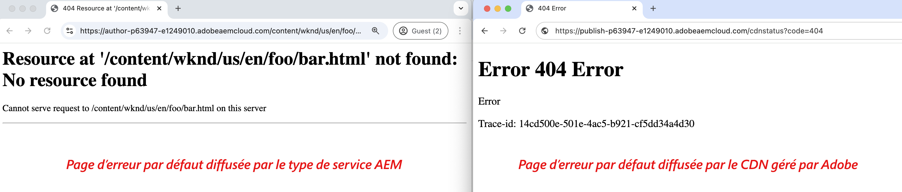

# Pages d’erreur personnalisées

Découvrez comment implémenter des pages d’erreur personnalisées pour votre site web hébergé par AEM as a Cloud Service.

Dans ce tutoriel, vous apprenez ce qui suit :

- Pages d’erreur par défaut
- Endroit à partir duquel les pages d’erreur sont diffusées.
   - Type de service AEM : création, publication, prévisualisation
   - Réseau CDN géré par Adobe
- Options de personnalisation des pages d’erreur
   - Directive Apache ErrorDocument
   - ACS AEM Commons - Gestionnaire de pages d’erreur
   - Pages d’erreur du réseau CDN

## Pages d’erreur par défaut

Examinons à quel moment les pages d’erreur s’affichent, les pages d’erreur par défaut et leur provenance.

Les pages d’erreur s’affichent lorsque ce qui suit se produit :

- La page n’existe pas (404)
- Non autorisé à accéder à une page (403)
- Erreur de serveur (500) en raison de problèmes de code ou de l’inaccessibilité du serveur.

AEM as a Cloud Service fournit des _pages d’erreur par défaut_ pour les scénarios ci-dessus. Il s’agit d’une page générique qui ne correspond pas à votre marque.

La page d’erreur par défaut _est diffusée_ à partir du _type de service AEM_ (création, publication, prévisualisation) ou du _réseau CDN géré par Adobe_. Pour plus d’informations, consultez le tableau ci-dessous.

| Page d’erreur diffusée depuis | Détails |
|---------------------|:-----------------------:|
| Type de service AEM : création, publication, prévisualisation | Lorsque la demande de page est traitée par le type de service AEM et que l’un des scénarios d’erreur ci-dessus se produit, la page d’erreur est diffusée à partir du type de service AEM. Par défaut, la page d’erreur 5XX est remplacée par la page d’erreur du CDN géré par Adobe, sauf si l’en-tête `x-aem-error-pass: true` est défini. |
| Réseau CDN géré par Adobe | Lorsque le réseau CDN géré par Adobe _ne peut pas atteindre le type de service AEM_ (serveur d’origine), la page d’erreur est diffusée à partir du réseau CDN géré par Adobe. **C’est un événement improbable mais qui mérite d’être planifié.** |

>[!NOTE]
>
>Dans AEM as a Cloud Service, le réseau CDN diffuse une page d’erreur générique lorsqu’une erreur 5XX est reçue du serveur principal. Pour permettre au back-end de transmettre la réponse réelle, vous devez ajouter l’en-tête suivant à la réponse : `x-aem-error-pass: true`.
>>Cela ne fonctionne que pour les réponses provenant d’AEM ou de la couche Apache/Dispatcher. D’autres erreurs inattendues provenant des couches d’infrastructure intermédiaires afficheront toujours la page d’erreur générique.


Par exemple, les pages d’erreur par défaut diffusées à partir du type de service AEM et du réseau CDN géré par Adobe sont les suivantes :



Cependant, vous pouvez _personnaliser à la fois le type de service AEM et les pages d’erreur du réseau CDN géré par Adobe_ pour qu’elles correspondent à votre marque et offrir une meilleure expérience d’utilisation.

## Options de personnalisation des pages d’erreur

Les options suivantes sont disponibles pour personnaliser les pages d’erreur :

| Applicable à | Nom de l’option | Description |
|---------------------|:-----------------------:|:-----------------------:|
| Types de service AEM : publication et prévisualisation | Directive ErrorDocument | Utilisez la directive [ErrorDocument](https://httpd.apache.org/docs/2.4/custom-error.html) dans le fichier de configuration Apache pour spécifier le chemin d’accès à la page d’erreur personnalisée. Applicable uniquement aux types de service AEM publication et prévisualisation. |
| Types de service AEM : création, publication, prévisualisation | Gestionnaire de pages d’erreur ACS AEM Commons | Utilisez le [gestionnaire de page d’erreur ACS AEM Commons](https://adobe-consulting-services.github.io/acs-aem-commons/features/error-handler/index.html) pour personnaliser les erreurs sur tous les types de service AEM. |
| Réseau CDN géré par Adobe | Pages d’erreur du réseau CDN | Utilisez les pages d’erreur de réseau CDN pour personnaliser les pages d’erreur lorsque le réseau CDN géré par Adobe ne peut pas atteindre le type de service AEM (serveur d’origine). |


## Prérequis

Dans ce tutoriel, vous apprenez à personnaliser les pages d’erreur à l’aide de la directive _ErrorDocument_, du _gestionnaire de page d’erreur ACS AEM Commons_ et des options _Pages d’erreur du réseau CDN_. Les éléments suivants sont requis afin de réaliser ce tutoriel :

- [Environnement de développement local AEM](https://experienceleague.adobe.com/fr/docs/experience-manager-learn/cloud-service/local-development-environment-set-up/overview) ou AEM as a Cloud Service. L’option _Pages d’erreur du réseau CDN_ s’applique à l’environnement AEM as a Cloud Service.

- [Projet AEM WKND](https://github.com/adobe/aem-guides-wknd) pour personnaliser les pages d’erreur.

## Configuration

- Clonez et déployez le projet AEM WKND dans votre environnement de développement AEM local en suivant les étapes ci-dessous :

  ```
  # For local AEM development environment
  $ git clone git@github.com:adobe/aem-guides-wknd.git
  $ cd aem-guides-wknd
  $ mvn clean install -PautoInstallSinglePackage -PautoInstallSinglePackagePublish
  ```

- Pour l’environnement AEM as a Cloud Service, déployez le projet AEM WKND en exécutant le [pipeline full-stack](https://experienceleague.adobe.com/fr/docs/experience-manager-cloud-service/content/implementing/using-cloud-manager/cicd-pipelines/introduction-ci-cd-pipelines#full-stack-pipeline), voir l’exemple de [pipeline hors production](https://experienceleague.adobe.com/fr/docs/experience-manager-learn/cloud-service/cloud-manager/cicd-non-production-pipeline).

- Vérifiez que le rendu des pages du site WKND est correct.

## Directive Apache ErrorDocument pour personnaliser les pages d’erreur AEM diffusées{#errordocument}

Pour personnaliser les pages d’erreur AEM diffusées, utilisez la directive Apache `ErrorDocument`.

Dans AEM as a Cloud Service, l’option de directive Apache `ErrorDocument` ne s’applique qu’aux types de service de publication et de prévisualisation. Elle ne s’applique pas au type de service de création, car Apache + Dispatcher ne fait pas partie de l’architecture de déploiement.

Examinons comment le projet [AEM WKND](https://github.com/adobe/aem-guides-wknd) utilise la directive Apache `ErrorDocument` pour afficher les pages d’erreur personnalisées.

- Le module `ui.content.sample` contient les [pages d’erreur](https://github.com/adobe/aem-guides-wknd/tree/main/ui.content.sample/src/main/content/jcr_root/content/wknd/language-masters/en/errors) de marque @ `/content/wknd/language-masters/en/errors`. Vérifiez-les dans votre environnement [AEM local](http://localhost:4502/sites.html/content/wknd/language-masters/en/errors) ou AEM as a Cloud Service `https://author-p<ID>-e<ID>.adobeaemcloud.com/ui#/aem/sites.html/content/wknd/language-masters/en/errors`.

- Le fichier `wknd.vhost` du module `dispatcher` contient les éléments suivants :
   - [Directive ErrorDocument](https://github.com/adobe/aem-guides-wknd/blob/main/dispatcher/src/conf.d/available_vhosts/wknd.vhost#L139-L143) qui pointe vers les [pages d’erreur](https://github.com/adobe/aem-guides-wknd/blob/main/dispatcher/src/conf.d/variables/custom.vars#L7-L8) ci-dessus.
   - La valeur [DispatcherPassError](https://github.com/adobe/aem-guides-wknd/blob/main/dispatcher/src/conf.d/available_vhosts/wknd.vhost#L133) est définie sur 1 afin que Dispatcher laisse Apache gérer toutes les erreurs.

  ```
  # In `wknd.vhost` file:
  
  ...
  
  ## ErrorDocument directive
  ErrorDocument 404 ${404_PAGE}
  ErrorDocument 500 ${500_PAGE}
  ErrorDocument 502 ${500_PAGE}
  ErrorDocument 503 ${500_PAGE}
  ErrorDocument 504 ${500_PAGE}
  
  ## Add Header for 5XX error page response
  <IfModule mod_headers.c>
    ### By default, CDN overrides 5XX error pages. To allow the actual response of the backend to pass through, add the header x-aem-error-pass: true
    Header set x-aem-error-pass "true" "expr=%{REQUEST_STATUS} >= 500 && %{REQUEST_STATUS} < 600"
  </IfModule>
  
  ...
  ## DispatcherPassError directive
  <IfModule disp_apache2.c>
      ...
      DispatcherPassError        1
  </IfModule>
  
  # In `custom.vars` file
  ...
  ## Define the error page paths
  Define 404_PAGE /content/wknd/us/en/errors/404.html
  Define 500_PAGE /content/wknd/us/en/errors/500.html
  ...
  ```

- Passez en revue les pages d’erreur personnalisées du site WKND en saisissant un nom ou un chemin de page incorrect dans votre environnement, par exemple [https://publish-p105881-e991000.adobeaemcloud.com/us/en/foo/bar.html](https://publish-p105881-e991000.adobeaemcloud.com/us/en/foo/bar.html).

## ACS AEM Commons - Gestionnaire de page d’erreur pour personnaliser les pages d’erreur AEM diffusées{#acs-aem-commons}

Pour personnaliser les pages d’erreur AEM diffusées sur _tous les types de service AEM_, vous pouvez utiliser l’option [Gestionnaire de page d’erreur ACS AEM Commons](https://adobe-consulting-services.github.io/acs-aem-commons/features/error-handler/index.html).

. Pour obtenir des instructions détaillées, reportez-vous à la section [Utilisation](https://adobe-consulting-services.github.io/acs-aem-commons/features/error-handler/index.html#how-to-use).

## Pages d’erreur du réseau CDN pour personnaliser les pages d’erreur du réseau CDN diffusées{#cdn-error-pages}

Pour personnaliser les pages d’erreur diffusées par le réseau CDN géré par Adobe, utilisez l’option Pages d’erreur du réseau CDN.

Implémentons les pages d’erreur du réseau CDN pour personnaliser les pages d’erreur lorsque le réseau CDN géré par Adobe ne peut pas atteindre le type de service AEM (serveur d’origine).

>[!IMPORTANT]
>
> L’événement _Le réseau CDN géré par Adobe ne peut pas atteindre le type de service AEM_ (serveur d’origine) est un **événement improbable** mais qui mérite d’être planifié.

Les étapes détaillées pour mettre en œuvre les pages d’erreur du réseau CDN sont les suivantes :

- Développez un contenu de page d’erreur personnalisé en tant qu’application monopage (SPA).
- Hébergez les fichiers statiques requis pour la page d’erreur du CDN à un emplacement accessible au public.
- Configurez la règle du réseau CDN (errorPages) et référencez les fichiers statiques ci-dessus.
- Déployez la règle du réseau CDN configurée sur l’environnement AEM as a Cloud Service à l’aide du pipeline Cloud Manager.
- Testez les pages d’erreur du réseau CDN.


### Vue d’ensemble des pages d’erreur du réseau CDN

La page d’erreur du réseau CDN est implémentée en tant qu’application monopage (SPA) par le réseau CDN géré par Adobe. Le document HTML SPA diffusé par le réseau CDN géré par Adobe contient le fragment de code HTML minimum. Le contenu de la page d’erreur personnalisée est généré dynamiquement à l’aide d’un fichier JavaScript. Le fichier JavaScript doit être développé et hébergé par le client ou la cliente dans un emplacement accessible au public.

Le fragment de code HTML fourni par le réseau CDN géré par Adobe présente la structure suivante :

```html
<!DOCTYPE html>
<html lang="en">
  <head>
    
    ...

    <title>{title}</title>
    <link rel="icon" href="{icoUrl}">
    <link rel="stylesheet" href="{cssUrl}">
  </head>
  <body>
    <script src="{jsUrl}"></script>
  </body>
</html>
```

Le fragment de code HTML contient les espaces réservés suivants :

1. **jsUrl** : URL absolue du fichier JavaScript pour effectuer le rendu du contenu de la page d’erreur en créant dynamiquement des éléments HTML.
1. **cssUrl** : URL absolue du fichier CSS pour appliquer un style au contenu de la page d’erreur.
1. **icoUrl** : URL absolue de la favicon.


### Développer une page d’erreur personnalisée

Développons le contenu de la page d’erreur de marque spécifique à WKND en tant qu’application monopage (SPA).

À des fins de démonstration, utilisons [React](https://react.dev/), mais vous pouvez utiliser n’importe quelle structure ou bibliothèque JavaScript.

- Créez un projet React en exécutant la commande suivante :

  ```
  $ npx create-react-app aem-cdn-error-page
  ```

- Ouvrez le projet dans votre éditeur de code préféré et mettez à jour les fichiers suivants :

   - `src/App.js` : il s’agit du composant principal qui effectue le rendu du contenu de la page d’erreur.

     ```javascript
     import logo from "./wknd-logo.png";
     import "./App.css";
     
     function App() {
       return (
         <>
           <div className="App">
             <div className="container">
             
             </div>
           </div>
           <div className="container">
             <div className="error-code">CDN Error Page</div>
             <h1 className="error-message">Ruh-Roh! Page Not Found</h1>
             <p className="error-description">
               We're sorry, we are unable to fetch this page!
             </p>
           </div>
         </>
       );
     }
     
     export default App;
     ```

   - `src/App.css` : appliquez un style au contenu de la page d’erreur.

     ```css
     .App {
       text-align: left;
     }
     
     .App-logo {
       height: 14vmin;
       pointer-events: none;
     }
     
     
     body {
       margin-top: 0;
       padding: 0;
       font-family: Arial, sans-serif;
       background-color: #fff;
       color: #333;
       display: flex;
       justify-content: center;
       align-items: center;
     }
     
     .container {
       text-align: letf;
       padding-top: 10px;
     }
     
     .error-code {
       font-size: 4rem;
       font-weight: bold;
       color: #ff6b6b;
     }
     
     .error-message {
       font-size: 2.5rem;
       margin-bottom: 10px;
     }
     
     .error-description {
       font-size: 1rem;
       margin-bottom: 20px;
     }
     ```

   - Ajoutez le fichier `wknd-logo.png` dans le dossier `src`. Copiez le [fichier](https://github.com/adobe/aem-guides-wknd/blob/main/ui.frontend/src/main/webpack/resources/images/favicons/favicon-512.png) en tant que `wknd-logo.png`.

   - Ajoutez le fichier `favicon.ico` dans le dossier `public`. Copiez le [fichier](https://github.com/adobe/aem-guides-wknd/blob/main/ui.frontend/src/main/webpack/resources/images/favicons/favicon-32.png) en tant que `favicon.ico`.

   - Vérifiez le contenu de la page d’erreur du réseau CDN de marque WKND en exécutant le projet :

     ```
     $ npm start
     ```

     Ouvrez le navigateur et accédez à `http://localhost:3000/` pour afficher le contenu de la page d’erreur du réseau CDN.

   - Créez le projet pour générer les fichiers statiques :

     ```
     $ npm run build
     ```

     Les fichiers statiques sont générés dans le dossier `build`.


Vous pouvez également télécharger le fichier [aem-cdn-error-page.zip](./assets/aem-cdn-error-page.zip) contenant les fichiers de projet React ci-dessus.

Ensuite, hébergez les fichiers statiques ci-dessus dans un emplacement accessible au public.

### Héberger les fichiers statiques requis pour la page d’erreur du réseau CDN

Hébergeons les fichiers statiques dans le stockage Blob Azure. Cependant, vous pouvez utiliser n’importe quel service d’hébergement de fichiers statiques tel que [Netlify](https://www.netlify.com/), [Vercel](https://vercel.com/) ou [AWS S3](https://aws.amazon.com/s3/).

- Suivez la documentation officielle [Stockage Blob Azure](https://learn.microsoft.com/fr-fr/azure/storage/blobs/storage-quickstart-blobs-portal) pour créer un conteneur et charger les fichiers statiques.

  >[!IMPORTANT]
  >
  >Si vous utilisez d’autres services d’hébergement de fichiers statiques, suivez leur documentation pour héberger les fichiers statiques.

- Assurez-vous que les fichiers statiques sont accessibles publiquement. Les paramètres de mon compte de stockage spécifique à la démonstration WKND sont les suivants :

   - **Nom du compte de stockage** : `aemcdnerrorpageresources`
   - **Nom du conteneur** : `static-files`

  

- Dans le conteneur `static-files` supérieur, les fichiers inférieurs du dossier `build` sont chargés :

   - `error.js` : le fichier `build/static/js/main.<hash>.js` est renommé `error.js` et est [publiquement accessible](https://aemcdnerrorpageresources.blob.core.windows.net/static-files/error.js).
   - `error.css` : le fichier `build/static/css/main.<hash>.css` est renommé `error.css` et est [publiquement accessible](https://aemcdnerrorpageresources.blob.core.windows.net/static-files/error.css).
   - `favicon.ico` : le fichier `build/favicon.ico` est chargé en l’état et est [publiquement accessible](https://aemcdnerrorpageresources.blob.core.windows.net/static-files/favicon.ico).

Ensuite, configurez la règle de réseau CDN (errorPages) et référencez les fichiers statiques ci-dessus.

### Configurer la règle du réseau CDN

Configurez la règle de réseau CDN `errorPages` qui utilise les fichiers statiques ci-dessus pour effectuer le rendu du contenu de la page d’erreur du réseau CDN.

1. Ouvrez le fichier `cdn.yaml` dans le dossier `config` principal de votre projet AEM. Par exemple, le fichier [cdn.yaml du projet WKND](https://github.com/adobe/aem-guides-wknd/blob/main/config/cdn.yaml).

1. Ajoutez les règles de réseau CDN suivantes au fichier `cdn.yaml` :

   ```yaml
   kind: "CDN"
   version: "1"
   metadata:
     envTypes: ["dev", "stage", "prod"]
   data:
     # The CDN Error Page configuration. 
     # The error page is displayed when the Adobe-managed CDN is unable to reach the origin server.
     # It is implemented as a Single Page Application (SPA) and WKND branded content must be generated dynamically using the JavaScript file 
     errorPages:
       spa:
         title: Adobe AEM CDN Error Page # The title of the error page
         icoUrl: https://aemcdnerrorpageresources.blob.core.windows.net/static-files/favicon.ico # The PUBLIC URL of the favicon
         cssUrl: https://aemcdnerrorpageresources.blob.core.windows.net/static-files/error.css # The PUBLIC URL of the CSS file
         jsUrl: https://aemcdnerrorpageresources.blob.core.windows.net/static-files/error.js # The PUBLIC URL of the JavaScript file
   ```

1. Enregistrez, validez et publiez les modifications dans le référentiel Adobe en amont.

### Déployer la règle du réseau CDN

Enfin, déployez la règle du réseau CDN configurée sur l’environnement AEM as a Cloud Service à l’aide du pipeline Cloud Manager.

1. Dans Cloud Manager, accédez à la section **Pipelines**.

1. Créez un pipeline ou sélectionnez le pipeline existant qui déploie uniquement les fichiers **Config**. Pour obtenir des instructions détaillées, voir [Créer un pipeline de configuration](https://experienceleague.adobe.com/fr/docs/experience-manager-learn/cloud-service/security/traffic-filter-and-waf-rules/how-to-setup#deploy-rules-through-cloud-manager).

1. Cliquez sur le bouton **Exécuter** pour déployer la règle CDN.


### Tester les pages d’erreur du réseau CDN

Pour tester les pages d’erreur CDN, procédez comme suit :

- Dans le navigateur, accédez à l’URL de publication d’AEM as a Cloud Service, ajoutez `cdnstatus?code=404` à l’URL, par exemple [https://publish-p105881-e991000.adobeaemcloud.com/cdnstatus?code=404](https://publish-p105881-e991000.adobeaemcloud.com/cdnstatus?code=404) ou accédez à l’aide de l’[URL de domaine personnalisé](https://wknd.enablementadobe.com/cdnstatus?code=404).

  

- Les codes pris en charge sont : 403, 404, 406, 500 et 503.

- Vérifiez l’onglet réseau du navigateur pour voir que les fichiers statiques sont chargés à partir du stockage Blob Azure. Le document HTML diffusé par le réseau CDN géré par Adobe contient le contenu minimum et le fichier JavaScript crée dynamiquement le contenu de la page d’erreur de marque.

  

## Résumé

Dans ce tutoriel, vous en avez appris davantage sur les pages d’erreur par défaut, à partir desquelles les pages d’erreur sont diffusées, ainsi que sur les options de personnalisation des pages d’erreur. Vous avez appris à mettre en œuvre des pages d’erreur personnalisées à l’aide de la directive Apache `ErrorDocument` et des options `ACS AEM Commons Error Page Handler` et `CDN Error Pages`.

## Ressources supplémentaires

- [Configuration des pages d’erreur du réseau CDN](https://experienceleague.adobe.com/fr/docs/experience-manager-cloud-service/content/implementing/content-delivery/cdn-error-pages)

- [Cloud Manager - Pipelines de configuration](https://experienceleague.adobe.com/fr/docs/experience-manager-cloud-service/content/implementing/using-cloud-manager/cicd-pipelines/introduction-ci-cd-pipelines#config-deployment-pipeline)
