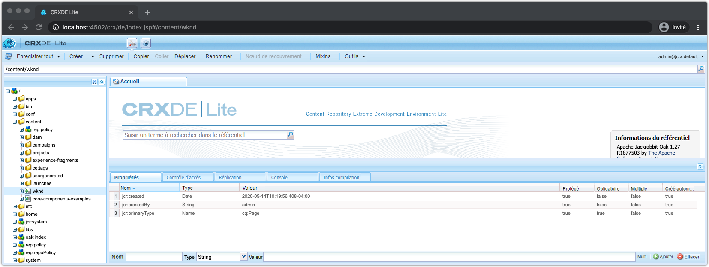
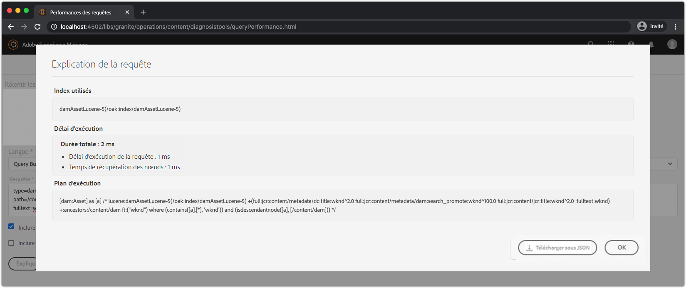

# Autres outils de débogage du SDK AEM

Divers autres outils peuvent vous aider à déboguer votre application sur le démarrage rapide local du SDK AEM.

## CRXDE Lite

CRXDE Lite est une interface Web permettant d’interagir avec le référentiel de données JCR, AEM référentiel de données. Le CRXDE Lite offre une visibilité complète dans le JCR, y compris les noeuds, les propriétés, les valeurs de propriété et les autorisations.

Le CRXDE Lite se trouve à :

+ Outils > Général > CRXDE Lite
+ ou directement à [http://localhost:4502/crx/de/index.jsp](http://localhost:4502/crx/de/index.jsp)

## Explication de la requête

Explique l&#39;outil web de Requête dans le démarrage rapide local de AEM SDK, qui fournit des informations clés sur la façon dont AEM interprète et exécute les requêtes, et un outil inestimable pour s&#39;assurer que les requêtes sont exécutées de manière performante par l&#39;AEM.

La Requête d&#39;explication se trouve à l&#39;adresse :

+ Outils > Diagnostic > Performances des Requêtes > Onglet Expliquer la Requête
+ [http://localhost:4502/libs/granite/operations/content/diagnosistools/queryPerformance.html](http://localhost:4502/libs/granite/operations/content/diagnosistools/queryPerformance.html) > onglet Requête d’explication

## Débogueur QueryBuilder

Le débogueur QueryBuilder est un outil Web qui vous permet de déboguer et de comprendre les requêtes de recherche en utilisant la syntaxe [QueryBuilder](https://docs.adobe.com/content/help/en/experience-manager-65/developing/platform/query-builder/querybuilder-api.html) AEM.

Le débogueur QueryBuilder se trouve à l’emplacement suivant :

+ [http://localhost:4502/libs/cq/search/content/querydebug.html](http://localhost:4502/libs/cq/search/content/querydebug.html)

## Sling Log Tracer et AEM module externe Chrome

[Sling Log Tracer](https://sling.apache.org/documentation/bundles/log-tracers.html), fourni avec le démarrage rapide local du SDK AEM, permet un suivi approfondi des requêtes HTTP, exposant des informations de débogage détaillées par requête. La configuration [Log Tracer OSGi doit être configurée](https://sling.apache.org/documentation/bundles/log-tracers.html#configuration-1) pour activer cette fonctionnalité.

Le module externe open source [AEM Chrome](https://chrome.google.com/webstore/detail/aem-chrome-plug-in/ejdcnikffjleeffpigekhccpepplaode?hl=en-US) pour le [navigateur Web Google Chrome](https://www.google.com/chrome/), s’intègre à Log Tracer, exposant les informations de débogage directement dans les outils de développement de Chrome.

_Le module externe AEM Chrome est un outil open source et l’Adobe ne le prend pas en charge._

