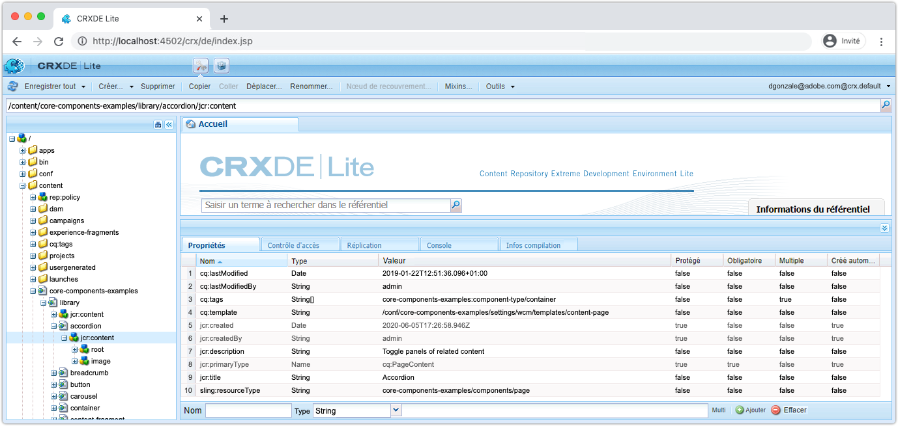
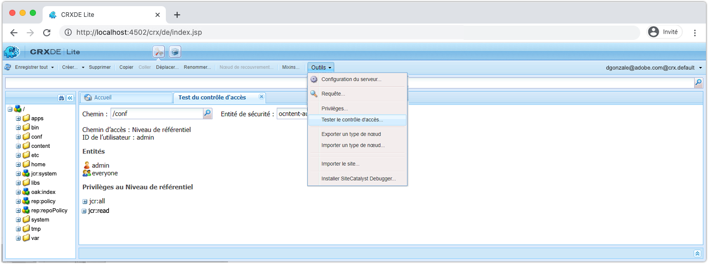

# Autres outils de débogage du SDK d’AEM

Plusieurs autres outils peuvent vous aider à déboguer votre application sur le démarrage rapide local du SDK d’AEM.

## CRXDE Lite

CRXDE Lite est une interface web permettant d’interagir avec le référentiel de données JCR d’AEM. CRXDE Lite offre une visibilité totale sur le JCR, y compris les nœuds, les propriétés, les valeurs de propriété et les autorisations.

CRXDE Lite se trouve à l’emplacement suivant :

+ Outils > Général > CRXDE Lite
+ ou directement à l’adresse [http://localhost:4502/crx/de/index.jsp](http://localhost:4502/crx/de/index.jsp).

### Déboguer le contenu

CRXDE Lite permet d’accéder directement au JCR. Le contenu visible via CRXDE Lite est limité par les autorisations accordées à votre utilisateur ou utilisatrice, ce qui signifie que vous ne pourrez peut-être pas voir ni modifier tout ce qui se trouve dans le JCR en fonction de votre accès.

+ Pour parcourir et modifier la structure JCR, utilisez le volet de navigation de gauche.
+ La sélection d’un nœud dans le volet de navigation de gauche expose la propriété du nœud dans le volet inférieur.
   + Les propriétés peuvent être ajoutées, supprimées ou modifiées dans le volet.
+ Double-cliquez sur un nœud de fichier dans le volet de navigation de gauche pour ouvrir le contenu du fichier dans le volet supérieur droit.
+ Appuyez sur le bouton Enregistrer tout en haut à gauche pour conserver la modification ou sur la flèche vers le bas en regard de l’option Enregistrer tout pour Annuler les modifications non enregistrées.

Toute modification apportée directement au SDK AEM via CRXDE Lite peut être difficile à suivre et à gérer. Le cas échéant, assurez-vous que les modifications effectuées via CRXDE Lite reviennent aux packages de contenu modifiable du projet AEM (`ui.content`) et sont validés dans Git. Idéalement, toutes les modifications de contenu d’application sont apportées dans la base de code et transmises au SDK AEM par le biais de déploiements, plutôt que d’apporter des modifications directement au SDK AEM via CRXDE Lite.

### Déboguer les contrôles d’accès

CRXDE Lite permet de tester et d’évaluer le contrôle d’accès sur un nœud spécifique pour un utilisateur ou une utilisatrice ou un groupe spécifique (c’est-à-dire l’entité principale).

Pour accéder à la console de test du contrôle d’accès dans CRXDE Lite, accédez à :

+ CRXDE Lite > Outils > Tester le contrôle d’accès...

1. À l’aide du champ Chemin, sélectionnez un chemin JCR à évaluer.
1. À l’aide du champ Entité principale, sélectionnez l’utilisateur ou l’utilisatrice ou le groupe pour en évaluer le chemin.
1. Appuyez sur le bouton Tester.

Les résultats s’affichent ci-dessous :

+ __Chemin__ répète le chemin qui a été évalué.
+ __Entité principale__ réitère l’utilisateur ou l’utilisatrice ou le groupe pour lequel le chemin a été évalué.
+ __Entités principales__ répertorie toutes les entités principales dont fait partie l’entité principale sélectionnée.
   + Cela s’avère utile pour comprendre les appartenances de groupe transitoires qui peuvent fournir des autorisations via l’héritage.
+ __Privilèges au chemin__ répertorie toutes les autorisations JCR dont dispose l’entité principale sélectionnée sur le chemin évalué.

## Expliquer la requête

L’outil web Expliquer la requête dans le démarrage rapide local du SDK AEM fournit des informations clés sur la manière dont AEM interprète et exécute les requêtes et permet de s’assurer que les requêtes sont exécutées de manière performante par AEM.

Expliquer la requête se trouve à l’emplacement suivant :

+ Outils > Diagnostic > Performances des requêtes > Onglet Expliquer la requête
+ [http://localhost:4502/libs/granite/operations/content/diagnosistools/queryPerformance.html](http://localhost:4502/libs/granite/operations/content/diagnosistools/queryPerformance.html) > Onglet Expliquer la requête

## Débogueur QueryBuilder

Le débogueur QueryBuilder est un outil web qui vous aide à déboguer et à comprendre les requêtes de recherche à l’aide de la syntaxe [QueryBuilder](https://experienceleague.adobe.com/docs/experience-manager-65/developing/platform/query-builder/querybuilder-api.html?lang=fr) d’AEM.

Le débogueur QueryBuilder est accessible ici :

+ [http://localhost:4502/libs/cq/search/content/querydebug.html](http://localhost:4502/libs/cq/search/content/querydebug.html)
