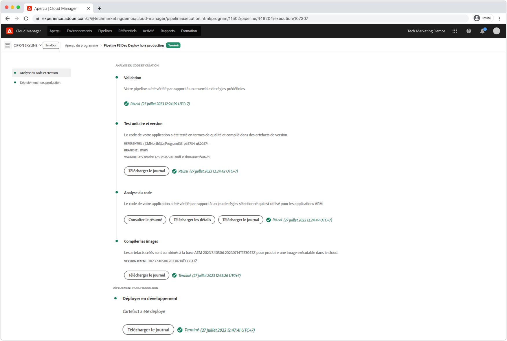
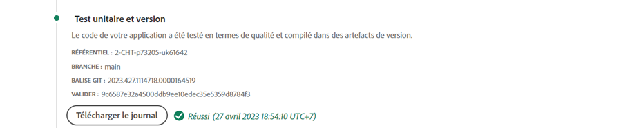
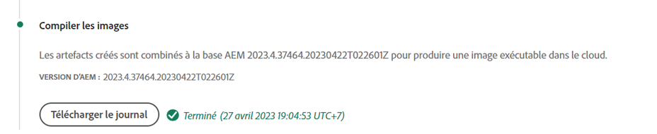

# Débogage des AEM en tant que génération et déploiement de Cloud Service

adobe Cloud Manager facilite la création de code et les déploiements vers AEM en tant que Cloud Service. Des échecs peuvent survenir pendant les étapes du processus de création, ce qui nécessite une action pour les résoudre. Ce guide décrit les échecs courants du déploiement et explique comment les aborder au mieux.



## Validation

L’étape de validation garantit simplement que les configurations de base de Cloud Manager sont valides. Les échecs de validation courants sont les suivants :

### L&#39;environnement est dans un état non valide

+ __Message d’erreur :__ L&#39;environnement est dans un état non valide.
   
+ __Cause :__ L&#39;environnement de cible du pipeline est dans un état transitoire où il ne peut pas accepter de nouvelles constructions.
+ __Résolution :__ Attendez que l’état soit résolu sur un état en cours d’exécution (ou mise à jour disponible). Si l’environnement est en cours de suppression, recréez l’environnement ou choisissez un autre environnement à créer.

### Impossible de trouver l&#39;environnement associé au pipeline

+ __Message d’erreur :__ L&#39;environnement est marqué comme supprimé.
   
+ __Cause :__ L&#39;environnement que le pipeline est configuré pour utiliser a été supprimé.
Même si un nouvel environnement du même nom est recréé, Cloud Manager ne réassociera pas automatiquement le pipeline à cet environnement du même nom.
+ __Résolution :__ Modifiez la configuration du pipeline et sélectionnez de nouveau l’environnement sur lequel effectuer le déploiement.

### Impossible de trouver la branche Git associée au pipeline

+ __Message d’erreur :__ Gazoduc non valide : XXXXXX. Raison=Branch=xxxx introuvable dans le référentiel.
   
+ __Cause :__ La branche Git que le pipeline est configuré pour utiliser a été supprimée.
+ __Résolution :__ Recréez la branche Git manquante à l&#39;aide du même nom ou reconfigurez le pipeline pour la construire à partir d&#39;une autre branche existante.

## Test unitaire et version



La phase de création et de test d&#39;unité exécute une création Maven (`mvn clean package`) du projet extrait de la branche Git configurée du pipeline.

Les erreurs identifiées au cours de cette phase devraient être reproductibles en construisant le projet localement, à l&#39;exception des suivantes :

+ Une dépendance maven non disponible sur [Maven Central](https://search.maven.org/) est utilisée et le référentiel Maven contenant cette dépendance est soit :
   + inatteignable à partir de Cloud Manager, tel qu’un référentiel Maven interne privé, ou le référentiel Maven nécessite une authentification et des informations d’identification incorrectes ont été fournies.
   + Non explicitement inscrit dans le projet `pom.xml`. Notez que l’inclusion des référentiels Maven est découragée car elle augmente le temps de génération.
+ Les tests unitaires échouent en raison de problèmes de minutage. Cela peut se produire lorsque les tests unitaires sont sensibles au timing. Un indicateur puissant repose sur `.sleep(..)` le code de test.
+ Utilisation de modules externes Maven non pris en charge.

## Analyse du code


L’analyse du code effectue l’analyse du code statique à l’aide d’un mélange de bonnes pratiques Java et spécifiques à l’AEM.

L&#39;analyse du code entraîne un échec de génération si le code contient des vulnérabilités de sécurité critique. Il est possible de remplacer les violations moins nombreuses, mais il est recommandé de les corriger. Notez que la numérisation du code n’est pas parfaite et peut générer des [faux positifs](https://docs.adobe.com/content/help/en/experience-manager-cloud-service/implementing/developing/understand-test-results.html#dealing-with-false-positives).

Pour résoudre les problèmes d’analyse du code, téléchargez le rapport au format CSV fourni par Cloud Manager via le bouton **Télécharger les détails** et passez en revue toutes les entrées.

Pour plus d’informations, voir AEM règles spécifiques, voir les règles [de numérisation de code](https://docs.adobe.com/content/help/en/experience-manager-cloud-manager/using/how-to-use/custom-code-quality-rules.html)personnalisées AEM des documentations Cloud Manager.

## Compiler les images



L’image de création est chargée de combiner les artefacts de code créés à l’étape de création et de test d’unité avec la version AEM, afin de former un seul artefact déployable.

Bien que des problèmes de compilation et de génération de code soient détectés lors des tests de build et d&#39;unité, des problèmes de configuration ou de structure peuvent être identifiés lors de la tentative de combinaison de l&#39;artefact de build personnalisé avec la version AEM.

### Configurations OSGi duplicata

Lorsque plusieurs configurations OSGi sont résolues via le mode d’exécution pour l’environnement d’AEM cible, l’étape de création d’image échoue avec l’erreur :

```
[ERROR] Unable to convert content-package [/tmp/packages/enduser.all-1.0-SNAPSHOT.zip]: 
Configuration ‘com.example.ExampleComponent’ already defined in Feature Model ‘com.example.groupId:example.all:slingosgifeature:xxxxx:X.X’, 
set the ‘mergeConfigurations’ flag to ‘true’ if you want to merge multiple configurations with same PID
```

#### Cause 1

+ __Cause :__ Le package complet du projet AEM, contient plusieurs packages de code et la même configuration OSGi est fournie par plusieurs packages de code, ce qui entraîne un conflit. L’étape Build Image ne peut donc pas décider qui doit être utilisé, ce qui entraîne l’échec de la génération. Notez que cela ne s’applique pas aux configurations d’usine OSGi, pour autant qu’elles aient des noms uniques.
+ __Résolution :__ Examinez tous les packages de code (y compris tous les packages de code tiers inclus) déployés dans le cadre de l’application AEM, à la recherche de configurations OSGi duplicata qui résolvent, via le mode d’exécution, l’environnement de cible. Les instructions du message d’erreur &quot;set the mergeConfigurations flag to true&quot; (définir l’indicateur mergeConfigurations sur true) ne sont pas possibles dans AEM en tant que service Cloud et doivent être ignorées.

#### Cause 2

+ __Cause :__ Le projet AEM inclut incorrectement le même package de code deux fois, ce qui entraîne la duplication de toute configuration OSGi contenue dans ledit package.
+ __Résolution :__ Examinez tous les packages pom.xml incorporés dans le projet all et assurez-vous que la `filevault-package-maven-plugin` configuration [est définie sur](https://docs.adobe.com/content/help/en/experience-manager-cloud-service/implementing/developing/aem-project-content-package-structure.html#cloud-manager-target)`<cloudManagerTarget>none</cloudManagerTarget>`.

### Script de redirection mal formé

Les scripts de redirection définissent le contenu de base, les utilisateurs, les listes de contrôle d’accès, etc. AEM en tant que Cloud Service, les scripts repointit sont appliqués pendant la création de l’image. Cependant, sur le démarrage rapide local du SDK AEM, ils sont appliqués lorsque la configuration repointit factory d’OSGi est activée. C’est pourquoi les scripts Repoinit peuvent échouer discrètement (avec journalisation) sur le démarrage rapide local du SDK AEM, mais provoquer l’échec de l’étape de création d’image, mettant ainsi un terme au déploiement.

+ __Cause :__ Un script de repointage est mal formé. Notez que cela peut laisser votre référentiel dans un état incomplet car tout script repoinit après l&#39;exécution du script défectueux par rapport au référentiel.
+ __Résolution :__ Vérifiez le démarrage rapide local du SDK AEM lorsque la configuration OSGi du script repoinit est déployée pour déterminer si et quelles sont les erreurs.

### Dépendance du contenu repointé insatisfaite

Les scripts de redirection définissent le contenu de base, les utilisateurs, les listes de contrôle d’accès, etc. Dans le démarrage rapide local du SDK AEM, les scripts repoinit sont appliqués lorsque la configuration d’usine OSGi repoinit est activée, ou en d’autres termes, après que le référentiel est principal et que des modifications de contenu ont pu être apportées directement ou via des packages de contenu. Dans AEM en tant que Cloud Service, les scripts de redirection sont appliqués pendant la création d’image à un référentiel qui ne contient pas nécessairement le contenu dont dépend le script de redirection.

+ __Cause :__ Un script de repointage dépend du contenu qui n’existe pas.
+ __Résolution :__ Assurez-vous que le contenu dont dépend le script repointé existe. Souvent, cela indique un script de redirection mal défini qui manque des directives qui définissent ces structures de contenu manquantes, mais requises. Cela peut être reproduit localement en supprimant AEM, en décompressant le fichier Jar et en ajoutant la configuration OSGi repoinit contenant le script repoinit dans le dossier d&#39;installation et en démarrant AEM. L’erreur se présentera dans le fichier error.log du kit de développement rapide local AEM.


### La version des composants principaux de l’application est supérieure à la version déployée.

_Ce problème affecte uniquement les environnements qui ne sont pas en production et qui ne se mettent PAS automatiquement à jour vers la dernière version AEM._

aem en tant que Cloud Service inclut automatiquement la dernière version des composants de base dans chaque AEM version, ce qui signifie qu’une fois qu’un environnement Cloud Service est mis à jour automatiquement ou manuellement, une version plus récente des composants de base est déployée sur cet .

Est possible car l’étape de création de l’image échoue lorsque :

+ L’application de déploiement met à jour la version de dépendance des composants principaux dans le projet `core` (lot OSGi).
+ L’application de déploiement est ensuite déployée sur un AEM sandbox (non en production) en tant qu’environnement Cloud Service qui n’a pas été mis à jour pour utiliser une version AEM qui contient cette nouvelle version des composants principaux.

Pour éviter cette erreur, chaque fois qu’une mise à jour de l’AEM en tant qu’environnement Cloud Service est disponible, incluez la mise à jour dans le cadre de la prochaine génération/déploiement et assurez-vous toujours que les mises à jour sont incluses après l’incrémentation de la version des composants principaux dans la base de code de l’application.

+ __Symptômes :__
L’étape de création de l’image échoue avec un rapports ERREUR qui 
`com.adobe.cq.wcm.core.components...` le ou les packages d&#39;une plage de versions spécifique n&#39;ont pas pu être importés par le `core` projet.

   ```
   [ERROR] Bundle com.example.core:0.0.3-SNAPSHOT is importing package(s) Package com.adobe.cq.wcm.core.components.models;version=[12.13,13) in start level 20 but no bundle is exporting these for that start level in the required version range.
   [ERROR] Analyser detected errors on feature 'com.adobe.granite:aem-ethos-app-image:slingosgifeature:aem-runtime-application-publish-dev:1.0.0-SNAPSHOT'. See log output for error messages.
   [INFO] ------------------------------------------------------------------------
   [INFO] BUILD FAILURE
   [INFO] ------------------------------------------------------------------------
   ```

+ __Cause :__  Le lot OSGi de l&#39;application (défini dans le `core` projet) importe des classes Java de la dépendance de base des composants principaux, à un niveau de version différent de celui qui est déployé en AEM en tant que Cloud Service.
+ __Résolution:__
   + En utilisant Git, revenez à une validation opérationnelle qui existe avant l&#39;incrément de version du composant principal. Envoyez cette validation à une branche Git de Cloud Manager et effectuez une mise à jour de l’environnement à partir de cette branche. AEM sera mis à niveau en tant que Cloud Service vers la dernière version AEM, qui inclura la version ultérieure des composants principaux. Une fois l’AEM en tant que Cloud Service mis à jour vers la dernière version AEM, qui contiendra la dernière version des composants principaux, redéployez le code qui échouait initialement.
   + Pour reproduire ce problème localement, assurez-vous que la version AEM SDK est la même AEM version de publication que celle utilisée par un environnement Cloud Service.


### Créer un dossier d&#39;assistance Adobe

Si les approches de dépannage ci-dessus ne résolvent pas le problème, créez un cas d&#39;assistance à l&#39;Adobe via :

+ [Adobe Admin Console](https://adminconsole.adobe.com) > Onglet Assistance > Créer un dossier

   _Si vous êtes membre de plusieurs organisations d&#39;Adobes, assurez-vous que l&#39;organisation d&#39;Adobes dont le pipeline est défaillant est sélectionnée dans le sélecteur d&#39;organisations d&#39;Adobes avant de créer le dossier._

## Déployer sur

L’étape Déployer vers est chargée de prendre l’artefact de code généré dans Build Image (Créer une image), de début de nouveaux services AEM Author et Publish qui l’utilisent et, en cas de succès, de supprimer tous les anciens services AEM Author et Publish. Les packages et index de contenu mutables sont également installés et mis à jour au cours de cette étape.

Familiarisez-vous avec [AEM en tant que journaux](./logs.md) de Cloud Service avant de déboguer l’étape Déployer pour. Le `aemerror` journal contient des informations sur la mise en service et l’arrêt des capsules par début, qui peuvent être pertinentes pour le déploiement sur les problèmes. Notez que le journal disponible via le bouton Télécharger le journal de l’étape Déployer vers de Cloud Manager n’est pas le `aemerror` journal et ne contient pas d’informations détaillées relatives au début de vos applications.


Les trois Principales raisons pour lesquelles l’étape Déploiement à peut échouer sont les suivantes :

### Le pipeline Cloud Manager contient une ancienne version AEM

+ __Cause :__ Un pipeline Cloud Manager contient une version d’AEM plus ancienne que celle qui est déployée sur l’environnement de cible. Cela peut se produire lorsqu’un pipeline est réutilisé et pointé vers un nouvel environnement qui exécute une version ultérieure de l’AEM. Ceci peut être identifié en vérifiant si la version AEM de l&#39;environnement est supérieure à la version AEM du pipeline.
   
+ __Résolution:__
   + Si l&#39;environnement cible dispose d&#39;une mise à jour disponible, sélectionnez Mettre à jour dans les actions de l&#39;environnement, puis relancez la compilation.
   + Si l&#39;environnement de cible ne dispose pas d&#39;une mise à jour disponible, cela signifie qu&#39;il exécute la dernière version d&#39;AEM. Pour résoudre ce problème, supprimez le pipeline et recréez-le.


### Cloud Manager expire

Le code qui s’exécute pendant le début de la mise en service du service AEM récemment déployé prend tellement de temps que Cloud Manager expire avant que le déploiement ne puisse se terminer. Dans ces cas, le déploiement peut finalement réussir, même si l’état de Cloud Manager signalé comme ayant échoué.

+ __Cause :__ Le code personnalisé peut exécuter des opérations, telles que des requêtes volumineuses ou des traversées de contenu, déclenchées tôt dans le lot OSGi ou les cycles de vie des composants, ce qui retarde considérablement le début de l&#39;AEM.
+ __Résolution :__ Passez en revue l’implémentation du code qui s’exécute au début du cycle de vie du lot OSGi et passez en revue les `aemerror` journaux des services Auteur et Publication AEM au moment de l’échec (heure de la journalisation GMT), comme le montre Cloud Manager, et recherchez des messages de journal indiquant tout processus d’exécution de journal personnalisé.

### Code ou configuration incompatible

La plupart des violations de code et de configuration sont détectées plus tôt dans la compilation. Cependant, il est possible que le code personnalisé ou la configuration soit incompatible avec l&#39;AEM en tant que Cloud Service et ne soit pas détecté jusqu&#39;à ce qu&#39;il s&#39;exécute dans le conteneur.

+ __Cause :__ Le code personnalisé peut déclencher de longues opérations, telles que des requêtes volumineuses ou des traversées de contenu, déclenchées tôt dans l&#39;ensemble OSGi ou les cycles de vie des composants, ce qui retarde considérablement le début de l&#39;AEM.
+ __Résolution :__ Examinez les `aemerror` journaux des services d’auteur et de publication AEM au fil du temps (heure de connexion GMT) de l’échec, comme le montre Cloud Manager.
   1. Consultez les journaux pour connaître les ERREURS générées par les classes Java fournies par l’application personnalisée. Si des problèmes sont détectés, résolvez-les, poussez le code fixe et recréez le pipeline.
   1. Examinez les journaux pour toute ERREUR signalée par certains aspects des AEM que vous étendez/interagissez dans votre application personnalisée, et examinez-les ; ces ERROR ne peuvent pas être directement attribuées aux classes Java. Si des problèmes sont détectés, résolvez-les, poussez le code fixe et recréez le pipeline.

### Inclusion de /var dans le package de contenu

`/var` est mutable contenant divers contenus transitoires et d’exécution. Inclusion `/var` dans des packages de contenu (ex. `ui.content`) déployés via Cloud Manager peuvent entraîner l’échec de l’étape de déploiement.

Ce problème est difficile à identifier, car il n&#39;entraîne pas d&#39;échec lors du déploiement initial, mais uniquement lors des déploiements ultérieurs. Les symptômes notables sont les suivants :

+ Le déploiement initial réussit, même si du contenu modifiable nouveau ou modifié, qui fait partie du déploiement, ne semble pas exister sur le service de publication AEM.
+ activation/désactivation du contenu dans AEM Author bloquée
+ Les déploiements suivants échouent à l’étape Déploiement, l’étape Déploiement échouant après environ 60 minutes.

La validation de ce problème est la cause du comportement défaillant :

1. En déterminant qu’au moins un package de contenu fait partie du déploiement, écrit dans `/var`.
1. Vérifiez que la file d&#39;attente de distribution Principale (verrouillée) est bloquée à l&#39;adresse suivante :
   + Auteur AEM > Outils > Déploiement > Distribution
      
1. En cas d’échec du déploiement suivant, téléchargez les journaux &quot;Déployer vers&quot; de Cloud Manager à l’aide du bouton Télécharger le journal :

   

   ... et vérifiez qu&#39;il y a environ 60 minutes entre les instructions du journal :

   ```
   2020-01-01T01:01:02+0000 Begin deployment in aem-program-x-env-y-dev [CorrelationId: 1234]
   ```

   ... et ...

   ```
   2020-01-01T02:04:10+0000 Failed deployment in aem-program-x-env-y-dev
   ```

   Notez que ce journal ne contiendra pas ces indicateurs sur les déploiements initiaux qui sont signalés comme réussis, mais uniquement sur les déploiements qui échouent ultérieurement.

+ __Cause :__ aem utilisateur du service de réplication utilisé pour déployer des packages de contenu vers le service de publication AEM ne peut pas écrire sur `/var` AEM Publish. Cela entraîne l’échec du déploiement du package de contenu dans le service de publication AEM.
+ __Résolution :__ Les moyens suivants de résoudre ces problèmes sont énumérés par ordre de préférence :
   1. Si les ressources `/var` ne sont pas nécessaires, supprimez les ressources sous `/var` des packages de contenu déployés dans le cadre de votre application.
   2. Si les `/var` ressources sont nécessaires, définissez les structures des noeuds à l’aide de [repoinit](https://docs.adobe.com/content/help/en/experience-manager-cloud-service/implementing/deploying/overview.html#repoinit). Les scripts de redirection peuvent être ciblés sur l’auteur AEM, AEM Publish ou les deux, via les modes d’exécution OSGi.
   3. Si les `/var` ressources ne sont requises que sur AEM auteur et ne peuvent pas être modélisées de manière raisonnable à l’aide d’un [repointit](https://docs.adobe.com/content/help/en/experience-manager-cloud-service/implementing/deploying/overview.html#repoinit), déplacez-les vers un package de contenu distinct, qui est uniquement installé sur AEM Author en l’ [incorporant](https://docs.adobe.com/content/help/en/experience-manager-cloud-service/implementing/developing/aem-project-content-package-structure.html#embeddeds) dans le package `all` d’un dossier AEM Author runmode (`<target>/apps/example-packages/content/install.author</target>`).

### Créer un dossier d&#39;assistance Adobe

Si les approches de dépannage ci-dessus ne résolvent pas le problème, créez un cas d&#39;assistance à l&#39;Adobe via :

+ [Adobe Admin Console](https://adminconsole.adobe.com) > Onglet Assistance > Créer un dossier

   _Si vous êtes membre de plusieurs organisations d&#39;Adobes, assurez-vous que l&#39;organisation d&#39;Adobes dont le pipeline est défaillant est sélectionnée dans le sélecteur d&#39;organisations d&#39;Adobes avant de créer le dossier._
