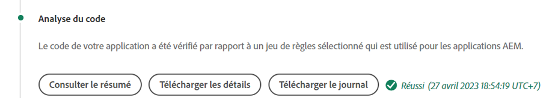

# Débogage AEM version et déploiements as a Cloud Service

Adobe Cloud Manager facilite la création et les déploiements de code pour AEM as a Cloud Service. Des échecs peuvent se produire lors des étapes du processus de création, ce qui nécessite une action pour les résoudre. Ce guide décrit les échecs courants du déploiement et comment les aborder au mieux.


## Validation

L’étape de validation permet simplement de s’assurer que les configurations Cloud Manager de base sont valides. Les échecs de validation courants sont les suivants :

### L’environnement n’est pas valide

+ __Message d’erreur :__ L’environnement n’est pas valide.
   
+ __Cause :__ L’environnement cible du pipeline se trouve dans un état transitoire au cours duquel il ne peut pas accepter de nouvelles versions.
+ __Résolution :__ Attendez que l’état se résolve en état d’exécution (ou mise à jour disponible). Si l’environnement est en cours de suppression, recréez l’environnement ou choisissez un autre environnement à créer.

### L’environnement associé au pipeline est introuvable

+ __Message d’erreur :__ L’environnement est marqué comme supprimé.
   
+ __Cause :__ L’environnement que le pipeline est configuré pour utiliser a été supprimé.
Même si un nouvel environnement du même nom est recréé, Cloud Manager ne réassociera pas automatiquement le pipeline à cet environnement du même nom.
+ __Résolution :__ Modifiez la configuration du pipeline et sélectionnez à nouveau l’environnement sur lequel effectuer le déploiement.

### La branche Git associée au pipeline est introuvable

+ __Message d’erreur :__ Pipeline non valide : XXXX. Reason=Branch=xxxx introuvable dans le référentiel.
   
+ __Cause :__ La branche Git que le pipeline est configuré pour utiliser a été supprimée.
+ __Résolution :__ Recréez la branche Git manquante à l’aide du même nom ou reconfigurez le pipeline pour créer à partir d’une autre branche existante.

## Test unitaire et version


La phase de test de création et d’unité exécute une version Maven (`mvn clean package`) du projet extrait de la branche Git configurée du pipeline.

Les erreurs identifiées dans cette phase doivent être reproductibles en local pour la création du projet, à l’exception des suivantes :

+ Une dépendance Maven non disponible sur [Maven Central](https://search.maven.org/) est utilisé et le référentiel Maven contenant la dépendance est :
   + Inatteignable à partir de Cloud Manager, tel qu’un référentiel Maven interne privé, ou le référentiel Maven nécessite une authentification et les informations d’identification incorrectes ont été fournies.
   + Non explicitement inscrit dans le `pom.xml`. Notez que l’inclusion des référentiels Maven est déconseillée, car elle augmente les délais de création.
+ Les tests unitaires échouent en raison de problèmes de minutage. Cela peut se produire lorsque les tests unitaires sont sensibles au timing. Un indicateur fort repose sur `.sleep(..)` dans le code test.
+ Utilisation de modules externes Maven non pris en charge.

## Analyse du code



L’analyse du code effectue une analyse du code statique à l’aide d’un mélange de bonnes pratiques Java et spécifiques à AEM.

L’analyse du code entraîne un échec de génération si le code contient des vulnérabilités de sécurité critique. Il est possible de remplacer des violations moindres, mais il est recommandé de les corriger. Notez que l’analyse du code est imparfaite et peut entraîner des [faux positifs](https://experienceleague.adobe.com/docs/experience-manager-cloud-service/implementing/using-cloud-manager/test-results/overview-test-results.html#dealing-with-false-positives).

Pour résoudre les problèmes d’analyse du code, téléchargez le rapport au format CSV fourni par Cloud Manager via le **Détails du téléchargement** et passez en revue les entrées.

Pour plus d’informations, voir AEM règles spécifiques, voir la documentation de Cloud Manager [règles d’analyse de code spécifiques à AEM personnalisées](https://experienceleague.adobe.com/docs/experience-manager-cloud-manager/using/how-to-use/custom-code-quality-rules.html).

## Compiler les images


L’image de version est chargée de combiner les artefacts de code créés à l’étape Test de création et d’unité avec la version AEM, afin de former un seul artefact déployable.

Bien que tous les problèmes de création et de compilation de code soient détectés lors des tests de création et d’unité, des problèmes de configuration ou de structure peuvent être identifiés lors de la tentative de combiner l’artefact de création personnalisé avec la version d’AEM.

### Duplication des configurations OSGi

Lorsque plusieurs configurations OSGi sont résolues via le mode d’exécution pour l’environnement d’AEM cible, l’étape de création d’image échoue avec l’erreur :

```
[ERROR] Unable to convert content-package [/tmp/packages/enduser.all-1.0-SNAPSHOT.zip]: 
Configuration ‘com.example.ExampleComponent’ already defined in Feature Model ‘com.example.groupId:example.all:slingosgifeature:xxxxx:X.X’, 
set the ‘mergeConfigurations’ flag to ‘true’ if you want to merge multiple configurations with same PID
```

#### Cause 1

+ __Cause :__ Le module d’AEM du projet contient plusieurs modules de code et la même configuration OSGi est fournie par plusieurs modules de code, ce qui entraîne un conflit. L’étape de création d’image ne parvient pas à déterminer lequel doit être utilisé, ce qui entraîne l’échec de la création. Notez que cela ne s’applique pas aux configurations d’usine OSGi tant qu’elles portent des noms uniques.
+ __Résolution :__ Examinez tous les modules de code (y compris les modules de code tiers inclus) déployés dans le cadre de l’application AEM, à la recherche de configurations OSGi en double qui résolvent, via le mode d’exécution, l’environnement cible. Les instructions du message d’erreur &quot;set the mergeConfigurations flag to true&quot; (définir l’indicateur mergeConfigurations sur true) ne sont pas possibles dans AEM as a Cloud service et doivent être ignorées.

#### Cause 2

+ __Cause :__ Le projet AEM inclut incorrectement le même module de code deux fois, ce qui entraîne la duplication de toute configuration OSGi contenue dans ce module.
+ __Résolution :__ Examinez tous les packages pom.xml incorporés dans l’ensemble du projet et assurez-vous qu’ils disposent de la variable `filevault-package-maven-plugin` [configuration](https://experienceleague.adobe.com/docs/experience-manager-cloud-service/implementing/developing/aem-project-content-package-structure.html#cloud-manager-target) défini sur `<cloudManagerTarget>none</cloudManagerTarget>`.

### Script repoinit mal formé

Les scripts repoinit définissent le contenu de base, les utilisateurs, les listes de contrôle d’accès, etc. Dans AEM as a Cloud Service, les scripts repoinit sont appliqués lors de la création de l’image. Toutefois, sur AEM quickstart local du SDK, ils sont appliqués lorsque la configuration d’usine repoinit OSGi est activée. Pour cette raison, les scripts Repoinit peuvent échouer discrètement (avec journalisation) sur le démarrage rapide local du SDK d’AEM, mais entraîner l’échec de l’étape de création d’image et l’arrêt du déploiement.

+ __Cause :__ Un script repoinit est incorrect. Notez que cela peut laisser votre référentiel à un état incomplet, car tout script repoinit après l’exécution du script défectueux par rapport au référentiel.
+ __Résolution :__ Passez en revue le démarrage rapide local du SDK AEM lorsque la configuration OSGi du script repoinit est déployée pour déterminer si et quelles sont les erreurs.

### Dépendance du contenu repointé insatisfaite

Les scripts repoinit définissent le contenu de base, les utilisateurs, les listes de contrôle d’accès, etc. Dans le démarrage rapide local du SDK AEM, les scripts repoinit sont appliqués lorsque la configuration d’usine OSGi repoinit est activée, ou en d’autres termes, une fois le référentiel principal et des modifications de contenu peuvent avoir été effectuées directement ou par le biais de modules de contenu. Dans AEM as a Cloud Service, les scripts repoinit sont appliqués pendant la création d’image à un référentiel qui ne contient pas nécessairement de contenu dont dépend le script repoinit.

+ __Cause :__ Un script repoinit dépend du contenu qui n’existe pas.
+ __Résolution :__ Assurez-vous que le contenu dont dépend le script repoinit existe. Souvent, cela indique un script repoinit mal défini qui ne comporte pas de directives définissant ces structures de contenu manquantes, mais requises. Cela peut être reproduit localement en supprimant AEM, en décompressant le fichier Jar et en ajoutant la configuration OSGi repoinit contenant le script repoinit au dossier d’installation, et en démarrant AEM. L’erreur se présente dans le fichier error.log du démarrage rapide local du SDK AEM.


### La version des composants principaux de l’application est supérieure à la version déployée.

_Ce problème affecte uniquement les environnements hors production qui ne se mettent PAS automatiquement à jour vers la dernière version d’AEM._

AEM as a Cloud Service inclut automatiquement la dernière version des composants principaux dans chaque version d’AEM, ce qui signifie qu’une fois qu’un environnement as a Cloud Service est, automatiquement ou manuellement mis à jour, la dernière version des composants principaux y est déployée.

Est possible car l’étape de création d’image échoue lorsque :

+ L’application de déploiement met à jour la version de dépendance Maven des composants principaux dans la variable `core` Projet (lot OSGi)
+ L’application de déploiement est ensuite déployée dans un environnement de test (hors production) AEM environnement as a Cloud Service qui n’a pas été mis à jour afin d’utiliser une version AEM qui contient cette nouvelle version des composants principaux.

Pour éviter cet échec, chaque fois qu’une mise à jour de l’environnement as a Cloud Service AEM est disponible, incluez la mise à jour dans le cadre du prochain build/déploiement et assurez-vous toujours que les mises à jour sont incluses après l’incrémentation de la version des composants principaux dans la base de code de l’application.

+ __Symptômes :__
L’étape Créer l’image échoue avec un rapport d’erreur indiquant que 
`com.adobe.cq.wcm.core.components...` Les modules situés dans des plages de versions spécifiques n’ont pas pu être importés par la variable `core` projet.

   ```
   [ERROR] Bundle com.example.core:0.0.3-SNAPSHOT is importing package(s) Package com.adobe.cq.wcm.core.components.models;version=[12.13,13) in start level 20 but no bundle is exporting these for that start level in the required version range.
   [ERROR] Analyser detected errors on feature 'com.adobe.granite:aem-ethos-app-image:slingosgifeature:aem-runtime-application-publish-dev:1.0.0-SNAPSHOT'. See log output for error messages.
   [INFO] ------------------------------------------------------------------------
   [INFO] BUILD FAILURE
   [INFO] ------------------------------------------------------------------------
   ```

+ __Cause :__  Le lot OSGi de l’application (défini dans la variable `core` projet) importe les classes Java de la dépendance Core Components, à un niveau de version différent de celui du déploiement sur AEM as a Cloud Service.
+ __Résolution:__
   + À l’aide de Git, revenez à une validation opérationnelle qui existe avant l’incrément de version des composants principaux. Envoyez cette validation à une branche Git de Cloud Manager et effectuez une mise à jour de l’environnement à partir de cette branche. Cette mise à niveau est as a Cloud Service à la dernière version d’AEM, qui inclut la version ultérieure des composants principaux. Une fois que l’AEM as a Cloud Service est mis à jour vers la dernière version d’AEM, qui contient la dernière version des composants principaux, redéployez le code qui échouait initialement.
   + Pour reproduire ce problème localement, assurez-vous que la version AEM SDK est la même version AEM version de mise à jour que celle utilisée par l’environnement as a Cloud Service.


### Création d’un cas de prise en charge des Adobes

Si les solutions de dépannage ci-dessus ne résolvent pas le problème, créez un cas d’assistance Adobe via :

+ [Adobe Admin Console](https://adminconsole.adobe.com) > Onglet Assistance > Créer un cas

   _Si vous êtes membre de plusieurs organisations d’Adobe, assurez-vous que l’organisation d’Adobe dont le pipeline échoue est sélectionnée dans le sélecteur d’organisations d’Adobe avant de créer le cas._

## Déployer sur

L’étape Déployer sur est chargée de prendre l’artefact de code généré dans Build Image (Créer l’image), de démarrer de nouveaux services AEM Author et Publish à l’aide de celui-ci et, en cas de succès, de supprimer les anciens services AEM Author et Publish. Les modules de contenu modifiable et les index sont également installés et mis à jour au cours de cette étape.

Familiarisez-vous avec [AEM journaux as a Cloud Service](./logs.md) avant de déboguer l’étape Déployer sur . Le `aemerror` Le journal contient des informations sur le démarrage et l’arrêt des capsules qui peuvent être pertinentes pour le déploiement sur les problèmes. Notez que le journal disponible via le bouton Télécharger le journal de l’étape Déployer vers de Cloud Manager n’est pas la `aemerror` et ne contient pas d’informations détaillées relatives au démarrage de vos applications.


Les trois Principales raisons pour lesquelles l’étape Déployer sur peut échouer :

### Le pipeline Cloud Manager contient une ancienne version AEM

+ __Cause :__ Un pipeline Cloud Manager contient une ancienne version d’AEM que celle déployée dans l’environnement cible. Cela peut se produire lorsqu’un pipeline est réutilisé et pointé vers un nouvel environnement qui exécute une version ultérieure d’AEM. Vous pouvez l’identifier en vérifiant si la version AEM de l’environnement est supérieure à la version AEM du pipeline.
   
+ __Résolution:__
   + Si l&#39;environnement cible dispose d&#39;une mise à jour disponible, sélectionnez Mettre à jour dans les actions de l&#39;environnement, puis relancez la génération.
   + Si l’environnement cible ne dispose pas d’une mise à jour disponible, cela signifie qu’il exécute la dernière version d’AEM. Pour résoudre ce problème, supprimez le pipeline et recréez-le.


### Cloud Manager expire

Le code qui s’exécute au démarrage du service d’AEM récemment déployé prend tellement de temps que Cloud Manager expire avant que le déploiement ne puisse se terminer. Dans ce cas, le déploiement peut réussir, même si l’état de Cloud Manager signalé comme ayant échoué.

+ __Cause :__ Le code personnalisé peut exécuter des opérations, telles que des requêtes volumineuses ou des traversées de contenu, déclenchées plus tôt dans le lot OSGi ou les cycles de vie des composants, ce qui retarde considérablement l’heure de début de l’AEM.
+ __Résolution :__ Examinez l’implémentation pour le code qui s’exécute au début du cycle de vie du bundle OSGi et passez en revue les `aemerror` journaux des services AEM Author et Publish à l’heure de l’échec (heure du journal dans GMT), comme indiqué par Cloud Manager, et recherchez les messages de journal indiquant les processus d’exécution de journal personnalisés.

### Code ou configuration incompatible

La plupart des violations de code et de configuration sont interceptées plus tôt dans la version. Il est toutefois possible que le code personnalisé ou la configuration soient incompatibles avec l’as a Cloud Service AEM et restent non détectés jusqu’à ce qu’il s’exécute dans le conteneur.

+ __Cause :__ Le code personnalisé peut nécessiter de longues opérations, telles que des requêtes volumineuses ou des traversées de contenu, déclenchées tôt dans le lot OSGi ou des cycles de vie de composants, ce qui retarde considérablement le temps de démarrage de l’AEM.
+ __Résolution :__ Consultez la section `aemerror` journaux des services AEM Author et Publish à l’heure (heure de connexion au format GMT) de l’échec, comme indiqué par Cloud Manager.
   1. Recherchez dans les journaux toute ERREUR générée par les classes Java fournies par l’application personnalisée. Si des problèmes sont détectés, résolvez, poussez le code fixe et recréez le pipeline.
   1. Examinez les journaux pour toute ERREUR signalée par certains aspects de l’AEM que vous étendez/interagissez avec dans votre application personnalisée, et examinez-les ; ces erreurs ne peuvent pas être directement attribuées aux classes Java. Si des problèmes sont détectés, résolvez, poussez le code fixe et recréez le pipeline.

### Inclusion de /var dans le module de contenu

`/var` est modifiable contenant une variété de contenu d’exécution transitoire. Inclusion `/var` dans des packages de contenu (par exemple `ui.content`) déployées via Cloud Manager peut entraîner l’échec de l’étape Déploiement .

Ce problème est difficile à identifier, car il n’entraîne pas d’échec lors du déploiement initial, mais uniquement lors des déploiements suivants. Les symptômes visibles sont les suivants :

+ Le déploiement initial réussit, même si du contenu modifiable nouveau ou modifié, qui fait partie du déploiement, ne semble pas exister sur le service de publication AEM.
+ L’activation/la désactivation du contenu dans l’auteur AEM est bloquée.
+ Les déploiements suivants échouent à l’étape Déployer pour . L’étape Déployer pour échoue après environ 60 minutes.

La validation de ce problème est la cause du comportement défaillant :

1. En déterminant qu’au moins un module de contenu fait partie du déploiement, écrit sur `/var`.
1. Vérifiez que la Principale file d’attente de distribution (en gras) est bloquée à l’adresse :
   + Auteur AEM > Outils > Déploiement > Distribution
      
1. En cas d’échec du déploiement suivant, téléchargez les journaux &quot;Déployer sur&quot; de Cloud Manager à l’aide du bouton Télécharger le journal :

   

   ... et vérifiez qu’il y a environ 60 minutes entre les instructions du journal :

   ```
   2020-01-01T01:01:02+0000 Begin deployment in aem-program-x-env-y-dev [CorrelationId: 1234]
   ```

   ... et ...

   ```
   2020-01-01T02:04:10+0000 Failed deployment in aem-program-x-env-y-dev
   ```

   Notez que ce journal ne contiendra pas ces indicateurs sur les déploiements initiaux qui signalent une réussite, plutôt que uniquement sur les déploiements en échec suivants.

+ __Cause :__ AEM utilisateur du service de réplication utilisé pour déployer des modules de contenu vers le service de publication AEM ne peut pas écrire dans `/var` sur AEM Publish. Cela entraîne l’échec du déploiement du module de contenu sur le service AEM Publish.
+ __Résolution :__ Les moyens suivants pour résoudre ces problèmes sont répertoriés par ordre de préférence :
   1. Si la variable `/var` Les ressources ne sont pas nécessaires pour supprimer les ressources sous `/var` des modules de contenu déployés dans le cadre de votre application.
   2. Si la variable `/var` les ressources sont nécessaires, définissez les structures de noeud à l’aide de [repoinit](https://experienceleague.adobe.com/docs/experience-manager-cloud-service/implementing/deploying/overview.html#repoinit). Les scripts repoinit peuvent être ciblés sur AEM Author, AEM Publish ou les deux, via les modes d’exécution OSGi.
   3. Si la variable `/var` Les ressources ne sont requises que sur AEM auteur et ne peuvent pas être modélisées raisonnablement à l’aide de [repoinit](https://experienceleague.adobe.com/docs/experience-manager-cloud-service/implementing/deploying/overview.html#repoinit), déplacez-les vers un module de contenu distinct, qui n’est installé que sur l’auteur AEM par [incorporation](https://experienceleague.adobe.com/docs/experience-manager-cloud-service/implementing/developing/aem-project-content-package-structure.html?lang=fr#embeddeds) dans le `all` module dans un dossier du mode d’exécution Auteur AEM (`<target>/apps/example-packages/content/install.author</target>`).
   4. Fournissez les listes de contrôle d’accès appropriées à la variable `sling-distribution-importer` utilisateur du service, comme décrit dans cette section [Adobe KB](https://helpx.adobe.com/in/experience-manager/kb/cm/cloudmanager-deploy-fails-due-to-sling-distribution-aem.html).

### Création d’un cas de prise en charge des Adobes

Si les solutions de dépannage ci-dessus ne résolvent pas le problème, créez un cas d’assistance Adobe via :

+ [Adobe Admin Console](https://adminconsole.adobe.com) > Onglet Assistance > Créer un cas

   _Si vous êtes membre de plusieurs organisations d’Adobe, assurez-vous que l’organisation d’Adobe dont le pipeline échoue est sélectionnée dans le sélecteur d’organisations d’Adobe avant de créer le cas._
