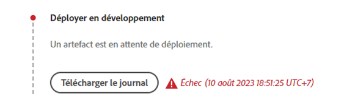

# Déboguer la création et les déploiements d’AEM as a Cloud Service

Adobe Cloud Manager facilite la création et les déploiements de code pour AEM as a Cloud Service. Des échecs peuvent se produire au cours du processus de création et doivent être résolus. Ce guide décrit les échecs courants pouvant survenir lors du déploiement et explique comment les aborder au mieux.


## Validation

L’étape de validation permet simplement de s’assurer que les configurations Cloud Manager de base sont valides. Les échecs de validation courants sont les suivants :

### L’environnement n’est pas valide.

+ __Message d’erreur :__ l’environnement n’est pas valide.
  
+ __Cause :__ l’environnement cible du pipeline se trouve dans un état transitoire au cours duquel il ne peut pas accepter de nouvelles créations.
+ __Résolution :__ attendez que l’état se résolve en état d’exécution (ou de mise à jour disponible). Si l’environnement est en cours de suppression, recréez l’environnement ou choisissez un autre environnement à créer.

### L’environnement associé au pipeline est introuvable.

+ __Message d’erreur :__ l’environnement est marqué comme supprimé.
  
+ __Cause :__ l’environnement pour lequel le pipeline est configuré a été supprimé.
Même si un nouvel environnement du même nom est recréé, Cloud Manager ne réassociera pas automatiquement le pipeline à cet environnement du même nom.
+ __Résolution :__ modifiez la configuration du pipeline et sélectionnez à nouveau l’environnement sur lequel effectuer le déploiement.

### La branche Git associée au pipeline est introuvable.

+ __Message d’erreur :__ pipeline non valide : XXXXXX. Raison=Branche=xxxx introuvable dans le référentiel.
  
+ __Cause :__ la branche Git pour laquelle le pipeline est configuré a été supprimée.
+ __Résolution :__ recréez la branche Git manquante à l’aide du même nom ou reconfigurez le pipeline pour créer à partir d’une autre branche existante.

## Test unitaire et de création


La phase de test unitaire et de création effectue une création Maven (`mvn clean package`) du projet extrait de la branche Git configurée du pipeline.

Les erreurs identifiées dans cette phase doivent être reproductibles localement pour la création du projet, avec les exceptions suivantes :

+ Une dépendance Maven non disponible sur [Maven Central](https://search.maven.org/) est utilisée et le référentiel Maven contenant la dépendance est :
   + Inatteignable à partir de Cloud Manager, tel qu’un référentiel Maven interne privé, ou le référentiel Maven nécessite une authentification et des informations d’identification incorrectes ont été fournies.
   + Non explicitement inscrit dans le `pom.xml` du projet. Notez que l’inclusion des référentiels Maven est déconseillée, car elle augmente les délais de création.
+ Les tests unitaires échouent en raison de problèmes temporel. Cela peut se produire lorsque les tests unitaires sont sensibles au temps. Un indicateur fort repose sur `.sleep(..)` dans le code test.
+ Utilisation de plug-ins Maven non pris en charge.

## Analyse du code


L’analyse du code effectue une analyse du code statique à l’aide d’un mélange de bonnes pratiques Java et spécifiques à AEM.

L’analyse du code entraîne un échec de création si le code contient des vulnérabilités de sécurité critiques. Il est possible de remplacer des violations moindres, mais il est recommandé de les corriger. Notez que l’analyse du code est imparfaite et peut entraîner des [faux positifs](https://experienceleague.adobe.com/docs/experience-manager-cloud-service/content/implementing/using-cloud-manager/test-results/overview-test-results.html?lang=fr).

Pour résoudre les problèmes d’analyse du code, téléchargez le rapport au format CSV fourni par Cloud Manager via le bouton **Détails du téléchargement** et passez en revue les entrées.

Pour plus d’informations, voir les règles spécifiques d’AEM et la documentation de Cloud Manager, [règles personnalisées d’analyse de code spécifiques à AEM](https://experienceleague.adobe.com/docs/experience-manager-cloud-manager/content/using/custom-code-quality-rules.html?lang=fr).

## Créer des images


La création d’image est chargée de combiner les artefacts de code créés à l’étape Test unitaire et de création avec la version d’AEM, afin de former un seul artefact déployable.

Bien que tous les problèmes de création et de compilation de code soient détectés lors des tests unitaires et de création, des problèmes de configuration ou de structure peuvent être identifiés lors de la tentative de combination de l’artefact de création personnalisé avec la version d’AEM.

### Dupliquer des configurations OSGi

Lorsque plusieurs configurations OSGi sont résolues via le mode d’exécution pour l’environnement d’AEM cible, l’étape de création d’image échoue avec l’erreur :

```
[ERROR] Unable to convert content-package [/tmp/packages/enduser.all-1.0-SNAPSHOT.zip]: 
Configuration 'com.example.ExampleComponent' already defined in Feature Model 'com.example.groupId:example.all:slingosgifeature:xxxxx:X.X', 
set the 'mergeConfigurations' flag to 'true' if you want to merge multiple configurations with same PID
```

#### Cause 1

+ __Cause :__ le package AEM du projet contient plusieurs packages de code et la même configuration OSGi est fournie par plusieurs packages de code, ce qui entraîne un conflit. L’étape de création d’image ne parvient alors pas à déterminer lequel doit être utilisé, ce qui entraîne l’échec de la création. Notez que cela ne s’applique pas aux configurations d’usine OSGi tant qu’elles portent des noms uniques.
+ __Résolution :__ examinez tous les packages de code (y compris les packages de code tiers inclus) déployés dans le cadre de l’application AEM, à la recherche de configurations OSGi en double qui résolvent, via le mode d’exécution, l’environnement cible. Les instructions du message d’erreur « set the mergeConfigurations flag to true » (définir l’indicateur mergeConfigurations sur true) ne sont pas possibles dans AEM as a Cloud Service et doivent être ignorées.

#### Cause 2

+ __Cause :__ le projet AEM inclut incorrectement le même package de code deux fois, ce qui entraîne la duplication de toute configuration OSGi contenue dans ce package.
+ __Résolution :__ examinez tous les fichiers pom.xml des packages incorporés dans l’ensemble du projet et assurez-vous que la [configuration](https://experienceleague.adobe.com/docs/experience-manager-cloud-service/content/implementing/developing/aem-project-content-package-structure.html?mt=false&amp;lang=fr#cloud-manager-target) `filevault-package-maven-plugin` est définie sur `<cloudManagerTarget>none</cloudManagerTarget>`.

### Script repoinit mal formé

Les scripts repoinit définissent le contenu de base, les utilisateurs et utilisatrices, les ACL, etc. Dans AEM as a Cloud Service, les scripts repoinit sont appliqués lors de la création d’image. Toutefois, sur le démarrage rapide local du SDK d’AEM, ils sont appliqués lorsque la configuration d’usine repoinit OSGi est activée. Pour cette raison, les scripts Repoinit peuvent échouer discrètement (avec journalisation) sur le démarrage rapide local du SDK d’AEM, mais entraîner l’échec de l’étape de création d’image et l’arrêt du déploiement.

+ __Cause :__ un script repoinit est mal formé. Cela peut mettre votre référentiel sur un statut incomplet, car tout script repoinit après le script défectueux n’est pas exécuté dans le référentiel.
+ __Résolution :__ examinez le démarrage rapide local du SDK d’AEM lorsque la configuration OSGi du script repoinit est déployée pour déterminer si des erreurs existent, et lesquelles.

### Dépendance du contenu repoinit insatisfaite

Les scripts repoinit définissent le contenu de base, les utilisateurs et utilisatrices, les ACL, etc. Dans le démarrage rapide local du SDK d’AEM, les scripts repoinit sont appliqués lorsque la configuration d’usine OSGi repoinit est activée ou, en d’autres termes, une fois que le référentiel principal est activé et que des modifications de contenu peuvent avoir été effectuées directement ou par le biais de packages de contenu. Dans AEM as a Cloud Service, les scripts repoinit sont appliqués pendant la création d’image à un référentiel qui ne contient pas nécessairement de contenu dont dépend le script repoinit.

+ __Cause :__ un script repoinit dépend d’un contenu qui n’existe pas.
+ __Résolution :__ assurez-vous que le contenu dont dépend le script repoinit existe. Souvent, cela indique un script repoinit mal défini qui ne comporte pas de directives définissant ces structures de contenu manquantes, mais requises. Cela peut être reproduit localement en supprimant AEM, en décompressant le fichier Jar et en ajoutant la configuration OSGi repoinit contenant le script repoinit au dossier d’installation, et en démarrant AEM. L’erreur se présente elle-même dans le fichier error.log du démarrage rapide local du SDK d’AEM.


### La version des composants principaux de l’application est supérieure à la version déployée.

_Ce problème affecte uniquement les environnements hors production qui ne se mettent PAS automatiquement à jour vers la dernière version d’AEM._

AEM as a Cloud Service inclut automatiquement la dernière version des composants principaux dans chaque version d’AEM, ce qui signifie qu’une fois qu’un environnement AEM as a Cloud Service est automatiquement ou manuellement mis à jour, la dernière version des composants principaux y est déployée.

Un échec lors de l’étape de création d’image est possible lorsque :

+ L’application de déploiement met à jour la version de dépendance Maven des composants principaux dans le projet `core` (lot OSGi).
+ L’application de déploiement est ensuite déployée dans un environnement de sandbox (hors production) AEM as a Cloud Service qui n’a pas été mis à jour afin d’utiliser une version AEM qui contient cette nouvelle version des composants principaux.

Pour éviter cet échec, chaque fois qu’une mise à jour de l’environnement AEM as a Cloud Service est disponible, incluez la mise à jour dans le cadre de la prochaine création/du prochain déploiement et assurez-vous toujours que les mises à jour sont incluses après l’incrémentation de la version des composants principaux dans la base de code de l’application.

+ __Symptômes :__
l’étape de création d’image échoue avec un rapport d’erreur indiquant que le ou les packages `com.adobe.cq.wcm.core.components...` situés dans des plages de versions spécifiques n’ont pas pu être importés par le projet `core`.

  ```
  [ERROR] Bundle com.example.core:0.0.3-SNAPSHOT is importing package(s) Package com.adobe.cq.wcm.core.components.models;version=[12.13,13) in start level 20 but no bundle is exporting these for that start level in the required version range.
  [ERROR] Analyser detected errors on feature 'com.adobe.granite:aem-ethos-app-image:slingosgifeature:aem-runtime-application-publish-dev:1.0.0-SNAPSHOT'. See log output for error messages.
  [INFO] ------------------------------------------------------------------------
  [INFO] BUILD FAILURE
  [INFO] ------------------------------------------------------------------------
  ```

+ __Cause :__ le lot OSGi de l’application (défini dans le projet `core`) importe les classes Java de la dépendance principale des composants principaux, à un niveau de version différent de celui du déploiement sur AEM as a Cloud Service.
+ __Résolution :__
   + À l’aide de Git, revenez à une validation opérationnelle antérieure à l’incrément de version des composants principaux. Envoyez cette validation à une branche Git de Cloud Manager et effectuez une mise à jour de l’environnement à partir de cette branche. AEM as a Cloud Service est alors mis à jour vers la dernière version d’AEM, qui inclut la version la plus récente des composants principaux. Une fois AEM as a Cloud Service mis à jour vers la dernière version d’AEM, qui contient la dernière version des composants principaux, redéployez le code qui échouait initialement.
   + Pour reproduire ce problème localement, assurez-vous que la version du SDK AEM est la même que celle de l’environnement AEM as a Cloud Service.


### Créer un cas d’assistance Adobe

Si les solutions de dépannage ci-dessus sont infructueuses, créez un cas d’assistance Adobe en procédant comme suit :

+ [Adobe Admin Console](https://adminconsole.adobe.com) > Onglet Assistance > Créer un cas

  _Si vous êtes une personne membre de plusieurs organisations Adobe, assurez-vous que l’organisation Adobe dont le pipeline échoue est sélectionnée dans le sélecteur d’organisation Adobe avant de créer le cas._

## Déploiement sur

L’étape Déploiement sur permet de lancer de nouveaux services de création et de publication AEM à l’aide de l’artefact de code généré dans la création d’image, et, en cas de succès, de supprimer les anciens services de création et de publication AEM. Les packages de contenu modifiables et les index sont également installés et mis à jour au cours de cette étape.

Familiarisez-vous avec les [journaux d’AEM as a Cloud Service](./logs.md) avant de déboguer l’étape Déploiement sur. Le journal `aemerror` contient des informations sur le démarrage et l’arrêt des capsules, ce qui est utile pour résoudre les problèmes liés à l’étape Déploiement sur. Notez que le journal disponible via le bouton Télécharger le journal de l’étape Déploiement sur de Cloud Manager n’est pas le journal `aemerror` et ne contient pas d’informations détaillées relatives au démarrage de vos applications.


Voici les trois principales raisons pour lesquelles l’étape Déploiement sur peut échouer :

### Le pipeline Cloud Manager contient une version antérieure d’AEM

+ __Cause :__ un pipeline Cloud Manager contient une version d’AEM antérieure à celle déployée dans l’environnement cible. Cela peut se produire lorsqu’un pipeline est réutilisé et pointe vers un nouvel environnement qui exécute une version ultérieure d’AEM. Pour le vérifier, consultez si la version AEM de l’environnement est supérieure à la version AEM du pipeline.
  
+ __Résolution :__
   + Si une mise à jour est disponible pour l’environnement cible, sélectionnez Mettre à jour dans les actions de l’environnement et relancez la création.
   + Si aucune mise à jour n’est disponible pour l’environnement cible, cela signifie que la version la plus récente d’AEM est installée. Pour résoudre ce problème, supprimez le pipeline et recréez-le.


### Expiration de Cloud Manager

L’exécution du code au démarrage du service AEM nouvellement déployé prend tellement de temps que Cloud Manager expire avant la fin du déploiement. Toutefois, le déploiement peut réussir, même si le statut de Cloud Manager est en échec.

+ __Cause :__ le code personnalisé peut exécuter des opérations, telles que des requêtes volumineuses ou des parcours de contenu, déclenchées plus tôt dans le lot OSGi ou les cycles de vie des composants. Le temps de démarrage d’AEM est alors considérablement allongé.
+ __Résolution :__ examinez l’implémentation du code qui s’exécute au début du cycle de vie du lot OSGi et consultez les journaux `aemerror` des services de création et de publication AEM au moment de l’échec (l’heure est au format GMT), comme indiqué par Cloud Manager, et recherchez les messages de journal indiquant les processus personnalisés d’exécution du journal.

### Code ou configuration incompatible

La plupart des violations de code et de configuration sont résolues plus tôt dans la création. Il est toutefois possible que le code personnalisé ou la configuration soient incompatibles avec AEM as a Cloud Service et restent non détectés jusqu’à leur exécution dans le conteneur.

+ __Cause :__ le code personnalisé peut engendrer de longues opérations, telles que des requêtes volumineuses ou des parcours de contenu, déclenchées plus tôt dans le lot OSGi ou les cycles de vie des composants. Le temps de démarrage d’AEM est alors considérablement allongé.
+ __Résolution :__ consultez les journaux `aemerror` des services de création et de publication AEM au moment de l’échec (l’heure est au format GMT), comme indiqué par Cloud Manager.
   1. Recherchez dans les journaux les erreurs générées par les classes Java fournies par l’application personnalisée. Si des problèmes sont détectés, apportez une solution, implémentez le nouveau code et recréez le pipeline.
   1. Recherchez dans les journaux les erreurs signalées par certains aspects d’AEM que vous étendez ou avec lesquels vous interagissez dans votre application personnalisée et examinez-les. Ces erreurs peuvent ne pas être directement attribuées aux classes Java. Si des problèmes sont détectés, apportez une solution, implémentez le nouveau code et recréez le pipeline.

### Inclure /var dans le package de contenu

`/var` est modifiable et contient une variété de contenu d’exécution transitoire. L’inclusion de `/var` dans des packages de contenu (par exemple, `ui.content`) déployés via Cloud Manager peut entraîner l’échec de l’étape Déploiement sur.

Ce problème est difficile à identifier, car il n’entraîne pas d’échec lors du déploiement initial, mais uniquement lors des déploiements suivants. Les symptômes courants sont les suivants :

+ Le déploiement initial réussit, même si du contenu modifiable nouveau ou modifié, qui fait partie du déploiement, n’apparaît pas sur le service de publication AEM.
+ L’activation et la désactivation du contenu dans le service de création AEM sont bloquées.
+ Les déploiements ultérieurs échouent à l’étape Déploiement sur après environ 60 minutes.

Pour confirmer que ce problème est bien la cause du comportement défaillant, procédez comme suit :

1. Vérifiez qu’au moins un package de contenu du déploiement écrit dans `/var`.
1. Vérifiez que la file d’attente de distribution principale (en gras) est bloquée à l’emplacement :
   + Création AEM > Outils > Déploiement > Distribution.
     
1. En cas d’échec du déploiement suivant, téléchargez les journaux « Déploiement sur » de Cloud Manager à l’aide du bouton Télécharger le journal :

   

   … et vérifiez qu’il y a environ 60 minutes entre les instructions du journal :

   ```
   2020-01-01T01:01:02+0000 Begin deployment in aem-program-x-env-y-dev [CorrelationId: 1234]
   ```

   ... et...

   ```
   2020-01-01T02:04:10+0000 Failed deployment in aem-program-x-env-y-dev
   ```

   Notez que ce journal ne contient pas ces indicateurs sur les déploiements initiaux qui ont réussi, mais uniquement sur les déploiements en échec ultérieurs.

+ __Cause :__ l’utilisateur ou l’utilisatrice du service de réplication d’AEM utilisé pour déployer les packages de contenu vers le service de publication AEM ne peut pas écrire dans `/var` sur le service de publication AEM. Cela entraîne l’échec du déploiement du package de contenu sur le service de publication AEM.
+ __Résolution :__ les solutions suivantes sont répertoriés par ordre de préférence :
   1. Si les ressources `/var` ne sont pas nécessaires, supprimez les ressources sous `/var` des packages de contenu déployés dans le cadre de votre application.
   2. Si les ressources `/var` sont nécessaires, définissez les structures de nœud à l’aide de [repoinit](https://experienceleague.adobe.com/docs/experience-manager-cloud-service/content/implementing/deploying/overview.html?lang=fr#repoinit). Les scripts repoinit peuvent être ciblés sur le service de création ou de publication AEM, voire les deux, via les modes d’exécution OSGi.
   3. Si les ressources `/var` sont uniquement destinées au service de création AEM et ne peuvent pas être modélisées raisonnablement à l’aide de [repoinit](https://experienceleague.adobe.com/docs/experience-manager-cloud-service/content/implementing/deploying/overview.html?lang=fr#repoinit), déplacez-les vers un package de contenu distinct, qui n’est installé que sur le service de création AEM, et [incorporez](https://experienceleague.adobe.com/docs/experience-manager-cloud-service/implementing/developing/aem-project-content-package-structure.html?lang=fr#embeddeds)-le dans le package `all` d’un dossier du mode d’exécution du service de création AEM (`<target>/apps/example-packages/content/install.author</target>`).
   4. Fournissez les listes de contrôle d’accès appropriées à l’utilisateur ou l’utilisatrice de service `sling-distribution-importer`, comme décrit dans la [base de connaissances Adobe](https://helpx.adobe.com/in/experience-manager/kb/cm/cloudmanager-deploy-fails-due-to-sling-distribution-aem.html).

### Créer un cas d’assistance Adobe

Si les solutions de dépannage ci-dessus sont infructueuses, créez un cas d’assistance Adobe en procédant comme suit :

+ [Adobe Admin Console](https://adminconsole.adobe.com) > Onglet Assistance > Créer un cas

  _Si vous êtes une personne membre de plusieurs organisations Adobe, assurez-vous de sélectionner l’organisation Adobe dont le pipeline est en échec dans le sélecteur d’organisation Adobe avant de créer le cas._
