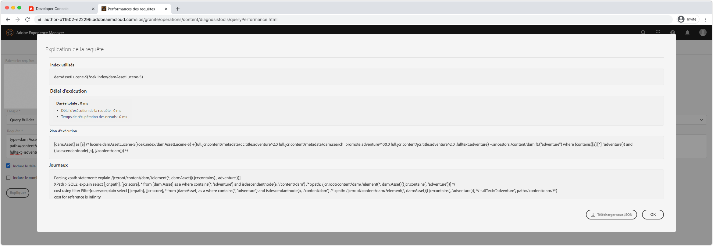

# Débogage de l’AEM en tant que Cloud Service avec la Console développeur

AEM en tant que Cloud Service fournit une Console développeur pour chaque environnement qui expose divers détails du service AEM en cours d’exécution qui sont utiles pour le débogage.

Chaque AEM en tant qu&#39;environnement Cloud Service dispose de sa propre Console développeur.

## Accès à la Console développeur

Pour accéder à la Console développeur et l&#39;utiliser, les autorisations suivantes doivent être attribuées à l&#39;Adobe ID du développeur via [Adobe Admin Console](https://adminconsole.adobe.com).

1. Assurez-vous que l’organisation d’Adobes qui a affecté Cloud Manager et AEM en tant que produits Cloud Service est principale dans le sélecteur d’organisation d’Adobes.
1. Le développeur doit être membre du Profil de produits __Développeur - Cloud Service__ de Cloud Manager.
   + Si cet abonnement n&#39;existe pas, le développeur ne pourra pas se connecter à la Console développeur.
1. Le développeur doit être membre du __AEM Utilisateurs__ ou __AEM Administrateurs__ Profil produit sur AEM Author et/ou Publish.
   + Si cet abonnement n&#39;existe pas, le [statut](#status) est vidé avec une erreur 401 Non autorisé.

### Dépannage de l’accès à la Console développeur

#### 401 Erreur non autorisée en cas de dumping

Si un Cloud Service affiche un état de dumping d’une erreur 401 Non autorisé, cela signifie que votre utilisateur n’existe pas encore avec les autorisations nécessaires dans AEM en tant que  ou que les jetons de connexion utilisés ne sont pas valides ou ont expiré.

Pour résoudre le problème 401 Non autorisé :

1. Assurez-vous que votre utilisateur est membre du Profil produit IMS d&#39;Adobe approprié (administrateurs AEM ou utilisateurs AEM) pour l&#39;AEM associée à la Console développeur en tant qu&#39;instance de produit Cloud Service.
   + N&#39;oubliez pas que Developer Console accède à 2 instances de produit IMS Adobe ; l’AEM en tant qu’instances d’auteur et de publication Cloud Service ; assurez-vous donc que les Profils de produits appropriés sont utilisés en fonction du niveau de service auquel l’accès est requis via Developer Console.
1. Connectez-vous à l’AEM en tant que Cloud Service (Auteur ou Publier) et assurez-vous que vos utilisateurs et groupes se sont correctement synchronisés dans AEM.
   + Developer Console requiert que votre enregistrement d&#39;utilisateur soit créé dans le niveau de service AEM correspondant pour qu&#39;il s&#39;authentifie dans ce niveau de service.
1. Effacez vos cookies de navigateur ainsi que l’état de l’application (enregistrement local) et reconnectez-vous à la Console développeur de jeton d&#39;accès, en vous assurant que l’utilisation de cette dernière est correcte et non expirée.

## Pod

Les AEM en tant que services d’auteur et de publication Cloud Service sont composés de plusieurs instances, respectivement, afin de gérer la variabilité du trafic et les mises à jour variables sans temps d’inactivité. Ces instances sont appelées &quot;capsules&quot;. La sélection de capsules dans la Console développeur définit la portée des données qui seront exposées par le biais des autres contrôles.

+ Un module est une instance distincte qui fait partie d’un service AEM (auteur ou publication).
+ Les capsules sont transitoires, ce qui signifie qu&#39;AEM en tant que Cloud Service les crée et les détruit selon les besoins.
+ Seuls les capsules qui font partie de l&#39;AEM associée en tant qu&#39;environnement Cloud Service sont répertoriées dans le commutateur de capsules de la Console de développement de l&#39;environnement.
+ Au bas du sélecteur de capsules, les options pratiques permettent de sélectionner des capsules par type de service :
   + Tous les auteurs
   + Tous les éditeurs
   + Toutes les instances

## État

L’état fournit des options permettant de générer l’état d’exécution AEM spécifique dans le texte ou la sortie JSON. La Console développeur fournit des informations similaires à la console Web OSGi du kit de développement AEM, avec la différence marquée que la Console développeur est en lecture seule.

### Lots

Bundles liste tous les lots OSGi dans AEM. Cette fonctionnalité est semblable à [AEM SDK local quickstart&#39;s OSGi Bundles](http://localhost:4502/system/console/bundles) à `/system/console/bundles`.

Bundler l’aide au débogage par :

+ Liste de tous les lots OSGi déployés en AEM en tant que service
+ Affichage de la liste de chaque état d&#39;assemblage OSGi ; y compris s&#39;ils sont principaux ou non
+ Fourniture de détails sur les dépendances non résolues qui empêchent les lots OSGi de devenir principaux

### Composants

Composants liste tous les composants OSGi dans AEM. Cette fonctionnalité est similaire aux [Composants OSGi ](http://localhost:4502/system/console/components) du kit de développement rapide local AEM à `/system/console/components`.

Les composants aident au débogage en procédant comme suit :

+ Liste de tous les composants OSGi déployés sur AEM en tant que Cloud Service
+ fournir l&#39;état de chaque composant OSGi ; y compris s&#39;ils sont principaux ou insatisfaits
+ La fourniture de détails dans des références de service insatisfaites peut faire en sorte que les composants OSGi deviennent principaux
+ Liste des propriétés OSGi et de leurs valeurs liées au composant OSGi

### Configurations

Configurations liste toutes les configurations du composant OSGi (propriétés et valeurs OSGi). Cette fonctionnalité est semblable à [AEM SDK local quickstart de l&#39;OSGi Configuration Manager](http://localhost:4502/system/console/configMgr) à `/system/console/configMgr`.

Les configurations aident au débogage par :

+ Liste des propriétés OSGi et de leurs valeurs par composant OSGi
+ Localisation et identification des propriétés mal configurées

### Index Oak

Les index de chêne fournissent un vidage des noeuds définis sous `/oak:index`. Gardez à l’esprit que cela n’affiche pas les index fusionnés, qui surviennent lorsqu’un index AEM est modifié.

Les index de chêne aident au débogage en :

+ Répertorie toutes les définitions d’index de chêne fournissant des informations sur la façon dont les requêtes de recherche sont exécutées dans AEM. Gardez à l’esprit que les index modifiés en index AEM ne sont pas reflétés ici. Cette vue n&#39;est utile que pour les index fournis uniquement par AEM, ou uniquement par le code personnalisé.

### Services OSGi

Composants liste tous les services OSGi. Cette fonctionnalité est similaire à [AEM SDK local quickstart&#39;s OSGi Services](http://localhost:4502/system/console/services) sur `/system/console/services`.

Les services OSGi vous aident à déboguer en :

+ Liste de tous les services OSGi en AEM, ainsi que de son offre groupée OSGi et de tous les lots OSGi qui en consomment

### Tâches Sling

Sling Jobs liste toutes les files d’attente Sling Jobs. Cette fonctionnalité est similaire à [AEM SDK local quickstart&#39;s Jobs](http://localhost:4502/system/console/slingevent) sur `/system/console/slingevent`.

Aide de Sling Jobs dans le débogage par :

+ Liste des files d&#39;attente de travaux Sling et de leurs configurations
+ Fournir des informations sur le nombre de tâches Sling principales, en file d’attente et traitées, ce qui s’avère utile pour déboguer les problèmes liés au flux de travail, au flux de travail temporaire et à d’autres tâches effectuées par Sling Jobs dans AEM.

## Packages Java

Les packages Java permettent de vérifier si un package Java et sa version sont disponibles en AEM en tant que Cloud Service. Cette fonctionnalité est identique à celle de [AEM kit SDK de démarrage rapide local de l’outil de recherche de dépendance](http://localhost:4502/system/console/depfinder) à `/system/console/depfinder`.

Java Packages est utilisé pour empêcher le démarrage de lots en raison d&#39;importations non résolues ou de classes non résolues dans les scripts (HTL, JSP, etc.). Si les rapports de packages Java, aucun lot n’exporte un package Java (ou si la version ne correspond pas à celle importée par un lot OSGi) :

+ Assurez-vous que la version de la dépendance d&#39;API maven de votre projet correspond à la version de AEM version de l&#39;environnement (et si possible, mettez à jour tout le contenu jusqu&#39;à la dernière version).
+ Si des dépendances Maven supplémentaires sont utilisées dans le projet Maven
   + Déterminez si une autre API fournie par la dépendance d’API AEM SDK peut être utilisée à la place.
   + Si la dépendance supplémentaire est requise, assurez-vous qu’elle est fournie sous forme de lot OSGi (plutôt qu’un Jar ordinaire) et qu’elle est incorporée dans le package de code de votre projet (`ui.apps`), de la même manière que le lot OSGi principal est incorporé dans le package `ui.apps`.

## Servlets

Servlets permet d’obtenir des informations sur la manière dont AEM résout une URL vers une servlet ou un script Java (HTL, JSP) qui gère finalement la requête. Cette fonctionnalité est identique à celle du &quot;Sling Servlet Resolver&quot; du kit de démarrage rapide [AEM du kit SDK local ](http://localhost:4502/system/console/servletresolver) à `/system/console/servletresolver`.

Les servlets aident à déterminer :

+ Comment une URL est décomposée en ses parties adressables (ressource, sélecteur, extension).
+ servlet ou script auquel une URL correspond, ce qui permet d’identifier les URL mal formées ou les servlets/scripts mal enregistrés.

## Requêtes

Les requêtes vous aident à identifier et comment les requêtes de recherche sont exécutées sur les AEM. Cette fonctionnalité est identique à la console [AEM SDK locale quickstart’s Tools > Requête Performance ](http://localhost:4502/libs/granite/operations/content/diagnosistools/queryPerformance.html).

Les requêtes ne fonctionnent que lorsqu’un module spécifique est sélectionné, car elles ouvrent la console Web Requête Performance de ce module, ce qui nécessite que le développeur ait accès à la connexion au service AEM.

Les requêtes aident à déboguer en :

+ Expliquer comment les requêtes sont interprétées, analysées et exécutées par Oak. C&#39;est très important pour le suivi des raisons de la lenteur d&#39;une requête et pour comprendre comment elle peut être accélérée.
+ Liste des requêtes les plus populaires s&#39;exécutant dans AEM, avec la possibilité de les expliquer.
+ Liste des requêtes les plus lentes s&#39;exécutant dans AEM, avec la possibilité de les expliquer.
