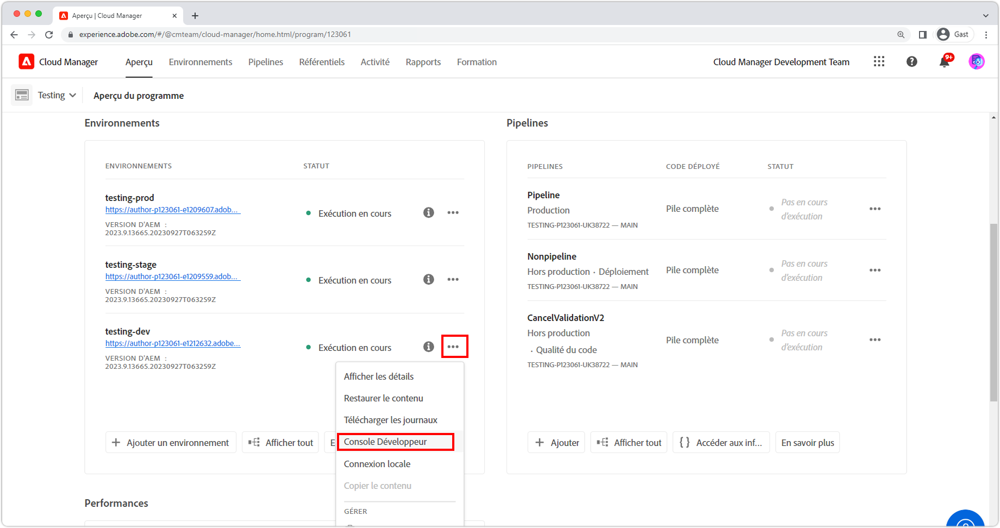

# Déboguer AEM as a Cloud Service avec la Developer Console

AEM as a Cloud Service fournit une Developer Console pour chaque environnement qui présente divers détails du service AEM en cours d’exécution qui sont utiles pour le débogage.

Chaque environnement AEM as a Cloud Service possède sa propre Developer Console.

## Accéder à Developer Console

Developer Console est accessible par l’environnement AEM as a Cloud Service via Cloud Manager.

1. Accédez à __[Cloud Manager](https://my.cloudmanager.adobe.com/)__.
2. Ouvrez le __Programme__ qui contient l’environnement AEM as a Cloud Service pour ouvrir Developer Console.
3. Recherchez l’__Environnement__, puis sélectionnez les `...`.
4. Sélectionnez __Developer Console__ dans la liste déroulante.

## Accéder à Developer Console

Pour accéder à Developer Console et l’utiliser, les autorisations suivantes doivent être accordées à l’Adobe ID du développeur ou de la développeuse via [l’Admin Console d’Adobe](https://adminconsole.adobe.com).

1. Assurez-vous que l’organisation Adobe qui a affecté les produits Cloud Manager et AEM as a Cloud Service est active dans le sélecteur d’organisations Adobe.
1. La personne chargée du développement doit être membre du [profil de produits du __service cloud de développement__ du produit Cloud Manager](https://experienceleague.adobe.com/docs/experience-manager-cloud-service/content/onboarding/journey/assign-profiles-cloud-manager.html?lang=fr#assign-developer).
   + Si cette appartenance n’existe pas, la personne chargée du développement ne pourra pas se connecter à Developer Console.
1. La personne chargée du développement doit être membre du [__profil de produit des Utilisateurs et utilisatrices AEM__ ou des __Administrateurs et administratrices AEM__ sur l’instance de création et/ou de publication d’AEM](https://experienceleague.adobe.com/docs/experience-manager-cloud-service/content/onboarding/journey/assign-profiles-aem.html?lang=fr#aem-product-profiles).
   + Si cette appartenance n’existe pas, le rejet du [Statut](#status) expirera avec une erreur 401 Unauthorized (non autorisé).

### Dépannage de l’accès à Developer Console

#### Erreur 401 Unauthorized (non autorisé) lors du rejet du statut

Si une erreur 401 Unauthorized (non autorisé) est signalée lors du rejet d’un statut, cela signifie que votre profil utilisateur n’existe pas encore avec les autorisations nécessaires dans AEM as a Cloud Service ou que les jetons de connexion utilisés sont invalides ou ont expiré.

Pour résoudre l’erreur 401 Unauthorized (non autorisé) :

1. Assurez-vous que votre utilisateur ou utilisatrice est membre du profil de produit Adobe IMS approprié (administrateurs et administratrices AEM ou utilisateurs et utilisatrices AEM) pour l’instance de produit AEM as a Cloud Service associée à Developer Console.
   + N’oubliez pas que Developer Console accède à 2 instances de produit Adobe IMS, à savoir les instances de produit de création et de publication d’AEM as a Cloud Service, et qu’il convient donc de veiller à utiliser les profils de produits appropriés en fonction du niveau de service pour lequel l’accès via Developer Console est requis.
1. Connectez-vous à AEM as a Cloud Service (instance de création ou de publication) et assurez-vous que vos utilisateurs et utilisatrices et groupes sont correctement synchronisés dans AEM.
   + Developer Console exige que vos enregistrements d’utilisateur ou d’utilisatrice soient créés au niveau de service AEM correspondant pour s’authentifier à ce niveau de service.
1. Effacez vos cookies de navigateur ainsi que l’état de l’application (stockage local) et connectez-vous à nouveau à Developer Console, en vous assurant que le jeton d’accès utilisé par Developer Console est correct et non expiré.

## Capsule

Les services de création et de publication d’AEM as a Cloud Service sont constitués respectivement de plusieurs instances afin de gérer la variabilité du trafic et les mises à jour en continu sans interruption de service. Ces instances sont appelées des capsules. La sélection de capsules dans Developer Console définit la portée des données qui seront exposées par le biais d’autres contrôles.

+ Une capsule est une instance distincte qui fait partie d’un service AEM (création ou publication).
+ Les capsules sont transitoires, ce qui signifie qu’AEM as a Cloud Service les crée et les détruit selon les besoins.
+ Seules les capsules qui font partie de l’environnement AEM as a Cloud Service associé sont répertoriées dans le sélecteur de capsules de la Developer Console de l’environnement.
+ Au bas du sélecteur de capsules, les options pratiques permettent de sélectionner des capsules par type de service :
   + Toutes les personnes chargées de la création
   + Toutes les personnes chargées de la publication
   + Toutes les instances

## Statut

« Statut » fournit des options permettant de générer un état d’exécution AEM spécifique dans la sortie de texte ou JSON. Developer Console fournit des informations similaires à celles de la console web OSGi du démarrage rapide local du SDK AEM, à la différence que Developer Console est en lecture seule.

### Lots

« Lots » répertorie tous les lots OSGi dans AEM. Cette fonctionnalité est similaire aux [lots OSGi du démarrage rapide local du SDK AEM](http://localhost:4502/system/console/bundles) sur `/system/console/bundles`.

Les lots aident au débogage en :

+ répertoriant tous les lots OSGi déployés vers AEM as a Cloud Service ;
+ répertoriant l’état de chaque lot OSGi, y compris s’ils sont actifs ou non ;
+ fournissant des détails sur les dépendances non résolues qui empêchent les lots OSGi d’être actifs.

### Composants

« Composants » répertorie tous les composants OSGi d’AEM. Cette fonctionnalité est similaire aux [composants OSGi du démarrage rapide local du SDK AEM](http://localhost:4502/system/console/components) sur `/system/console/components`.

Les composants aident au débogage en :

+ répertoriant tous les composants OSGi déployés sur AEM as a Cloud Service ;
+ fournissant l’état de chaque composant OSGi, y compris s’ils sont actifs ou non satisfaits ;
+ fournissant des détails sur des références de service non satisfaites qui pourraient empêcher les composants OSGi de devenir actifs ;
+ répertoriant les propriétés OSGi et leurs valeurs liées au composant OSGi.
   + Cela affiche les valeurs réelles injectées via les [variables de configuration de l’environnement OSGi](https://experienceleague.adobe.com/docs/experience-manager-cloud-service/content/implementing/deploying/configuring-osgi.html?lang=fr#environment-specific-configuration-values).

### Configurations

« Configurations » répertorie toutes les configurations du composant OSGi (propriétés et valeurs OSGi). Cette fonctionnalité est similaire au [gestionnaire de configuration OSGi du démarrage rapide local du SDK AEM](http://localhost:4502/system/console/configMgr) sur `/system/console/configMgr`.

Les configurations aident au débogage en :

+ répertoriant les propriétés OSGi et leurs valeurs par composant OSGi.
   + Cela n’affichera PAS les valeurs réelles injectées via les [variables de configuration de l’environnement OSGi](https://experienceleague.adobe.com/docs/experience-manager-cloud-service/content/implementing/deploying/configuring-osgi.html?lang=fr#environment-specific-configuration-values). Voir [Composants](#components) ci-dessus, pour les valeurs injectées.
+ Localiser et identifier des propriétés mal configurées

### Index Oak

Les index Oak fournissent une image mémoire des nœuds définis sous `/oak:index`. Gardez à l’esprit que cela n’affiche pas les index fusionnés, ce qui se produit lors de la modification d’un index AEM.

Les index Oak aident au débogage en :

+ répertoriant toutes les définitions d’index Oak qui fournissent des informations sur la manière dont les requêtes de recherche sont exécutées dans AEM. Gardez à l’esprit que les modifications apportées aux index AEM ne sont pas prises en compte ici. Cette vue n’est utile que pour les index qui sont uniquement fournis par AEM ou uniquement fournis par le code personnalisé.

### Services OSGi

« Composants » répertorie tous les services OSGi. Cette fonctionnalité est similaire aux [services OSGi du démarrage rapide local du SDK AEM](http://localhost:4502/system/console/services) sur `/system/console/services`.

Les services OSGi aident au débogage en :

+ répertoriant tous les services OSGi d’AEM, ainsi que le lot OSGi fourni et tous les lots OSGi qui l’utilisent.

### Tâches Sling

« Tâches Sling » répertorie toutes les files d’attente de tâches Sling. Cette fonctionnalité est similaire aux [tâches du démarrage rapide local du SDK AEM](http://localhost:4502/system/console/slingevent) sur `/system/console/slingevent`.

Les tâches Sling aident au débogage en :

+ répertoriant les files d’attente de tâches Sling et de leurs configurations ;
+ fournissant des informations sur le nombre de tâches Sling principales, en file d’attente et traitées, ce qui s’avère utile pour le débogage des problèmes liés aux workflows, aux workflows transitoires et aux autres tâches effectuées par les tâches Sling dans AEM.

## Packages Java

Les packages Java permettent de vérifier si un package et une version Java sont disponibles dans AEM as a Cloud Service. Cette fonctionnalité est identique à l’[outil de recherche de dépendance du démarrage rapide local du SDK AEM](http://localhost:4502/system/console/depfinder) sur `/system/console/depfinder`.

« Packages Java » est utilisé pour empêcher le démarrage des lots en raison d’imports non résolus ou de classes non résolues dans les scripts (HTL, JSP, etc.). Si les packages Java signalent qu’aucun lot n’exporte un package Java (ou que la version ne correspond pas à celle importée par un lot OSGi) :

+ Assurez-vous que la version de la dépendance Maven de l’API AEM de votre projet correspond à la version d’AEM de l’environnement (et, si possible, mettez tout à jour vers la dernière version).
+ Si des dépendances Maven supplémentaires sont utilisées dans le projet Maven :
   + déterminez si une autre API fournie par la dépendance de l’API du SDK AEM peut être utilisée à la place.
   + Si la dépendance supplémentaire est requise, assurez-vous qu’elle est fournie sous la forme d’un lot OSGi (plutôt que d’un fichier Jar simple) et qu’elle est incorporée dans le package de code de votre projet (`ui.apps`), de la même manière que le lot OSGi principal est incorporé dans le package `ui.apps`.

## Servlets

« Servlets » permet de savoir comment AEM réfère une URL à un servlet ou un script Java (HTL, JSP) qui gère finalement la demande. Cette fonctionnalité est identique au [résolveur de servlet Sling du démarrage rapide local du SDK AEM](http://localhost:4502/system/console/servletresolver) sur `/system/console/servletresolver`.

Les servlets aident au débogage en déterminant :

+ Comment une URL est décomposée en parties adressables (ressource, sélecteur, extension).
+ À quel servlet ou script se réfère une URL, ce qui permet d’identifier les URL mal formées ou les servlets/scripts mal enregistrés.

## Requêtes

« Requêtes » permet d’obtenir des informations sur les requêtes de recherche exécutées sur AEM. Cette fonctionnalité est identique à celle de la console [Outils de démarrage rapide local du SDK AEM > Performances des requêtes](http://localhost:4502/libs/granite/operations/content/diagnosistools/queryPerformance.html).

« Requêtes » ne fonctionnent que lorsqu’une capsule spécifique est sélectionnée, car elle ouvre la console web Performances des requêtes de cette capsule, ce qui nécessite que le développeur ou la développeuse ait accès au service AEM.

Les requêtes aident au débogage en :

+ expliquant comment les requêtes sont interprétées, analysées et exécutées par Oak. Ceci est très important pour comprendre pourquoi une requête est lente et comment l’accélérer ;
+ listant les requêtes les plus appréciées s’exécutant dans AEM, avec la possibilité de les expliquer ;
+ listant les requêtes les plus lentes s’exécutant dans AEM, avec la possibilité de les expliquer.
