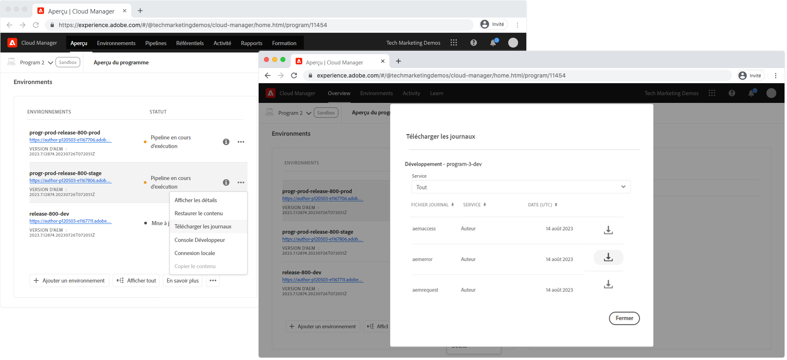

# Débogage de l’AEM en tant que Cloud Service à l’aide de journaux

Les journaux agissent en tant que première ligne pour le débogage des applications AEM en AEM en tant que Cloud Service, mais dépendent d&#39;une journalisation adéquate dans l&#39;application AEM déployée.

Toute l’activité de journal d’un service AEM d’environnement donné (Auteur, Publier/Publier le répartiteur) est consolidée dans un seul fichier journal, même si différents modules de ce service génèrent les instructions de journal.

Les ID de capsule sont fournis dans chaque instruction de journal et permettent le filtrage ou le classement des instructions de journal. Les ID de capsule sont au format suivant :

+ `cm-p<PROGRAM ID>-e<ENVIRONMENT ID>-aem-<author|publish>-<POD NAME>`
+ Exemple: `cm-p12345-e56789-aem-author-abcdefabde-98765`

## Fichiers journaux personnalisés

AEM en tant que Cloud Services ne prend pas en charge les fichiers journaux personnalisés, mais il prend en charge la journalisation personnalisée.

Pour que les journaux Java soient disponibles dans AEM en tant que Cloud Service (via [Cloud Manager](#cloud-manager) ou [CLI](#aio) Adobe I/O), les instructions de journal personnalisées doivent être écrites dans le `error.log`. Les journaux écrits dans des journaux nommés personnalisés, tels que `example.log`, ne seront pas accessibles depuis AEM en tant que Cloud Service.

## Journaux des services d’auteur et de publication AEM

Les services Auteur AEM et Publication fournissent AEM journaux du serveur d’exécution :

+ `aemerror` est le journal d’erreurs Java (situé  `/crx-quickstart/error.log` sur l’AEM SDK local quickstart). Voici les [niveaux de journalisation recommandés](#log-levels) pour les journaux personnalisés par type d&#39;environnement :
   + Développement: `DEBUG`
   + Évaluation: `WARN`
   + Production: `ERROR`
+ `aemaccess` liste les requêtes HTTP au service AEM avec plus de détails
+ `aemrequest` listes requêtes HTTP effectuées au service AEM et leur réponse HTTP correspondante

## Journaux du répartiteur de publication AEM

Seul le répartiteur de publication AEM fournit les journaux du serveur Web et du répartiteur Apache, car ces aspects n’existent que dans le niveau Publication AEM et non dans le niveau Auteur AEM.

+ `httpdaccess` liste les requêtes HTTP effectuées au serveur Web Apache/Répartiteur Apache du service AEM.
+ `httperror`  Les listes enregistrent les messages du serveur Web Apache et aident à déboguer les modules Apache pris en charge, tels que  `mod_rewrite`.
   + Développement: `DEBUG`
   + Évaluation: `WARN`
   + Production : `ERROR`
+ `aemdispatcher` Les listes consignent les messages des modules Répartiteur, y compris le filtrage et la diffusion à partir des messages du cache.
   + Développement: `DEBUG`
   + Évaluation: `WARN`
   + Production : `ERROR`

## Cloud Manager{#cloud-manager}

Adobe Cloud Manager permet de télécharger les journaux par jour, via une action Télécharger les journaux de l’environnement.



Ces journaux peuvent être téléchargés et inspectés à l&#39;aide de n&#39;importe quel outil d&#39;analyse des journaux.

## Adobe I/O CLI avec le module externe Cloud Manager{#aio}

Adobe Cloud Manager prend en charge l’accès à l’AEM en tant que journal Cloud Service via l’[interface de ligne de commande de l’Adobe I/O](https://github.com/adobe/aio-cli) avec le module [Cloud Manager pour l’Adobe I/O CLI](https://github.com/adobe/aio-cli-plugin-cloudmanager).

Tout d’abord, [configurez l’Adobe I/O avec le module externe Cloud Manager](../../local-development-environment/development-tools.md#aio-cli).

Assurez-vous que l’ID de Programme et l’ID d’Environnement appropriés ont été identifiés et utilisez [liste-available-log-options](https://github.com/adobe/aio-cli-plugin-cloudmanager#aio-cloudmanagerlist-available-log-options-environmentid) pour liste les options de journal utilisées pour [tail](#aio-cli-tail-logs) ou [télécharger](#aio-cli-download-logs) les journaux.

```
$ aio cloudmanager:list-programs
Program Id Name      Enabled 
14304      Program 1 true    
11454      Program 2 true 
11502      Program 3 true    

$ aio config:set cloudmanager_programid <PROGRAM ID>

$ aio cloudmanager:list-environments        
Environment Id Name            Type  Description 
22295          program-3-dev   dev               
22310          program-3-prod  prod              
22294          program-3-stage stage   

$ aio cloudmanager:list-available-log-options <ENVIRONMENT ID>
Environment Id Service    Name          
22295          author     aemaccess     
22295          author     aemerror      
22295          author     aemrequest    
22295          publish    aemaccess     
22295          publish    aemerror      
22295          publish    aemrequest    
22295          dispatcher httpdaccess   
22295          dispatcher httpderror    
22295          dispatcher aemdispatcher 
```

### Journaux de destination{#aio-cli-tail-logs}

L&#39;interface de ligne de commande d&#39;Adobe I/O permet d&#39;extraire les journaux en temps réel de l&#39;AEM en tant que Cloud Service à l&#39;aide de la commande [tail-logs](https://github.com/adobe/aio-cli-plugin-cloudmanager#aio-cloudmanagertail-log-environmentid-service-name). L’engrenage est utile pour surveiller l’activité du journal en temps réel lorsque des actions sont effectuées sur l’AEM en tant qu’environnement Cloud Service.

```
$ aio config:set cloudmanager_programid <PROGRAM ID>
$ aio cloudmanager:tail-logs <ENVIRONMENT ID> <SERVICE> <NAME>
```

D&#39;autres outils de ligne de commande, tels que `grep` peuvent être utilisés de concert avec `tail-logs` pour isoler les consignes d&#39;intérêt, par exemple :

```
$ aio cloudmanager:tail-logs 12345 author | grep com.example.MySlingModel
```

... affiche uniquement les instructions de journal générées à partir de `com.example.MySlingModel` ou contient cette chaîne.

### Téléchargement de journaux{#aio-cli-download-logs}

L’interface de ligne de commande Adobe I/O permet de télécharger les journaux de l’AEM en tant que Cloud Service à l’aide de la commande [download-logs](https://github.com/adobe/aio-cli-plugin-cloudmanager#aio-cloudmanagerdownload-logs-environmentid-service-name-days)). Cela produit le même résultat final que le téléchargement des journaux depuis l’interface utilisateur Web de Cloud Manager, la différence étant que la commande `download-logs` consolide les journaux sur plusieurs jours, en fonction du nombre de jours de journaux requis.

```
$ aio config:set cloudmanager_programid <PROGRAM ID>
$ aio cloudmanager:download-logs <ENVIRONMENT> <SERVICE> <NAME> <DAYS>
```

## Présentation des journaux

Les journaux d&#39;AEM en tant que Cloud Service comportent plusieurs capsules où sont écrites des instructions de journal. Comme plusieurs instances d’AEM écrivent dans le même fichier journal, il est important de comprendre comment analyser et réduire le bruit pendant le débogage. Pour plus d&#39;informations, le fragment de code de journal `aemerror` suivant sera utilisé :

```
01.01.2020 12:00:00.000 [cm-p12345-e56789-aem-author-abcdefg-1111] *DEBUG* [qtp2078364989-269] com.example.components.impl.ExampleModelImpl Preparing to collect resources
01.01.2020 12:00:01.002 [cm-p12345-e56789-aem-author-abcdefg-2222] *WARN*  [qtp40782847611-87] com.example.services.impl.ExampleServiceImpl Unable to resolve resource [ /content/example ] to a resource. Aborting.
01.01.2020 12:00:02.003 [cm-p12345-e56789-aem-author-abcdefg-1111] *ERROR* [qtp2078364989-269] com.example.components.impl.ExampleModelImpl Unable to collect any resources
```

A l’aide des ID de capsule, point de données après la date et l’heure, les journaux peuvent être rassemblés par Pod, ou instance AEM au sein du service, ce qui facilite le suivi et la compréhension de l’exécution du code.

__Pod cm-p12345-e56789-aem-author-abcdefg-1111__

```
01.01.2020 12:00:00.000 [cm-p12345-e56789-aem-author-abcdefg-1111] *DEBUG* [qtp2078364989-269] com.example.components.impl.ExampleModelImpl Preparing to collect resources
01.01.2020 12:00:02.003 [cm-p12345-e56789-aem-author-abcdefg-1111] *ERROR* [qtp2078364989-269] com.example.components.impl.ExampleModelImpl Unable to collect any resources
```

__Pod cm-p12345-e56789-aem-author-abcdefg-2222__

```
01.01.2020 12:00:01.002 [cm-p12345-e56789-aem-author-abcdefg-2222] *WARN*  [qtp2078364989-269] com.example.services.impl.ExampleServiceImpl Unable to resolve resource [ /content/example ] to a resource. Aborting.
```

## Niveaux de journal recommandés{#log-levels}

Les orientations générales de l&#39;Adobe sur les niveaux de journalisation par AEM en tant qu&#39;environnement Cloud Service sont les suivantes :

+ Développement local (AEM SDK) : `DEBUG`
+ Développement: `DEBUG`
+ Évaluation: `WARN`
+ Production : `ERROR`

La définition du niveau de journal le plus approprié pour chaque type d&#39;environnement est avec AEM comme Cloud Service, les niveaux de journal sont conservés dans le code.

+ Les configurations des journaux Java sont conservées dans les configurations OSGi.
+ Niveaux des journaux du serveur Web Apache et du répartiteur dans le projet de répartiteur

...Il faut donc un déploiement pour changer.

### Environnement de variables spécifiques pour définir les niveaux de journal Java

Une alternative à la définition de niveaux de journaux Java statiques bien connus pour chaque environnement consiste à utiliser AEM comme Cloud Service [variables spécifiques à l’environnement](https://docs.adobe.com/content/help/en/experience-manager-cloud-service/implementing/deploying/configuring-osgi.html#environment-specific-configuration-values) pour paramétrer les niveaux de journaux, ce qui permet de modifier dynamiquement les valeurs par le biais de l’interface de ligne de commande [Adobe I/O avec le module externe Cloud Manager](#aio-cli).

Pour ce faire, il est nécessaire de mettre à jour les configurations OSGi de journalisation afin d’utiliser les espaces réservés de variable spécifiques à l’environnement. [Les ](https://docs.adobe.com/content/help/en/experience-manager-cloud-service/implementing/deploying/configuring-osgi.html#default-values) valeurs par défaut des niveaux de journal doivent être définies conformément aux recommandations [ ](#log-levels)Adobes. Par exemple :

`/apps/example/config/org.apache.sling.commons.log.LogManager.factory.config-example.cfg.json`

```
{
    "org.apache.sling.commons.log.names": ["com.example"],
    "org.apache.sling.commons.log.level": "$[env:LOG_LEVEL;default=DEBUG]"
}
```

Cette approche présente des inconvénients qui doivent être pris en compte :

+ [Un nombre limité de variables d&#39;environnement est autorisé](https://docs.adobe.com/content/help/en/experience-manager-cloud-service/implementing/deploying/configuring-osgi.html#number-of-variables) et la création d&#39;une variable pour gérer le niveau de journal en utilise une.
+ Les variables d’Environnement ne peuvent être gérées par programmation que par le biais des API HTTP [Adobe I/O CLI](https://github.com/adobe/aio-cli-plugin-cloudmanager#aio-cloudmanagerset-environment-variables-environmentid) ou [Cloud Manager](https://docs.adobe.com/content/help/en/experience-manager-cloud-service/implementing/deploying/configuring-osgi.html#cloud-manager-api-format-for-setting-properties).
+ Les modifications apportées aux variables d’environnement doivent être réinitialisées manuellement par un outil pris en charge. L’oubli de réinitialiser un environnement de trafic élevé, tel que Production, à un niveau de journal moins détaillé peut inonder les journaux et affecter les performances AEM.

_Les variables spécifiques à l&#39;Environnement ne fonctionnent pas pour les configurations de serveur Web Apache ou de journal du répartiteur, car elles ne sont pas configurées via la configuration OSGi._