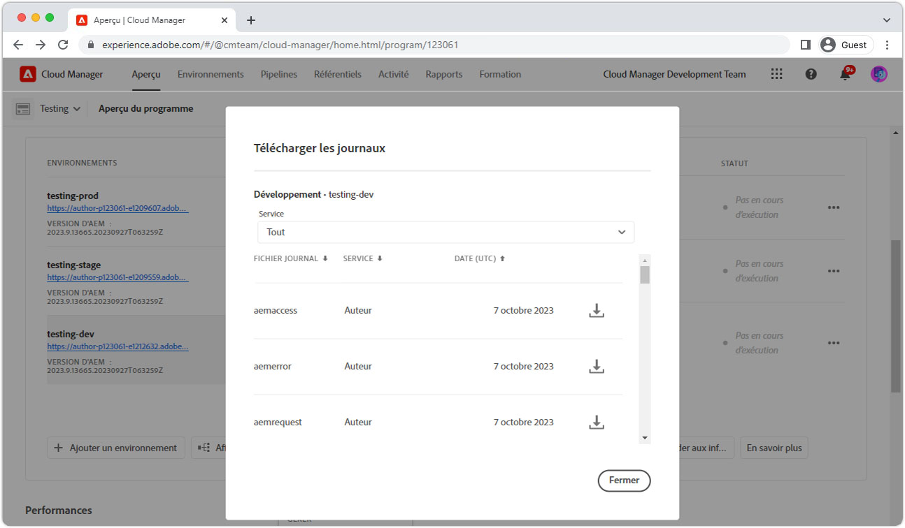
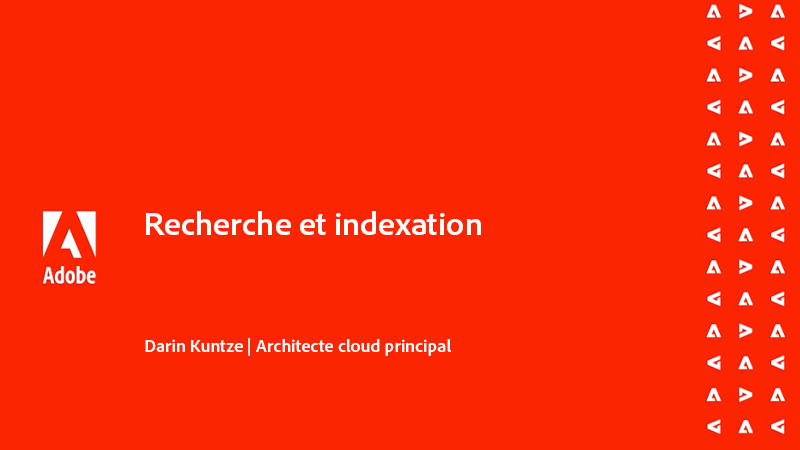

# Avertissements relatifs aux conversions

>[!TIP]
>Mettez cette page en signet à des fins de référence ultérieure.

_Que sont les avertissements transversaux ?_

Les avertissements de traversée sont __aemerror__ Instructions de journal indiquant que les requêtes peu performantes sont exécutées sur le service AEM Publish. Les avertissements de traversée se manifestent généralement de deux AEM :

1. __Requêtes lentes__ qui n’utilisent pas d’index, ce qui entraîne des temps de réponse lents.
1. __Requêtes en échec__, qui lance une `RuntimeNodeTraversalException`, ce qui entraîne une interruption de l’expérience.

Permettre que les avertissements traversaux soient décochés ralentit AEM performances et peut entraîner des expériences rompues pour vos utilisateurs.

## Comment résoudre les avertissements transversaux

L’atténuation des avertissements transversaux peut être abordée en trois étapes simples : analyser, ajuster et vérifier. Attendez-vous à plusieurs itérations d’ajustement et de vérification avant d’identifier les réglages optimaux.

<div class="columns is-multiline">

<!-- Analyze -->
<div class="column is-half-tablet is-half-desktop is-one-third-widescreen" aria-label="Analyze" tabindex="0">
   <div class="x-card">
       <div class="card-image">
           <figure class="image is-16by9">
               <a href="#analyze" title="Analyze" tabindex="-1">
                   
               </a>
           </figure>
       </div>
       <div class="card-content is-padded-small">
           <div class="content">
                <p class="headline is-size-5 has-text-weight-bold">Analyser le problème</p>
               <p class="is-size-6">Identifiez et comprenez les requêtes qui traversent.</p>
               <a href="#analyze" class="spectrum-Button spectrum-Button--outline spectrum-Button--primary spectrum-Button--sizeM">
                   <span class="spectrum-Button-label has-no-wrap has-text-weight-bold">Analyser</span>
               </a>
           </div>
       </div>
   </div>
</div>

<!-- Adjust -->
<div class="column is-half-tablet is-half-desktop is-one-third-widescreen" aria-label="Adjust" tabindex="0">
   <div class="x-card">
       <div class="card-image">
           <figure class="image is-16by9">
               <a href="#adjust" title="Régler" tabindex="-1">
                   
               </a>
           </figure>
       </div>
       <div class="card-content is-padded-small">
           <div class="content">
                <p class="headline is-size-5 has-text-weight-bold">Ajuster le code ou la configuration</p>
               <p class="is-size-6">Mettez à jour les requêtes et les index pour éviter les traversées de requête.</p>
               <a href="#adjust" class="spectrum-Button spectrum-Button--outline spectrum-Button--primary spectrum-Button--sizeM">
                   <span class="spectrum-Button-label has-no-wrap has-text-weight-bold">Régler</span>
               </a>
           </div>
       </div>
   </div>
</div>

<!-- Verify -->
<div class="column is-half-tablet is-half-desktop is-one-third-widescreen" aria-label="Verify" tabindex="0">
   <div class="x-card">
       <div class="card-image">
           <figure class="image is-16by9">
               <a href="#verify" title="Vérifier" tabindex="-1">
                   
               </a>
           </figure>
       </div>
       <div class="card-content is-padded-small">
           <div class="content">
                <p class="headline is-size-5 has-text-weight-bold">Vérifier les ajustements réalisés</p>                       
               <p class="is-size-6">Vérifiez que les modifications apportées aux requêtes et aux index suppriment les traversées.</p>
               <a href="#verify" class="spectrum-Button spectrum-Button--outline spectrum-Button--primary spectrum-Button--sizeM">
                   <span class="spectrum-Button-label has-no-wrap has-text-weight-bold">Vérifier</span>
               </a>
           </div>
       </div>
   </div>
</div>

</div>

## 1. Analyser{#analyze}

Tout d’abord, identifiez les services de publication AEM qui présentent des avertissements transversaux. Pour ce faire, à partir de Cloud Manager, [télécharger les services de publication `aemerror` logs](https://experienceleague.adobe.com/docs/experience-manager-learn/cloud-service/debugging/debugging-aem-as-a-cloud-service/logs.html#cloud-manager){target=&quot;_blank&quot;} de tous les environnements (développement, évaluation et production) pour le passé __trois jours__.



Ouvrez les fichiers journaux et recherchez la classe Java™ `org.apache.jackrabbit.oak.plugins.index.Cursors$TraversingCursor`. Le journal contenant des avertissements transversaux contient une série d’instructions qui ressemblent à :

```log
24.05.2022 14:18:46.146 [cm-p123-e456-aem-author-9876-edcba] *WARN* [192.150.10.214 [1653401908419] GET /content/wknd/us/en/example.html HTTP/1.1] 
org.apache.jackrabbit.oak.plugins.index.Cursors$TraversingCursor Traversed 5000 nodes with filter 
Filter(query=select [jcr:path], [jcr:score], * from [nt:base] as a where [xyz] = 'abc' and isdescendantnode(a, '/content') 
/* xpath: /jcr:root/content//element(*, nt:base)[(@xyz = 'abc')] */, path=/content//*, property=[xyz=[abc]]) 
called by apps.wknd.components.search.example__002e__jsp._jspService; 
consider creating an index or changing the query
```

Selon le contexte d’exécution de la requête, les instructions du journal peuvent contenir des informations utiles sur l’expéditeur de la requête :

+ URL de requête HTTP associée à l’exécution de la requête

   + Exemple : `GET /content/wknd/us/en/example.html HTTP/1.1`

+ Syntaxe de requête Oak

   + Exemple : `select [jcr:path], [jcr:score], * from [nt:base] as a where [xyz] = 'abc' and isdescendantnode(a, '/content')`

+ Requête XPath

   + Exemple : `/jcr:root/content//element(*, nt:base)[(@xyz = 'abc')] */, path=/content//*, property=[xyz=[abc]])`

+ Code exécutant la requête

   + Exemple:  `apps.wknd.components.search.example__002e__jsp._jspService` → `/apps/wknd/components/search/example.html`

__Requêtes en échec__ sont suivis d’un `RuntimeNodeTraversalException` , similaire à :

```log
24.05.2022 14:18:47.240 [cm-p123-e456-aem-author-9876-edcba] *WARN* [192.150.10.214 [1653401908419] GET /content/wknd/us/en/example.html HTTP/1.1] 
org.apache.jackrabbit.oak.query.FilterIterators The query read or traversed more than 100000 nodes.
org.apache.jackrabbit.oak.query.RuntimeNodeTraversalException: 
    The query read or traversed more than 100000 nodes. To avoid affecting other tasks, processing was stopped.
    ...
```

## 2. Réglez{#adjust}

Une fois que les requêtes incriminées et leur code d&#39;appel sont découverts, des ajustements doivent être apportés. Deux types d’ajustements peuvent être effectués pour atténuer les avertissements transversaux :

### Ajuster la requête

__Modifier la requête__ pour ajouter de nouvelles restrictions de requête qui résolvent les restrictions d’index existantes. Dans la mesure du possible, préférez modifier la requête plutôt que les index.

+ [Découvrez comment optimiser les performances des requêtes](https://experienceleague.adobe.com/docs/experience-manager-65/developing/bestpractices/troubleshooting-slow-queries.html#query-performance-tuning){target=&quot;_blank&quot;}

### Ajuster l&#39;index

__Modification (ou création) d’un index AEM__ de sorte que les restrictions de requête existantes puissent être résolues sur les mises à jour d’index.

+ [Découvrez comment optimiser les index existants](https://experienceleague.adobe.com/docs/experience-manager-65/developing/bestpractices/troubleshooting-slow-queries.html#query-performance-tuning){target=&quot;_blank&quot;}
+ [Découvrez comment créer des index](https://experienceleague.adobe.com/docs/experience-manager-65/developing/bestpractices/troubleshooting-slow-queries.html#create-a-new-index){target=&quot;_blank&quot;}

## 3. Vérifier{#verify}

Les ajustements apportés aux requêtes, aux index ou aux deux doivent être vérifiés pour s’assurer qu’ils atténuent les avertissements transversaux.


Si uniquement [réglages de la requête](#adjust-the-query) sont créées, la requête peut être directement testée sur AEM as a Cloud Service via le [Expliquer la requête](https://experienceleague.adobe.com/docs/experience-manager-learn/cloud-service/debugging/debugging-aem-as-a-cloud-service/developer-console.html#queries){target=&quot;_blank&quot;}. Expliquer que la requête s’exécute par rapport au service AEM Author. Toutefois, puisque les définitions d’index sont identiques dans les services Auteur et Publication, la validation des requêtes par rapport au service Auteur AEM est suffisante.

If [ajustements de l&#39;index](#adjust-the-index) est effectuée, l’index doit être déployé sur AEM as a Cloud Service. Une fois les ajustements d’index déployés, Developer Console [Expliquer la requête](https://experienceleague.adobe.com/docs/experience-manager-learn/cloud-service/debugging/debugging-aem-as-a-cloud-service/developer-console.html#queries){target=&quot;_blank&quot;} peut être utilisé pour exécuter et affiner davantage la requête.

En fin de compte, toutes les modifications (requête et code) sont validées dans Git et déployées vers AEM as a Cloud Service à l’aide de Cloud Manager. Une fois déployé, testez les chemins de code associés aux avertissements transversaux d’origine et vérifiez que les avertissements transversaux n’apparaissent plus dans la variable `aemerror` log.

## Autres ressources

Consultez ces autres ressources utiles pour comprendre AEM index, rechercher et parcourir les avertissements.

<div class="columns is-multiline">

<!-- Cloud 5 - Search &amp; Indexing -->
<div class="column is-half-tablet is-half-desktop is-one-third-widescreen" aria-label="Cloud 5 - Search &amp; Indexing" tabindex="0">
   <div class="card">
       <div class="card-image">
           <figure class="image is-16by9">
               <a href="https://experienceleague.adobe.com/docs/experience-manager-learn/cloud-service/cloud-5/cloud5-aem-search-and-indexing.html" title="Cloud 5 - Recherche et indexation" tabindex="-1"></a>
           </figure>
       </div>
       <div class="card-content is-padded-small">
           <div class="content">
               <p class="headline is-size-6 has-text-weight-bold"><a href="https://experienceleague.adobe.com/docs/experience-manager-learn/cloud-service/cloud-5/cloud5-aem-search-and-indexing.html" title="Cloud 5 - Recherche et indexation">Cloud 5 - Recherche et indexation</a></p>
               <p class="is-size-6">L’équipe de Cloud 5 explore les entrées et les sorties de la recherche et de l’indexation sur AEM as a Cloud Service.</p>
               <a href="https://experienceleague.adobe.com/docs/experience-manager-learn/cloud-service/cloud-5/cloud5-aem-search-and-indexing.html" class="spectrum-Button spectrum-Button--outline spectrum-Button--primary spectrum-Button--sizeM">
                   <span class="spectrum-Button-label has-no-wrap has-text-weight-bold">Mode</span>
               </a>
           </div>
       </div>
   </div>
</div>

<!-- Content Search and Indexing -->
<div class="column is-half-tablet is-half-desktop is-one-third-widescreen" aria-label="Content Search and Indexing
" tabindex="0">
   <div class="card">
       <div class="card-image">
           <figure class="image is-16by9">
               <a href="https://experienceleague.adobe.com/docs/experience-manager-cloud-service/content/operations/indexing.html?lang=fr" title="Recherche et indexation de contenu" tabindex="-1">
                   
               </a>
           </figure>
       </div>
       <div class="card-content is-padded-small">
           <div class="content">
               <p class="headline is-size-6 has-text-weight-bold"><a href="https://experienceleague.adobe.com/docs/experience-manager-cloud-service/content/operations/indexing.html" title="Recherche et indexation de contenu">Documentation sur la recherche et l’indexation de contenu</a></p>
               <p class="is-size-6">Découvrez comment créer et gérer des index dans AEM as a Cloud Service.</p>
               <a href="https://experienceleague.adobe.com/docs/experience-manager-cloud-service/content/operations/indexing.html" class="spectrum-Button spectrum-Button--outline spectrum-Button--primary spectrum-Button--sizeM">
                   <span class="spectrum-Button-label has-no-wrap has-text-weight-bold">Mode</span>
               </a>
           </div>
       </div>
   </div>
</div>

<!-- Modernizing your Oak indexes -->
<div class="column is-half-tablet is-half-desktop is-one-third-widescreen" aria-label="Modernizing your Oak indexes" tabindex="0">
   <div class="card">
       <div class="card-image">
           <figure class="image is-16by9">
               <a href="https://experienceleague.adobe.com/docs/experience-manager-learn/cloud-service/migration/moving-to-aem-as-a-cloud-service/search-and-indexing.html" title="Modernisation de vos index Oak" tabindex="-1">
                   
               </a>
           </figure>
       </div>
       <div class="card-content is-padded-small">
           <div class="content">
               <p class="headline is-size-6 has-text-weight-bold"><a href="https://experienceleague.adobe.com/docs/experience-manager-learn/cloud-service/migration/moving-to-aem-as-a-cloud-service/search-and-indexing.html" title="Modernisation de vos index Oak">Modernisation de vos index Oak</a></p>
               <p class="is-size-6">Découvrez comment convertir AEM 6 définitions d’index Oak pour qu’elles soient AEM compatibles as a Cloud Service et gérer les index à l’avenir.</p>
               <a href="https://experienceleague.adobe.com/docs/experience-manager-learn/cloud-service/migration/moving-to-aem-as-a-cloud-service/search-and-indexing.html" class="spectrum-Button spectrum-Button--outline spectrum-Button--primary spectrum-Button--sizeM">
                   <span class="spectrum-Button-label has-no-wrap has-text-weight-bold">Mode</span>
               </a>
           </div>
       </div>
   </div>
</div>

<!-- Index definition documentation -->
<div class="column is-half-tablet is-half-desktop is-one-third-widescreen" aria-label="Index definition documentation" tabindex="0">
   <div class="card">
       <div class="card-image">
           <figure class="image is-16by9">
               <a href="https://jackrabbit.apache.org/oak/docs/query/lucene.html" title="Documentation sur la définition d’index" tabindex="-1">
                   
               </a>
           </figure>
       </div>
       <div class="card-content is-padded-small">
           <div class="content">
               <p class="headline is-size-6 has-text-weight-bold"><a href="https://jackrabbit.apache.org/oak/docs/query/lucene.html" title="Documentation sur la définition d’index">Documentation de l’index Lucene</a></p>
               <p class="has-ellipsis is-size-6">La référence d’index Apache Oak Jackrabbit Lucene qui documente toutes les configurations d’index Lucene prises en charge.</p>
               <a href="https://jackrabbit.apache.org/oak/docs/query/lucene.html" class="spectrum-Button spectrum-Button--outline spectrum-Button--primary spectrum-Button--sizeM">
                   <span class="spectrum-Button-label has-no-wrap has-text-weight-bold">Mode</span>
               </a>
           </div>
       </div>
   </div>
</div>

</div>
