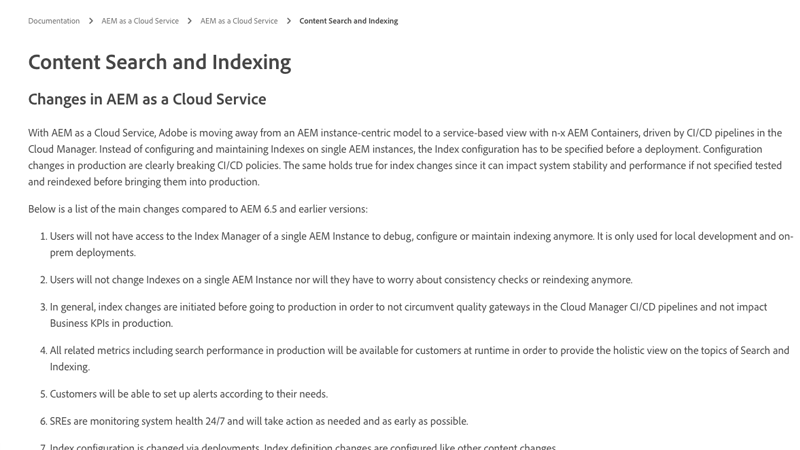

# Avertissements transversaux

>[!TIP]
>Mettez un signet sur cette page pour vous en servir ultérieurement.

_Que sont les avertissements transversaux ?_

Les avertissements transversaux sont des instructions de journal __aemerror__ indiquant que des requêtes peu performantes sont exécutées sur le service de publication AEM. Les avertissements transversaux se manifestent généralement de deux façons dans AEM :

1. Des __requêtes lentes__ qui n’utilisent pas d’index, ce qui entraîne des temps de réponse lents.
1. Des __requêtes en échec__ qui lance une `RuntimeNodeTraversalException`, ce qui entraîne une interruption de l’expérience.

La non vérification des avertissements transversaux ralentit les performances d’AEM et peut entraîner des interruptions d’expériences pour vos utilisateurs et utilisatrices.

## Comment résoudre les avertissements transversaux

Il est possible d’aborder la limitation des avertissements transversaux en trois étapes simples : analyser, ajuster et vérifier. Attendez-vous à plusieurs itérations d’ajustement et de vérification avant d’identifier les réglages optimaux.

<div class="columns is-multiline">

<!-- Analyze -->
<div class="column is-half-tablet is-half-desktop is-one-third-widescreen" aria-label="Analyze" tabindex="0">
   <div class="x-card">
       <div class="card-image">
           <figure class="image is-16by9">
               <a href="#analyze" title="Analyser" tabindex="-1">
                   
               </a>
           </figure>
       </div>
       <div class="card-content is-padded-small">
           <div class="content">
                <p class="headline is-size-5 has-text-weight-bold">Analyser le problème</p>
               <p class="is-size-6">Identifiez et comprenez les requêtes qui causent les avertissement transversaux.</p>
               <a href="#analyze" class="spectrum-Button spectrum-Button--outline spectrum-Button--primary spectrum-Button--sizeM">
<span class="spectrum-Button-label has-no-wrap has-text-weight-bold">Analyser</span>
</a>
           </div>
       </div>
   </div>
</div>

<!-- Adjust -->
<div class="column is-half-tablet is-half-desktop is-one-third-widescreen" aria-label="Adjust" tabindex="0">
   <div class="x-card">
       <div class="card-image">
           <figure class="image is-16by9">
               <a href="#adjust" title="Ajuster" tabindex="-1">
                   
               </a>
           </figure>
       </div>
       <div class="card-content is-padded-small">
           <div class="content">
                <p class="headline is-size-5 has-text-weight-bold">Ajuster le code ou la configuration</p>
               <p class="is-size-6">Mettez à jour les requêtes et les index pour éviter que les requêtes soient transversales.</p>
               <a href="#adjust" class="spectrum-Button spectrum-Button--outline spectrum-Button--primary spectrum-Button--sizeM">
<span class="spectrum-Button-label has-no-wrap has-text-weight-bold">Ajuster</span>
</a>
           </div>
       </div>
   </div>
</div>

<!-- Verify -->
<div class="column is-half-tablet is-half-desktop is-one-third-widescreen" aria-label="Verify" tabindex="0">
   <div class="x-card">
       <div class="card-image">
           <figure class="image is-16by9">
               <a href="#verify" title="Vérifier" tabindex="-1">
                   
               </a>
           </figure>
       </div>
       <div class="card-content is-padded-small">
           <div class="content">
                <p class="headline is-size-5 has-text-weight-bold">Vérifier que les ajustements fonctionnent</p>                       
               <p class="is-size-6">Vérifiez que les modifications apportées aux requêtes et aux index suppriment les avertissements transversaux.</p>
               <a href="#verify" class="spectrum-Button spectrum-Button--outline spectrum-Button--primary spectrum-Button--sizeM">
<span class="spectrum-Button-label has-no-wrap has-text-weight-bold">Vérifier</span>
</a>
           </div>
       </div>
   </div>
</div>

</div>

## 1. Analyser{#analyze}

Tout d’abord, identifiez les services de publication AEM qui présentent des avertissements transversaux. Pour ce faire, à partir de Cloud Manager, [téléchargez les journaux `aemerror` des services de publication](https://experienceleague.adobe.com/docs/experience-manager-learn/cloud-service/debugging/debugging-aem-as-a-cloud-service/logs.html?lang=fr#cloud-manager){target="_blank"} de tous les environnements (développement, évaluation et production) des __trois derniers jours__.


Ouvrez les fichiers journaux et recherchez la classe Java™ `org.apache.jackrabbit.oak.plugins.index.Cursors$TraversingCursor`. Le journal comprenant des avertissements transversaux contient une série d’instructions qui ressemblent à :

```log
24.05.2022 14:18:46.146 [cm-p123-e456-aem-author-9876-edcba] *WARN* [192.150.10.214 [1653401908419] GET /content/wknd/us/en/example.html HTTP/1.1] 
org.apache.jackrabbit.oak.plugins.index.Cursors$TraversingCursor Traversed 5000 nodes with filter 
Filter(query=select [jcr:path], [jcr:score], * from [nt:base] as a where [xyz] = 'abc' and isdescendantnode(a, '/content') 
/* xpath: /jcr:root/content//element(*, nt:base)[(@xyz = 'abc')] */, path=/content//*, property=[xyz=[abc]]) 
called by apps.wknd.components.search.example__002e__jsp._jspService; 
consider creating an index or changing the query
```

Selon le contexte d’exécution de la requête, les instructions du journal peuvent contenir des informations utiles sur l’expéditeur ou l’expéditrice de la requête :

+ URL de requête HTTP associée à l’exécution de la requête

   + Exemple : `GET /content/wknd/us/en/example.html HTTP/1.1`

+ Syntaxe de requête Oak

   + Exemple : `select [jcr:path], [jcr:score], * from [nt:base] as a where [xyz] = 'abc' and isdescendantnode(a, '/content')`

+ Requête XPath

   + Exemple : `/jcr:root/content//element(*, nt:base)[(@xyz = 'abc')] */, path=/content//*, property=[xyz=[abc]])`

+ Code exécutant la requête

   + Exemple : `apps.wknd.components.search.example__002e__jsp._jspService` → `/apps/wknd/components/search/example.html`

Les __requêtes en échec__ sont suivies d’une instruction `RuntimeNodeTraversalException` similaire à :

```log
24.05.2022 14:18:47.240 [cm-p123-e456-aem-author-9876-edcba] *WARN* [192.150.10.214 [1653401908419] GET /content/wknd/us/en/example.html HTTP/1.1] 
org.apache.jackrabbit.oak.query.FilterIterators The query read or traversed more than 100000 nodes.
org.apache.jackrabbit.oak.query.RuntimeNodeTraversalException: 
    The query read or traversed more than 100000 nodes. To avoid affecting other tasks, processing was stopped.
    ...
```

## 2. Ajuster{#adjust}

Une fois que les requêtes incriminées et leur code d’appel sont découverts, des ajustements doivent être effectués. Deux types d’ajustements peuvent être réalisés pour atténuer les avertissements transversaux :

### L’ajustement de la requête.

La __modification de la requête__ pour ajouter de nouvelles restrictions de requête qui résolvent les restrictions d’index existantes. Dans la mesure du possible, préférez modifier la requête plutôt que les index.

+ [Découvrir comment optimiser les performances des requêtes](https://experienceleague.adobe.com/docs/experience-manager-65/developing/bestpractices/troubleshooting-slow-queries.html?lang=fr#query-performance-tuning){target="_blank"}

### Ajuster l’index

__Modifier (ou créer) un index AEM__ de sorte que les restrictions de requête existantes puissent être résolues sur les mises à jour d’index.

+ [Découvrir comment optimiser les index existants](https://experienceleague.adobe.com/docs/experience-manager-65/developing/bestpractices/troubleshooting-slow-queries.html?lang=fr#query-performance-tuning){target="_blank"}
+ [Découvrir comment créer des index](https://experienceleague.adobe.com/docs/experience-manager-65/developing/bestpractices/troubleshooting-slow-queries.html?lang=fr#create-a-new-index){target="_blank"}

## 3. Vérifier{#verify}

Les ajustements effectués sur les requêtes, les index ou les deux doivent être vérifiés pour s’assurer qu’ils atténuent les avertissements transversaux.


Si seuls des [ajustements de la requête](#adjust-the-query) sont effectués, la requête peut être directement testée sur AEM as a Cloud Service via l’outil [Expliquer la requête](https://experienceleague.adobe.com/docs/experience-manager-learn/cloud-service/debugging/debugging-aem-as-a-cloud-service/developer-console.html?lang=fr#queries){target="_blank"} de la Developer Console. L’outil Expliquer la requête s’exécute par rapport au service de création AEM. Toutefois, puisque les définitions d’index sont identiques dans les services de création et de publication, la validation des requêtes par rapport au service de création AEM est suffisante.

Si des [ajustements de l’index](#adjust-the-index) sont effectués, l’index doit être déployé sur AEM as a Cloud Service. Une fois les ajustements d’index déployés, l’outil [Expliquer la requête](https://experienceleague.adobe.com/docs/experience-manager-learn/cloud-service/debugging/debugging-aem-as-a-cloud-service/developer-console.html?lang=fr#queries){target="_blank"} de la Developer Console peut être utilisé pour exécuter et affiner davantage la requête.

Finalement, toutes les modifications (requête et code) sont validées dans Git et déployées vers AEM as a Cloud Service à l’aide de Cloud Manager. Une fois le déploiement effectué, testez les chemins de code associés aux avertissements transversaux d’origine et vérifiez que les avertissements transversaux n’apparaissent plus dans le journal `aemerror`.

## Autres ressources

Consultez ces autres ressources utiles pour comprendre les index, la recherche et les avertissements transversaux d’AEM.

<div class="columns is-multiline">

<!-- Cloud 5 - Search &amp; Indexing -->
<div class="column is-half-tablet is-half-desktop is-one-third-widescreen" aria-label="Cloud 5 - Search &amp; Indexing" tabindex="0">
   <div class="card">
       <div class="card-image">
           <figure class="image is-16by9">
               <a href="https://experienceleague.adobe.com/docs/experience-manager-learn/cloud-service/expert-resources/cloud-5/cloud5-aem-search-and-indexing.html?lang=fr" title="Cloud 5 - Recherche et indexation" tabindex="-1"></a>
           </figure>
       </div>
       <div class="card-content is-padded-small">
           <div class="content">
               <p class="headline is-size-6 has-text-weight-bold"><a href="https://experienceleague.adobe.com/docs/experience-manager-learn/cloud-service/expert-resources/cloud-5/cloud5-aem-search-and-indexing.html?lang=fr" title="Cloud 5 - Recherche et indexation">Cloud 5 - Recherche et indexation</a></p>
               <p class="is-size-6">L’équipe de Cloud 5 explore les entrées et les sorties de la recherche et de l’indexation sur AEM as a Cloud Service.</p>
               <a href="https://experienceleague.adobe.com/docs/experience-manager-learn/cloud-service/expert-resources/cloud-5/cloud5-aem-search-and-indexing.html?lang=fr" class="spectrum-Button spectrum-Button--outline spectrum-Button--primary spectrum-Button--sizeM">
<span class="spectrum-Button-label has-no-wrap has-text-weight-bold">En savoir plus</span>
</a>
           </div>
       </div>
   </div>
</div>

<!-- Content Search and Indexing -->
<div class="column is-half-tablet is-half-desktop is-one-third-widescreen" aria-label="Content Search and Indexing
" tabindex="0">
   <div class="card">
       <div class="card-image">
           <figure class="image is-16by9">
               <a href="https://experienceleague.adobe.com/docs/experience-manager-cloud-service/content/operations/indexing.html?lang=fr" title="Recherche et indexation de contenu" tabindex="-1">
                   
               </a>
           </figure>
       </div>
       <div class="card-content is-padded-small">
           <div class="content">
               <p class="headline is-size-6 has-text-weight-bold"><a href="https://experienceleague.adobe.com/docs/experience-manager-cloud-service/content/operations/indexing.html?lang=fr" title="Recherche et indexation de contenu">Documentation sur la recherche et l’indexation de contenu</a></p>
               <p class="is-size-6">Découvrez comment créer et gérer des index dans AEM as a Cloud Service.</p>
               <a href="https://experienceleague.adobe.com/docs/experience-manager-cloud-service/content/operations/indexing.html?lang=fr" class="spectrum-Button spectrum-Button--outline spectrum-Button--primary spectrum-Button--sizeM">
<span class="spectrum-Button-label has-no-wrap has-text-weight-bold">En savoir plus</span>
</a>
           </div>
       </div>
   </div>
</div>

<!-- Modernizing your Oak indexes -->
<div class="column is-half-tablet is-half-desktop is-one-third-widescreen" aria-label="Modernizing your Oak indexes" tabindex="0">
   <div class="card">
       <div class="card-image">
           <figure class="image is-16by9">
               <a href="https://experienceleague.adobe.com/docs/experience-manager-learn/cloud-service/migration/moving-to-aem-as-a-cloud-service/search-and-indexing.html?lang=fr" title="Moderniser les index Oak" tabindex="-1">
                   
               </a>
           </figure>
       </div>
       <div class="card-content is-padded-small">
           <div class="content">
               <p class="headline is-size-6 has-text-weight-bold"><a href="https://experienceleague.adobe.com/docs/experience-manager-learn/cloud-service/migration/moving-to-aem-as-a-cloud-service/search-and-indexing.html?lang=fr" title="Moderniser les index Oak">Moderniser les index Oak</a></p>
               <p class="is-size-6">Découvrez comment convertir les définitions d’index AEM 6 Oak pour qu’elles soient compatibles avec AEM as a Cloud Service et qu’elles puissent gérer les index à l’avenir.</p>
               <a href="https://experienceleague.adobe.com/docs/experience-manager-learn/cloud-service/migration/moving-to-aem-as-a-cloud-service/search-and-indexing.html?lang=fr" class="spectrum-Button spectrum-Button--outline spectrum-Button--primary spectrum-Button--sizeM">
<span class="spectrum-Button-label has-no-wrap has-text-weight-bold">En savoir plus</span>
</a>
           </div>
       </div>
   </div>
</div>

<!-- Index definition documentation -->
<div class="column is-half-tablet is-half-desktop is-one-third-widescreen" aria-label="Index definition documentation" tabindex="0">
   <div class="card">
       <div class="card-image">
           <figure class="image is-16by9">
               <a href="https://jackrabbit.apache.org/oak/docs/query/lucene.html" title="Documentation sur la définition d’index" tabindex="-1">
                   
               </a>
           </figure>
       </div>
       <div class="card-content is-padded-small">
           <div class="content">
               <p class="headline is-size-6 has-text-weight-bold"><a href="https://jackrabbit.apache.org/oak/docs/query/lucene.html" title="Documentation sur la définition d’index">Documentation sur l’index Lucene</a></p>
               <p class="has-ellipsis is-size-6">Référence d’index Apache Oak Jackrabbit Lucene qui documente toutes les configurations d’index Lucene prises en charge.</p>
               <a href="https://jackrabbit.apache.org/oak/docs/query/lucene.html" class="spectrum-Button spectrum-Button--outline spectrum-Button--primary spectrum-Button--sizeM">
<span class="spectrum-Button-label has-no-wrap has-text-weight-bold">En savoir plus</span>
</a>
           </div>
       </div>
   </div>
</div>

</div>
