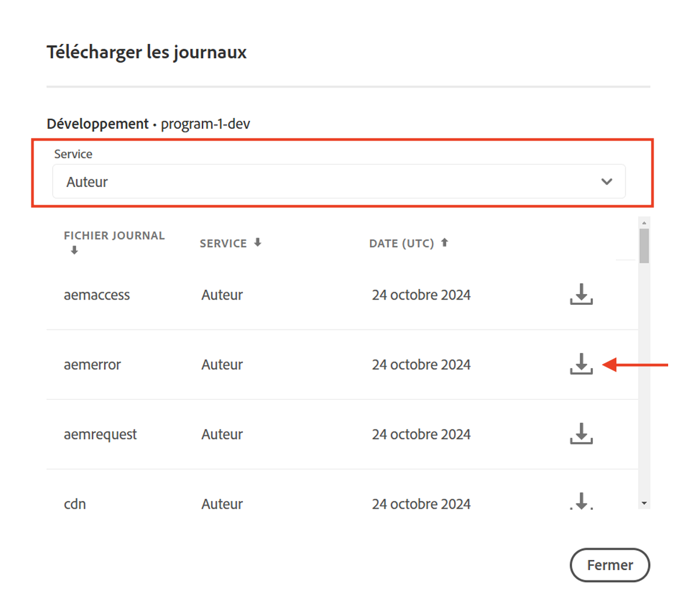

# Exécution d’une tâche sur l’instance principale dans AEM as a Cloud Service

Découvrez comment exécuter une tâche sur l’instance principale du service de création AEM dans le cadre d’AEM as a Cloud Service et la configurer pour qu’elle ne s’exécute qu’une seule fois.

Les tâches Sling sont des tâches asynchrones qui fonctionnent en arrière-plan, conçues pour gérer les événements déclenchés par le système ou les personnes qui les utilisent. Par défaut, ces tâches sont réparties uniformément entre toutes les instances (capsules) du cluster.

Pour plus d’informations, consultez la section [Gestion des tâches et des événements Apache Sling](https://sling.apache.org/documentation/bundles/apache-sling-eventing-and-job-handling.html).

## Création et traitement de tâches

À des fins de démonstration, créons une _tâche simple qui demande au processeur de tâche de consigner un message_.

### Création d’une tâche

Utilisez le code ci-dessous pour _créer_ une tâche Apache Sling :

```java
package com.adobe.aem.guides.wknd.core.sling.jobs.impl;

import java.util.HashMap;
import java.util.Map;

import org.apache.sling.event.jobs.JobManager;
import org.osgi.service.component.annotations.Activate;
import org.osgi.service.component.annotations.Component;
import org.osgi.service.component.annotations.Reference;
import org.slf4j.Logger;
import org.slf4j.LoggerFactory;

@Component(immediate = true)
public class SimpleJobCreaterImpl {

    private static final Logger log = LoggerFactory.getLogger(SimpleJobCreaterImpl.class);

    // Define the topic on which the job will be created
    protected static final String TOPIC = "wknd/simple/job/topic";

    // Inject a JobManager
    @Reference
    private JobManager jobManager;

    @Activate
    protected final void activate() throws Exception {
        log.info("SimpleJobCreater activated successfully");
        createJob();
        log.info("SimpleJobCreater created a job");
    }

    private void createJob() {
        // Create a job and add it on the above defined topic
        Map<String, Object> jobProperties = new HashMap<>();
        jobProperties.put("action", "log");
        jobProperties.put("message", "Job metadata is: Created in activate method");
        jobManager.addJob(TOPIC, jobProperties);
    }
}
```

Les points clés à noter dans le code ci-dessus sont les suivants :

- La payload de la tâche possède deux propriétés : `action` et `message`.
- En utilisant la méthode `addJob(...)` de [JobManager](https://javadoc.io/doc/com.adobe.aem/aem-sdk-api/latest/org/apache/sling/event/jobs/JobManager.html), la tâche est ajoutée à la rubrique `wknd/simple/job/topic`.

### Traitement d’une tâche

Utilisez le code ci-dessous pour _traiter_ la tâche Apache Sling ci-dessus :

```java
package com.adobe.aem.guides.wknd.core.sling.jobs.impl;

import org.apache.sling.event.jobs.Job;
import org.apache.sling.event.jobs.consumer.JobConsumer;
import org.osgi.service.component.annotations.Component;
import org.slf4j.Logger;
import org.slf4j.LoggerFactory;

@Component(service = JobConsumer.class, property = {
        JobConsumer.PROPERTY_TOPICS + "=" + SimpleJobCreaterImpl.TOPIC
}, immediate = true)
public class SimpleJobConsumerImpl implements JobConsumer {

    private static final Logger log = LoggerFactory.getLogger(SimpleJobConsumerImpl.class);

    @Override
    public JobResult process(Job job) {
        // Get the action and message properties
        String action = job.getProperty("action", String.class);
        String message = job.getProperty("message", String.class);

        // Log the message
        if ("log".equals(action)) {
            log.info("Processing WKND Job, and {}", message);
        }

        // Return a successful result
        return JobResult.OK;
    }

}
```

Les points clés à noter dans le code ci-dessus sont les suivants :

- La classe `SimpleJobConsumerImpl` met en œuvre l’interface `JobConsumer`.
- Il s’agit d’un service enregistré pour consommer les tâches de la rubrique `wknd/simple/job/topic`.
- La méthode `process(...)` traite la tâche en enregistrant la propriété `message` de la payload de la tâche.

### Traitement des tâches par défaut

Lorsque vous déployez le code ci-dessus dans un environnement AEM as a Cloud Service et que vous l’exécutez sur le service de création AEM, qui fonctionne comme un cluster avec plusieurs JVM de création AEM, la tâche s’exécute une fois sur chaque instance de création AEM (capsule), ce qui signifie que le nombre de tâches créées correspondra au nombre de capsules. Le nombre de capsules est toujours supérieur à un (pour les environnements non-RDE), mais fluctue en fonction de la gestion des ressources internes d’AEM as a Cloud Service.

La tâche est exécutée sur chaque instance de création AEM (capsule), car la `wknd/simple/job/topic` est associée à la file d’attente principale d’AEM, qui distribue les tâches à toutes les instances disponibles.

Cela devient souvent problématique lorsque la tâche est responsable de modifier un état, comme la création ou la mise à jour de ressources ou de services externes.

Si vous souhaitez que la tâche ne s’exécute qu’une seule fois sur le service de création AEM, ajoutez la [configuration de la file d’attente des tâches](#how-to-run-a-job-on-the-leader-instance) décrite ci-dessous.

Vous pouvez confirmer l’exécution en consultant les journaux du service de création AEM dans [Cloud Manager](https://experienceleague.adobe.com/fr/docs/experience-manager-learn/cloud-service/debugging/debugging-aem-as-a-cloud-service/logs#cloud-manager).




Vous devriez voir :

```
<DD.MM.YYYY HH:mm:ss.SSS> [cm-pxxxx-exxxx-aem-author-68775db964-nxxcx] *INFO* [sling-oak-observation-15] org.apache.sling.event.impl.jobs.queues.JobQueueImpl.<main queue> Starting job queue <main queue>
<DD.MM.YYYY HH:mm:ss.SSS> INFO [com.adobe.aem.guides.wknd.core.sling.jobs.impl.SimpleJobConsumerImpl] Processing WKND Job, and Job metadata is: Created in activate method

<DD.MM.YYYY HH:mm:ss.SSS> [cm-pxxxx-exxxx-aem-author-68775db964-r4zk7] *INFO* [sling-oak-observation-11] org.apache.sling.event.impl.jobs.queues.JobQueueImpl.<main queue> Starting job queue <main queue>
<DD.MM.YYYY HH:mm:ss.SSS> INFO [com.adobe.aem.guides.wknd.core.sling.jobs.impl.SimpleJobConsumerImpl] Processing WKND Job, and Job metadata is: Created in activate method
```

deux entrées de journal, une pour chaque instance de création AEM (`68775db964-nxxcx` et `68775db964-r4zk7`), indiquant que chaque instance (capsule) a bien traité la tâche.

## Exécution d’une tâche sur l’instance principale

Pour exécuter une tâche _une seule fois_ sur le service de création AEM, créez une nouvelle file d’attente des tâches Sling de type **Ordered** et associez votre rubrique de tâche (`wknd/simple/job/topic`) à cette file d’attente. Avec cette configuration, seule l’instance principale de création (capsule) AEM peut traiter la tâche.

Dans le module `ui.config` de votre projet AEM, créez un fichier de configuration OSGi (`org.apache.sling.event.jobs.QueueConfiguration~wknd.cfg.json`) et stockez-le dans le dossier `ui.config/src/main/content/jcr_root/apps/wknd/osgiconfig/config.author`.

```json
{
    "queue.name":"WKND Queue - ORDERED",
    "queue.topics":[
      "wknd/simple/job/topic"
    ],
    "queue.type":"ORDERED",
    "queue.retries":1,
    "queue.maxparallel":1.0
  }
```

Les points clés à noter dans la configuration ci-dessus sont les suivants :

- La rubrique de file d’attente est définie sur `wknd/simple/job/topic`.
- Le type de file d’attente est défini sur `ORDERED`.
- Le nombre maximal de tâches parallèles est défini sur `1`.

Une fois la configuration ci-dessus déployée, la tâche est traitée exclusivement par l’instance principale, garantissant qu’elle ne s’exécute qu’une seule fois sur l’ensemble du service de création AEM.

```
<DD.MM.YYYY HH:mm:ss.SSS> [cm-pxxxx-exxxx-aem-author-7475cf85df-qdbq5] *INFO* [FelixLogListener] Events.Service.org.apache.sling.event Service [QueueMBean for queue WKND Queue - ORDERED,7755, [org.apache.sling.event.jobs.jmx.StatisticsMBean]] ServiceEvent REGISTERED
<DD.MM.YYYY HH:mm:ss.SSS> INFO [com.adobe.aem.guides.wknd.core.sling.jobs.impl.SimpleJobConsumerImpl] Processing WKND Job, and Job metadata is: Created in activate method
<DD.MM.YYYY HH:mm:ss.SSS> [com.adobe.aem.guides.wknd.core.sling.jobs.impl.SimpleJobConsumerImpl] Processing WKND Job, and Job metadata is: Created in activate method
```
