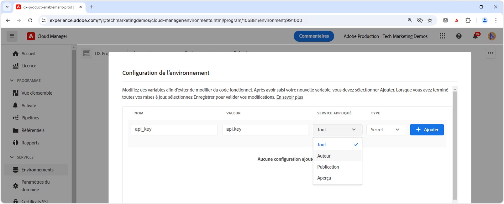

# Gestion des secrets dans AEM as a Cloud Service

La gestion des secrets, tels que les clés d’API et les mots de passe, est essentielle pour la maintenance de la sécurité des applications. Adobe Experience Manager (AEM) as a Cloud Service offre des outils robustes pour gérer les secrets en toute sécurité.

Dans ce tutoriel, vous allez découvrir les bonnes pratiques de gestion des secrets dans AEM. Nous couvrirons les outils et les techniques proposés par AEM pour protéger vos informations sensibles, en veillant à ce que votre application reste sécurisée et confidentielle.

Ce tutoriel suppose une connaissance pratique du développement AEM Java, des services OSGi, des modèles Sling et d’Adobe Cloud Manager.

## Service OSGi de gestionnaire de secrets

Dans AEM as a Cloud Service, la gestion des secrets par le biais des services OSGi offre une approche évolutive et sécurisée. Les services OSGi peuvent être configurés pour gérer des informations sensibles, telles que des clés d’API et des mots de passe, définis via des configurations OSGi et spécifiés via Cloud Manager.

### Mise en œuvre du service OSGi

Nous allons passer en revue le développement d’un service OSGi personnalisé qui [expose des secrets des configurations OSGi](https://experienceleague.adobe.com/fr/docs/experience-manager-cloud-service/content/implementing/deploying/configuring-osgi#secret-configuration-values).

L’implémentation lit les secrets de la configuration OSGi via la méthode `@Activate` et les expose via la méthode `getSecret(String secretName)`. Vous pouvez également créer des méthodes discrètes comme `getApiKey()` pour chaque secret, mais cette approche nécessite davantage de maintenance, car les secrets sont ajoutés ou supprimés.

```java
package com.example.core.util.impl;

import com.example.core.util.SecretsManager;
import org.osgi.service.component.annotations.*;
import org.slf4j.Logger;
import org.slf4j.LoggerFactory;
import org.apache.sling.api.resource.ValueMap;
import org.apache.sling.api.resource.ValueMapDecorator;
import java.util.Map;

@Component(
    service = { SecretsManager.class }
)
public class SecretsManagerImpl implements SecretsManager {
    private static final Logger log = LoggerFactory.getLogger(SecretsManagerImpl.class);
 
    private ValueMap secrets;

    @Override
    public String getSecret(String secretName) {
        return secrets.get(secretName, String.class);
    }

    @Activate
    @Modified
    protected void activate(Map<String, Object> properties) {
        secrets = new ValueMapDecorator(properties);
    }
}
```

En tant que service OSGi, il est préférable de l’enregistrer et de l’utiliser via une interface Java. Vous trouverez ci-dessous une interface simple qui permet aux consommateurs d’obtenir des secrets par nom de propriété OSGi.

```java
package com.example.core.util;

import org.osgi.annotation.versioning.ConsumerType;

@ConsumerType
public interface SecretsManager {
    String getSecret(String secretName);
}
```

## Mappage des secrets à la configuration OSGi

Pour exposer les valeurs secrètes dans le service OSGi, mappez-les aux configurations OSGi à l’aide des [valeurs de configuration secrètes OSGi](https://experienceleague.adobe.com/fr/docs/experience-manager-cloud-service/content/implementing/deploying/configuring-osgi#secret-configuration-values). Définissez le nom de la propriété OSGi comme clé pour récupérer la valeur secrète de la méthode `SecretsManager.getSecret()`.

Définissez les secrets dans le fichier de configuration OSGi `/apps/example/osgiconfig/config/com.example.core.util.impl.SecretsManagerImpl.cfg.json` de votre projet Maven AEM. Chaque propriété représente un secret exposé dans AEM, avec la valeur définie via Cloud Manager. La clé est le nom de propriété OSGi, utilisée pour récupérer la valeur secrète du service `SecretsManager`.

```json
{
    "api.key": "$[secret:api_key]",
    "service.password": "$[secret:service_password]"
}
```

Au lieu d’utiliser un service OSGi de gestionnaire de secrets partagé, vous pouvez inclure des secrets directement dans la configuration OSGi de services spécifiques qui les utilisent. Cette approche est utile lorsque les secrets ne sont requis que par un seul service OSGi et ne sont pas partagés entre plusieurs services. Dans ce cas, les valeurs secrètes sont définies dans le fichier de configuration OSGi pour le service spécifique et accessibles dans le code Java du service via la méthode `@Activate`.

## Consommation des secrets

Les secrets peuvent être consommés à partir du service OSGi de différentes manières, par exemple à partir d’un modèle Sling ou d’un autre service OSGi. Vous trouverez ci-dessous des exemples de consommation de secrets des deux.

### À partir du modèle Sling

Les modèles Sling fournissent souvent la logique métier pour les composants de site AEM. Le service OSGi `SecretsManager` peut être consommé via l’annotation `@OsgiService` et utilisé dans le modèle Sling pour récupérer la valeur secrète.

```java
import com.example.core.util.SecretsManager;
import org.apache.sling.api.resource.Resource;
import org.apache.sling.api.servlets.SlingHttpServletRequest;
import org.apache.sling.models.annotations.Model;
import org.apache.sling.models.annotations.OsgiService;

@Model(
    adaptables = {SlingHttpServletRequest.class, Resource.class},
    adapters = {ExampleDatabaseModel.class}
)
public class ExampleDatabaseModelImpl implements ExampleDatabaseModel {

    @OsgiService
    SecretsManager secretsManager;

    @Override 
    public String doWork() {
        final String secret = secretsManager.getSecret("api.key");
        // Do work with secret
    }
}
```

### À partir d’un service OSGi

Les services OSGi exposent souvent une logique métier réutilisable dans AEM, utilisée par les modèles Sling, les services AEM tels que les workflows ou d’autres services OSGi personnalisés. Le service OSGi `SecretsManager` peut être consommé via l’annotation `@Reference` et utilisé dans le service OSGi pour récupérer la valeur secrète.

```java
import com.example.core.util.SecretsManager;
import org.osgi.service.component.annotations.Component;
import org.osgi.service.component.annotations.Reference;

@Component
public class ExampleSecretConsumerImpl implements ExampleSecretConsumer {

    @Reference
    SecretsManager secretsManager;

    public void doWork() {
        final String secret = secretsManager.getSecret("service.password");
        // Do work with the secret
    }
}
```

## Définition des secrets dans Cloud Manager

Une fois le service OSGi et la configuration en place, la dernière étape consiste à définir les valeurs secrètes dans Cloud Manager.

Les valeurs pour les secrets peuvent être définies via l’[API Cloud Manager](https://developer.adobe.com/experience-cloud/cloud-manager/reference/api/#tag/Variables) ou, plus communément, via l’[interface d’utilisation de Cloud Manager](https://experienceleague.adobe.com/fr/docs/experience-manager-cloud-service/content/implementing/using-cloud-manager/environment-variables#overview). Pour appliquer une variable secrète via l’interface d’utilisation de Cloud Manager, procédez comme suit :



1. Connectez-vous à [Adobe Cloud Manager](https://my.cloudmanager.adobe.com).
1. Sélectionnez le programme et l’environnement AEM pour lesquels vous souhaitez définir le secret.
1. Dans la vue Détails de l’environnement, sélectionnez l’onglet **Configuration**.
1. Sélectionnez **Ajouter**.
1. Dans la boîte de dialogue Configuration de l’environnement, procédez comme suit :
   - Saisissez le nom de la variable secrète (par exemple, `api_key`) référencée dans la configuration OSGi.
   - Saisissez la valeur secrète.
   - Sélectionnez à quel service AEM le secret s’applique.
   - Sélectionnez **Secret** comme type.
1. Sélectionnez **Ajouter** pour conserver le secret.
1. Ajoutez autant de secrets que nécessaire. Une fois l’opération terminée, sélectionnez **Enregistrer** pour appliquer immédiatement les modifications à l’environnement AEM.

L’utilisation de configurations Cloud Manager pour les secrets permet d’appliquer différentes valeurs pour différents environnements ou services et d’effectuer une rotation des secrets sans redéployer l’application AEM.
