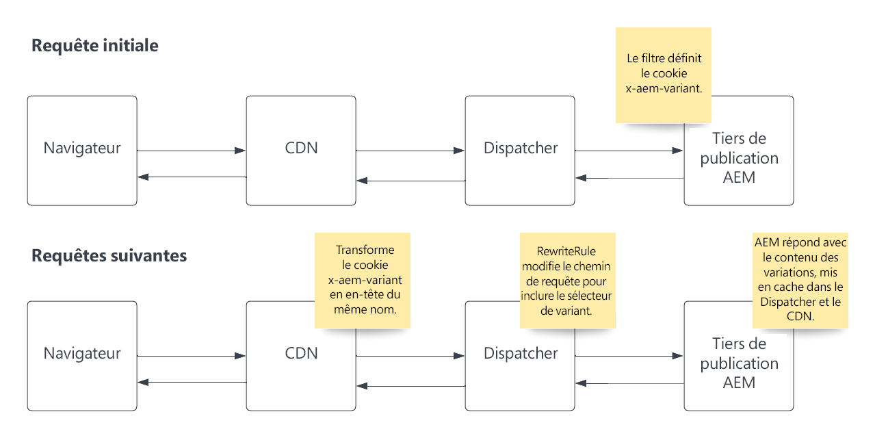

# Mettre en cache des variantes de page

Découvrez comment configurer et utiliser AEM as a Cloud Service pour prendre en charge la mise en cache des variantes de page.

## Exemples de cas d’utilisation

+ Tout fournisseur qui propose un ensemble différent d’offres de service et d’options de tarification correspondantes en fonction de la géolocalisation de l’utilisateur ou de l’utilisatrice, et du cache des pages avec du contenu dynamique, doit être géré sur le réseau CDN et Dispatcher.

+ Un client ou une cliente de vente au détail dispose de magasins dans tout le pays et chaque magasin dispose d’offres différentes en fonction de l’endroit où il se trouve, et le cache de pages avec du contenu dynamique doit être géré sur le réseau CDN et Dispatcher.

## Vue d’ensemble de la solution

+ Identifiez la clé de la variante et le nombre de valeurs qu’elle peut avoir. Dans notre exemple, nous varions selon les États des États-Unis, donc le nombre maximal est 50. C’est assez petit pour ne pas poser de problèmes avec les limites des variantes au niveau du réseau CDN. [Section Révision des limites des variantes](#variant-limitations).

+ Le code AEM doit définir le cookie __« x-aem-variant »__ sur l’État préféré du visiteur ou de la visiteuse (par exemple, `Set-Cookie: x-aem-variant=NY`) sur la réponse HTTP correspondante de la requête HTTP initiale.

+ Les requêtes suivantes du visiteur ou de la visiteuse envoient ce cookie (par exemple, `"Cookie: x-aem-variant=NY"`) et le cookie est transformé au niveau du réseau CDN en un en-tête prédéfini (c’est-à-dire `x-aem-variant:NY`) qui est transmis au Dispatcher.

+ Une règle de réécriture Apache modifie le chemin d’accès à la requête afin d’inclure la valeur d’en-tête dans l’URL de la page en tant que sélecteur Apache Sling (par exemple, `/page.variant=NY.html`). Cela permet à l’instance de publication AEM de diffuser un contenu différent en fonction du sélecteur et au Dispatcher de mettre en cache une page par variante.

+ La réponse envoyée par le Dispatcher AEM doit contenir un en-tête de réponse HTTP `Vary: x-aem-variant`. Cela indique au réseau CDN de stocker différentes copies de cache pour différentes valeurs d’en-tête.

>[!TIP]
>
>Chaque fois qu’un cookie est défini (par exemple, Set-Cookie: x-aem-variant=NY), la réponse ne doit pas être mise en cache (doit avoir Cache-Control: private ou Cache-Control: no-cache).

## Flux de requête HTTP



>[!NOTE]
>
>Le flux de requête HTTP initial ci-dessus doit avoir lieu avant toute demande de contenu utilisant des variantes.

## Utilisation

1. Pour démontrer la fonctionnalité, nous utiliserons l’implémentation de [WKND](https://experienceleague.adobe.com/docs/experience-manager-learn/getting-started-wknd-tutorial-develop/overview.html?lang=fr) comme exemple.

1. Implémentez un [SlingServletFilter](https://sling.apache.org/documentation/the-sling-engine/filters.html) dans AEM pour définir une cookie `x-aem-variant` sur la réponse HTTP, avec une valeur de variante.

1. Le réseau CDN d’AEM transforme automatiquement le cookie `x-aem-variant` en un en-tête HTTP du même nom.

1. Ajoutez la règle mod_rewrite du serveur web Apache à votre projet `dispatcher`, qui modifie le chemin d’accès à la requête pour inclure le sélecteur de variantes.

1. Déployez les règles de filtrage et de réécriture à l’aide de Cloud Manager.

1. Testez le flux global de requêtes.

## Exemples de code

+ Exemple de SlingServletFilter pour définir le cookie `x-aem-variant` avec une valeur dans AEM.

  ```
  package com.adobe.aem.guides.wknd.core.servlets.filters;
  
  import javax.servlet.*;
  import java.io.IOException;
  
  import org.apache.sling.api.SlingHttpServletRequest;
  import org.apache.sling.api.SlingHttpServletResponse;
  import org.apache.sling.servlets.annotations.SlingServletFilter;
  import org.apache.sling.servlets.annotations.SlingServletFilterScope;
  import org.osgi.service.component.annotations.Component;
  import org.slf4j.Logger;
  import org.slf4j.LoggerFactory;
  
  
  // Invoke filter on  HTTP GET /content/wknd.*.foo|bar.html|json requests.
  // This code and scope is for example purposes only, and will not interfere with other requests.
  @Component
  @SlingServletFilter(scope = {SlingServletFilterScope.REQUEST},
          resourceTypes = {"cq:Page"},
          pattern = "/content/wknd/.*",
          extensions = {"html", "json"},
          methods = {"GET"})
  public class PageVariantFilter implements Filter {
      private static final Logger log = LoggerFactory.getLogger(PageVariantFilter.class);
      private static final String VARIANT_COOKIE_NAME = "x-aem-variant";
  
      @Override
      public void init(FilterConfig filterConfig) throws ServletException { }
  
      @Override
      public void doFilter(ServletRequest servletRequest, ServletResponse servletResponse, FilterChain filterChain) throws IOException, ServletException {
          SlingHttpServletResponse slingResponse = (SlingHttpServletResponse) servletResponse;
          SlingHttpServletRequest slingRequest = (SlingHttpServletRequest) servletRequest;
  
          // Check is the variant was previously set
          final String existingVariant = slingRequest.getCookie(VARIANT_COOKIE_NAME).getValue();
  
          if (existingVariant == null) {
              // Variant has not been set, so set it now
              String newVariant = "NY"; // Hard coding as an example, but should be a calculated value
              slingResponse.setHeader("Set-Cookie", VARIANT_COOKIE_NAME + "=" + newVariant + "; Path=/; HttpOnly; Secure; SameSite=Strict");
              log.debug("x-aem-variant cookie is set with the value {}", newVariant);
          } else {
              log.debug("x-aem-variant previously set with value {}", existingVariant);
          }
  
          filterChain.doFilter(servletRequest, slingResponse);
      }
  
      @Override
      public void destroy() { }
  }
  ```

+ Exemple de règle de réécriture dans le fichier __dispatcher/src/conf.d/rewrite.rules__ qui est géré en tant que code source dans Git, et déployé à l’aide de Cloud Manager.

  ```
  ...
  
  RewriteCond %{REQUEST_URI} ^/us/.*  
  RewriteCond %{HTTP:x-aem-variant} ^.*$  
  RewriteRule ^([^?]+)\.(html.*)$ /content/wknd$1.variant=%{HTTP:x-aem-variant}.$2 [PT,L] 
  
  ...
  ```

## Limites des variantes

+ Le réseau CDN d’AEM peut gérer jusqu’à 200 variations. Cela signifie que l’en-tête `x-aem-variant` peut contenir jusqu’à 200 valeurs uniques. Pour plus d’informations, voir [Limites de configuration du réseau CDN](https://docs.fastly.com/en/guides/resource-limits).

+ Vous devez veiller à ce que la clé de variante choisie ne dépasse jamais ce nombre.  Par exemple, un identifiant d’utilisateur ou d’utilisatrice ne constitue pas une bonne clé, car il dépasserait facilement 200 valeurs pour la plupart des sites web, tandis que les États/territoires d’un pays sont mieux adaptés s’il y a moins de 200 États dans ce pays.

>[!NOTE]
>
>Lorsque les variantes dépassent 200, le réseau CDN répond avec la réponse « Trop de variantes » au lieu du contenu de la page.
