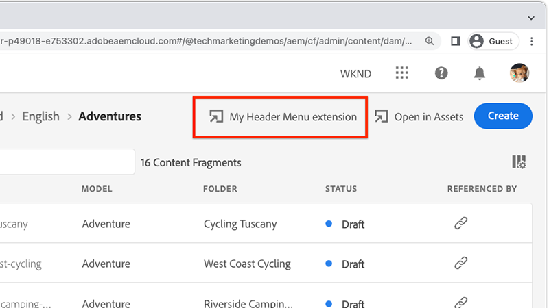
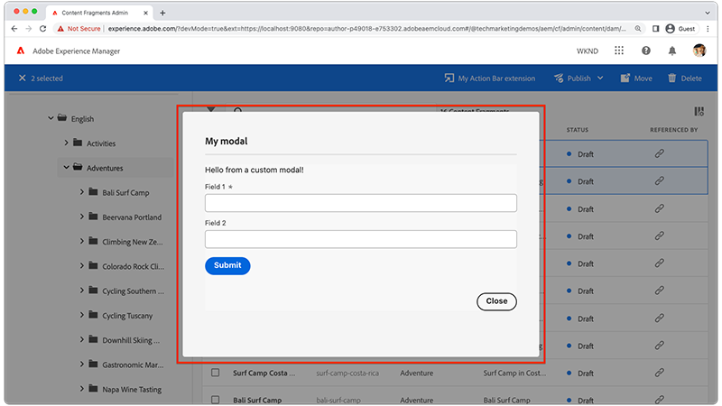

# Extension AEM Content Fragments Console

[AEM la console Fragments de contenu](https://experienceleague.adobe.com/docs/experience-manager-cloud-service/content/sites/administering/content-fragments/content-fragments-console.html?lang=fr) les extensions peuvent être ajoutées via deux points d’extension : un bouton dans la fonction [de la console de fragments de contenu](https://experienceleague.adobe.com/docs/experience-manager-cloud-service/content/sites/administering/content-fragments/content-fragments-console.html?lang=fr) menu d’en-tête ou barre d’actions. Les extensions sont écrites en JavaScript et s’exécutent en tant qu’applications App Builder. Elles peuvent également mettre en oeuvre une interface utilisateur web personnalisée et des actions Adobe I/O Runtime sans serveur afin d’effectuer des tâches plus intensives et de longue durée.

{align="center"}

| Type d’extension | Description | Paramètre(s) |
| :--- | :--- | :--- |
| Menu En-tête | Ajoute un bouton à l’en-tête qui s’affiche lorsque __zero__ Les fragments de contenu sont sélectionnés. | Aucun. |
| Barre d’actions | Ajoute un bouton à la barre d’actions qui s’affiche lorsque __un ou plusieurs__ Les fragments de contenu sont sélectionnés. | Tableau des chemins d’accès aux fragments de contenu sélectionnés. |

Une seule extension de la console de fragments de contenu AEM peut inclure zéro ou un menu d’en-tête et zéro ou un type d’extension de barre d’actions. Si plusieurs types d’extension du même type sont requis, plusieurs extensions de la console Fragments de contenu AEM doivent être créées.

AEM des extensions de la console de fragments de contenu, une [Projet de la console Adobe Developer](https://developer.adobe.com/uix/docs/services/aem-cf-console-admin/extension-development/#create-a-project-in-adobe-developer-console) et un [Application App Builder](https://developer.adobe.com/uix/docs/services/aem-cf-console-admin/code-generation) en utilisant la variable `@adobe/aem-cf-admin-ui-ext-tpl` modèle, associé au projet de console Adobe Developer.

Effectuez une sélection parmi les fonctionnalités suivantes lors de la génération de l’application App Builder, en fonction de ce que fait l’extension. Toutes les combinaisons d’options peuvent être utilisées dans une extension.

|  | Ajouter un bouton à [Menu En-tête](./header-menu.md) | Ajouter un bouton à [Barre d’actions](./action-bar.md) | Afficher [Modal](./modal.md) | Ajouter [gestionnaire côté serveur](./runtime-action.md) |
| ------------------------------------------ | :-----------------------: | :----------------------: | :--------: | :--------------------:  |
| Disponible lorsque les fragments de contenu ne sont pas sélectionnés | ✔ |  |  |  |
| Disponible lorsqu’un ou plusieurs fragments de contenu sont sélectionnés |  | ✔ |  |  |
| Collecte des entrées personnalisées de l’utilisateur |  |  | ✔️ |  |
| Affiche des commentaires personnalisés à l’intention de l’utilisateur |  |  | ✔️ |  |
| Appelle les requêtes HTTP vers AEM |  |  |  | ✔ |
| Appelle des requêtes HTTP vers des services tiers/Adobe |  |  |  | ✔ |

## Documentation Adobe Developer

Adobe Developer contient des informations détaillées sur les développeurs concernant AEM extensions de la console de fragments de contenu. Veuillez consulter la section [Contenu Adobe Developer pour plus de détails techniques](https://developer.adobe.com/uix/docs/).

## Développement d’une extension

Suivez les étapes décrites ci-dessous pour savoir comment générer, développer et déployer une extension AEM Content Fragment Console pour AEM as a Cloud Service.

    <!-- Create Adobe Developer Project -->
    

        

            

                <figure class="image is-16by9">
                    
                </figure>
            

            

                

                    
1. Création d’un projet

                    
Créez un projet de console Adobe Developer qui définit son accès aux autres services Adobe et gère ses déploiements.

                    <a href="./adobe-developer-console-project.md" class="spectrum-Button spectrum-Button--outline spectrum-Button--primary spectrum-Button--sizeM">
                        Création d’un projet Adobe Developer
                    </a>
                

            

        

    

    <!-- Generate an Extension app -->
    

        

            

                <figure class="image is-16by9">
                    
                </figure>
            

            

                

                    
2. Initialisation d’une application d’extension

                    
Initialisez une application du générateur d’applications de la console de fragments de contenu AEM qui définit l’emplacement d’affichage de l’extension et le travail qu’elle effectue.

                    <a href="./app-initialization.md" class="spectrum-Button spectrum-Button--outline spectrum-Button--primary spectrum-Button--sizeM">
                        Initialisation d’une application d’extension
                    </a>
                

            

        

    

    <!-- Extension registration -->
    

        

            

                <figure class="image is-16by9">
                    
                </figure>
            

            

                

                    
3. Enregistrement de l’extension

                    
Enregistrez l’extension dans la console de fragments de contenu AEM en tant que menu d’en-tête ou type d’extension de barre d’actions.

                    <a href="./extension-registration.md" class="spectrum-Button spectrum-Button--outline spectrum-Button--primary spectrum-Button--sizeM">
                        Enregistrement de l’extension
                    </a>
                

            

        

    

    <!-- Header Menu -->
    

        

            

                <figure class="image is-16by9">
                    
                </figure>
            

            

                

                    
4a. Menu d’en-tête

                    
Découvrez comment créer une extension de menu d’en-tête de la console de fragments de contenu AEM.

                    <a href="./header-menu.md" class="spectrum-Button spectrum-Button--outline spectrum-Button--primary spectrum-Button--sizeM">
                        Étendre le menu d’en-tête
                    </a>
                

            

        

    

    <!-- Action Bar -->
    

        

            

                <figure class="image is-16by9">
                    
                </figure>
            

            

                

                    
4b. Barre d’actions

                    
Découvrez comment créer une extension de barre d’actions de la console de fragments de contenu AEM.

                    <a href="./action-bar.md" class="spectrum-Button spectrum-Button--outline spectrum-Button--primary spectrum-Button--sizeM">
                        Étendre la barre d’actions
                    </a>
                

            

        

    

    <!-- Modal -->
    

        

            

                <figure class="image is-16by9">
                    
                </figure>
            

            

                

                    
5. Modal

                    
Ajoutez un modal personnalisé à l’extension qui peut être utilisé pour créer des expériences personnalisées pour les utilisateurs. Les modèles collectent souvent les entrées des utilisateurs et affichent les résultats d’une opération.

                    <a href="./modal.md" class="spectrum-Button spectrum-Button--outline spectrum-Button--primary spectrum-Button--sizeM">
                        Ajouter un modal
                    </a>
                

            

        

    

    <!-- Adobe I/O Runtime action -->
    

        

            

                <figure class="image is-16by9">
                    
                </figure>
            

            

                

                    
6. Action Adobe I/O Runtime

                    
Ajoutez une action Adobe I/O Runtime sans serveur que l’extension peut appeler pour interagir avec des fragments de contenu et AEM pour effectuer des opérations commerciales personnalisées.

                    <a href="./runtime-action.md" class="spectrum-Button spectrum-Button--outline spectrum-Button--primary spectrum-Button--sizeM">
                        Ajout d’une action Adobe I/O Runtime
                    </a>
                

            

        

    

    <!-- Test -->
    

        

            

                <figure class="image is-16by9">
                    
                </figure>
            

            

                

                    
7. Test

                    
Testez les extensions pendant le développement et partagez les extensions terminées avec les testeurs AQ ou UAT à l’aide d’une URL spéciale.

                    <a href="./test.md" class="spectrum-Button spectrum-Button--outline spectrum-Button--primary spectrum-Button--sizeM">
                        Tester l’extension
                    </a>
                

            

        

    

    <!-- Extension deployment -->
    

        

            

                <figure class="image is-16by9">
                    
                </figure>
            

            

                

                    
8. Déploiement en production

                    
Déployez l’extension pour l’Adobe I/O afin de la rendre disponible pour AEM utilisateurs. Les extensions peuvent également être mises à jour et supprimées.

                    <a href="./deploy.md" class="spectrum-Button spectrum-Button--outline spectrum-Button--primary spectrum-Button--sizeM">
                        Déploiement en production
                    </a>
                

            

        

    

## Exemples d’extensions

Exemple d’AEM d’extensions de la console de fragments de contenu.

    <!-- Bulk property update extension -->
    

        

            

                <figure class="image is-16by9">
                    
                </figure>
            

            

                

                    
Extension Bulk property update

                    
Explorez un exemple d’extension de barre d’actions qui met à jour en masse une propriété sur les fragments de contenu sélectionnés.

                    <a href="./example-extensions/bulk-property-update.md" class="spectrum-Button spectrum-Button--outline spectrum-Button--primary spectrum-Button--sizeM">
                        Explorer l’exemple d’extension
                    </a>
                

            

        

    

    <!-- Bulk property update extension -->
    

        

            

                <figure class="image is-16by9">
                    
                </figure>
            

            

                

                    
Génération d’images et chargement vers l’extension AEM

                    
Explorez un exemple d’extension de barre d’actions qui génère une image à l’aide d’OpenAI, la charge dans AEM et met à jour la propriété de l’image sur le fragment de contenu sélectionné.

                    <a href="./example-extensions/image-generation-and-image-upload.md" class="spectrum-Button spectrum-Button--outline spectrum-Button--primary spectrum-Button--sizeM">
                        Explorer l’exemple d’extension
                    </a>
                

            

        

    

