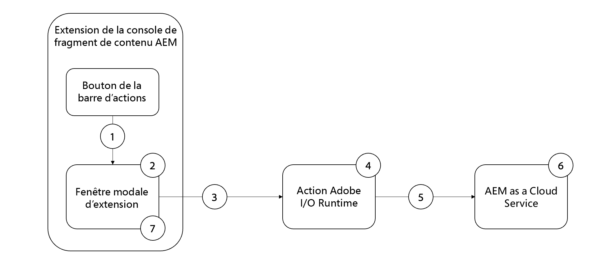

# Exemple de mise à jour en bloc de propriété

>[!VIDEO](https://video.tv.adobe.com/v/3412296?quality=12&learn=on)

Cet exemple d’extensions de la console de fragments de contenu d’AEM est une [barre d’actions](https://developer.adobe.com/uix/docs/services/aem-cf-console-admin/api/action-bar/) qui met à jour en bloc une propriété de fragments de contenu vers une valeur commune.

Le flux fonctionnel de l’exemple d’extension est le suivant :

{align="center"}.

1. Sélectionnez Fragments de contenu et cliquez sur le bouton de l’extension dans la [barre d’actions](#extension-registration) pour ouvrir la [boîte de dialogue modale](#modal).
2. La [boîte de dialogue modale](#modal) affiche un formulaire d’entrée personnalisé créé avec [React Spectrum](https://react-spectrum.adobe.com/react-spectrum/).
3. L’envoi du formulaire envoie la liste des fragments de contenu sélectionnés et l’hôte AEM à l’[action Adobe I/O Runtime personnalisée](#adobe-io-runtime-action).
4. L’[action Adobe I/O Runtime](#adobe-io-runtime-action) valide les entrées et envoie des requêtes de PUT HTTP à AEM pour mettre à jour les fragments de contenu sélectionnés.
5. Série de PUT HTTP pour chaque fragment de contenu afin de mettre à jour la propriété spécifiée.
6. AEM as a Cloud Service conserve les mises à jour de propriété dans le fragment de contenu et renvoie les réponses de succès ou d’échec à l’action Adobe IO Runtime.
7. La boîte de dialogue modale a reçu la réponse de l’action Adobe I/O Runtime et affiche la liste des mises à jour en bloc réussies.

## Point d’extension

Cet exemple s’étend jusqu’au point d’extension `actionBar` pour ajouter un bouton personnalisé à la console de fragments de contenu.

| Interface utilisateur AEM étendue | Point d’extension |
| ------------------------ | --------------------- | 
| [Console Fragments de contenu](https://developer.adobe.com/uix/docs/services/aem-cf-console-admin/) | [Barre d’actions](https://developer.adobe.com/uix/docs/services/aem-cf-console-admin/api/action-bar/) |


## Exemple d’extension

L’exemple utilise un projet Adobe Developer Console existant, ainsi que les options suivantes lors de l’initialisation de l’application Créateur d’applications via `aio app init`.

+ Quels modèles souhaitez-vous rechercher ? : `All Extension Points`
+ Sélectionnez le ou les modèles à installer :` @adobe/aem-cf-admin-ui-ext-tpl`
+ Comment souhaitez-vous nommer votre extension ? : `Bulk property update`
+ Veuillez fournir une brève description de votre extension : `An example action bar extension that bulk updates a single property one or more content fragments.`
+ Avec quelle version souhaitez-vous commencer ? : `0.0.1`
+ Que souhaitez-vous faire ensuite ?
   + `Add a custom button to Action Bar`
      + Veuillez indiquer le nom du libellé du bouton : `Bulk property update`
      + Devez-vous afficher une boîte de dialogue modale pour le bouton ? `y`
   + `Add server-side handler`
      + Adobe I/O Runtime vous permet d’appeler du code sans serveur à la demande. Comment souhaitez-vous nommer cette action ? : `generic`

L’application d’extension de créateur d’applications générée est mise à jour comme décrit ci-dessous.

### Itinéraires de l’application{#app-routes}

`src/aem-cf-console-admin-1/web-src/src/components/App.js` contient le [Routeur React](https://reactrouter.com/en/main).

Il existe deux ensembles logiques d’itinéraires :

1. Le premier itinéraire mappe les requêtes à `index.html`, qui appelle le composant React responsable de l’[enregistrement d’extension](#extension-registration).

   ```javascript
   <Route index element={<ExtensionRegistration />} />
   ```

1. Le deuxième ensemble d’itinéraires mappe les URL aux composants React qui rendent le contenu de la boîte de dialogue modale de l’extension. Le paramètre `:selection` représente un chemin d’accès au fragment de contenu de liste délimitée.

   Si l’extension comporte plusieurs boutons pour appeler des actions discrètes, chaque [enregistrement d’extension](#extension-registration) mappe vers un itinéraire défini ici.

   ```javascript
   <Route
       exact path="content-fragment/:selection/bulk-property-update"
       element={<BulkPropertyUpdateModal />}
       />
   ```

### Enregistrement d’une extension

`ExtensionRegistration.js`, mappé sur l’itinéraire `index.html`, est le point d’entrée de l’extension AEM et définit les éléments suivants :

1. L’emplacement du bouton d’extension apparaît dans l’expérience de création AEM (`actionBar` ou `headerMenu`).
1. Définition du bouton d’extension dans la fonction `getButton()`
1. Gestionnaire de clics du bouton, dans la fonction `onClick()`

+ `src/aem-cf-console-admin-1/web-src/src/components/ExtensionRegistration.js`

```javascript
function ExtensionRegistration() {
  const init = async () => {
    const guestConnection = await register({
      id: extensionId,
      methods: {
        // Configure your Action Bar button here
        actionBar: {
          getButton() {
            return {
              'id': 'bulk-property-update',     // Unique ID for the button
              'label': 'Bulk property update',  // Button label 
              'icon': 'Edit'                    // Button icon; get name from: https://spectrum.adobe.com/page/icons/ (Remove spaces, keep uppercase)
            }
          },

          // Click handler for the extension button
          onClick(selections) {
            // Collect the selected content fragment paths 
            const selectionIds = selections.map(selection => selection.id);

            // Create a URL that maps to the 
            const modalURL = "/index.html#" + generatePath(
              "/content-fragment/:selection/bulk-property-update",
              {
                // Set the :selection React route parameter to an encoded, delimited list of paths of the selected content fragments
                selection: encodeURIComponent(selectionIds.join('|'))
              }
            );

            // Open the route in the extension modal using the constructed URL
            guestConnection.host.modal.showUrl({
              title: "Bulk property update",
              url: modalURL
            })
          }
        },

      }
    })
  }
  init().catch(console.error)
```

### Boîte de dialogue modale

Chaque itinéraire de l’extension, tel que défini dans [`App.js`](#app-routes), mappe vers un composant React qui effectue le rendu dans la boîte de dialogue modale de l’extension.

Dans cet exemple d’application, il existe un composant React modal (`BulkPropertyUpdateModal.js`) qui comporte trois états :

1. Chargement, indiquant que l’utilisateur ou l’utilisatrice doit attendre.
1. Formulaire de mise à jour de propriété en bloc qui permet à l’utilisateur ou à l’utilisatrice de spécifier le nom et la valeur de la propriété à mettre à jour.
1. Réponse de l’opération de mise à jour des propriétés en bloc, répertoriant les fragments de contenu qui ont été mis à jour et ceux qui n’ont pas pu être mis à jour.

De plus, toute interaction avec AEM de l’extension doit être déléguée à une [action Adobe I/O Runtime du Créateur d’applications](https://developer.adobe.com/runtime/docs/guides/using/creating_actions/), qui est un processus distinct sans serveur s’exécutant dans [Adobe I/O Runtime](https://developer.adobe.com/runtime/docs/).
L’utilisation d’actions Adobe I/O Runtime pour communiquer avec AEM permet d’éviter des problèmes de connectivité du partage de ressources entre origines multiples (CORS).

Lorsque le formulaire de mise à jour des propriétés en bloc est envoyé, un `onSubmitHandler()` personnalisé appelle l’action Adobe I/O Runtime, en transmettant l’hôte AEM actuel (domaine) et le jeton d’accès AEM de l’utilisateur ou utilisatrice, qui à son tour appelle l’[API de fragment de contenu AEM](https://experienceleague.adobe.com/docs/experience-manager-65/assets/extending/assets-api-content-fragments.html?lang=fr) pour mettre à jour les fragments de contenu.

Lorsque la réponse de l’action Adobe I/O Runtime est reçue, la boîte de dialogue modale est mise à jour afin d’afficher les résultats de l’opération de mise à jour des propriétés.

+ `src/aem-cf-console-admin-1/web-src/src/components/BulkPropertyUpdateModal.js`

```javascript
import React, { useState, useEffect } from 'react'
import { attach } from "@adobe/uix-guest"
import {
  Flex,
  Form,
  Provider,
  Content,
  defaultTheme,
  ContextualHelp,
  Text,
  TextField,
  ButtonGroup,
  Button,
  Heading,
  ListView,
  Item,
} from '@adobe/react-spectrum'

import Spinner from "./Spinner"

import { useParams } from "react-router-dom"

import allActions from '../config.json'
import actionWebInvoke from '../utils'

import { extensionId } from "./Constants"

export default function BulkPropertyUpdateModal() {
  // Set up state used by the React component
  const [guestConnection, setGuestConnection] = useState()
  
  const [actionInvokeInProgress, setActionInvokeInProgress] = useState(false);
  const [actionResponse, setActionResponse] = useState();

  const [propertyName, setPropertyName] = useState(null);
  const [propertyValue, setPropertyValue] = useState(null);
  const [validationState, setValidationState] = useState({});

  // Get the selected content fragment paths from the route parameter `:selection`
  let { selection } = useParams();
  let fragmentIds = selection?.split('|') || [];
  
  console.log('Content Fragment Ids', fragmentIds);

  if (!fragmentIds || fragmentIds.length === 0) {
    console.error("Unable to locate a list of Content Fragments to update.")
    return;
  }

  // Asynchronously attach the extension to AEM, we must wait or the guestConnection to be set before doing anything in the modal
  useEffect(() => {
    (async () => {
      const guestConnection = await attach({ id: extensionId })
      setGuestConnection(guestConnection);
    })()
  }, [])


  // Determine view to display in the modal
  if (!guestConnection) {
    // If the guestConnection is not initialized, display a loading spinner
    return <Spinner />
  } else if (actionInvokeInProgress) {
    // If the bulk property action has been invoked but not completed, display a loading spinner
    return <Spinner />
  } else if (actionResponse) {
    // If the bulk property action has completed, display the response
    return renderResponse();
  } else {
    // Else display the bulk property update form
    return renderForm();
  }

  /**
   * Renders the Bulk Property Update form. 
   * This form has two fields:
   * - Property Name: The name of the Content Fragment property name to update
   * - Property Value: the value the Content Fragment property, specified by the Property Name, will be updated to
   * 
   * @returns the Bulk Property Update form
   */
  function renderForm() {
    return (
      // Use React Spectrum components to render the form
      <Provider theme={defaultTheme} colorScheme='light'>
        <Content width="100%">
          <Flex width="100%">
            <Form 
              width="100%">
              <TextField label="Property name"
                          isRequired={true}
                          validationState={validationState?.propertyName}
                onChange={setPropertyName}
                contextualHelp={
                  <ContextualHelp>
                    <Heading>Need help?</Heading>
                    <Content>
                      <Text>The <strong>Property name</strong> must be a valid for the Content Fragment model(s) the selected Content Fragments implement.</Text>
                    </Content>
                  </ContextualHelp>
                } />

              <TextField
                label="Property value"
                validationState={validationState?.propertyValue}
                onChange={setPropertyValue} />

              <ButtonGroup align="start" marginTop="size-200">
                <Button variant="cta" onPress={onSubmitHandler}>Update {fragmentIds.length} Content Fragments</Button>
              </ButtonGroup>
            </Form>
          </Flex>

          {/* Render the close button so the user can close the modal */}
          {renderCloseButton()}
        </Content>
      </Provider>
    )
  }
  /**
   * Display the response from the Adobe I/O Runtime action in the modal.
   * This includes:
   * - A list of content fragments that were updated successfully
   * - A list a content fragments that failed to update
   * 
   * @returns the response view
   */
  function renderResponse() {
    // Separate the successful and failed content fragments updates
    const successes = actionResponse.filter(item => item.status === 200);
    const failures = actionResponse.filter(item => item.status !== 200);

    return (
      <Provider theme={defaultTheme} colorScheme='light'>
        <Content width="100%">

          <Text>Bulk updated property <strong>{propertyName}</strong> with value <strong>{propertyValue}</strong></Text>

          {/* Render the list of content fragments that were updated successfully */}
          {successes.length > 0 &&
            <><Heading level="4">{successes.length} Content Fragments successfully updated</Heading>
              <ListView
                items={successes}
                selectionMode="none"
                aria-label="Successful updates"
              >
                {(item) => (
                  <Item key={item.fragmentId} textValue={item.fragmentId.split('/').pop()}>
                    {item.fragmentId.split('/').pop()}
                  </Item>
                )}
              </ListView></>}

          {/* Render the list of content fragments that failed to update */}
          {failures.length > 0 &&
            <><Heading level="4">{failures.length} Content Fragments failed to update</Heading><ListView
              items={failures}
              selectionMode="none"
              aria-label="Failed updates"
            >
              {(item) => (
                <Item key={item.fragmentId} textValue={item.fragmentId.split('/').pop()}>
                  {item.fragmentId.split('/').pop()}
                </Item>
              )}
            </ListView></>}

          {/* Render the close button so the user can close the modal */}
          {renderCloseButton()}
        </Content>
      </Provider>);
  }

  /**
   * Provide a close button for the modal, else it cannot be closed (without refreshing the browser window)
   * 
   * @returns a button that closes the modal.
   */
   function renderCloseButton() {
    return (
      <Flex width="100%" justifyContent="end" alignItems="center" marginTop="size-400">
        <ButtonGroup align="end">
          <Button variant="primary" onPress={() => guestConnection.host.modal.close()}>Close</Button>
        </ButtonGroup>
      </Flex>
    );
  }

  /**
   * Handle the Bulk Property Update form submission.
   * This function calls the supporting Adobe I/O Runtime action to update the selected Content Fragments, and then returns the response for display in the modal
   * When invoking the Adobe I/O Runtime action, the following parameters are passed as they're used by the action to connect to AEM:
   * - AEM Host to connect to
   * - AEM access token to connect to AEM with
   * - The list of Content Fragment paths to update
   * - The Content Fragment property name to update
   * - The value to update the Content Fragment property to
   * 
   * @returns a list of content fragment update successes and failures
   */
  async function onSubmitHandler() {
    // Validate the form input fields
    if (propertyName?.length > 1) {
      setValidationState({propertyName: 'valid', propertyValue: 'valid'});
    } else {
      setValidationState({propertyName: 'invalid', propertyValue: 'valid'});
      return;
    }

    // Mark the extension as invoking the action, so the loading spinner is displayed
    setActionInvokeInProgress(true);

    // Set the HTTP headers to access the Adobe I/O runtime action
    const headers = {
      'Authorization': 'Bearer ' + guestConnection.sharedContext.get('auth').imsToken,
      'x-gw-ims-org-id': guestConnection.sharedContext.get('auth').imsOrg
    };

    console.log('headers', headers);

    // Set the parameters to pass to the Adobe I/O Runtime action
    const params = {
      aemHost: `https://${guestConnection.sharedContext.get('aemHost')}`,

      fragmentIds: fragmentIds,
      propertyName: propertyName,
      propertyValue: propertyValue
    };

    // Invoke the Adobe I/O Runtime action named `generic`. This name defined in the `ext.config.yaml` file.
    const action = 'generic';

    try {
      // Invoke Adobe I/O Runtime action with the configured headers and parameters
      const actionResponse = await actionWebInvoke(allActions[action], headers, params);

      // Set the response from the Adobe I/O Runtime action
      setActionResponse(actionResponse);

      console.log(`Response from ${action}:`, actionResponse)
    } catch (e) {
      // Log and store any errors
      console.error(e)
    }

    // Set the action as no longer being invoked, so the loading spinner is hidden
    setActionInvokeInProgress(false);
  }
}
```


### Action Adobe I/O Runtime

Une application de créateur d’applications d’extension AEM peut définir ou utiliser 0 ou plusieurs actions Adobe I/O Runtime.
Les actions Adobe Runtime devraient être responsables du travail qui nécessite d’interagir avec AEM ou d’autres services web Adobe.

Dans cet exemple d’application, l’action Adobe I/O Runtime, qui utilise le nom par défaut `generic`, est responsable de ce qui suit :

1. Envoi d’une série de requêtes HTTP à l’API de fragment de contenu AEM pour mettre à jour les fragments de contenu.
1. Collection des réponses de ces requêtes HTTP, et leur regroupement en réussites et échecs
1. Renvoi de la liste des succès et des échecs pour affichage par la boîte de dialogue modale (`BulkPropertyUpdateModal.js`)

+ `src/aem-cf-console-admin-1/actions/generic/index.js`


```javascript
const fetch = require('node-fetch')
const { Core } = require('@adobe/aio-sdk')
const { errorResponse, getBearerToken, stringParameters, checkMissingRequestInputs } = require('../utils')

// main function that will be executed by Adobe I/O Runtime
async function main (params) {
  // create a Logger
  const logger = Core.Logger('main', { level: params.LOG_LEVEL || 'info' })

  try {
    // 'info' is the default level if not set
    logger.info('Calling the main action')

    // log parameters, only if params.LOG_LEVEL === 'debug'
    logger.debug(stringParameters(params))

    // check for missing request input parameters and headers
    const requiredParams = [ 'aemHost', 'fragmentIds', 'propertyName', 'propertyValue' ]
    const requiredHeaders = ['Authorization']
    const errorMessage = checkMissingRequestInputs(params, requiredParams, requiredHeaders)
    if (errorMessage) {
      // return and log client errors
      return errorResponse(400, errorMessage, logger)
    }
      
    const body = {
      "properties": {
        "elements": {
          [params.propertyName]: {
            "value": params.propertyValue
          }
        }
      }
    };

    // Extract the user Bearer token from the Authorization header used to authenticate the request to AEM
    const accessToken = getBearerToken(params);

    let results = await Promise.all(params.fragmentIds.map(async (fragmentId) => {

      logger.info(`Updating fragment ${fragmentId} with property ${params.propertyName} and value ${params.propertyValue}`);

      const res = await fetch(`${params.aemHost}${fragmentId.replace('/content/dam/', '/api/assets/')}.json`, { 
        method: 'put',
        body: JSON.stringify(body),
        headers: {
          'Authorization': `Bearer ${accessToken}`,
          'Content-Type': 'application/json'
        }
      });

      if (res.ok) {
        logger.info(`Successfully updated ${fragmentId}`);
        return { fragmentId, status: res.status, statusText: res.statusText, body: await res.json() };
      } else {
        logger.info(`Failed to update ${fragmentId}`);
        return { fragmentId, status: res.status, statusText: res.statusText, body: await res.text() };
      }
    }));

    const response = {
      statusCode: 200,
      body: results
    };

    logger.info('Adobe I/O Runtime action response', response);

    // Return the response to the A
     return response;

  } catch (error) {
    // log any server errors
    logger.error(error)
    // return with 500
    return errorResponse(500, 'server error', logger)
  }
}

exports.main = main
```
