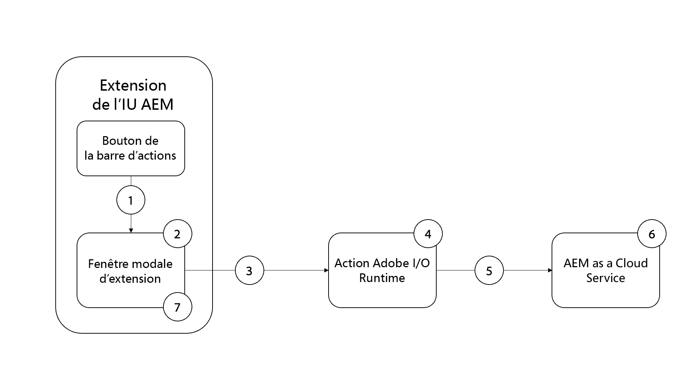

# Génération des ressources d’image AEM à l’aide d’OpenAI

Découvrez comment générer une image à l’aide d’OpenAI ou de DALL.E 2 et la charger dans AEM DAM pour la vitesse du contenu.

>[!VIDEO](https://video.tv.adobe.com/v/3413093?quality=12&learn=on)

Cet exemple d’extension de console de fragments de contenu AEM est une extension de [barre d’actions](https://developer.adobe.com/uix/docs/services/aem-cf-console-admin/api/action-bar/) qui génère une image numérique à partir d’une entrée de langage naturel utilisant l’[API OpenAI](https://openai.com/api/) ou [DALL.E 2](https://openai.com/dall-e-2/). L’image générée est chargée dans AEM DAM et la propriété d’image du fragment de contenu sélectionné est mise à jour pour faire référence à cette image nouvellement générée et chargée à partir de DAM.

Dans cet exemple, vous apprenez à :

1. Générer des images à l’aide de l’[API OpenAI](https://beta.openai.com/docs/guides/images/image-generation-beta) ou [DALL.E 2](https://openai.com/dall-e-2/)
2. Charger des images dans AEM
3. Mettre à jour la propriété de fragment de contenu

Le flux fonctionnel de l’exemple d’extension est le suivant :

{align="center"}

1. Sélectionnez Fragment de contenu et cliquez sur le bouton `Generate Image` de l&#39;extension dans la [barre d’actions](#extension-registration) pour ouvrir la [boîte de dialogue modale](#modal).
1. La [boîte de dialogue modale](#modal) affiche un formulaire d’entrée personnalisé créé avec [React Spectrum](https://react-spectrum.adobe.com/react-spectrum/).
1. L’envoi du formulaire envoie le texte `Image Description` fourni par l’utilisateur ou utilisatrice, le fragment de contenu sélectionné et l’hôte AEM à la fonction [action Adobe I/O Runtime personnalisée](#adobe-io-runtime-action).
1. L’[action Adobe I/O Runtime](#adobe-io-runtime-action) valide les entrées.
1. Ensuite, elle appelle l’API [Image generation](https://beta.openai.com/docs/guides/images/image-generation-beta) d’OpenAI et utilise le texte `Image Description` pour spécifier l’image à générer.
1. Le point d’entrée de [génération d’images](https://beta.openai.com/docs/guides/images/image-generation-beta) crée une image d’origine de taille _1024 x 1024_ pixels utilisant la valeur du paramètre de demande d’invite et renvoie l’URL de l’image générée en tant que réponse.
1. L’[action Adobe I/O Runtime](#adobe-io-runtime-action) télécharge l’image générée sur le runtime du créateur d’applications.
1. Elle lance ensuite le chargement de l’image à partir du runtime du créateur d’applications vers AEM DAM sous un chemin prédéfini.
1. AEM as a Cloud Service enregistre l’image dans la gestion des ressources numériques et renvoie les réponses de succès ou d’échec à l’action Adobe I/O Runtime. La réponse de chargement réussie met à jour la valeur de propriété d’image du fragment de contenu sélectionné à l’aide d’une autre requête HTTP à AEM à partir de l’action Adobe I/O Runtime.
1. La boîte de dialogue modale reçoit la réponse de l’action Adobe I/O Runtime et fournit le lien des détails de la ressource AEM de l’image nouvellement générée et chargée.

## Point d’extension

Cet exemple s’étend jusqu’au point d’extension `actionBar` pour ajouter un bouton personnalisé à la console de fragments de contenu.

| Interface utilisateur AEM étendue | Point d’extension |
| ------------------------ | --------------------- | 
| [Console Fragments de contenu](https://developer.adobe.com/uix/docs/services/aem-cf-console-admin/) | [Barre d’actions](https://developer.adobe.com/uix/docs/services/aem-cf-console-admin/api/action-bar/) |

## Exemple d’extension

L’exemple utilise un projet Adobe Developer Console existant, ainsi que les options suivantes lors de l’initialisation de l’application de créateur d’applications via `aio app init`.

+ Quels modèles voulez-vous rechercher ? : `All Extension Points`
+ Sélectionnez le ou les modèles à installer :` @adobe/aem-cf-admin-ui-ext-tpl`
+ Comment souhaitez-vous nommer votre extension ? : `Image generation`
+ Fournir une brève description de votre extension : `An example action bar extension that generates an image using OpenAI and uploads it to AEM DAM.`
+ Avec quelle version souhaitez-vous commencer ? : `0.0.1`
+ Que souhaitez-vous faire ensuite ?
   + `Add a custom button to Action Bar`
      + Indiquer le nom du libellé du bouton : `Generate Image`
      + Devez-vous afficher une boîte de dialogue modale pour le bouton ? `y`
   + `Add server-side handler`
      + Adobe I/O Runtime vous permet d’appeler du code sans serveur à la demande. Comment souhaitez-vous nommer cette action ? : `generate-image`

L’application d’extension de créateur d’applications générée est mise à jour comme décrit ci-dessous.

### Configuration initiale

1. Créez gratuitement un compte [API OpenAI](https://openai.com/api/) et créez une [clé API](https://beta.openai.com/account/api-keys).
1. Ajoutez cette clé au fichier `.env` du projet de créateur d’applications.

   ```
       # Specify your secrets here
       # This file must not be committed to source control
       ## Adobe I/O Runtime credentials
       ...
       AIO_runtime_apihost=https://adobeioruntime.net
       ...
       # OpenAI secret API key
       OPENAI_API_KEY=my-openai-secrete-key-to-generate-images
       ...
   ```

1. Passez `OPENAI_API_KEY` en tant que paramètre de l’action Adobe I/O Runtime, mettez à jour `src/aem-cf-console-admin-1/ext.config.yaml`

   ```yaml
       ...
   
       runtimeManifest:
         packages:
           aem-cf-console-admin-1:
             license: Apache-2.0
             actions:
               generate-image:
                 function: actions/generate-image/index.js
                 web: 'yes'
                 runtime: nodejs:16
                 inputs:
                   LOG_LEVEL: debug
                   OPENAI_API_KEY: $OPENAI_API_KEY
       ...
   ```

1. Procédez à l’installation sous les bibliothèques Node.js.
   1. [Bibliothèque OpenAI Node.js](https://github.com/openai/openai-node#installation) : pour appeler facilement l’API OpenAI
   1. [Chargement AEM](https://github.com/adobe/aem-upload#install) : pour charger des images vers les instances AEM-CS.


>[!TIP]
>
>Dans les sections suivantes, vous découvrirez les fichiers JavaScript d’action React et Adobe I/O Runtime clés. À titre de référence, les fichiers clés du dossier `web-src` et `actions` du projet de créateur d’applications sont fournis, voir [adobe-appbuilder-cfc-ext-image-generate-code.zip](./assets/digital-image-generation/adobe-appbuilder-cfc-ext-image-generation-code.zip).


### Itinéraires de l’application{#app-routes}

`src/aem-cf-console-admin-1/web-src/src/components/App.js` contient le [Routeur React](https://reactrouter.com/en/main).

Il existe deux ensembles logiques d’itinéraires :

1. Le premier itinéraire mappe les requêtes à `index.html`, qui appelle le composant React responsable de l’[enregistrement d’extension](#extension-registration).

   ```javascript
   <Route index element={<ExtensionRegistration />} />
   ```

1. Le deuxième ensemble d’itinéraires mappe les URL aux composants React qui rendent le contenu de la boîte de dialogue modale de l’extension. Le paramètre `:selection` représente un chemin d’accès au fragment de contenu de liste délimitée.

   Si l’extension comporte plusieurs boutons pour appeler des actions discrètes, chaque [enregistrement d’extension](#extension-registration) mappe vers un itinéraire défini ici.

   ```javascript
   <Route
       exact path="content-fragment/:selection/generate-image-modal"
       element={<GenerateImageModal />}
       />
   ```

### Enregistrement d’une extension

`ExtensionRegistration.js`, mappé sur l’itinéraire `index.html`, est le point d’entrée de l’extension AEM et définit les éléments suivants :

1. L’emplacement du bouton d’extension apparaît dans l’expérience de création AEM (`actionBar` ou `headerMenu`).
1. Définition du bouton d’extension dans la fonction `getButton()`
1. Gestionnaire de clics du bouton, dans la fonction `onClick()`

+ `src/aem-cf-console-admin-1/web-src/src/components/ExtensionRegistration.js`

```javascript
function ExtensionRegistration() {
  const init = async () => {
    const guestConnection = await register({
      id: extensionId,
      methods: {
        // Configure your Action Bar button here
        actionBar: {
          getButton() {
            return {
              'id': 'generate-image',     // Unique ID for the button
              'label': 'Generate Image',  // Button label 
              'icon': 'PublishCheck'      // Button icon; get name from: https://spectrum.adobe.com/page/icons/ (Remove spaces, keep uppercase)
            }
          },

          // Click handler for the extension button
          onClick(selections) {
            // Collect the selected content fragment paths 
            const selectionIds = selections.map(selection => selection.id);

            // Create a URL that maps to the 
            const modalURL = "/index.html#" + generatePath(
              "/content-fragment/:selection/generate-image-modal",
              {
                // Set the :selection React route parameter to an encoded, delimited list of paths of the selected content fragments
                selection: encodeURIComponent(selectionIds.join('|')),
              }
            );

            // Open the route in the extension modal using the constructed URL
            guestConnection.host.modal.showUrl({
              title: "Generate Image",
              url: modalURL
            })
          }
        },

      }
    })
  }
  init().catch(console.error)
```

### Boîte de dialogue modale

Chaque itinéraire de l’extension, tel que défini dans [`App.js`](#app-routes), mappe vers un composant React qui effectue le rendu dans la boîte de dialogue modale de l’extension.

Dans cet exemple d’application, il existe un composant React modal (`GenerateImageModal.js`) qui comporte quatre états :

1. Chargement, indiquant que l’utilisateur ou l’utilisatrice doit attendre.
1. Le message d’avertissement qui suggère aux utilisateurs et utilisatrices de sélectionner un seul fragment de contenu à la fois
1. Le formulaire Générer l’image qui permet à l’utilisateur ou l’utilisatrice de fournir une description d’image dans la langue naturelle.
1. La réponse de l’opération de génération d’image, fournissant le lien de détails de la ressource AEM de l’image nouvellement générée et chargée.

De plus, toute interaction avec AEM de l’extension doit être déléguée à une [action Adobe I/O Runtime de créateur d’applications](https://developer.adobe.com/runtime/docs/guides/using/creating_actions/), qui est un processus distinct sans serveur s’exécutant dans [Adobe I/O Runtime](https://developer.adobe.com/runtime/docs/).
L’utilisation d’actions Adobe I/O Runtime pour communiquer avec AEM permet d’éviter des problèmes de connectivité du partage de ressources entre origines multiples (CORS).

Lorsque le formulaire _Générer l’image_ est envoyé, un `onSubmitHandler()` personnalisé appelle l’action Adobe I/O Runtime, en transmettant la description de l’image, l’hôte AEM actuel (domaine) et le jeton d’accès AEM de l’utilisateur ou utilisatrice. L’action appelle ensuite l’API [Image generation](https://beta.openai.com/docs/guides/images/image-generation-beta) d’OpenAI pour générer une image à l’aide de la description de l’image envoyée. Ensuite, la classe `DirectBinaryUpload` du module de nœud [Chargement AEM](https://github.com/adobe/aem-upload) permet de charger l’image générée vers AEM et d’utiliser enfin l’[API de fragment de contenu AEM](https://experienceleague.adobe.com/docs/experience-manager-65/assets/extending/assets-api-content-fragments.html?lang=fr) pour mettre à jour les fragments de contenu.

Lorsque la réponse de l’action Adobe I/O Runtime est reçue, la boîte de dialogue modale est mise à jour afin d’afficher les résultats de l’opération de génération d’image.

+ `src/aem-cf-console-admin-1/web-src/src/components/GenerateImageModal.js`

```javascript
export default function GenerateImageModal() {
  // Set up state used by the React component
  const [guestConnection, setGuestConnection] = useState();

  // State hooks to manage the application state
  const [imageDescription, setImageDescription] = useState(null);
  const [validationState, setValidationState] = useState({});

  const [actionInvokeInProgress, setActionInvokeInProgress] = useState(false);
  const [actionResponse, setActionResponse] = useState();

  // Get the selected content fragment paths from the route parameter `:selection`
  const { selection } = useParams();
  const fragmentIds = selection?.split('|') || [];

  console.log('Selected Fragment Ids', fragmentIds);

  if (!fragmentIds || fragmentIds.length === 0) {
    console.error('The Content Fragments are not selected, can NOT generate images');
    return;
  }

  // Asynchronously attach the extension to AEM, we must wait or the guestConnection to be set before doing anything in the modal
  useEffect(() => {
    (async () => {
      const myGuestConnection = await attach({ id: extensionId });

      setGuestConnection(myGuestConnection);
    })();
  }, []);

  // Determine view to display in the modal
  if (!guestConnection) {
    // If the guestConnection is not initialized, display a loading spinner
    return <Spinner />;
  } if (actionInvokeInProgress) {
    // If the 'Generate Image' action has been invoked but not completed, display a loading spinner
    return <Spinner />;
  } if (fragmentIds.length > 1) {
    // If more than one CF selected show warning and suggest to select only one CF
    return renderMoreThanOneCFSelectionError();
  } if (fragmentIds.length === 1 && !actionResponse) {
    // Display the 'Generate Image' modal and ask for image description
    return renderImgGenerationForm();
  } if (actionResponse) {
    // If the 'Generate Image' actio has completed, display the response
    return renderActionResponse();
  }

  /**
   * Renders the message suggesting to select only on CF at a time to not lose credits accidentally
   *
   * @returns the suggestion or error message to select one CF at a time
   */
  function renderMoreThanOneCFSelectionError() {
    return (
      <Provider theme={defaultTheme} colorScheme="light">
        <Content width="100%">
          <Text>
            As this operation
            <strong> uses credits from Generative AI services</strong>
            {' '}
            such as DALL.E 2 (or Stable Dufusion), we allow only one Generate Image at a time.
            <p />
            <strong>So please select only one Content Fragment at this moment.</strong>
          </Text>

          <Flex width="100%" justifyContent="end" alignItems="center" marginTop="size-400">
            <ButtonGroup align="end">
              <Button variant="negative" onPress={() => guestConnection.host.modal.close()}>Close</Button>
            </ButtonGroup>
          </Flex>

        </Content>
      </Provider>
    );
  }

  /**
   * Renders the form asking for image description in the natural language and
   * displays message this action uses credits from Generative AI services.
   *
   *
   * @returns the image description input field and credit usage message
   */
  function renderImgGenerationForm() {
    return (

      <Provider theme={defaultTheme} colorScheme="light">
        <Content width="100%">

          <Flex width="100%">
            <Form
              width="100%"
            >
              <TextField
                label="Image Description"
                description="The image description in natural language, for e.g. Alaskan adventure in wilderness, animals, and flowers."
                isRequired
                validationState={validationState?.propertyName}
                onChange={setImageDescription}
                contextualHelp={(
                  <ContextualHelp>
                    <Heading>Need help?</Heading>
                    <Content>
                      <Text>
                        The
                        <strong>description of an image</strong>
                        {' '}
                        you are looking for in the natural language, for e.g. &quot;Family vacation on the beach with blue ocean, dolphins, boats and drink&quot;
                      </Text>
                    </Content>
                  </ContextualHelp>
                  )}
              />

              <Text>
                <p />
                Please note this will use credits from Generative AI services such as OpenAI/DALL.E 2. The AI-generated images are saved to this AEM as a Cloud Service Author service using logged user access (IMS) token.
              </Text>

              <ButtonGroup align="end">
                <Button variant="accent" onPress={onSubmitHandler}>Use Credits</Button>
                <Button variant="accent" onPress={() => guestConnection.host.modal.close()}>Close</Button>
              </ButtonGroup>
            </Form>
          </Flex>

        </Content>
      </Provider>

    );
  }

  function buildAssetDetailsURL(aemImgURL) {
    const urlParts = aemImgURL.split('.com');
    const aemAssetdetailsURL = `${urlParts[0]}.com/ui#/aem/assetdetails.html${urlParts[1]}`;

    return aemAssetdetailsURL;
  }

  /**
   * Displays the action response received from the App Builder
   *
   * @returns Displays App Builder action and details
   */
  function renderActionResponse() {
    return (
      <Provider theme={defaultTheme} colorScheme="light">
        <Content width="100%">

          {actionResponse.status === 'success'
            && (
              <>
                <Heading level="4">
                  Successfully generated an image, uploaded it to this AEM-CS Author service, and associated it to the selected Content Fragment.
                </Heading>

                <Text>
                  {' '}
                  Please see generated image in AEM-CS
                  {' '}
                  <Link>
                    <a href={buildAssetDetailsURL(actionResponse.aemImgURL)} target="_blank" rel="noreferrer">
                      here.
                    </a>
                  </Link>
                </Text>
              </>
            )}

          {actionResponse.status === 'failure'
            && (
            <Heading level="4">
              Failed to generate, upload image, please check App Builder logs.
            </Heading>
            )}

          <Flex width="100%" justifyContent="end" alignItems="center" marginTop="size-400">
            <ButtonGroup align="end">
              <Button variant="negative" onPress={() => guestConnection.host.modal.close()}>Close</Button>
            </ButtonGroup>
          </Flex>

        </Content>
      </Provider>
    );
  }

  /**
   * Handle the Generate Image form submission.
   * This function calls the supporting Adobe I/O Runtime actions such as
   * - Call the Generative AI service (DALL.E) with 'image description' to generate an image
   * - Download the AI generated image to App Builder runtime
   * - Save the downloaded image to AEM DAM and update Content Fragment's image reference property to use this new image
   *
   * When invoking the Adobe I/O Runtime actions, the following parameters are passed as they're used by the action to connect to AEM:
   * - AEM Host to connect to
   * - AEM access token to connect to AEM with
   * - The Content Fragment path to update
   *
   * @returns In case of success the updated content fragment, otherwise failure message
   */
  async function onSubmitHandler() {
    console.log('Started Image Generation orchestration');

    // Validate the form input fields
    if (imageDescription?.length > 1) {
      setValidationState({ imageDescription: 'valid' });
    } else {
      setValidationState({ imageDescription: 'invalid' });
      return;
    }

    // Mark the extension as invoking the action, so the loading spinner is displayed
    setActionInvokeInProgress(true);

    // Set the HTTP headers to access the Adobe I/O runtime action
    const headers = {
      Authorization: `Bearer ${guestConnection.sharedContext.get('auth').imsToken}`,
      'x-gw-ims-org-id': guestConnection.sharedContext.get('auth').imsOrg,
    };

    // Set the parameters to pass to the Adobe I/O Runtime action
    const params = {

      aemHost: `https://${guestConnection.sharedContext.get('aemHost')}`,

      fragmentId: fragmentIds[0],
      imageDescription,
    };

    const generateImageAction = 'generate-image';

    try {
      const generateImageActionResponse = await actionWebInvoke(allActions[generateImageAction], headers, params);

      // Set the response from the Adobe I/O Runtime action
      setActionResponse(generateImageActionResponse);

      console.log(`Response from ${generateImageAction}:`, actionResponse);
    } catch (e) {
      // Log and store any errors
      console.error(e);
    }

    // Set the action as no longer being invoked, so the loading spinner is hidden
    setActionInvokeInProgress(false);
  }
}
```

>[!NOTE]
>
>Dans la fonction `buildAssetDetailsURL()`, la valeur de la variable `aemAssetdetailsURL` suppose que [Unified Shell](https://experienceleague.adobe.com/docs/experience-manager-cloud-service/content/overview/aem-cloud-service-on-unified-shell.html?lang=fr#overview) est activé. Si vous avez désactivé Unified Shell, vous devez supprimer `/ui#/aem` de la valeur de la variable.


### Action Adobe I/O Runtime

Une application de créateur d’applications d’extension AEM peut définir ou utiliser 0 ou plusieurs actions Adobe I/O Runtime.
L’action Adobe Runtime est responsable du travail qui nécessite d’interagir avec les services web tiers, AEM ou Adobe.

Dans cet exemple d’application, l’action Adobe I/O Runtime `generate-image` est responsable des éléments suivants :

1. Génération d’une image à l’aide du service de l’[API Image Generation d’OpenAI](https://beta.openai.com/docs/guides/images/image-generation-beta)
1. Chargement de l’image générée dans l’instance AEM-CS à l’aide de la bibliothèque [Chargement AEM](https://github.com/adobe/aem-upload)
1. Envoi d’une requête HTTP à l’API de fragment de contenu AEM pour mettre à jour la propriété d’image du fragment de contenu.
1. Renvoi des informations clés sur les succès et les échecs pour affichage par la boîte de dialogue modale (`GenerateImageModal.js`)


#### Point d’entrée (`index.js`)

`index.js` orchestre les tâches 1 à 3 ci-dessus à l’aide des modules JavaScript respectifs, à savoir : `generate-image-using-openai, upload-generated-image-to-aem, update-content-fragement`. Ces modules et le code associé sont décrits dans les [sous-sections](#image-generation-module---generate-image-using-openaijs) suivantes.

+ `src/aem-cf-console-admin-1/actions/generate-image/index.js`

```javascript
/**
 *
 * This action orchestrates an image generation by calling the OpenAI API (DALL.E 2) and saves generated image to AEM.
 *
 * It leverages following modules
 *  - 'generate-image-using-openai' - To generate an image using OpenAI API
 *  - 'upload-generated-image-to-aem' - To upload the generated image into AEM-CS instance
 *  - 'update-content-fragement' - To update the CF image property with generated image's DAM path
 *
 */

const { Core } = require('@adobe/aio-sdk');
const {
  errorResponse, stringParameters, getBearerToken, checkMissingRequestInputs,
} = require('../utils');

const { generateImageUsingOpenAI } = require('./generate-image-using-openai');

const { uploadGeneratedImageToAEM } = require('./upload-generated-image-to-aem');

const { updateContentFragmentToUseGeneratedImg } = require('./update-content-fragement');

// main function that will be executed by Adobe I/O Runtime
async function main(params) {
  // create a Logger
  const logger = Core.Logger('main', { level: params.LOG_LEVEL || 'info' });

  try {
    // 'info' is the default level if not set
    logger.info('Calling the main action');

    // log parameters, only if params.LOG_LEVEL === 'debug'
    logger.debug(stringParameters(params));

    // check for missing request input parameters and headers
    const requiredParams = ['aemHost', 'fragmentId', 'imageDescription'];
    const requiredHeaders = ['Authorization'];
    const errorMessage = checkMissingRequestInputs(params, requiredParams, requiredHeaders);

    if (errorMessage) {
      // return and log client errors
      return errorResponse(400, errorMessage, logger);
    }

    // extract the user Bearer token from the Authorization header
    const token = getBearerToken(params);

    // Call OpenAI (DALL.E 2) API to generate an image using image description
    const generatedImageURL = await generateImageUsingOpenAI(params);
    logger.info(`Generated image using OpenAI API and url is : ${generatedImageURL}`);

    // Upload the generated image to AEM-CS
    const uploadedImagePath = await uploadGeneratedImageToAEM(params, generatedImageURL, token);
    logger.info(`Uploaded image to AEM, path is: ${uploadedImagePath}`);

    // Update Content Fragment with the newly generated image reference
    const updateContentFragmentPath = await updateContentFragmentToUseGeneratedImg(params, uploadedImagePath, token);
    logger.info(`Updated Content Fragment path is: ${updateContentFragmentPath}`);

    let result;
    if (updateContentFragmentPath) {
      result = {
        status: 'success', message: 'Successfully generated and uploaded image to AEM', genTechServiceImageURL: generatedImageURL, aemImgURL: uploadedImagePath, fragmentPath: updateContentFragmentPath,
      };
    } else {
      result = { status: 'failure', message: 'Failed to generated and uploaded image, please check App Builder logs' };
    }

    const response = {
      statusCode: 200,
      body: result,
    };

    logger.info('Adobe I/O Runtime action response', response);

    // Return the response to the caller
    return response;
  } catch (error) {
    // log any server errors
    logger.error(error);
    // return with 500
    return errorResponse(500, 'server error', logger);
  }
}

exports.main = main;
```

#### Génération d’images

Ce module est chargé d’appeler les points d’entrée de [Génération d’images](https://beta.openai.com/docs/guides/images/image-generation-beta) d’OpenAI à l’aide de la bibliothèque [OpenAI](https://github.com/openai/openai-node). Pour obtenir la clé secrète de l’API d’OpenAI définie dans le fichier `.env`, il utilise `params.OPENAI_API_KEY`.

+ `src/aem-cf-console-admin-1/actions/generate-image/generate-image-using-openai.js`

```javascript
/**
 * This module calls OpenAI API to generate an image based on image description provided to Action
 *
 */

const { Configuration, OpenAIApi } = require('openai');

const { Core } = require('@adobe/aio-sdk');

// Placeholder than actual OpenAI Image
const PLACEHOLDER_IMG_URL = 'https://www.gstatic.com/webp/gallery/2.png';

async function generateImageUsingOpenAI(params) {
  // create a Logger
  const logger = Core.Logger('generateImageUsingOpenAI', { level: params.LOG_LEVEL || 'info' });

  let generatedImageURL = PLACEHOLDER_IMG_URL;

  // create configuration object with the API Key
  const configuration = new Configuration({
    apiKey: params.OPENAI_API_KEY,
  });

  // create OpenAIApi object
  const openai = new OpenAIApi(configuration);

  logger.info(`Generating image for input: ${params.imageDescription}`);

  try {
    // invoke createImage method with details
    const response = await openai.createImage({
      prompt: params.imageDescription,
      n: 1,
      size: '1024x1024',
    });

    generatedImageURL = response.data.data[0].url;

    logger.info(`The OpenAI generate image url is: ${generatedImageURL}`);
  } catch (error) {
    logger.error(`Error while generating image, details are: ${error}`);
  }

  return generatedImageURL;
}

module.exports = {
  generateImageUsingOpenAI,
};
```

#### Charger dans AEM

Ce module est responsable du chargement de l’image générée par OpenAI dans AEM à l’aide de la bibliothèque [Chargement AEM](https://github.com/adobe/aem-upload). L’image générée est d’abord téléchargée dans le runtime du créateur d’applications à l’aide de la bibliothèque [Système de fichiers](https://nodejs.org/api/fs.html) Node.js et une fois le chargement dans AEM terminé, elle est supprimée.

Dans le code ci-dessous, la fonction `uploadGeneratedImageToAEM` orchestre le téléchargement d’image généré vers le runtime, la charge dans AEM et la supprime du runtime. L’image est chargée dans le chemin d’accès `/content/dam/wknd-shared/en/generated`, assurez-vous que tous les dossiers existent dans la gestion des actifs numériques, c’est une condition préalable à l’utilisation de la bibliothèque [Chargement AEM](https://github.com/adobe/aem-upload).

+ `src/aem-cf-console-admin-1/actions/generate-image/upload-generated-image-to-aem.js`

```javascript
/**
 * This module uploads the generated image to AEM-CS instance using current user's IMS token
 *
 */

const { Core } = require('@adobe/aio-sdk');
const fs = require('fs');

const {
  DirectBinaryUploadErrorCodes,
  DirectBinaryUpload,
  DirectBinaryUploadOptions,
} = require('@adobe/aem-upload');

const codes = DirectBinaryUploadErrorCodes;
const IMG_EXTENSION = '.png';

const GENERATED_IMAGES_DAM_PATH = '/content/dam/wknd-shared/en/generated';

async function downloadImageToRuntime(logger, generatedImageURL) {
  logger.log('Downloading generated image to the runtime');

  // placeholder image name
  let generatedImageName = 'generated.png';

  try {
    // Get the generated image name from the image URL
    const justImgURL = generatedImageURL.substring(0, generatedImageURL.indexOf(IMG_EXTENSION) + 4);
    generatedImageName = justImgURL.substring(justImgURL.lastIndexOf('/') + 1);

    // Read image from URL as the buffer
    const response = await fetch(generatedImageURL);
    const buffer = await response.buffer();

    // Write/download image to the runtime
    fs.writeFileSync(generatedImageName, buffer, (err) => {
      if (err) throw err;
      logger.log('Saved the generated image!');
    });
  } catch (error) {
    logger.error(`Error while downloading image on the runtime, details are: ${error}`);
  }

  return generatedImageName;
}

function setupEventHandlers(binaryUpload, logger) {
  binaryUpload.on('filestart', (data) => {
    const { fileName } = data;

    logger.log(`Started file upload ${fileName}`);
  });

  binaryUpload.on('fileprogress', (data) => {
    const { fileName, transferred } = data;

    logger.log(`Fileupload is in progress ${fileName} & ${transferred}`);
  });

  binaryUpload.on('fileend', (data) => {
    const { fileName } = data;

    logger.log(`Finished file upload ${fileName}`);
  });

  binaryUpload.on('fileerror', (data) => {
    const { fileName, errors } = data;

    logger.log(`Error in file upload ${fileName} and ${errors}`);
  });
}

async function getImageSize(downloadedImgName) {
  const stats = fs.statSync(downloadedImgName);
  return stats.size;
}

async function uploadImageToAEMFromRuntime(logger, aemURL, downloadedImgName, accessToken) {
  let aemImageURL;
  try {
    logger.log('Uploading generated image to AEM from the runtime');

    const binaryUpload = new DirectBinaryUpload();

    // setup event handlers to track the progress, success or error
    setupEventHandlers(binaryUpload, logger);

    // get downloaded image size
    const imageSize = await getImageSize(downloadedImgName);
    logger.info(`The image upload size is: ${imageSize}`);

    // The deatils of the file to be uploaded
    const uploadFiles = [
      {
        fileName: downloadedImgName, // name of the file as it will appear in AEM
        fileSize: imageSize, // total size, in bytes, of the file
        filePath: downloadedImgName, // Full path to the local file
      },
    ];

    // Provide AEM URL and DAM Path where images will be uploaded
    const options = new DirectBinaryUploadOptions()
      .withUrl(`${aemURL}${GENERATED_IMAGES_DAM_PATH}`)
      .withUploadFiles(uploadFiles);

    // Add headers like content type and authorization
    options.withHeaders({
      'content-type': 'image/png',
      Authorization: `Bearer ${accessToken}`,
    });

    // Start the upload to AEM
    await binaryUpload.uploadFiles(options)
      .then((result) => {
        // Handle Error
        result.getErrors().forEach((error) => {
          if (error.getCode() === codes.ALREADY_EXISTS) {
            logger.error('The generated image already exists');
          }
        });

        // Handle Upload result and check for errors
        result.getFileUploadResults().forEach((fileResult) => {
          // log file upload result
          logger.info(`File upload result ${JSON.stringify(fileResult)}`);

          fileResult.getErrors().forEach((fileErr) => {
            if (fileErr.getCode() === codes.ALREADY_EXISTS) {
              const fileName = fileResult.getFileName();
              logger.error(`The generated image already exists ${fileName}`);
            }
          });
        });
      })
      .catch((err) => {
        logger.info(`Failed to uploaded generated image to AEM${err}`);
      });

    logger.info('Successfully uploaded generated image to AEM');

    aemImageURL = `${aemURL + GENERATED_IMAGES_DAM_PATH}/${downloadedImgName}`;
  } catch (error) {
    logger.info(`Error while uploading generated image to AEM, see ${error}`);
  }

  return aemImageURL;
}

async function deleteFileFromRuntime(logger, downloadedImgName) {
  try {
    logger.log('Deleting the generated image from the runtime');

    fs.unlinkSync(downloadedImgName);

    logger.log('Successfully deleted the generated image from the runtime');
  } catch (error) {
    logger.error(`Error while deleting generated image from the runtime, details are: ${error}`);
  }
}

async function uploadGeneratedImageToAEM(params, generatedImageURL, accessToken) {
  // create a Logger
  const logger = Core.Logger('uploadGeneratedImageToAEM', { level: params.LOG_LEVEL || 'info' });

  const aemURL = params.aemHost;

  logger.info(`Uploading generated image from ${generatedImageURL} to AEM ${aemURL} by streaming the bytes.`);

  // download image to the App Builder runtime
  const downloadedImgName = await downloadImageToRuntime(logger, generatedImageURL);

  // Upload image to AEM from the App Builder runtime
  const aemImageURL = await uploadImageToAEMFromRuntime(logger, aemURL, downloadedImgName, accessToken);

  // Delete the downloaded image from the App Builder runtime
  await deleteFileFromRuntime(logger, downloadedImgName);

  return aemImageURL;
}

module.exports = {
  uploadGeneratedImageToAEM,
};
```

#### Mettre à jour le fragment de contenu

Ce module est chargé de mettre à jour la propriété d’image du fragment de contenu donné avec le chemin DAM de l’image nouvellement chargée à l’aide de l’API de fragment de contenu AEM.

+ `src/aem-cf-console-admin-1/actions/generate-image/update-content-fragement.js`

```javascript
/**
 * This module updates the CF image property with generated image's DAM path
 *
 */
const { Core } = require('@adobe/aio-sdk');

const ADVENTURE_MODEL_IMG_PROPERTY_NAME = 'primaryImage';

const ARTICLE_MODEL_IMG_PROPERTY_NAME = 'featuredImage';

const AUTHOR_MODEL_IMG_PROPERTY_NAME = 'profilePicture';

function findImgPropertyName(fragmenPath) {
  if (fragmenPath && fragmenPath.includes('/adventures')) {
    return ADVENTURE_MODEL_IMG_PROPERTY_NAME;
  } if (fragmenPath && fragmenPath.includes('/magazine')) {
    return ARTICLE_MODEL_IMG_PROPERTY_NAME;
  }
  return AUTHOR_MODEL_IMG_PROPERTY_NAME;
}

async function updateContentFragmentToUseGeneratedImg(params, uploadedImagePath, accessToken) {
  // create a Logger
  const logger = Core.Logger('updateContentFragment', { level: params.LOG_LEVEL || 'info' });

  const fragmenPath = params.fragmentId;
  const imgPropName = findImgPropertyName(fragmenPath);
  const relativeImgPath = uploadedImagePath.substring(uploadedImagePath.indexOf('/content/dam'));

  logger.info(`Update CF ${fragmenPath} to use ${relativeImgPath} image path`);

  const body = {
    properties: {
      elements: {
        [imgPropName]: {
          value: relativeImgPath,
        },
      },
    },
  };

  const res = await fetch(`${params.aemHost}${fragmenPath.replace('/content/dam/', '/api/assets/')}.json`, {
    method: 'put',
    body: JSON.stringify(body),
    headers: {
      Authorization: `Bearer ${accessToken}`,
      'Content-Type': 'application/json',
    },

  });

  if (res.ok) {
    logger.info(`Successfully updated ${fragmenPath}`);
    return fragmenPath;
  }

  logger.info(`Failed to update ${fragmenPath}`);
  return '';
}

module.exports = {
  updateContentFragmentToUseGeneratedImg,
};
```
