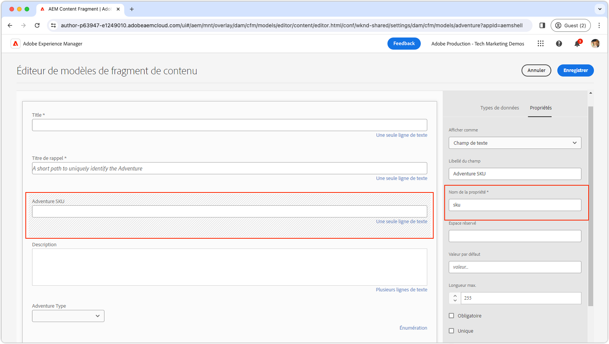

# Champs personnalisés

Découvrez comment créer des champs personnalisés dans l’éditeur de fragments de contenu AEM.

>[!VIDEO](https://video.tv.adobe.com/v/3427585?learn=on)

Les extensions d’interface utilisateur AEM doivent être développées à l’aide du framework [Adobe React Spectrum](https://react-spectrum.adobe.com/react-spectrum/index.html), car il conserve un aspect cohérent avec le reste d’AEM, et dispose également d’une vaste bibliothèque de fonctionnalités prédéfinies, réduisant ainsi le temps de développement.

## Point d’extension

Cet exemple remplace un fichier existant dans l’éditeur de fragments de contenu par une implémentation personnalisée.

| Interface utilisateur AEM étendue | Point d’extension |
| ------------------------ | --------------------- | 
| [Éditeur de fragments de contenu](https://developer.adobe.com/uix/docs/services/aem-cf-editor/) | [Rendu d’élément de formulaire personnalisé](https://developer.adobe.com/uix/docs/services/aem-cf-editor/api/custom-fields/) |

## Exemple d’extension

Cet exemple montre la restriction des valeurs de champ dans l’éditeur de fragments de contenu à un ensemble prédéterminé en remplaçant le champ standard par une liste déroulante personnalisée de SKU prédéfinis. Les auteurs et autrices peuvent effectuer une sélection parmi cette liste de SKU spécifique. Alors que les SKU proviennent généralement d’un système PIM, cet exemple permet une simplification en répertoriant statiquement les SKU.

Le code source de cet exemple peut être [téléchargé](./assets/editor-custom-field/content-fragment-editor-custom-field-src.zip).

### Définition de modèle de fragment de contenu

Cet exemple se lie à n’importe quel champ de fragment de contenu dont le nom est `sku` (par l’intermédiaire d’une [correspondance d’expression régulière](#extension-registration) de `^sku$`) et le remplace par un champ personnalisé. L’exemple utilise le modèle de fragment de contenu WKND Adventure qui a été mis à jour. La définition est la suivante :



Bien que le champ SKU personnalisé soit affiché sous forme de liste déroulante, son modèle sous-jacent est configuré comme champ de texte. L’implémentation du champ personnalisé doit uniquement s’aligner sur le nom et le type de propriété appropriés, facilitant ainsi le remplacement du champ standard par la version déroulante personnalisée.


### Itinéraires de l’application

Dans le composant principal React `App.js`, incluez l’itinéraire `/sku-field` pour rendre le composant React `SkuField`.

`src/aem-cf-editor-1/web-src/src/components/App.js`

```javascript
import React from "react";
import ErrorBoundary from "react-error-boundary";
import { HashRouter as Router, Routes, Route } from "react-router-dom";
import ExtensionRegistration from "./ExtensionRegistration";
import SkuField from "./SkuField"; // Custom component implemented below

function App() {
  return (
    <Router>
      <ErrorBoundary onError={onError} FallbackComponent={fallbackComponent}>
        <Routes>
          <Route index element={<ExtensionRegistration />} />
          <Route
            exact path="index.html"
            element={<ExtensionRegistration />}
          />
          {/* This is the React route that maps to the custom field */}
          <Route
            exact path="/sku-field"
            element={<SkuField />}/>
        </Routes>
      </ErrorBoundary>
    </Router>
  )
  ...
}
...
```

Cet itinéraire personnalisé de `/sku-field` qui mappe vers le composant `SkuField` est utilisé ci-dessous dans l’[enregistrement d’extension](#extension-registration).

### Enregistrement d’une extension

`ExtensionRegistration.js`, mappé à l’itinéraire index.html, est le point d’entrée de l’extension AEM et définit les éléments suivants :

+ La définition du widget dans la fonction `getDefinitions()` avec les attributs `fieldNameExp` et `url`. La liste complète des attributs disponibles figure dans le [guide de référence de l’API de rendu d’élément de formulaire personnalisé](https://developer.adobe.com/uix/docs/services/aem-cf-editor/api/custom-fields/#api-reference).
+ La valeur d’attribut `url`, un chemin d’URL relatif (`/index.html#/skuField`) pour charger l’interface utilisateur du champ.

`src/aem-cf-editor-1/web-src/src/components/ExtensionRegistration.js`

```javascript
import { Text } from "@adobe/react-spectrum";
import { register } from "@adobe/uix-guest";
import { extensionId } from "./Constants";

function ExtensionRegistration() {
  const init = async () => {
    const guestConnection = await register({
      id: extensionId,
      methods: {
        field: {
          getDefinitions() {
            return [
              // Multiple fields can be registered here.
              {
                fieldNameExp: '^sku$',  // This is a regular expression that matches the field name in the Content Fragment Model to replace with React component specified in the `url` key.
                url: '/#/sku-field',    // The URL, which is mapped vai the Route in App.js, to the React component that will be used to render the field.
              },
              // Other bindings besides fieldNameExp, other bindings can be used as well as defined here:
              // https://developer.adobe.com/uix/docs/services/aem-cf-editor/api/custom-fields/#api-reference
            ];
          },
        },
      }
    });
  };
  init().catch(console.error);

  return <Text>IFrame for integration with Host (AEM)...</Text>;
}

export default ExtensionRegistration;
```

### Champ personnalisé

Le composant React `SkuField` met à jour l’éditeur de fragments de contenu avec une interface utilisateur personnalisée, en utilisant Adobe React Spectrum pour son formulaire de sélecteur. Les points forts incluent les éléments suivants :

+ Utilisation de `useEffect` pour l’initialisation et la connexion à l’éditeur de fragments de contenu d’AEM, avec un état de chargement affiché jusqu’à ce que la configuration soit terminée.
+ Rendu à l’intérieur d’un iFrame, il ajuste dynamiquement la hauteur de l’iFrame via la fonction `onOpenChange` pour s’adapter à la liste déroulante du sélecteur Adobe React Spectrum.
+ Communication des sélections de champs à l’hôte à l’aide de `connection.host.field.onChange(value)` dans la fonction `onSelectionChange`, ce qui garantit que la valeur sélectionnée est validée et enregistrée automatiquement conformément aux directives du modèle de fragment de contenu.

Les champs personnalisés sont rendus dans un iFrame injecté dans l’éditeur de fragments de contenu. La communication entre le code du champ personnalisé et l’éditeur de fragments de contenu s’effectue exclusivement via l’objet `connection`. Elle est établie par la fonction `attach` à partir du package `@adobe/uix-guest`.

`src/aem-cf-editor-1/web-src/src/components/SkuField.js`

```javascript
import React, { useEffect, useState } from "react";
import { extensionId } from "./Constants";
import { attach } from "@adobe/uix-guest";
import { Provider, View, lightTheme } from "@adobe/react-spectrum";
import { Picker, Item } from "@adobe/react-spectrum";

const SkuField = (props) => {
  const [connection, setConnection] = useState(null);
  const [validationState, setValidationState] = useState(null);
  const [value, setValue] = useState(null);
  const [model, setModel] = useState(null);
  const [items, setItems] = useState(null);

  /**
   * Mock function that gets a list of Adventure SKUs to display.
   * The data could come anywhere, AEM's HTTP APIs, a PIM, or other system.
   * @returns a list of items for the picker
   */
  async function getItems() {
    // Data to drive input field validation can come from anywhere.
    // Fo example this commented code shows how it could be fetched from an HTTP API.
    // fetch(MY_API_URL).then((response) => response.json()).then((data) => { return data; }

    // In this example, for simplicity, we generate a list of 25 SKUs.
    return Array.from({ length: 25 }, (_, i) => ({ 
        name: `WKND-${String(i + 1).padStart(3, '0')}`, 
        id: `WKND-${String(i + 1).padStart(3, '0')}` 
    }));
  }

  /**
   * When the fields changes, update the value in the Content Fragment Editor
   * @param {*} value the selected value in the picker
   */
  const onSelectionChange = async (value) => {
    // This sets the value in the React state of the custom field
    setValue(value);
    // This calls the setValue method on the host (AEM's Content Fragment Editor)
    connection.host.field.onChange(value);
  };

  /**
   * Some widgets, like the Picker, have a variable height.
   * In these cases adjust the Content Fragment Editor's iframe's height so the field doesn't get cut off.     *
   * @param {*} isOpen true if the picker is open, false if it's closed
   */
  const onOpenChange = (isOpen) => {
    if (isOpen) {
      // Calculate the height of the picker box and its label, and surrounding padding.
      const pickerHeight = Number(document.body.clientHeight.toFixed(0));
      // Calculate the height of the picker options dropdown, and surrounding padding.
      // We do this  by multiplying the number of items by the height of each item (32px) and adding 12px for padding.
      const optionsHeight = items.length * 32 + 12;

      // Set the height of the iframe to the height of the picker + the height of the options, or 400px, whichever is smaller.
      // The options will scroll if they they cannot fit into 400px
      const height = Math.min(pickerHeight + optionsHeight, 400);

      // Set the height of the iframe in the Content Fragment Editor
      connection.host.field.setStyles({
        current: { height, },
        parent: { height, },
      })
    } else {
      connection.host.field.setStyles({
        current: { height: 74 },
        parent: { height: 74 },
      })
    }
  };

  useEffect(() => {
    const init = async () => {
      // Connect to the host (AEM's Content Fragment Editor)
      const conn = await attach({ id: extensionId });
      setConnection(conn);

      // get the Content Fragment Model
      setModel(await conn.host.field.getModel());

      // Share the validation state back to the client.
      // When conn.host.field.setValue(value) is called, the
      await conn.host.field.onValidationStateChange((state) => {
        // state can be `valid` or `invalid`.
        setValidationState(state);
      });
      // Get default value from the Content Fragment Editor
      // (either the default value set in the model, or a perviously set value)
      setValue(await conn.host.field.getDefaultValue());

      // Get the list of items for the picker; in this case its a list of adventure SKUs 
      // This could come from elsewhere in AEM or from an external system.
      setItems(await getItems());
    };

    init().catch(console.error);
  }, []);

  // If the component is not yet initialized, return a loading state.
  if (!connection || !model || !items) {
    // Put whatever loader you like here...
    return <Provider theme={lightTheme}>Loading custom field...</Provider>;
  }

  // Wrap the Spectrum UI component in a Provider theme, such that it is styled appropriately.
  // Render the picker, and bind to the data and custom event handlers.

  // Set as much of the model as we can, to allow maximum authoring flexibility without developer support.
  return (
    <Provider theme={lightTheme}>
      <View width="100%">
        <Picker
          label={model.fieldLabel}
          isRequired={model.required}
          placeholder={model.emptyText}
          errorMessage={model.customErrorMsg}
          selectedKey={value}
          necessityIndicator="icon"
          shouldFlip={false}
          width={"90%"}
          items={items}
          isInvalid={validationState === "invalid"}
          onSelectionChange={onSelectionChange}
          onOpenChange={onOpenChange}
        >
          {(item) => <Item key={item.value}>{item.name}</Item>}
        </Picker>
      </View>
    </Provider>
  );
};

export default SkuField;
```
