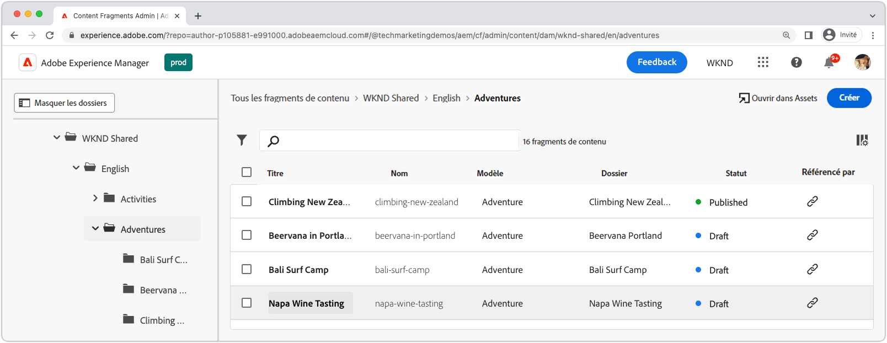
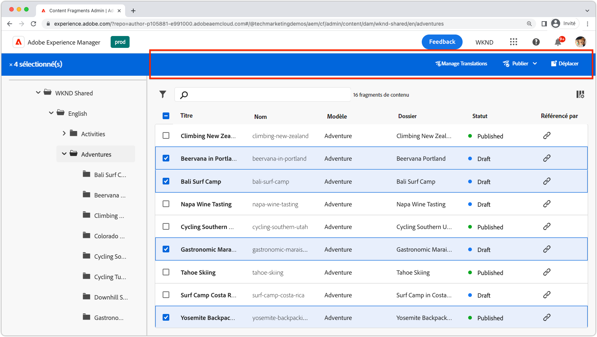
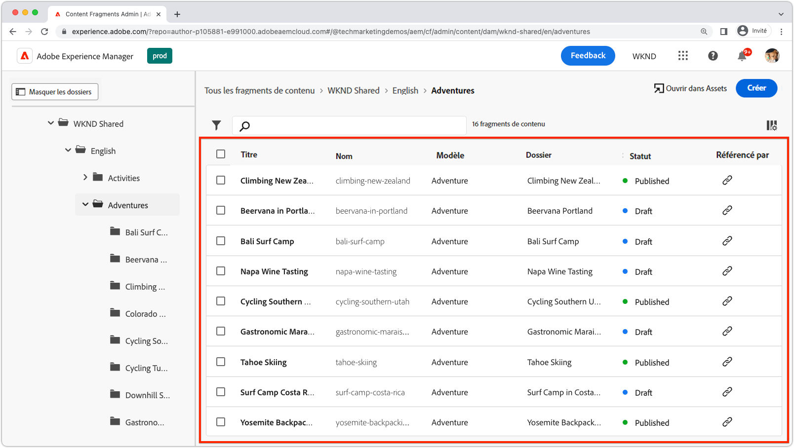
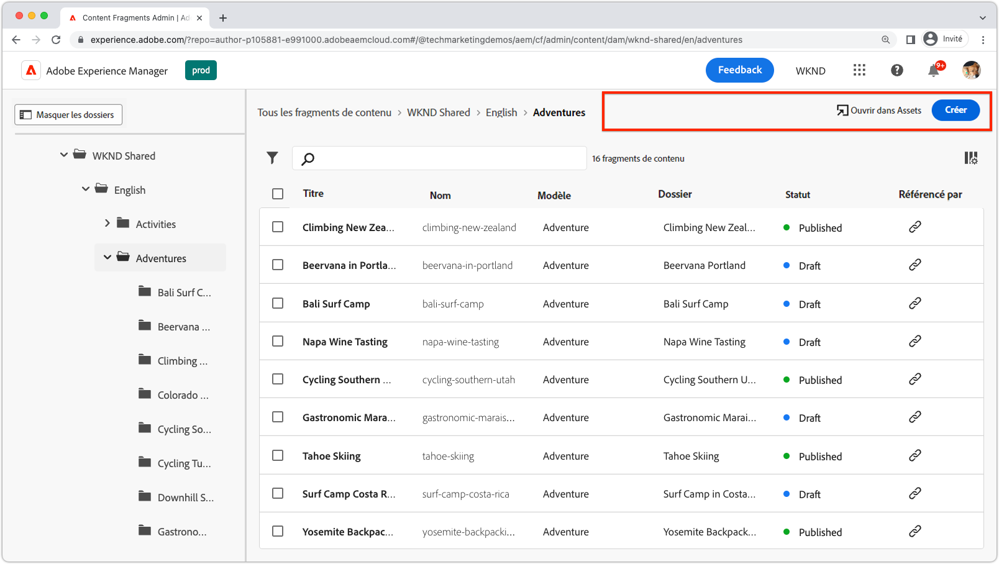
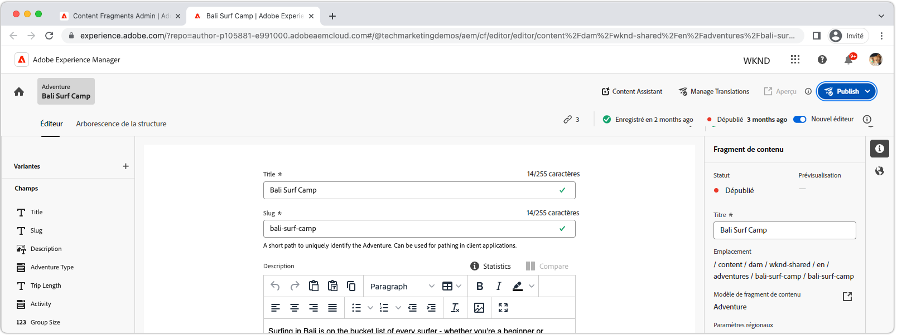
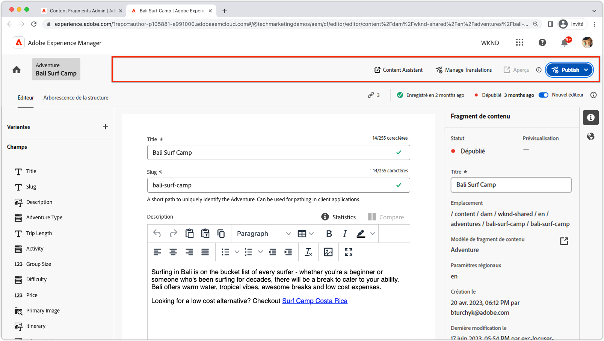
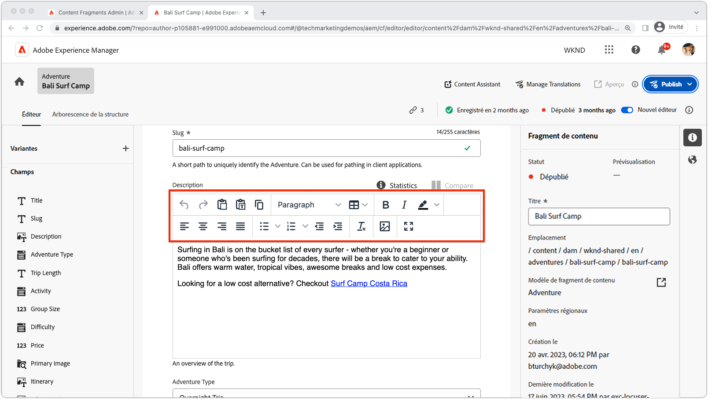
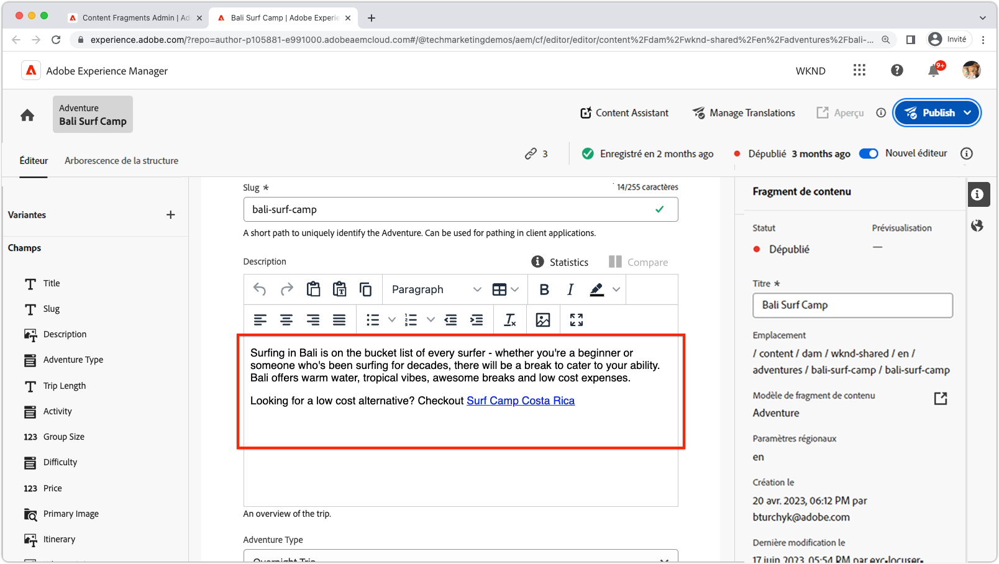
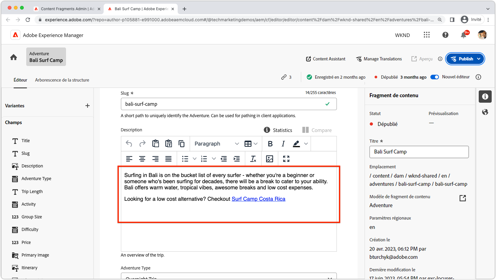
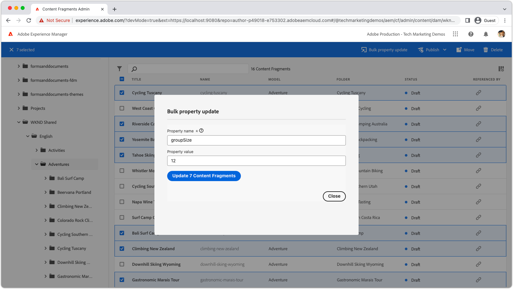

# Extensibilité des fragments de contenu AEM

L’interface utilisateur des fragments de contenu d’AEM est une puissante interface utilisateur extensible permettant de gérer la création, la gestion et la modification de fragments de contenu. Plusieurs points d’extension sont disponibles pour personnaliser l’interface utilisateur en fonction de vos besoins. Différents points d’extension sont disponibles en fonction de l’interface utilisateur que vous étendez.

## Points d’extension de la console de fragments de contenu

La console de fragments de contenu d’AEM (Adobe Experience Manager) est une interface utilisateur qui fournit un emplacement centralisé pour la gestion et l’organisation des fragments de contenu. Il propose un ensemble complet d’outils et de fonctionnalités pour créer, modifier, publier et suivre des fragments de contenu, ce qui permet aux utilisateurs de gérer efficacement le contenu structuré sur différents canaux et points de contact.

[AEM la console Fragments de contenu](https://experienceleague.adobe.com/docs/experience-manager-cloud-service/content/sites/administering/content-fragments/content-fragments-console.html?lang=fr) est l’interface utilisateur extensible permettant de répertorier et de gérer des fragments de contenu. [AEM les extensions de la console de fragments de contenu sont créées](https://developer.adobe.com/uix/docs/services/aem-cf-console-admin/code-generation) en utilisant la variable `@adobe/aem-cf-admin-ui-ext-tpl` Modèle App Builder.

Les points d’extension de la console de fragments de contenu suivants sont disponibles :

      

        

          

            <figure class="image is-16by9">
              
            </figure>
          

          

            

              
<a href="https://developer.adobe.com/uix/docs/services/aem-cf-console-admin/api/action-bar/" title="Barre d’actions" target="_blank" rel="referrer">Barre d’actions</a>

              
Personnalisez les actions pour lorsqu’un ou plusieurs fragments de contenu sont sélectionnés.

              <a href="https://developer.adobe.com/uix/docs/services/aem-cf-console-admin/api/action-bar/" class="spectrum-Button spectrum-Button--outline spectrum-Button--primary spectrum-Button--sizeM" target="_blank" rel="referrer">
                Affichage des documents
              </a>
            

          

        

      

  

    

      

        <figure class="image is-16by9">
          
        </figure>
      

      

        

          
<a href="https://developer.adobe.com/uix/docs/services/aem-cf-console-admin/api/grid-columns/" title="Colonnes de grille" target="_blank" rel="referrer">Colonnes de grille</a>

          
Personnalisez les données qui apparaissent dans la liste Fragments de contenu.

          <a href="https://developer.adobe.com/uix/docs/services/aem-cf-console-admin/api/grid-columns/" class="spectrum-Button spectrum-Button--outline spectrum-Button--primary spectrum-Button--sizeM" target="_blank" rel="referrer">
            Affichage des documents
          </a>
        

      

    

  

  

    

      

        <figure class="image is-16by9">
          
        </figure>
      

      

        

          
<a href="https://developer.adobe.com/uix/docs/services/aem-cf-console-admin/api/header-menu/" title="Menu d’en-tête" target="_blank" rel="referrer">Menu d’en-tête</a>

          
Personnalisez les actions pour lorsqu’aucun fragment de contenu n’est sélectionné.

          <a href="https://developer.adobe.com/uix/docs/services/aem-cf-console-admin/api/header-menu/" class="spectrum-Button spectrum-Button--outline spectrum-Button--primary spectrum-Button--sizeM" target="_blank" rel="referrer">
            Affichage des documents
          </a>
        

      

    

  
  

## Points d’extension de l’éditeur de fragments de contenu

L’éditeur de fragment de contenu d’AEM (Adobe Experience Manager) est un composant de l’interface utilisateur qui permet aux utilisateurs de créer, modifier et gérer des fragments de contenu. Il offre un environnement intuitif et convivial visuellement pour travailler avec du contenu structuré, ce qui permet aux utilisateurs de définir et d’organiser des éléments de contenu, d’appliquer des modèles, de gérer des variations et de prévisualiser l’affichage du contenu sur différents canaux. L’éditeur de fragment de contenu simplifie le processus de création de contenu réutilisable et modulaire qui peut être facilement distribué et publié sur plusieurs expériences numériques.

AEM’éditeur de fragments de contenu est l’interface utilisateur extensible permettant de modifier des fragments de contenu. [AEM les extensions de l’éditeur de fragments de contenu sont créées](https://developer.adobe.com/uix/docs/services/aem-cf-editor/code-génération/) en utilisant la variable `@adobe/aem-cf-editor-ui-ext-tpl` Modèle App Builder.

Les points d’extension suivants de l’éditeur de fragments de contenu sont disponibles :

    

      

        

          <figure class="image is-16by9">
            
          </figure>
        

        

          

            
<a href="https://developer.adobe.com/uix/docs/services/aem-cf-editor/api/header-menu/" title="Menu d’en-tête" target="_blank" rel="referrer">Menu d’en-tête</a>

            
Personnalisez les actions dans le menu d’en-tête de l’éditeur de fragments de contenu.

            <a href="https://developer.adobe.com/uix/docs/services/aem-cf-editor/api/header-menu" class="spectrum-Button spectrum-Button--outline spectrum-Button--primary spectrum-Button--sizeM" target="_blank" rel="referrer">
              Affichage des documents
            </a>
          

        

      

    

  

    

      

        <figure class="image is-16by9">
          
        </figure>
      

      

        

          
<a href="https://developer.adobe.com/uix/docs/services/aem-cf-editor/api/rte-toolbar/" title="Barre d’outils de l’éditeur de texte enrichi"  target="_blank" rel="referrer">Barre d’outils de l’éditeur de texte enrichi</a>

          
Ajoutez un bouton personnalisé à l’éditeur de texte enrichi (RTE) de l’éditeur de fragment de contenu.

          <a href="https://developer.adobe.com/uix/docs/services/aem-cf-editor/api/rte-toolbar/" class="spectrum-Button spectrum-Button--outline spectrum-Button--primary spectrum-Button--sizeM" target="_blank" rel="referrer">
            Affichage des documents
          </a>
        

      

    

  

    

      

        <figure class="image is-16by9">
          
        </figure>
      

      

        

          
<a href="https://developer.adobe.com/uix/docs/services/aem-cf-editor/api/rte-widgets/" title="Widgets de l’éditeur de texte enrichi" target="_blank" rel="referrer">Widgets de l’éditeur de texte enrichi</a>

          
Personnalisez les actions dans l’éditeur de texte enrichi liées aux touches.

          <a href="https://developer.adobe.com/uix/docs/services/aem-cf-editor/api/rte-widgets/" class="spectrum-Button spectrum-Button--outline spectrum-Button--primary spectrum-Button--sizeM" target="_blank" rel="referrer">
            Affichage des documents
          </a>
        

      

    

  

  

    

      

        <figure class="image is-16by9">
          
        </figure>
      

      

        

          
<a href="https://developer.adobe.com/uix/docs/services/aem-cf-editor/api/rte-badges/ " title="Badges de l’éditeur de texte enrichi" target="_blank" rel="referrer">Badges de l’éditeur de texte enrichi</a>

          
Personnalisez des blocs de style non modifiables dans l’éditeur de texte enrichi.

          <a href="https://developer.adobe.com/uix/docs/services/aem-cf-editor/api/rte-badges/" class="spectrum-Button spectrum-Button--outline spectrum-Button--primary spectrum-Button--sizeM" target="_blank" rel="referrer">
            Affichage des documents
          </a>
        

      

    

  

## Exemples d’extensions

Bienvenue dans une collection d’exemples de code d’extensibilité de l’interface utilisateur AEM ! Cette ressource est conçue pour vous fournir des démonstrations pratiques et des informations sur l’extension de l’interface utilisateur d’Adobe Experience Manager (AEM). Que vous soyez développeur et que vous souhaitiez améliorer les fonctionnalités d’AEM, ces exemples de code constituent une référence précieuse.

  

    

      

        <figure class="image is-16by9">
          
        </figure>
      

      

        

          
<a href="./examples/console-bulk-property-update.md" title="Mise à jour en bloc des propriétés">Mise à jour de la propriété Fragment de contenu en bloc</a>

          
Extension de la barre d’actions de la console de fragments de contenu avec action modale et Adobe I/O Runtime.

          <a href="./examples/console-bulk-property-update.md" class="spectrum-Button spectrum-Button--outline spectrum-Button--primary spectrum-Button--sizeM">
            Afficher l’exemple
          </a>
        

      

    

  

  

        

            

                <figure class="image is-16by9">
                    
                </figure>
            

            

                

                    
<a href="./examples/console-image-generation-and-image-upload.md" title="Génération d’images basée sur OpenAI et chargement vers l’extension AEM">Génération d’images OpenAPI</a>

                    
Explorez un exemple d’extension de barre d’actions qui génère une image à l’aide d’OpenAI, la charge dans AEM et met à jour la propriété de l’image sur le fragment de contenu sélectionné.

                    <a href="./examples/console-image-generation-and-image-upload.md" class="spectrum-Button spectrum-Button--outline spectrum-Button--primary spectrum-Button--sizeM">
                        Afficher l’exemple
                    </a>
                

            

        

    
    
  

    

      

        <figure class="image is-16by9">
          
        </figure>
      

      

        

          
<a href="./examples/custom-grid-columns.md" title="Colonnes personnalisées">Colonnes personnalisées</a>

          
Ajoutez une colonne personnalisée à la console de fragments de contenu.

          <a href="./examples/custom-grid-columns.md" class="spectrum-Button spectrum-Button--outline spectrum-Button--primary spectrum-Button--sizeM">
            Afficher l’exemple
          </a>
        

      

    

  
    
  

    

      

        <figure class="image is-16by9">
          
        </figure>
      

      

        

          
<a href="./examples/editor-export-to-xml.md" title="Exporter au format XML">Exporter au format XML</a>

          
Exportez un fragment de contenu au format XML à partir de l’éditeur de fragment de contenu.

          <a href="./examples/editor-export-to-xml.md" class="spectrum-Button spectrum-Button--outline spectrum-Button--primary spectrum-Button--sizeM">
            Afficher l’exemple
          </a>
        

      

    

  
    
  

    

      

        <figure class="image is-16by9">
          
        </figure>
      

      

        

          
<a href="./examples/editor-rte-toolbar.md" title="Éditeur de texte enrichi, bouton de barre d’outils">Éditeur de texte enrichi, bouton de barre d’outils</a>

          
Ajoutez des boutons de barre d’outils personnalisés aux champs de l’éditeur de texte enrichi dans l’éditeur de fragments de contenu.

          <a href="./examples/editor-rte-toolbar.md" class="spectrum-Button spectrum-Button--outline spectrum-Button--primary spectrum-Button--sizeM">
            Afficher l’exemple
          </a>
        

      

    

  
   
  

    

      

        <figure class="image is-16by9">
          
        </figure>
      

      

        

          
<a href="./examples/editor-rte-toolbar.md" title="Widget d’éditeur de texte enrichi">Widget d’éditeur de texte enrichi</a>

          
Ajoutez des widgets à l’éditeur de texte enrichi dans l’éditeur de fragment de contenu.

          <a href="./examples/editor-rte-widget.md" class="spectrum-Button spectrum-Button--outline spectrum-Button--primary spectrum-Button--sizeM">
            Afficher l’exemple
          </a>
        

      

    

  

