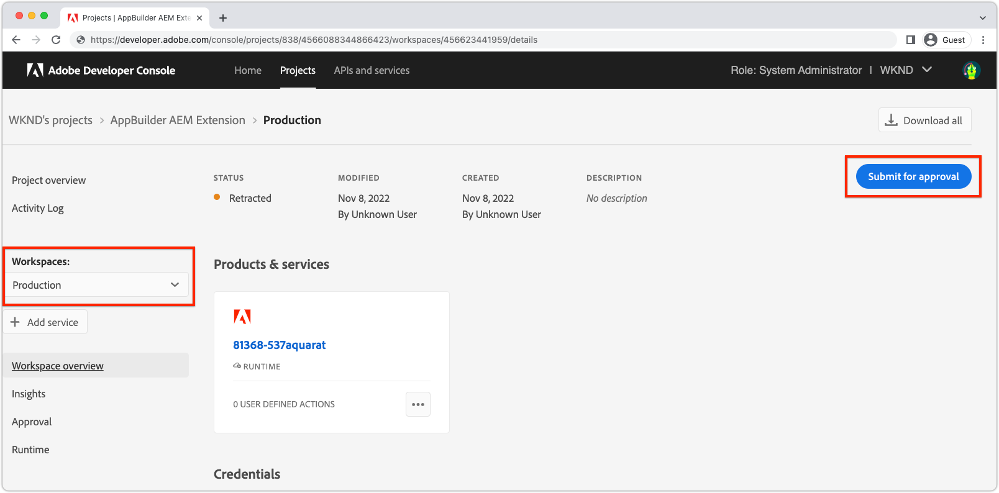

# Déployer une extension

Pour une utilisation dans les environnements AEM as a Cloud Service, l’extension de l’application Créateur d’applications doit être déployée et approuvée.

Plusieurs points doivent être pris en compte lors du déploiement des extensions d’applications Créateur d’applications :

+ Les extensions sont déployées dans l’espace de travail du projet de l’Adobe Developer Console. Les espaces de travail par défaut sont les suivants :
   + L’espace de travail __Production__ contient des déploiements d’extension disponibles dans toutes les instances AEM as a Cloud Service.
   + L’espace de travail __Évaluation__ fait office d’espace de travail de développement. Les extensions déployées dans l’espace de travail Évaluation ne sont pas disponibles dans AEM as a Cloud Service.
Les espaces de travail de l’Adobe Developer Console ne comportent aucune corrélation directe avec les types d’environnements AEM as a Cloud Service.
+ Une extension déployée dans l’espace de travail de production s’affiche dans tous les environnements AEM as a Cloud Service dans l’organisation Adobe dans laquelle l’extension existe.
Une extension ne peut pas être limitée aux environnements dans lesquels elle est enregistrée en ajoutant une [logique conditionnelle qui vérifie le nom d’hôte AEM as a Cloud Service](https://developer.adobe.com/uix/docs/guides/publication/#enabling-extension-only-on-specific-aem-environments).
+ Plusieurs extensions peuvent être utilisées sur AEM as a Cloud Service. Adobe recommande que chaque extension de l’application Créateur d’applications soit utilisée pour résoudre un seul objectif commercial. Cela dit, une seule extension de l’application Créateur d’applications peut mettre en œuvre plusieurs points d’extension qui prennent en charge un objectif commercial commun.

## Déploiement initial

Pour qu’une extension soit disponible dans les environnements AEM as a Cloud Service, elle doit être déployée sur l’Adobe Developer Console.

Le processus de déploiement se divise en deux étapes logiques :

1. Déploiement de l’extension de l’application Créateur d’applications vers Adobe Developer Console par un développeur ou une développeuse.
1. Validation de l’extension par une personne responsable du déploiement ou une personne propriétaire d’entreprise.

### Déployer l’extension

Déployez l’extension dans l’espace de travail de production. Les extensions déployées dans l’espace de travail de production sont automatiquement ajoutées à tous les services de création d’AEM as a Cloud Service dans l’organisation Adobe vers laquelle l’extension est déployée.

1. Ouvrez une ligne de commande à la racine de l’extension mise à jour de l’application du créateur d’applications.
1. Assurez-vous que l’espace de travail de production est actif.

   ```shell
   $ aio app use -w Production
   ```

   Fusionnez toutes les modifications dans `.env` et `.aio`.

1. Déployez l’extension mise à jour de l’application Créateur d’applications.

   ```shell
   $ aio app deploy
   ```

#### Demander l’approbation du déploiement

{align="center"}

1. Connectez-vous à l’[Adobe Developer Console](https://developer.adobe.com).
1. Sélectionnez __Console__.
1. Accédez à __Projets__.
1. Sélectionnez le projet associé à l’extension.
1. Sélectionnez l’espace de travail __Production__.
1. Sélectionnez __Soumettre pour validation__.
1. Remplissez et envoyez le formulaire, en mettant à jour les champs selon vos besoins.

### Validation du déploiement

{align="center"}

1. Connectez-vous à [Adobe Exchange](https://exchange.adobe.com/).
1. Accédez à __Gérer__ > __Applications en attente de révision__.
1. __Révisez__ l’extension de l’application Créateur d’applications.
1. Si les modifications d’extension sont acceptables, __Acceptez__ la révision. Cette opération injecte immédiatement l’extension sur tous les services de création d’AEM as a Cloud Service dans l’organisation Adobe.

Une fois la demande d’extension approuvée, l’extension devient immédiatement active dans les services de création d’AEM as a Cloud Service.

## Mettre à jour une extension

Mettre à jour une extension de l’application Créateur d’applications suit le même processus que le [déploiement initial](#initial-deployment), à la différence que le déploiement d’extension existant doit d’abord être révoqué.

### Révoquer l’extension

Pour déployer une nouvelle version d’une extension, celle-ci doit d’abord être révoquée (ou supprimée). Quand l’extension est révoquée, elle n’est pas disponible dans les consoles AEM.

1. Connectez-vous à [Adobe Exchange](https://exchange.adobe.com/).
1. Accédez à __Gérer__ > __Applications Créateur d’applications__.
1. __Révoquez__ l’extension à mettre à jour.

### Déployer l’extension

Déployez l’extension dans l’espace de travail de production. Les extensions déployées dans l’espace de travail de production sont automatiquement ajoutées à tous les services de création d’AEM as a Cloud Service dans l’organisation Adobe vers laquelle l’extension est déployée.

1. Ouvrez une ligne de commande à la racine de l’extension mise à jour de l’application du créateur d’applications.
1. Assurez-vous que l’espace de travail de production est actif.

   ```shell
   $ aio app use -w Production
   ```

   Fusionnez toutes les modifications dans `.env` et `.aio`.

1. Déployez l’extension mise à jour de l’application Créateur d’applications.

   ```shell
   $ aio app deploy
   ```

#### Demander l’approbation du déploiement

{align="center"}

1. Connectez-vous à l’[Adobe Developer Console](https://developer.adobe.com).
1. Sélectionnez __Console__.
1. Accédez à __Projets__.
1. Sélectionnez le projet associé à l’extension.
1. Sélectionnez l’espace de travail __Production__.
1. Sélectionnez __Soumettre pour validation__.
1. Remplissez et envoyez le formulaire, en mettant à jour les champs selon vos besoins.

#### Approuvez la requête de déploiement.

{align="center"}

1. Connectez-vous à [Adobe Exchange](https://exchange.adobe.com/).
1. Accédez à __Gérer__ > __Applications en attente de révision__.
1. __Révisez__ l’extension de l’application Créateur d’applications.
1. Si les modifications d’extension sont acceptables, __Acceptez__ la révision. Cette opération injecte immédiatement l’extension sur tous les services de création d’AEM as a Cloud Service dans l’organisation Adobe.

Une fois la demande d’extension approuvée, l’extension devient immédiatement active dans les services de création d’AEM as a Cloud Service.

## Supprimer une extension


Pour supprimer une extension, révoquez-la (ou supprimez-la) d’Adobe Exchange. Lorsque l’extension est révoquée, elle est supprimée de tous les services de création d’AEM as a Cloud Service.

1. Connectez-vous à [Adobe Exchange](https://exchange.adobe.com/).
1. Accédez à __Gérer__ > __Applications de créateur d’applications__.
1. __Révoquez__ l’extension à supprimer.
