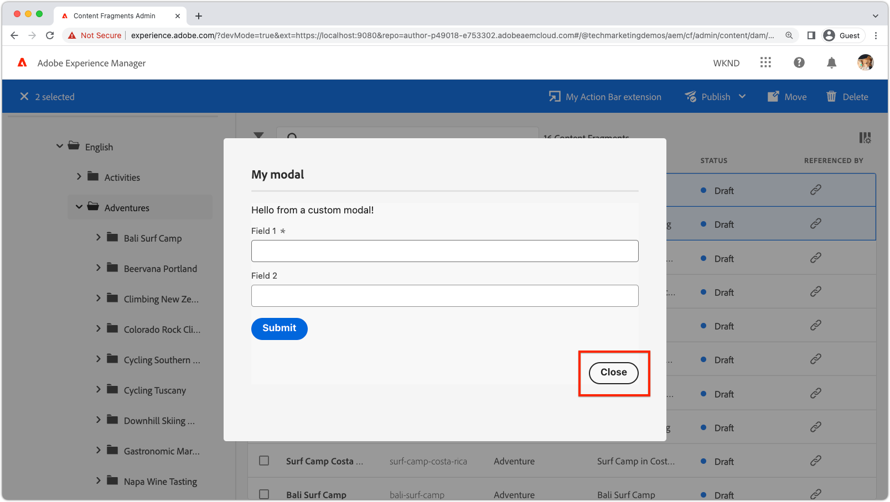

# Boîte de dialogue modale de l’extension

{align="center"}

La boîte de dialogue modale de l’extension de l’interface utilisateur AEM permet de joindre une interface utilisateur personnalisée aux extensions de l’interface utilisateur AEM.

Les boîtes de dialogue modales sont des applications React, basées sur [React Spectrum](https://react-spectrum.adobe.com/react-spectrum/), et peuvent créer toute interface utilisateur personnalisée requise par l’extension, notamment, mais sans s’y limiter :

+ des boîtes de dialogue de confirmation ;
+ des [formulaires de saisie](https://react-spectrum.adobe.com/react-spectrum/#forms) ;
+ des [indicateurs de progression](https://react-spectrum.adobe.com/react-spectrum/#status) ;
+ un [résumé des résultats](https://react-spectrum.adobe.com/react-spectrum/#collections) ;
+ des messages d’erreur ;
+ ou même une application React à vues multiples et complète.

## Itinéraires des boîtes de dialogue modales

L’expérience modale est définie par l’extension de l’application React du créateur d’applications définie sous le dossier `web-src`. Comme pour toute application React, l’expérience complète est orchestrée à l’aide d’[itinéraires React](https://reactrouter.com/en/main/components/routes) qui effectuent le rendu des [composants React](https://reactjs.org/docs/components-and-props.html).

Au moins un itinéraire est nécessaire pour générer l’affichage initial de la boîte de dialogue modale. Cet itinéraire initial est appelé dans la fonction `onClick(..)` de l’[enregistrement d’extension](#extension-registration), comme illustré ci-dessous.


+ `./src/aem-ui-extension/web-src/src/components/App.js`

```javascript
import MyModal from './MyModal';
import MyModalResults from './MyModalResults';
...
function App(props) {
  return (
    <Router>
      <ErrorBoundary onError={onError} FallbackComponent={fallbackComponent}>
        <Routes>
          ...         
          {/* 
            Define the entry route to the modal.

            For modals opened from Action Bar extensions.
            Depending on the extension point, different parameters are passed to the modal.
            This example illustrates a modal for the AEM Content Fragment Console (list view), where typically a :selection parameter is used to pass in the list of selected Content Fragments.
            Where as Header Menu extensions do not use a selection parameter.
           */}
          <Route
            exact path="aem-ui-extension/:selection/my-modal"
            element={<MyModal />}
          />                    

          {/* Define any other routes the modal may need */}
          <Route
            exact path="aem-ui-extension/my-modal"
            element={<MyOtherModalView />}
          />                    

        </Routes>
      </ErrorBoundary>
    </Router>
  )
  ...
}
```

## Enregistrement d’une extension

Pour ouvrir une boîte de dialogue modale, un appel à `guestConnection.host.modal.showUrl(..)` est effectué à partir de la fonction `onClick(..)` de l’extension. `showUrl(..)` transmet un objet JavaScript avec la clé/les valeurs :

+ `title` fournit le nom du titre de la boîte de dialogue modale affichée pour l’utilisateur ou l’utilisatrice.
+ `url` est l’URL qui appelle l’[itinéraire React](#modal-routes) responsable de l’affichage initial de la boîte de dialogue modale.

Il est impératif que l’`url` transmise à `guestConnection.host.modal.showUrl(..)` soit résolue sur l’itinéraire dans l’extension, sinon rien ne s’affiche dans la boîte de dialogue modale.

+ `./src/aem-ui-extension/web-src/src/components/ExtensionRegistration.js`

```javascript
function ExtensionRegistration() {
  ...
  onClick() {
    // Create a URL that maps to the React route to be rendered in the modal
    const modalURL = "/index.html#/aem-ui-extension/my-modal";

    // Open the modal and display the React route created above
    guestConnection.host.modal.showUrl({
      title: "My modal title",
      url: modalURL
    })     
  }
  ...     
}...
```

## Composant de boîte de dialogue modale

Chaque itinéraire de l’extension, [qui n’est pas l’itinéraire `index`](./extension-registration.md#app-routes), correspond à un composant React qui peut effectuer le rendu dans la boîte de dialogue modale de l’extension.

Une boîte de dialogue modale peut être constituée de n’importe quel nombre d’itinéraires React, d’une boîte de dialogue modale simple à une boîte de dialogue modale complexe à plusieurs itinéraires.

Le scénario suivant illustre une boîte de dialogue modale à un seul itinéraire, mais cet affichage modal peut contenir des liens React qui appellent d’autres itinéraires ou comportements.

+ `./src/aem-ui-extension/web-src/src/components/MyModal.js`

```javascript
import React, { useState, useEffect } from 'react'
import { attach } from "@adobe/uix-guest"
import {
  Flex,
  Provider,
  Content,
  defaultTheme,
  Text,
  ButtonGroup,
  Button
} from '@adobe/react-spectrum'
import Spinner from "./Spinner"
import { useParams } from "react-router-dom"
import { extensionId } from "./Constants"

export default function MyModal() {
  // Initial modal views for Action Bar extensions typically pass in the list of selected Content Fragment Paths from ExtensionRegistration.js
  // Get the paths from useParams() and split on delimiter used
  let { selection } = useParams();
  let contentFragmentPaths = selection?.split('|') || [];
  
  // Asynchronously attach the extension to AEM. 
  // Wait or the guestConnection to be set before doing anything in the modal.
  const [guestConnection, setGuestConnection] = useState()

  useEffect(() => {
    (async () => {
      const guestConnection = await attach({ id: extensionId })
      setGuestConnection(guestConnection);
    })()
  }, [])

  if (!guestConnection) {
    // If the guestConnection is not initialized, display a loading spinner
    return <Spinner />
  } else {
    // Else the modal is ready to render!
    return (
        <Provider theme={defaultTheme} colorScheme='light'>
        {/* 
            Use the React Spectrum components to render the modal UI.
            Using React Spectrum ensures a consistent, accessible, future-proof look-and-feel and speeds up development.
        */}
            <Content width="100%">
                <Flex width="100%">
                    <Text>
                        This is the contents in the modal! 
                        Anything can be created in this return statement!

                        The selected Content Fragments are: { contentFragmentPaths.join(', ') }
                    </Text>                    
                    {/*
                        Modals must provide their own Close button, by calling: guestConnection.host.modal.close()
                    */}
                    <ButtonGroup align="end">
                        <Button variant="primary" onPress={() => guestConnection.host.modal.close()}>Close</Button>
                    </ButtonGroup>
                </Flex>
            </Content>
        </Provider>
    )
  }
}
```

## Fermer la boîte de dialogue modale

{align="center"}

Les boîte de dialogue modale doivent fournir leur propre commande de fermeture. Pour ce faire, appelez `guestConnection.host.modal.close()`.

```javascript
<ButtonGroup align="end">
    <Button variant="primary" onPress={() => guestConnection.host.modal.close()}>Close</Button>
</ButtonGroup>
```
