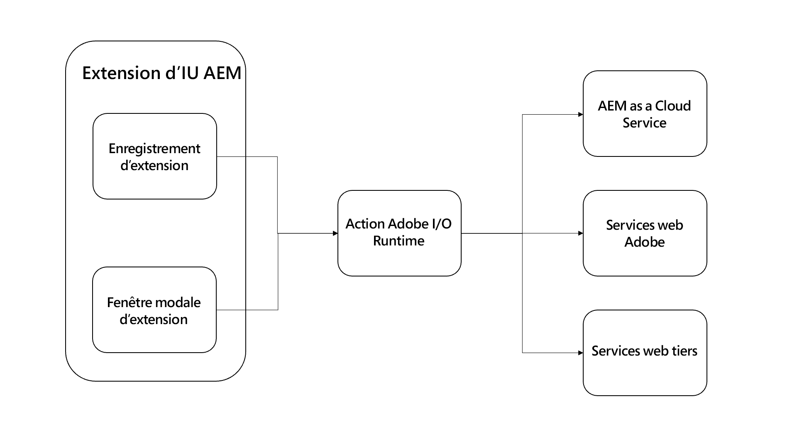

# Action Adobe I/O Runtime

{align="center"}

Les extensions de l’interface utilisateur d’AEM peuvent éventuellement inclure n’importe quel nombre [Actions Adobe I/O Runtime](https://developer.adobe.com/runtime/docs/).

Les actions Adobe I/O Runtime sont des fonctions sans serveur qui peuvent être invoquées par l’extension. Les actions sont utiles pour effectuer un travail qui nécessite une interaction avec AEM ou d’autres services Web d’Adobe. Les actions sont généralement plus utiles pour exécuter des tâches de longue durée (plus de quelques secondes) ou envoyer des requêtes HTTP à AEM ou à d’autres services Web.

Les avantages de l’utilisation d’actions Adobe I/O Runtime pour effectuer du travail sont les suivants :

+ Les actions sont des fonctions sans serveur qui s’exécutent en dehors du contexte d’un navigateur, supprimant la nécessité de se soucier de CORS.
+ Les actions ne peuvent pas être interrompues par l’utilisateur (par exemple, l’actualisation du navigateur)
+ Les actions sont asynchrones, elles peuvent donc s’exécuter aussi longtemps que nécessaire sans bloquer l’utilisateur.

Dans le contexte des extensions de l’interface utilisateur d’AEM, les actions sont souvent utilisées pour communiquer directement avec AEM as a Cloud Service :

+ Collecter les données associées à partir d’AEM à propos du contenu sélectionné ou actuel
+ Exécution d’opérations personnalisées sur le contenu
+ Création de contenu sur site

Bien que l’extension de l’interface utilisateur d’AEM soit affichée dans des AEM spécifiques de l’interface utilisateur, les extensions et leurs actions de prise en charge peuvent appeler toute API HTTP d’disponible, y compris les points de terminaison d’API d’ personnalisés.

## Appeler une action

Les actions Adobe I/O Runtime sont principalement appelées à partir de deux emplacements dans une extension d’interface utilisateur AEM :

1. Le [enregistrement de l’extension](./extension-registration.md) `onClick(..)` gestionnaire
1. Dans un [modal](./modal.md)

### À partir de l’enregistrement d’extension

Les actions Adobe I/O Runtime peuvent être appelées directement à partir du code d’enregistrement de l’extension. Le cas d’utilisation le plus courant consiste à lier une action à une [menu d’en-tête](https://developer.adobe.com/uix/docs/services/aem-cf-console-admin/api/header-menu/)Bouton de qui n’utilise pas [modals](./modal.md).

+ `./src/aem-ui-extension/web-src/src/components/ExtensionRegistration.js`

```javascript
// allActions is an object containing all the actions defined in the extension's manifest
import allActions from '../config.json'

// actionWebInvoke is a helper that invokes an action
import actionWebInvoke from '../utils'
...
function ExtensionRegistration() {
  const init = async () => {
    const guestConnection = await register({
      id: extensionId, // A unique ID for the extension
      methods: {
        // Configure your header menu button here
        headerMenu: {
          getButton() {
            return {
              'id': 'example.my-header-menu-extension',  // Unique ID for the button
              'label': 'My header menu extension',       // Button label 
              'icon': 'Edit'                             // Button icon from https://spectrum.adobe.com/page/icons/
            }
          },

          // Click handler for the extension button
          onClick() {
            // Set the HTTP headers required to access the Adobe I/O runtime action
            const headers = {
              'Authorization': 'Bearer ' + guestConnection.sharedContext.get('auth').imsToken,
              'x-gw-ims-org-id': guestConnection.sharedContext.get('auth').imsOrg
            };

            // Set the parameters to pass to the Adobe I/O Runtime action
            const params = {
              aemHost: `https://${guestConnection.sharedContext.get('aemHost')}`, // Pass in the AEM host if the action interacts with AEM
              aemAccessToken: guestConnection.sharedContext.get('auth').imsToken
            };

            try {
              // Invoke Adobe I/O Runtime action named `generic`, with the configured headers and parameters.
              const actionResponse = await actionWebInvoke(allActions['generic'], headers, params);
            } catch (e) {
              // Log and store any errors
              console.error(e)
            }           
          }
        }
      }
    })
  }
  init().catch(console.error);
}
```

### À partir du modal

Les actions Adobe I/O Runtime peuvent être appelées directement à partir de modèles pour effectuer un travail plus impliqué, en particulier un travail qui repose sur la communication avec AEM services as a Cloud Service, Adobe web ou même des services tiers.

Les actions Adobe I/O Runtime sont des applications JavaScript basées sur Node.js qui s’exécutent dans l’environnement Adobe I/O Runtime sans serveur. Ces actions peuvent être gérées via HTTP par le SPA d’extension.

+ `./src/aem-ui-extension/web-src/src/components/MyModal.js`

```javascript
import React, { useState, useEffect } from 'react'
import { attach } from "@adobe/uix-guest"
import {
  Flex,
  Provider,
  Content,
  defaultTheme,
  Text,
  ButtonGroup,
  Button
} from '@adobe/react-spectrum'
import Spinner from "./Spinner"
import { useParams } from "react-router-dom"
import { extensionId } from "./Constants"

export default function MyModal() {
  // Initial modal views for Action Bar extensions typically pass in the list of selected Content Fragment Paths from ExtensionRegistration.js
  // Get the paths from useParams() and split on delimiter used
  let { selection } = useParams();
  let contentFragmentPaths = selection?.split('|') || [];

  const [actionInvokeInProgress, setActionInvokeInProgress] = useState(false);
  const [actionResponse, setActionResponse] = useState();

  // Asynchronously attach the extension to AEM. 
  // Wait or the guestConnection to be set before doing anything in the modal.
  const [guestConnection, setGuestConnection] = useState()
  useEffect(() => {
    (async () => {
      const guestConnection = await attach({ id: extensionId })
      setGuestConnection(guestConnection);
    })()
  }, [])

  if (!guestConnection) {
    // If the guestConnection is not initialized, display a loading spinner
    return <Spinner />
  } else if (!actionResponse) {
    // Else if the modal is ready to render and has not called the Adobe I/O Runtime action yet
    return (
        <Provider theme={defaultTheme} colorScheme='light'>
            <Content width="100%">
                <Flex width="100%">
                    <Text>
                        The selected Content Fragments are: { contentFragmentPaths.join(', ') }
                    </Text>                    

                     <ButtonGroup align="end">
                        <Button variant="cta" onPress={doWork}>Do work</Button>
                        <Button variant="primary" onPress={() => guestConnection.host.modal.close()}>Close</Button>
                    </ButtonGroup>
                </Flex>
            </Content>
        </Provider>
    )
  } else {
    // Else the modal has called the Adobe I/O Runtime action and is ready to render the response
    return (
        <Provider theme={defaultTheme} colorScheme='light'>
            <Content width="100%">
                <Flex width="100%">
                    <Text>
                        Done! The response from the action is: { actionResponse }
                    </Text>                    

                     <ButtonGroup align="end">
                        <Button variant="primary" onPress={() => guestConnection.host.modal.close()}>Close</Button>
                    </ButtonGroup>
                </Flex>
            </Content>
        </Provider>
    )
  }

  /**
   * Invoke the Adobe I/O Runtime action and store the response in the React component's state.
   */
  async function doWork() {
    // Mark the extension as invoking the action, so the loading spinner is displayed
    setActionInvokeInProgress(true);

    // Set the HTTP headers to access the Adobe I/O runtime action
    const headers = {
      'Authorization': 'Bearer ' + guestConnection.sharedContext.get('auth').imsToken,
      'x-gw-ims-org-id': guestConnection.sharedContext.get('auth').imsOrg
    };

    // Set the parameters to pass to the Adobe I/O Runtime action
    const params = {
      aemHost: `https://${guestConnection.sharedContext.get('aemHost')}`,
      contentFragmentPaths: contentFragmentPaths
    };

    try {
      // Invoke Adobe I/O Runtime action with the configured headers and parameters
      // Invoke the Adobe I/O Runtime action named `generic`.
      const actionResponse = await actionWebInvoke(allActions['generic'], headers, params);

      // Set the response from the Adobe I/O Runtime action
      setActionResponse(actionResponse);
    } catch (e) {
      // Log and store any errors
      console.error(e)
    }

    // Set the action as no longer being invoked, so the loading spinner is hidden
    setActionInvokeInProgress(false);
  }
}
```

## Action Adobe I/O Runtime

+ `src/aem-ui-extension/actions/generic/index.js`

```javascript
const fetch = require('node-fetch')
const { Core } = require('@adobe/aio-sdk')
const { errorResponse, getBearerToken, stringParameters, checkMissingRequestInputs } = require('../utils')

async function main (params) {
  const logger = Core.Logger('main', { level: params.LOG_LEVEL || 'info' })

  try {
    logger.debug(stringParameters(params))

    // Check for missing request input parameters and headers
    const requiredParams = [ 'aemHost', 'contentFragmentPaths' ]
    const requiredHeaders = ['Authorization']
    const errorMessage = checkMissingRequestInputs(params, requiredParams, requiredHeaders)
    if (errorMessage) {
      // return and log client errors
      return errorResponse(400, errorMessage, logger)
    }
      
    // Extract the user Bearer token from the Authorization header used to authenticate the request to AEM
    const accessToken = getBearerToken(params);

    // Example HTTP request to AEM payload; This updates all 'title' properties of the Content Fragments to 'Hello World'
    const body = {
      "properties": {
        "elements": {
          "title": {
            "value": "Hello World"
          }
        }
      }
    };

    let results = await Promise.all(params.contentFragmentPaths.map(async (contentFragmentPath) => {
      // Invoke the AEM HTTP Assets Content Fragment API to update each Content Fragment
      // The AEM host is passed in as a parameter to the Adobe I/O Runtime action
      const res = await fetch(`${params.aemHost}${contentFragmentPath.replace('/content/dam/', '/api/assets/')}.json`, { 
        method: 'put',
        body: JSON.stringify(body),
        headers: {
          // Pass in the accessToken as AEM Author service requires authentication/authorization
          'Authorization': `Bearer ${accessToken}`,
          'Content-Type': 'application/json'
        }
      });

      if (res.ok) {
        logger.info(`Successfully updated title of ${contentFragmentPath}`);
        return { contentFragmentPath, status: res.status, statusText: res.statusText, body: await res.json() };
      } else {
        logger.info(`Failed to update title of ${contentFragmentPath}`);
        return { contentFragmentPath, status: res.status, statusText: res.statusText, body: await res.text() };
      }
    }));

    // Return a response to the AEM Content Fragment extension React application
    const response = {
      statusCode: 200,
      body: results
    };
    return response;

  } catch (error) {
    logger.error(error)
    return errorResponse(500, 'server error', logger)
  }
}
```

## API HTTP AEM

Les API HTTP AEM suivantes sont généralement utilisées pour interagir avec AEM à partir d’extensions :

+ [API AEM GraphQL](https://experienceleague.adobe.com/landing/experience-manager/headless/developer.html?lang=fr)
+ [API HTTP AEM Assets](https://experienceleague.adobe.com/docs/experience-manager-cloud-service/content/assets/admin/mac-api-assets.html?lang=fr)
   + [Prise en charge des fragments de contenu dans l’API HTTP AEM Assets](https://experienceleague.adobe.com/docs/experience-manager-cloud-service/content/assets/admin/assets-api-content-fragments.html)
+ [API QueryBuilder AEM](https://experienceleague.adobe.com/docs/experience-manager-cloud-service/content/implementing/developing/full-stack/search/query-builder-api.html)
+ [Terminer AEM référence d’API as a Cloud Service](https://experienceleague.adobe.com/docs/experience-manager-cloud-service/content/implementing/developing/reference-materials.html)


## Adobe des modules npm

Les modules npm suivants sont utiles pour développer des actions Adobe I/O Runtime :

+ [@adobe/aio-sdk](https://www.npmjs.com/package/@adobe/aio-sdk)
   + [SDK principal](https://github.com/adobe/aio-sdk-core)
   + [Bibliothèque d’états](https://github.com/adobe/aio-lib-state)
   + [Bibliothèque de fichiers](https://github.com/adobe/aio-lib-files)
   + [Bibliothèque Adobe Target](https://github.com/adobe/aio-lib-target)
   + [Bibliothèque Adobe Analytics](https://github.com/adobe/aio-lib-analytics)
   + [Bibliothèque Adobe Campaign Standard](https://github.com/adobe/aio-lib-campaign-standard)
   + [Bibliothèque de profils client Adobe](https://github.com/adobe/aio-lib-customer-profile)
   + [Bibliothèque de données client Adobe Audience Manager](https://github.com/adobe/aio-lib-audience-manager-cd)
   + [Événements Adobe I/O](https://github.com/adobe/aio-lib-events)
+ [@adobe/aio-lib-core-network](https://github.com/adobe/aio-lib-core-networking)
+ [@adobe/node-httptransfer](https://github.com/adobe/node-httptransfer)
