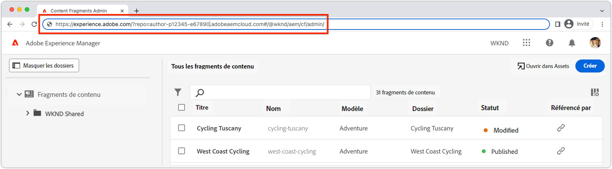

# Vérifier une extension

Les extensions d’interface utilisateur AEM peuvent être vérifiées par rapport à n’importe quel environnement AEM as a Cloud Service dans l’organisation d’Adobe à laquelle appartiennent ces extensions.

Le test d’une extension est effectué par le biais d’une URL spécialement conçue qui indique à AEM de charger l’extension, et ce uniquement pour cette requête.

>[!VIDEO](https://video.tv.adobe.com/v/3412877?quality=12&learn=on)

>[!IMPORTANT]
>
> La vidéo ci-dessus montre l’utilisation d’une extension de la console de fragments de contenu pour illustrer l’aperçu et la vérification de l’application d’extension du Créateur d’applications. Toutefois, il est important de noter que les concepts abordés peuvent être appliqués à toutes les extensions de l’interface utilisateur AEM.

## URL de l’interface utilisateur AEM

{align="center"}

Pour créer une URL qui monte l’extension hors production dans AEM, l’URL de l’interface utilisateur d’AEM dans laquelle l’extension est injectée doit être obtenue. Accédez à l’environnement AEM as a Cloud Service pour vérifier l’extension et ouvrez l’interface utilisateur dans laquelle l’extension doit être prévisualisée.

Par exemple, pour prévisualiser une extension pour la console Fragments de contenu :

1. Connectez-vous à l’environnement AEM as a Cloud Service souhaité.
2. Sélectionnez l’icône __Fragments de contenu__.
3. Attendez que la console de fragments de contenu d’AEM se charge dans le navigateur.
4. Copiez l’URL de la console de fragments de contenu AEM dans la barre d’adresse du navigateur. Elle doit ressembler à cela :

   ```
   https://experience.adobe.com/?repo=author-p1234-e5678.adobeaemcloud.com#/@wknd/aem/cf/admin
   ```

Cette URL est utilisée ci-dessous lors de la conception des URL pour le développement et la vérification des étapes. Si vous vérifiez l’extension par rapport à d’autres interfaces utilisateur AEM, obtenez ces URL et suivez les mêmes étapes que ci-dessous.

## Vérifiez les versions de développement locales.

1. Ouvrez une ligne de commande à la racine du projet d’extension.
1. Exécutez l’extension d’interface utilisateur AEM en tant qu’application locale du Créateur d’applications.

   ```shell
   $ aio app run
   ...
   No change to package.json was detected. No package manager install will be executed.
   
   To view your local application:
     -> https://localhost:9080
   To view your deployed application in the Experience Cloud shell:
     -> https://experience.adobe.com/?devMode=true#/custom-apps/?localDevUrl=https://localhost:9080
   ```

Prenez note de l’URL de l’application locale, comme illustré ci-dessus : `-> https://localhost:9080`.

1. Ajoutez les deux paramètres de requête suivants à l’[URL de l’interface utilisateur AEM](#aem-ui-url).
   + `&devMode=true`
   + `&ext=<LOCAL APPLICATION URL>`, généralement `&ext=https://localhost:9080`.

   Ajoutez les deux paramètres de requête ci-dessus (`devMode` et `ext`) en tant que __premiers__ paramètres de requête dans l’URL. L’interface utilisateur extensible d’AEM utilise des itinéraires de hachage (`#/@wknd/aem/...`) ; par conséquent, corriger de manière incorrecte les paramètres après `#` ne fonctionne pas.

   L’URL de prévisualisation doit se présenter comme suit :

   ```
   https://experience.adobe.com/?devMode=true&ext=https://localhost:9080&repo=author-p1234-e5678.adobeaemcloud.com#/@wknd/aem/cf/admin
   ```

2. Copiez et collez l’URL de prévisualisation dans votre navigateur.

   + Vous devrez peut-être [accepter le certificat HTTPS](https://developer.adobe.com/uix/docs/services/aem-cf-console-admin/extension-development/#accepting-the-certificate-first-time-users) (d’abord de manière initiale, puis périodiquement) pour l’hôte de l’application locale (`https://localhost:9080`).

3. L’interface utilisateur AEM se charge avec la version locale de l’extension qui y est injectée pour vérification.

>[!IMPORTANT]
>
>Souvenez-vous que lorsque vous utilisez cette approche, l’extension en cours de développement n’affecte que votre expérience, et que tous les autres utilisateurs et utilisatrices de l’interface utilisateur AEM expérimentent l’interface utilisateur sans l’extension injectée.

## Vérifier les versions d’étape

1. Ouvrez une ligne de commande à la racine du projet d’extension.
1. Assurez-vous que l’espace de travail d’évaluation est actif (ou que cet espace de travail est utilisé à des fins de vérification).

   ```shell
   $ aio app use -w Stage
   ```

   Fusionnez toutes les modifications dans `.env` et `.aio`.

1. Déployez l’extension mise à jour de l’application Créateur d’applications. S’il n’est pas connecté, exécutez `aio login` en premier.

   ```shell
   $ aio app deploy
   ...
   Your deployed actions:
   web actions:
     -> https://98765-123aquarat.adobeio-static.net/api/v1/web/aem-cf-console-admin-1/generic 
   To view your deployed application:
     -> https://98765-123aquarat.adobeio-static.net/index.html
   To view your deployed application in the Experience Cloud shell:
     -> https://experience.adobe.com/?devMode=true#/custom-apps/?localDevUrl=https://98765-123aquarat.adobeio-static.net/index.html
   New Extension Point(s) in Workspace 'Production': 'aem/cf-console-admin/1'
   Successful deployment 🏄
   ```

1. Ajoutez les deux paramètres de requête suivants à l’[URL de l’interface utilisateur AEM](#aem-ui-url).
   + `&devMode=true`
   + `&ext=<DEPLOYED APPLICATION URL>`

   Ajoutez les deux paramètres de requête ci-dessus (`devMode` et `ext`) en tant que __premiers__ paramètres de requête dans l’URL, car les interfaces utilisateur AEM extensibles utilisent un itinéraire de hachage (`#/@wknd/aem/...`) ; par conséquent, corriger de manière incorrecte les paramètres après `#` ne fonctionne pas.

   L’URL de prévisualisation doit se présenter comme suit :

   ```
   https://experience.adobe.com/?devMode=true&ext=https://98765-123aquarat.adobeio-static.net/index.html&repo=author-p1234-e5678.adobeaemcloud.com#/@wknd/aem/cf/admin
   ```

1. Copiez et collez l’URL de prévisualisation dans votre navigateur.
1. La console AEM de fragments de contenu injecte la version de l’extension déployée dans l’espace de travail d’évaluation. Cette URL d’évaluation peut être partagée avec les utilisateurs et utilisatrices d’assurance qualité (AQ) ou d’entreprise à des fins de vérification.

N’oubliez pas que lorsque vous utilisez cette approche, l’extension évaluée n’est injectée que dans la console de fragments de contenu d’AEM lorsque l’accès avec l’URL d’évaluation de l’appareil est autorisé.

1. Les extensions déployées peuvent être mises à jour en exécutant `aio app deploy` à nouveau ; ces modifications se répercutent automatiquement lors de l’utilisation de l’URL de prévisualisation.
1. Pour supprimer une extension à vérifier, exécutez `aio app undeploy`.

## Prévisualiser le signet d’applet

Pour faciliter la création d’URL de prévisualisation et d’aperçu décrites ci-dessus, un signet d’applet JavaScript qui charge l’extension peut être créé.

Le signet d’applet ci-dessous prévisualise les [versions de développement locales](#verify-local-development-builds) de l’extension sur `https://localhost:9080`. Pour prévisualiser les [versions d’environnement d’évaluation](#verify-stage-builds), créez un signet d’applet avec la variable `previewApp` définie sur l’URL de l’application Créateur d’applications déployée.

1. Créez un signet dans votre navigateur.
2. Modifiez le signet.
3. Attribuez un nom significatif à un signet, tel que `AEM UI Extension Preview (localhost:9080)`.
4. Définissez l’URL du signet sur le code suivant :

   ```javascript
   javascript: (() => {
       /* Change this to the URL of the local App Builder app if not using https://localhost:9080 */
       const previewApp = 'https://localhost:9080';
   
       const repo = new URL(window.location.href).searchParams.get('repo');
   
       if (window.location.href.match(/https:\/\/experience\.adobe\.com\/.*\/aem\/cf\/(editor|admin)\/.*/i)) {
           window.location = `https://experience.adobe.com/?devMode=true&ext=${previewApp}&repo=${repo}${window.location.hash}`;
       } 
   })();
   ```

5. Accédez à une interface utilisateur AEM extensible pour charger l’extension d’aperçu, puis cliquez sur le signet d’applet.

>[!TIP]
>
> Si l’extension du Créateur d’applications ne se charge pas, lors de l’utilisation de `&ext=https://localhost:9080`, ouvrez cet hôte et ce port directement dans un onglet de navigateur et acceptez le certificat auto-signé. Essayez à nouveau le signet d’applet.
