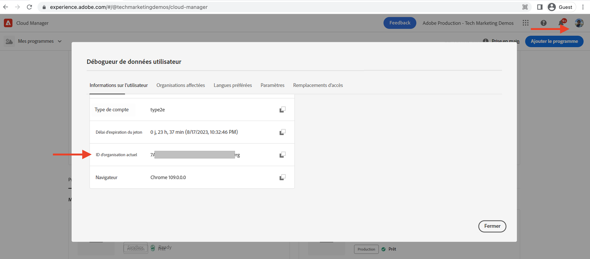
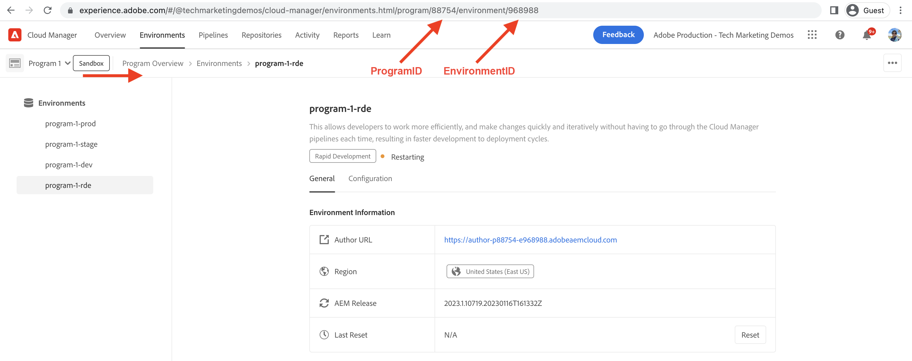

# Configurer l’environnement de développement rapide

Découvrez **comment configurer** un environnement de développement rapide (RDE) dans AEM as a Cloud Service.

Cette vidéo montre les éléments suivants :

- Ajout d’un RDE à votre programme à l’aide de Cloud Manager.
- Flux de connexion RDE à l’aide d’Adobe IMS, similaire à tout autre environnement AEM as a Cloud Service.
- Configuration de l’[interface de ligne de commande extensible Adobe I/O Runtime](https://developer.adobe.com/runtime/docs/guides/tools/cli_install/), également appelée la `aio CLI`.
- Configuration du plug-in RDE AEM et `aio CLI` Cloud Manager.

>[!VIDEO](https://video.tv.adobe.com/v/3415490?quality=12&learn=on)

## Prérequis

Les logiciels suivants doivent être installés localement :

- [Node.js](https://nodejs.org/fr/) (LTS - Prise en charge à long terme)
- [npm 8 et ultérieure.](https://docs.npmjs.com/)

## Configuration locale

Pour déployer le code et le contenu du [projet de site WKND](https://github.com/adobe/aem-guides-wknd#aem-wknd-sites-project) sur le RDE à partir de votre ordinateur local, procédez comme suit :

### Interface de ligne de commande extensible Adobe I/O Runtime

Installez l’interface de ligne de commande extensible Adobe I/O Runtime, également appelée la `aio CLI`, en exécutant la commande suivante à partir de la ligne de commande.

```shell
$ npm install -g @adobe/aio-cli
```

### Plug-ins AEM

Installez les plug-ins RDE pour Cloud Manager et AEM à l’aide de la commande `plugins:install` de la `aio cli`.

```shell
$ aio plugins:install @adobe/aio-cli-plugin-cloudmanager

$ aio plugins:install @adobe/aio-cli-plugin-aem-rde
```

Le plug-in Cloud Manager permet aux développeurs et aux développeuses d’interagir avec Cloud Manager à partir de la ligne de commande.

Le plug-in du RDE AEM permet aux développeurs et aux développeuses de déployer du code et du contenu à partir de l’ordinateur local.

En outre, pour mettre à jour les plug-ins, utilisez la commande `aio plugins:update`.

## Configurer des plug-ins AEM

Les plug-ins AEM doivent être configurés pour interagir avec votre RDE. Tout d’abord, à l’aide de l’interface utilisateur de Cloud Manager, copiez les valeurs des ID d’organisation, de programme et d’environnement.

1. ID d’organisation : copiez la valeur à partir de **Photo de profil > Informations sur le compte (interne) > Fenêtre modale > ID d’organisation actuel**.

   

1. ID de programme : copiez la valeur à partir de **Vue d’ensemble du programme > Environnements > {ProgramName}-rde > URI du navigateur > nombres entre `program/` et`/environment`**.

1. ID d’environnement : copiez la valeur à partir de **Vue d’ensemble du programme > Environnements > {ProgramName}-rde > URI du navigateur > nombres après`environment/`**.

   

1. Ensuite, en utilisant le jeu de commandes `config:set` de la `aio cli`, définissez ces valeurs en exécutant la commande suivante.

   ```shell
   $ aio config:set cloudmanager_orgid <org-id>
   
   $ aio config:set cloudmanager_programid <program-id>
   
   $ aio config:set cloudmanager_environmentid <env-id>
   ```

Vous pouvez vérifier les valeurs de configuration actuelles en exécutant la commande suivante.

```shell
$ aio config:list
```

En outre, pour changer ou savoir à quelle organisation votre connexion est actuellement établie, vous pouvez utiliser la commande ci-dessous.

```shell
$ aio where
```

## Vérifier l’accès au RDE

Vérifiez l’installation et la configuration du plug-in du RDE AEM en exécutant la commande suivante.

```shell
$ aio aem:rde:status
```

Les informations sur le statut du RDE s’affichent, comme le statut de l’environnement et la liste des lots et des configurations de _votre projet AEM_ sur les services de création et de publication.

## Étape suivante

Découvrez [comment utiliser](./how-to-use.md) un RDE pour déployer le code et le contenu de votre environnement de développement intégré (IDE) favori afin d’accélérer les cycles de développement.


## Ressources supplémentaires

[Documentation sur l’activation du RDE dans un programme](https://experienceleague.adobe.com/docs/experience-manager-cloud-service/content/implementing/developing/rapid-development-environments.html?lang=fr#enabling-rde-in-a-program)

Configurer l’[interface de ligne de commande extensible Adobe I/O Runtime](https://developer.adobe.com/runtime/docs/guides/tools/cli_install/), également appelée la `aio CLI`

[Utilisation et commandes de l’interface de ligne de commande AIO](https://github.com/adobe/aio-cli#usage)

[Module d’interface de ligne de commande Adobe I/O Runtime pour les interactions avec les environnements de développement rapide AEM](https://github.com/adobe/aio-cli-plugin-aem-rde#aio-cli-plugin-aem-rde)

[Module d’interface de ligne de commande AIO de Cloud Manager](https://github.com/adobe/aio-cli-plugin-cloudmanager)
