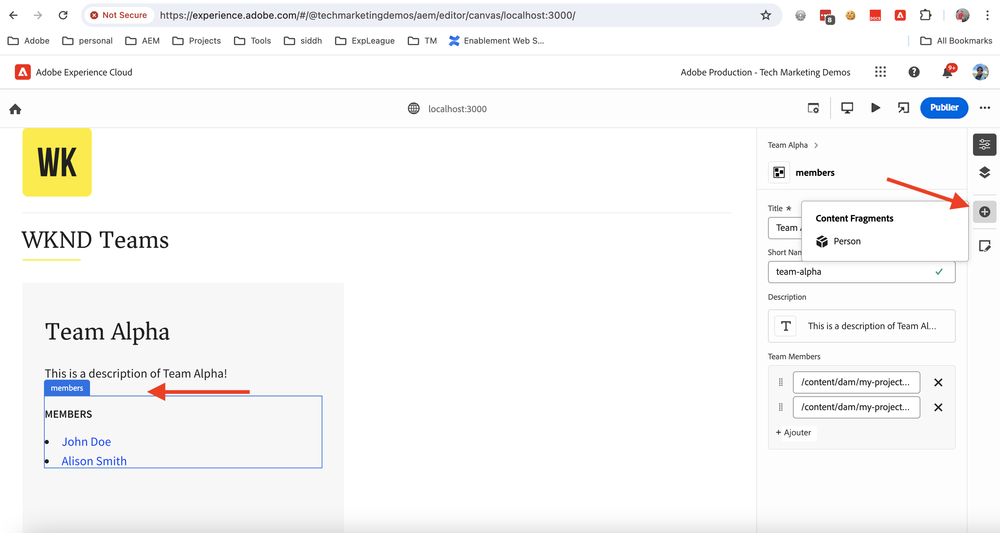

# Application React d’instrument pour modifier du contenu à l’aide d’Universal Editor

Découvrez comment instrumenter l’application React pour modifier le contenu à l’aide d’Universal Editor.

## Conditions préalables

Vous avez configuré l’environnement de développement local comme décrit à l’étape précédente [Configuration du développement local](./local-development-setup.md) .

## Inclusion de la bibliothèque principale d’Universal Editor

Commençons par inclure la bibliothèque principale Universal Editor dans l’application WKND Teams React. Il s’agit d’une bibliothèque JavaScript qui fournit la couche de communication entre l’application modifiée et l’éditeur universel.

Il existe deux manières d’inclure la bibliothèque principale Universal Editor dans l’application React :

1. Dépendance du module de noeud du registre npm, voir [@adobe/universal-editor-cors](https://www.npmjs.com/package/@adobe/universal-editor-cors).
1. Balise de script (`<script>`) dans le fichier d’HTML.

Pour ce tutoriel, nous allons utiliser l’approche de la balise de script.

1. Installez le package `react-helmet-async` pour gérer la balise `<script>` dans l’application React.

   ```bash
   $ npm install react-helmet-async
   ```

1. Mettez à jour le fichier `src/App.js` de l’application WKND Teams React pour inclure la bibliothèque principale Universal Editor.

   ```javascript
   ...
   import { Helmet, HelmetProvider } from "react-helmet-async";
   
   function App() {
   return (
       <HelmetProvider>
           <div className="App">
               <Helmet>
                   {/* AEM Universal Editor :: CORE Library
                     Loads the LATEST Universal Editor library
                   */}
                   <script
                       src="https://universal-editor-service.experiencecloud.live/corslib/LATEST"
                       async
                   />
               </Helmet>
               <Router>
                   <header>
                       <Link to={"/"}>
                       
                       </Link>
                       <hr />
                   </header>
                   <Routes>
                       <Route path="/" element={<Home />} />
                       <Route path="/person/:fullName" element={<Person />} />
                   </Routes>
               </Router>
           </div>
       </HelmetProvider>
   );
   }
   
   export default App;
   ```

## Ajout de métadonnées - source de contenu

Pour connecter l’application WKND Teams React _à la source de contenu_ en vue de la modifier, vous devez fournir des métadonnées de connexion. Le service Universal Editor utilise ces métadonnées pour établir une connexion avec la source de contenu.

Les métadonnées de connexion sont stockées sous la forme de balises `<meta>` dans le fichier d’HTML. La syntaxe des métadonnées de connexion est la suivante :

```html
<meta name="urn:adobe:aue:<category>:<referenceName>" content="<protocol>:<url>">
```

Ajoutons les métadonnées de connexion à l’application WKND Teams React au sein du composant `<Helmet>`. Mettez à jour le fichier `src/App.js` avec la balise `<meta>` suivante. Dans cet exemple, la source de contenu est une instance d’AEM locale s’exécutant sur `https://localhost:8443`.

```javascript
...
function App() {
return (
    <HelmetProvider>
        <div className="App">
            <Helmet>
                {/* AEM Universal Editor :: CORE Library
                    Loads the LATEST Universal Editor library
                */}
                <script
                    src="https://universal-editor-service.experiencecloud.live/corslib/LATEST"
                    async
                />
                {/* AEM Universal Editor :: Connection metadata 
                    Connects to local AEM instance
                */}
                <meta
                    name="urn:adobe:aue:system:aemconnection"
                    content={`aem:https://localhost:8443`}
                />
            </Helmet>
            ...
    </HelmetProvider>
);
}

export default App;
```

`aemconnection` fournit un nom court de la source de contenu. L’instrumentation suivante utilise le nom court pour faire référence à la source de contenu.

## Ajout de métadonnées - configuration locale du service Universal Editor

Au lieu du service Universal Editor hébergé par l’Adobe, une copie locale du service Universal Editor est utilisée pour le développement local. Le service local lie l’éditeur universel et le SDK AEM. Ajoutons donc les métadonnées du service Universal Editor local à l’application WKND Teams React.

Ces paramètres de configuration sont également stockés en tant que balises `<meta>` dans le fichier d’HTML. La syntaxe des métadonnées du service Universal Editor local est la suivante :

```html
<meta name="urn:adobe:aue:config:service" content="<url>">
```

Ajoutons les métadonnées de connexion à l’application WKND Teams React au sein du composant `<Helmet>`. Mettez à jour le fichier `src/App.js` avec la balise `<meta>` suivante. Dans cet exemple, le service Universal Editor local est en cours d’exécution sur `https://localhost:8001`.

```javascript
...

function App() {
  return (
    <HelmetProvider>
      <div className="App">
        <Helmet>
          {/* AEM Universal Editor :: CORE Library
              Loads the LATEST Universal Editor library
          */}
          <script
            src="https://universal-editor-service.experiencecloud.live/corslib/LATEST"
            async
          />
          {/* AEM Universal Editor :: Connection metadata 
              Connects to local AEM instance
          */}
          <meta
            name="urn:adobe:aue:system:aemconnection"
            content={`aem:https://localhost:8443`}
          />
          {/* AEM Universal Editor :: Configuration for Service
              Using locally running Universal Editor service
          */}
          <meta
            name="urn:adobe:aue:config:service"
            content={`https://localhost:8001`}
          />
        </Helmet>
        ...
    </HelmetProvider>
);
}
export default App;
```

## instrumenter les composants React

Pour modifier le contenu de l’application WKND Teams React, tel que _le titre de l’équipe et la description de l’équipe_, vous devez instrumenter les composants React. L’instrumentation consiste à ajouter des attributs de données pertinents (`data-aue-*`) aux éléments d’HTML que vous souhaitez rendre modifiables à l’aide de l’éditeur universel. Pour plus d’informations sur les attributs de données, voir [Attributs et types](https://experienceleague.adobe.com/en/docs/experience-manager-cloud-service/content/implementing/developing/universal-editor/attributes-types).

### Définition des éléments modifiables

Commençons par définir les éléments à modifier à l’aide d’Universal Editor. Dans l’application WKND Teams React, le titre et la description de l’équipe sont stockés dans le fragment de contenu de l’équipe dans AEM, ce qui constitue les meilleurs candidats pour la modification.

instrumentons le composant React `Teams` pour rendre le titre et la description de l’équipe modifiables.

1. Ouvrez le fichier `src/components/Teams.js` de l’application WKND Teams React.
1. Ajoutez l’attribut `data-aue-prop`, `data-aue-type` et `data-aue-label` aux éléments de titre et de description de l’équipe.

   ```javascript
   ...
   function Teams() {
       const { teams, error } = useAllTeams();
       ...
   
       return (
           <div className="team">
               // AEM Universal Editor :: Instrumentation using data-aue-* attributes
               <h2 className="team__title" data-aue-prop="title" data-aue-type="text" data-aue-label="title">{title}</h2>
               <p className="team__description" data-aue-prop="description" data-aue-type="richtext" data-aue-label="description">{description.plaintext}</p>
               ...
           </div>
       );
   }
   
   export default Teams;
   ```

1. Actualisez la page Universal Editor dans le navigateur qui charge l’application WKND Teams React. Vous pouvez désormais constater que les éléments de titre et de description de l’équipe sont modifiables.

   

1. Si vous essayez de modifier le titre ou la description de l’équipe à l’aide de la modification en ligne ou du rail de propriétés, un compteur de chargement s’affiche, mais vous ne pouvez pas modifier le contenu. Parce qu’Universal Editor n’a pas connaissance des détails de la ressource AEM pour le chargement et l’enregistrement du contenu.

   

En résumé, les modifications ci-dessus marquent le titre et les éléments de description de l’équipe comme étant modifiables dans l’éditeur universel. Cependant, **vous ne pouvez pas modifier (via le rail de propriétés ou intégré) et enregistrer les modifications jusqu’à**, pour cela vous devez ajouter les détails de la ressource AEM à l’aide de l’attribut `data-aue-resource` . Faisons cela à l&#39;étape suivante.

### Définition des détails AEM ressource

Pour réenregistrer le contenu modifié dans AEM et charger également le contenu dans le rail de propriétés, vous devez fournir les détails de la ressource AEM à l’éditeur universel.

Dans ce cas, la ressource AEM est le chemin d’accès Fragment de contenu d’équipe. Ajoutons donc les détails de la ressource au composant React `Teams` au niveau supérieur de l’élément `<div>`.

1. Mettez à jour le fichier `src/components/Teams.js` pour ajouter les attributs `data-aue-resource`, `data-aue-type` et `data-aue-label` à l’élément de niveau supérieur `<div>`.

   ```javascript
   ...
   function Teams() {
       const { teams, error } = useAllTeams();
       ...
   
       // Render single Team
       function Team({ _path, title, shortName, description, teamMembers }) {
           // Must have title, shortName and at least 1 team member
           if (!_path || !title || !shortName || !teamMembers) {
               return null;
           }
   
         return (
           // AEM Universal Editor :: Instrumentation using data-aue-* attributes
           <div className="team" data-aue-resource={`urn:aemconnection:${_path}/jcr:content/data/master`} data-aue-type="reference" data-aue-label={title}>
           ...
           </div>
       );
       }
   }
   export default Teams;
   ```

   La valeur de l’attribut `data-aue-resource` est le chemin d’accès AEM à la ressource du fragment de contenu de l’équipe. Le préfixe `urn:aemconnection:` utilise le nom court de la source de contenu définie dans les métadonnées de connexion.

1. Actualisez la page Universal Editor dans le navigateur qui charge l’application WKND Teams React. Vous pouvez désormais constater que l’élément de niveau supérieur de l’équipe est modifiable, mais que le rail des propriétés ne charge toujours pas le contenu. Dans l’onglet réseau du navigateur, vous pouvez voir l’erreur 401 Non autorisé pour la requête `details` qui charge le contenu. Il tente d’utiliser le jeton IMS pour l’authentification, mais le SDK AEM local ne prend pas en charge l’authentification IMS.

   

1. Pour corriger l’erreur 401 Non autorisé, vous devez fournir les détails d’authentification du SDK d’AEM local à l’éditeur universel à l’aide de l’option **En-têtes d’authentification** de l’éditeur universel. En tant que SDK d’AEM local, définissez la valeur sur `Basic YWRtaW46YWRtaW4=` pour les informations d’identification `admin:admin`.

   

1. Actualisez la page Universal Editor dans le navigateur qui charge l’application WKND Teams React. Vous pouvez désormais constater que le rail de propriétés charge le contenu et que vous pouvez modifier le titre et la description de l’équipe en ligne ou à l’aide du rail de propriétés.

   

#### Sous le capot

Le rail de propriétés charge le contenu de la ressource AEM à l’aide du service local Universal Editor. À l’aide de l’onglet réseau du navigateur, vous pouvez voir la demande du POST au service local Universal Editor (`https://localhost:8001/details`) pour le chargement du contenu.

Lorsque vous modifiez le contenu à l’aide du rail de modification ou de propriétés intégré, les modifications sont réenregistrées dans la ressource AEM à l’aide du service local Universal Editor. À l’aide de l’onglet réseau du navigateur, vous pouvez voir la demande du POST au service local Universal Editor (`https://localhost:8001/update` ou `https://localhost:8001/patch`) pour l’enregistrement du contenu.


L’objet JSON de payload de requête contient les détails nécessaires tels que le serveur de contenu (`connections`), le chemin d’accès à la ressource (`target`) et le contenu mis à jour (`patch`).


### Développer le contenu modifiable

Développons le contenu modifiable et appliquons l’instrumentation aux **membres de l’équipe** afin que vous puissiez modifier les membres de l’équipe à l’aide du rail de propriétés.

Comme ci-dessus, ajoutons les attributs `data-aue-*` pertinents aux membres de l’équipe dans le composant React `Teams`.

1. Mettez à jour le fichier `src/components/Teams.js` pour ajouter des attributs de données à l’élément `<li key={index} className="team__member">`.

   ```javascript
   ...
   function Teams() {
       const { teams, error } = useAllTeams();
       ...
   
       <div>
           <h4 className="team__members-title">Members</h4>
           <ul className="team__members">
               {/* Render the referenced Person models associated with the team */}
               {teamMembers.map((teamMember, index) => {
                   return (
                       // AEM Universal Editor :: Instrumentation using data-aue-* attributes
                       <li key={index} className="team__member" data-aue-resource={`urn:aemconnection:${teamMember?._path}/jcr:content/data/master`} data-aue-type="component" data-aue-label={teamMember.fullName}>
                       <Link to={`/person/${teamMember.fullName}`}>
                           {teamMember.fullName}
                       </Link>
                       </li>
                   );
               })}
           </ul>
       </div>
       ...
   }
   export default Teams;
   ```

   La valeur de l’attribut `data-aue-type` est `component`, car les membres de l’équipe sont stockés en tant que `Person` fragments de contenu dans AEM et permettent d’indiquer les parties déplaçables/pouvant être supprimées du contenu.

1. Actualisez la page Universal Editor dans le navigateur qui charge l’application WKND Teams React. Vous pouvez désormais constater que les membres de l’équipe sont modifiables à l’aide du rail de propriétés.

   

#### Sous le capot

Comme ci-dessus, la récupération et l’enregistrement du contenu sont effectués par le service local Universal Editor. Les demandes `/details`, `/update` ou `/patch` sont envoyées au service local Universal Editor pour le chargement et l’enregistrement du contenu.

### Définition et suppression de contenu

Jusqu’à présent, vous avez rendu le contenu existant modifiable, mais que se passe-t-il si vous souhaitez ajouter un nouveau contenu ? Ajoutons la possibilité d’ajouter ou de supprimer des membres de l’équipe WKND à l’aide de l’éditeur universel. Par conséquent, les auteurs de contenu n’ont pas besoin d’accéder à l’AEM pour ajouter ou supprimer des membres de l’équipe.

Cependant, en résumé rapide, les membres de l’équipe WKND sont stockés en tant que fragments de contenu `Person` dans AEM et sont associés au fragment de contenu de l’équipe à l’aide de la propriété `teamMembers` . Pour passer en revue la définition de modèle dans AEM visite [my-project](http://localhost:4502/libs/dam/cfm/models/console/content/models.html/conf/my-project).

1. Commencez par créer le fichier de définition de composant `/public/static/component-definition.json`. Ce fichier contient la définition du composant pour le fragment de contenu `Person`. Le module externe `aem/cf` permet d’insérer des fragments de contenu, en fonction d’un modèle et d’un modèle fournissant les valeurs par défaut à appliquer.

   ```json
   {
       "groups": [
           {
           "title": "Content Fragments",
           "id": "content-fragments",
           "components": [
               {
               "title": "Person",
               "id": "person",
               "plugins": {
                   "aem": {
                       "cf": {
                           "name": "person",
                           "cfModel": "/conf/my-project/settings/dam/cfm/models/person",
                           "cfFolder": "/content/dam/my-project/en",
                           "title": "person",
                           "template": {
                               "fullName": "New Person",
                               "biographyText": "This is biography of new person"
                               }
                           }
                       }
                   }
               }
           ]
           }
       ]
   }
   ```

1. Reportez-vous ensuite au fichier de définition de composant ci-dessus dans `index.html` de l’application React de l’équipe WKND. Mettez à jour la section `<head>` du fichier `public/index.html` pour inclure le fichier de définition de composant.

   ```html
   ...
   <script
       type="application/vnd.adobe.aue.component+json"
       src="/static/component-definition.json"
   ></script>
   <title>WKND App - Basic GraphQL Tutorial</title>
   </head>
   ...
   ```

1. Enfin, mettez à jour le fichier `src/components/Teams.js` pour ajouter des attributs de données. La section **MEMBERS** pour agir comme conteneur pour les membres de l’équipe, ajoutons les attributs `data-aue-prop`, `data-aue-type` et `data-aue-label` à l’élément `<div>`.

   ```javascript
   ...
   function Teams() {
       const { teams, error } = useAllTeams();
       ...
   
       {/* AEM Universal Editor :: Team Members as container */}
       <div data-aue-prop="teamMembers" data-aue-type="container" data-aue-label="members">
           <h4 className="team__members-title">Members</h4>
           <ul className="team__members">
           {/* Render the referenced Person models associated with the team */}
           {teamMembers.map((teamMember, index) => {
               return (
               // AEM Universal Editor :: Instrumentation using data-aue-* attributes
               <li key={index} className="team__member" data-aue-resource={`urn:aemconnection:${teamMember?._path}/jcr:content/data/master`} data-aue-type="component" data-aue-label={teamMember.fullName}>
                   <Link to={`/person/${teamMember.fullName}`}>
                   {teamMember.fullName}
                   </Link>
               </li>
               );
           })}
           </ul>
       </div>
       ...
   }
   export default Teams;
   ```

1. Actualisez la page Universal Editor dans le navigateur qui charge l’application WKND Teams React. Vous pouvez désormais constater que la section **MEMBERS** agit comme un conteneur. Vous pouvez insérer de nouveaux membres de l’équipe à l’aide du rail de propriétés et de l’icône **+** .

   

1. Pour supprimer un membre de l’équipe, sélectionnez-le et cliquez sur l’icône **Supprimer** .

   

#### Sous le capot

Les opérations d’ajout et de suppression de contenu sont effectuées par le service local Universal Editor. La demande du POST à `/add` ou `/remove` avec une charge utile détaillée est envoyée au service local Universal Editor pour ajouter ou supprimer le contenu à l’AEM.

## Fichiers de solution

Pour vérifier vos modifications de mise en oeuvre ou si vous ne parvenez pas à ce que l’application WKND Teams React fonctionne avec l’éditeur universel, reportez-vous à la branche de solution [basic-tutorial-instrumenting-for-UE](https://github.com/adobe/aem-guides-wknd-graphql/tree/solution/basic-tutorial-instrumented-for-UE) .

La comparaison fichier par fichier avec la branche **basic-tutorial** opérationnelle est disponible [ici](https://github.com/adobe/aem-guides-wknd-graphql/compare/solution/basic-tutorial...solution/basic-tutorial-instrumented-for-UE?expand=1).

## Félicitations.

Vous avez réussi à instrumenter l’application WKND Teams React pour ajouter, modifier et supprimer du contenu à l’aide d’Universal Editor. Vous avez appris à inclure la bibliothèque principale, à ajouter la connexion et les métadonnées du service Universal Editor local et à instrumenter le composant React à l’aide de divers attributs de données (`data-aue-*`).
