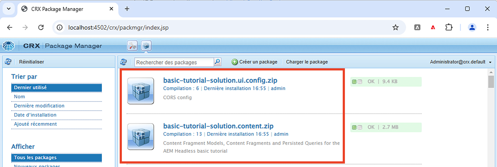
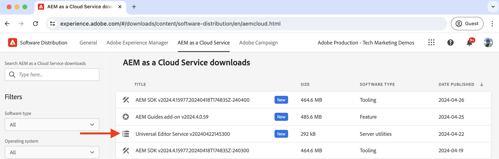
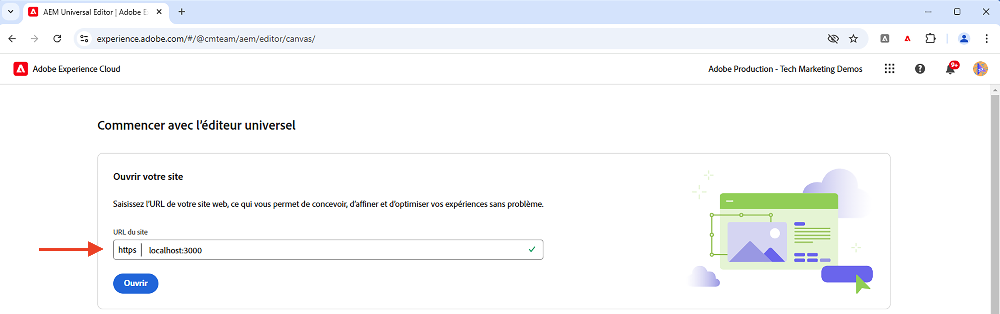
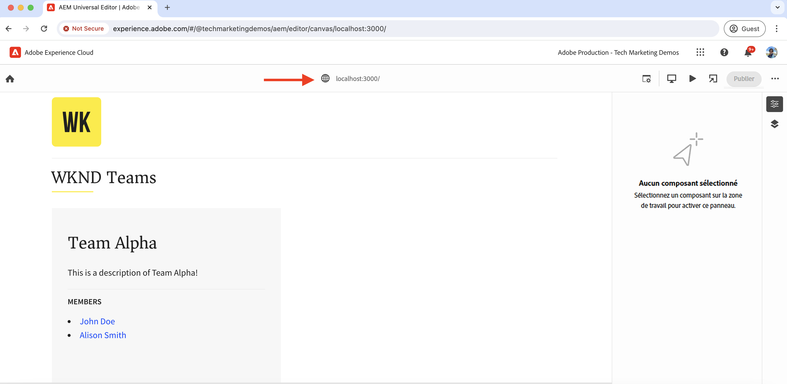

# Configuration du développement local

Découvrez comment configurer un environnement de développement local pour modifier le contenu d’une application React à l’aide de l’éditeur universel d’AEM.

## Prérequis

Pour suivre ce tutoriel, vous devez suivre les étapes ci-après :

- Compétences de base en HTML et JavaScript.
- Les outils suivants doivent être installés localement :
   - [Node.js](https://nodejs.org/fr/download/)
   - [Git](https://git-scm.com/downloads)
   - Un éditeur IDE ou de code, tel que [Visual Studio Code](https://code.visualstudio.com/)
- Téléchargez et installez les éléments suivants :
   - [SDK AEM as a Cloud Service](https://experienceleague.adobe.com/fr/docs/experience-manager-learn/cloud-service/local-development-environment-set-up/aem-runtime#download-the-aem-as-a-cloud-service-sdk) : contient le fichier Quickstart Jar utilisé pour exécuter les instances de création et de publication d’AEM localement à des fins de développement.
   - [Service Éditeur universel](https://experienceleague.adobe.com/r/docs/experience-cloud/software-distribution/home) : copie locale du service Éditeur universel, il comporte un sous-ensemble de fonctionnalités et peut être téléchargé à partir du portail de distribution logicielle.
   - [local-ssl-proxy](https://www.npmjs.com/package/local-ssl-proxy#local-ssl-proxy) : proxy HTTP SSL local simple utilisant un certificat auto-signé pour le développement local. L’éditeur universel d’AEM requiert l’URL HTTPS de l’application React pour la charger dans l’éditeur.

## Configuration locale

Pour installer l’environnement de développement local, procédez comme suit :

### SDK AEM

Pour fournir le contenu de l’application React WKND Teams, installez les packages suivants dans le SDK AEM local.

- [WKND Teams - Package de contenu](./assets/basic-tutorial-solution.content.zip) : contient les modèles de fragment de contenu, les fragments de contenu et les requêtes GraphQL persistantes.
- [WKND Teams - Package de configuration](./assets/basic-tutorial-solution.ui.config.zip) : contient les configurations CORS (Cross-Origin Resource Sharing) et de gestionnaire d’authentification du jeton. La norme CORS facilite les propriétés web non AEM pour effectuer des appels côté client basés sur un navigateur vers l’API GraphQL d’AEM et le gestionnaire d’authentification du jeton est utilisé pour authentifier chaque demande vers AEM.

  

### Application React

Pour configurer l’application React WKND Teams, procédez comme suit :

1. Clonez l’[application React WKND Teams](https://github.com/adobe/aem-guides-wknd-graphql/tree/solution/basic-tutorial) de la branche de solution `basic-tutorial`.

   ```bash
   $ git clone -b solution/basic-tutorial git@github.com:adobe/aem-guides-wknd-graphql.git
   ```

1. Accédez au répertoire `basic-tutorial` et ouvrez-le dans votre éditeur de code.

   ```bash
   $ cd aem-guides-wknd-graphql/basic-tutorial
   $ code .
   ```

1. Installez les dépendances et démarrez l’application React.

   ```bash
   $ npm install
   $ npm start
   ```

1. Ouvrez l’application React WKND Teams dans votre navigateur à l’adresse [http://localhost:3000](http://localhost:3000). Elle affiche la liste des personnes membres de l’équipe et leurs détails. Le contenu de l’application React est fourni par le SDK AEM local à l’aide des API GraphQL (`/graphql/execute.json/my-project/all-teams`), que vous pouvez vérifier à l’aide de l’onglet réseau du navigateur.

   

### Service Éditeur universel

Pour configurer le service **local** Éditeur universel, procédez comme suit :

1. Téléchargez la dernière version de l’éditeur universel à partir du [Portail de distribution logicielle](https://experience.adobe.com/downloads).

   

1. Extrayez le fichier ZIP téléchargé et copiez le fichier `universal-editor-service.cjs` dans un nouveau répertoire appelé `universal-editor-service`.

   ```bash
   $ unzip universal-editor-service-vproduction-<version>.zip
   $ mkdir universal-editor-service
   $ cp universal-editor-service.cjs universal-editor-service
   ```

1. Créez le fichier `.env` dans le répertoire `universal-editor-service` et ajoutez les variables d’environnement suivantes :

   ```bash
   # The port on which the Universal Editor service runs
   UES_PORT=8000
   # Disable SSL verification
   UES_TLS_REJECT_UNAUTHORIZED=false
   ```

1. Démarrez le service local Éditeur universel.

   ```bash
   $ cd universal-editor-service
   $ node universal-editor-service.cjs
   ```

La commande ci-dessus lance le service Éditeur universel sur le port `8000` et vous devriez voir la sortie suivante :

```bash
Either no private key or certificate was set. Starting as HTTP server
Universal Editor Service listening on port 8000 as HTTP Server
```

### Proxy HTTP SSL local

L’éditeur universel d’AEM exige que l’application React soit diffusée via HTTPS. Configurons un proxy HTTP SSL local qui utilise un certificat auto-signé pour le développement local.

Suivez les étapes ci-dessous pour configurer le proxy HTTP SSL local et diffuser le SDK AEM et le service Éditeur universel via HTTPS :

1. Installez le package `local-ssl-proxy` de manière globale.

   ```bash
   $ npm install -g local-ssl-proxy
   ```

1. Démarrez deux instances du proxy HTTP SSL local pour les services suivants :

   - SDL AEM local du proxy HTTP SSL sur le port `8443`.
   - Proxy HTTP SSL local du service Éditeur universel sur le port `8001`.

   ```bash
   # AEM SDK local SSL HTTP proxy on port 8443
   $ local-ssl-proxy --source 8443 --target 4502
   
   # Universal Editor service local SSL HTTP proxy on port 8001
   $ local-ssl-proxy --source 8001 --target 8000
   ```

### Mettre à jour l’application React pour utiliser HTTPS

Pour activer HTTPS pour l’application React WKND Teams, procédez comme suit :

1. Arrêtez l’application React en appuyant sur `Ctrl + C` dans le terminal.
1. Mettez à jour le fichier `package.json` pour inclure la variable d’environnement `HTTPS=true` dans le script `start`.

   ```json
   "scripts": {
       "start": "HTTPS=true react-scripts start",
       ...
   }
   ```

1. Mettez à jour `REACT_APP_HOST_URI` dans le fichier `.env.development` pour utiliser le protocole HTTPS et le port proxy HTTP SSL local du SDK AEM.

   ```bash
   REACT_APP_HOST_URI=https://localhost:8443
   ...
   ```

1. Mettez à jour le fichier `../src/proxy/setupProxy.auth.basic.js` pour utiliser des paramètres SSL souples à l’aide de l’option `secure: false`.

   ```javascript
   ...
   module.exports = function(app) {
   app.use(
       ['/content', '/graphql'],
       createProxyMiddleware({
       target: REACT_APP_HOST_URI,
       changeOrigin: true,
       secure: false, // Ignore SSL certificate errors
       // pass in credentials when developing against an Author environment
       auth: `${REACT_APP_BASIC_AUTH_USER}:${REACT_APP_BASIC_AUTH_PASS}`
       })
   );
   };
   ```

1. Démarrez l’application React.

   ```bash
   $ npm start
   ```

## Vérifier la configuration

Après avoir configuré l’environnement de développement local en suivant les étapes ci-dessus, nous allons vérifier la configuration.

### Vérification locale

Assurez-vous que les services suivants s’exécutent localement sur HTTPS. Vous devrez peut-être accepter l’avertissement de sécurité dans le navigateur pour le certificat auto-signé :

1. Application React WKND Teams sur [https://localhost:3000](https://localhost:3000)
1. SDK AEM sur [https://localhost:8443](https://localhost:8443)
1. Service Éditeur universel sur [https://localhost:8001](https://localhost:8001)

### Charger l’application React WKND Teams dans l’éditeur universel

Chargeons l’application React WKND Teams dans l’éditeur universel pour vérifier la configuration :

1. Ouvrez l’éditeur universel https://experience.adobe.com/#/aem/editor dans votre navigateur. Si on vous y invite, connectez-vous à l’aide de votre Adobe ID.

1. Saisissez l’URL de l’application React WKND Teams dans le champ de saisie URL du site de l’éditeur universel et cliquez sur `Open`.

   

1. L’application React WKND Teams se charge dans l’éditeur universel, **mais vous ne pouvez pas encore modifier le contenu**. Vous devez utiliser l’application React pour activer la modification de contenu à l’aide de l’éditeur universel.

   


## Étape suivante

Découvrez comment [instrumentaliser l’application React pour modifier le contenu](./instrument-to-edit-content.md).
