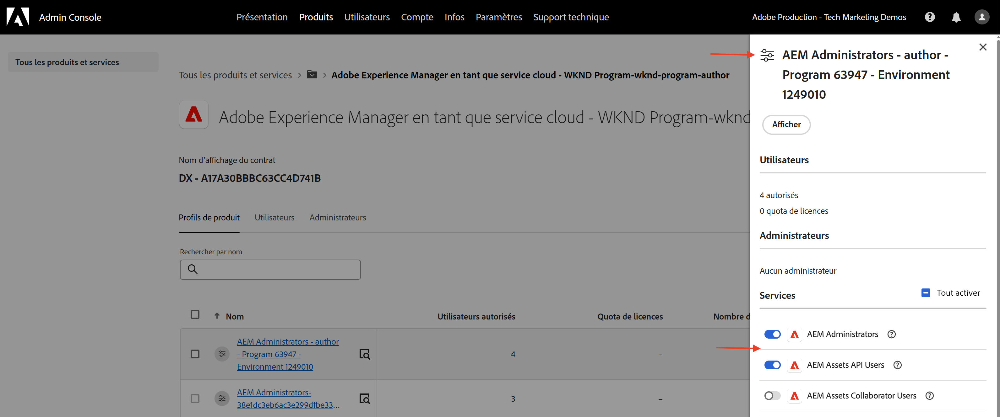
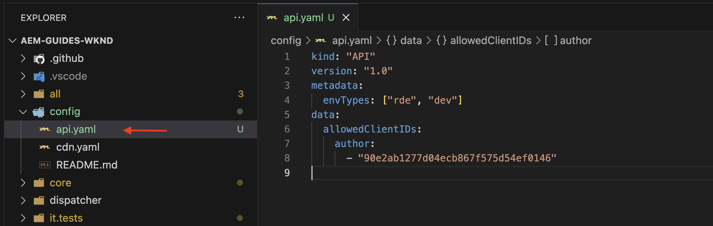
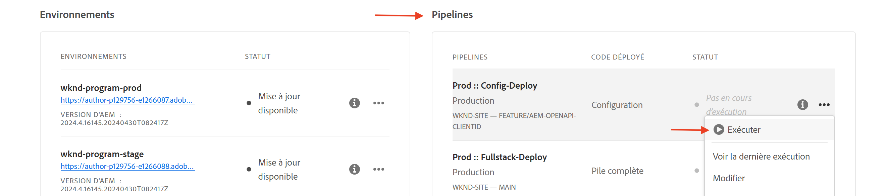
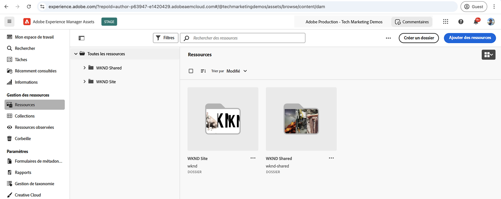
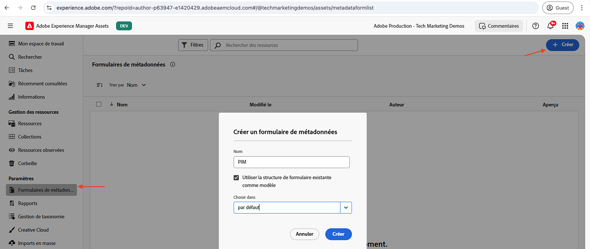
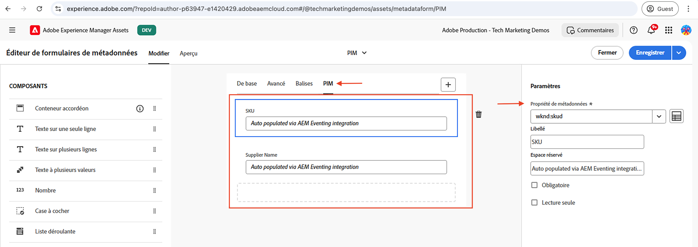
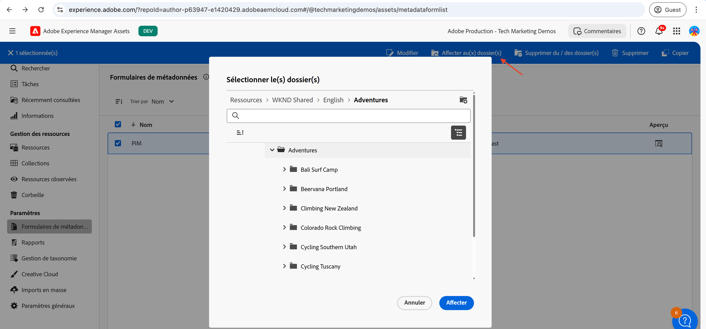

# Événements AEM Assets pour l’intégration PIM

>[!IMPORTANT]
>
>Ce tutoriel utilise des API AEM basées sur OpenAPI. Ils sont disponibles dans le cadre d’un programme d’accès anticipé. Si vous souhaitez y accéder, nous vous encourageons à envoyer un e-mail à l’adresse [aem-apis@adobe.com](mailto:aem-apis@adobe.com) avec une description de votre cas d’utilisation.

Découvrez comment recevoir un événement AEM et agir sur celui-ci pour mettre à jour l’état du contenu dans AEM à l’aide de l’API de création Assets basée sur OpenAPI.

Le traitement de l’événement reçu dépend des besoins de l’entreprise. Par exemple, les données d’événement peuvent être utilisées pour mettre à jour le système tiers ou AEM, ou les deux.

Cet exemple montre comment un système tiers, tel qu’un système de gestion des informations produit (PIM), peut être intégré à AEM as a Cloud Service Assets. Lors de la réception d’un événement AEM Assets, il est traité pour récupérer des métadonnées supplémentaires à partir du système PIM et mettre à jour les métadonnées de la ressource dans AEM. Les métadonnées des ressources mises à jour peuvent inclure des informations supplémentaires telles que le SKU, le nom du fournisseur ou d’autres détails du produit.

Pour recevoir et traiter l’événement AEM Assets, la [Adobe I/O Runtime](https://developer.adobe.com/runtime/docs/guides/overview/what_is_runtime/), une plateforme sans serveur est utilisée. Cependant, d’autres systèmes de traitement des événements tels que Webhook dans votre système tiers ou Amazon EventBridge peuvent également être utilisés.

Le flux de haut niveau de l’intégration est le suivant :


1. Le service de création AEM déclenche un événement _Traitement des ressources terminé_ lorsqu’un chargement de ressources est terminé et que toutes les activités de traitement des ressources sont également terminées. L’attente de la fin du traitement des ressources garantit que tout traitement prêt à l’emploi, tel que l’extraction des métadonnées, est terminé.
1. L’événement est envoyé au service [Événements Adobe I/O](https://developer.adobe.com/events/).
1. Le service Événements Adobe I/O transmet l’événement à l’[action Adobe I/O Runtime](https://developer.adobe.com/runtime/docs/guides/using/creating_actions/) pour traitement.
1. L’action Adobe I/O Runtime appelle l’API du système PIM pour récupérer des métadonnées supplémentaires telles que le SKU, les informations sur le fournisseur ou d’autres détails.
1. Les métadonnées supplémentaires récupérées à partir du PIM sont ensuite mises à jour dans AEM Assets à l’aide de l’API de création [Assets basée sur OpenAPI](https://developer.adobe.com/experience-cloud/experience-manager-apis/api/experimental/assets/author/).

## Conditions préalables

Les éléments suivants sont requis afin de terminer ce tutoriel :

- Environnement AEM as a Cloud Service avec [AEM Eventing activé](https://developer.adobe.com/experience-cloud/experience-manager-apis/guides/events/#enable-aem-events-on-your-aem-cloud-service-environment). L’exemple de projet [Sites WKND](https://github.com/adobe/aem-guides-wknd?#aem-wknd-sites-project) doit être déployé dessus.

- Accès à [Adobe Developer Console](https://developer.adobe.com/developer-console/docs/guides/getting-started).

- [Interface de ligne de commande d’Adobe Developer](https://developer.adobe.com/runtime/docs/guides/tools/cli_install/) installée sur votre ordinateur local.

## Étapes de développement

Les étapes de développement générales sont les suivantes :

1. [ Modernisation de l’environnement AEM as a Cloud Service ](https://experienceleague.adobe.com/fr/docs/experience-manager-learn/cloud-service/aem-apis/invoke-openapi-based-aem-apis#modernization-of-aem-as-a-cloud-service-environment)
1. [Activer l’accès aux API AEM](https://experienceleague.adobe.com/fr/docs/experience-manager-learn/cloud-service/aem-apis/invoke-openapi-based-aem-apis#enable-aem-apis-access)
1. [Créer un projet dans Adobe Developer Console (ADC)](./runtime-action.md#Create-project-in-Adobe-Developer-Console)
1. [Initialiser le projet de développement local](./runtime-action.md#initialize-project-for-local-development)
1. Configurer le projet dans ADC
1. Configurer le service de création AEM pour activer la communication du projet ADC
1. Développer une action d’exécution à orchestrer
   1. extraction de métadonnées à partir du système PIM
   1. mise à jour des métadonnées dans AEM Assets à l’aide de l’API de création Assets
1. Création et application d’un schéma de métadonnées de ressource
1. Vérification du chargement des ressources et de la mise à jour des métadonnées

Pour plus d’informations sur les étapes 1 et 2, reportez-vous au guide [Appeler les API AEM basées sur OpenAPI](https://experienceleague.adobe.com/fr/docs/experience-manager-learn/cloud-service/aem-apis/invoke-openapi-based-aem-apis) et pour les étapes 3 et 4, reportez-vous à l’exemple [Action Adobe I/O Runtime et Événements AEM](./runtime-action.md#). Pour les étapes 5 à 9, reportez-vous aux sections suivantes.

### Configurer le projet dans Adobe Developer Console (ADC)

Pour recevoir les événements AEM Assets et exécuter l’action Adobe I/O Runtime créée à l’étape précédente, configurez le projet dans ADC.

- Dans ADC, accédez au [projet](https://developer.adobe.com/console/projects) que vous avez créé à l’étape 3. Dans ce projet, sélectionnez l’espace de travail `Stage` où l’action d’exécution est déployée lorsque vous l’exécutez `aio app deploy` dans le cadre des instructions de l’étape 4.

- Cliquez sur le bouton **Ajouter un service** et sélectionnez l’option **Événement**. Dans la boîte de dialogue **Ajouter des événements**, sélectionnez **Experience Cloud** > **AEM Assets**, puis cliquez sur **Suivant**.
  

- À l’étape **Configurer l’enregistrement d’événement**, sélectionnez l’instance AEMCS souhaitée, puis l’événement _Traitement des ressources terminé_ et le type d’authentification OAuth de serveur à serveur.

  

- Enfin, à l’étape **Comment recevoir des événements**, développez l’option **Action d’exécution** et sélectionnez l’action _générique_ créée à l’étape précédente. Cliquez sur **Enregistrer les événements configurés**.

  

- De même, cliquez sur le bouton **Ajouter un service** et sélectionnez l’option **API**. Dans la boîte de dialogue modale **Ajouter une API**, sélectionnez **Experience Cloud** > **API de création AEM Assets** et cliquez sur **Suivant**.

  

- Sélectionnez ensuite **OAuth de serveur à serveur** comme type d’authentification et cliquez sur **Suivant**.

- Sélectionnez ensuite le **profil de produit** approprié associé à l’environnement AEM Assets à partir duquel l’événement est généré et disposez d’un accès suffisant pour y mettre à jour les ressources. Enfin, cliquez sur le bouton **Enregistrer l’API configurée**.

  

  Dans mon cas, le profil de produit _Administrateurs AEM - auteur - Programme XXX - Environnement YYYY_ est sélectionné, le service **Utilisateurs de l’API AEM Assets** est activé.

  

## Configurer l’instance AEM pour activer la communication de projet ADC

Pour permettre à l’ID client des informations d’identification OAuth de serveur à serveur du projet ADC de communiquer avec l’instance AEM, vous devez configurer l’instance AEM.

Pour ce faire, définissez la configuration dans le fichier `api.yaml` du projet AEM. Déployez ensuite le fichier `api.yaml` à l’aide du pipeline de configuration dans le Cloud Manager.

- Dans AEM Project, recherchez ou créez le fichier `api.yaml` à partir du dossier `config` .

  

- Ajoutez la configuration suivante au fichier `api.yaml`.

  ```yaml
  kind: "API"
  version: "1.0"
  metadata: 
      envTypes: ["dev", "stage", "prod"]
  data:
      allowedClientIDs:
          author:
          - "<ADC Project's OAuth Server-to-Server credential ClientID>"
  ```

  Remplacez `<ADC Project's OAuth Server-to-Server credential ClientID>` par l’ID client réel des informations d’identification OAuth de serveur à serveur du projet ADC.

  >[!CAUTION]
  >
  > À des fins de démonstration, le même ClientID est utilisé pour tous les environnements. Il est recommandé d’utiliser des ID client distincts par environnement (développement, évaluation, production) pour une meilleure sécurité et un meilleur contrôle.


- Validez les modifications de configuration dans le référentiel Git et transmettez les modifications au référentiel distant.

- Déployez les modifications ci-dessus à l’aide du pipeline de configuration dans le Cloud Manager. Notez que le fichier `api.yaml` peut également être installé dans un RDE à l’aide de l’outil de ligne de commande.

  

### Développer une action Runtime

Pour effectuer la récupération et la mise à jour des métadonnées, commencez par mettre à jour le code d’action _générique_ créé automatiquement dans le dossier `src/dx-excshell-1/actions/generic`.

Reportez-vous au fichier [WKND-Assets-PIM-Integration.zip](../assets/examples/assets-pim-integration/WKND-Assets-PIM-Integration.zip) joint pour obtenir le code complet et la section ci-dessous met en évidence les fichiers essentiels.

- Le fichier `src/dx-excshell-1/actions/generic/mockPIMCommunicator.js` imite l’appel de l’API PIM pour récupérer des métadonnées supplémentaires telles que le SKU et le nom du fournisseur. Ce fichier est utilisé à des fins de démonstration. Une fois que le flux de bout en bout fonctionne, remplacez cette fonction par un appel à votre véritable système PIM pour récupérer les métadonnées de la ressource.

  ```javascript
  /**
   * Mock PIM API to get the product data such as SKU, Supplier, etc.
   *
   * In a real-world scenario, this function would call the PIM API to get the product data.
   * For this example, we are returning mock data.
   *
   * @param {string} assetId - The assetId to get the product data.
   */
  module.exports = {
      async getPIMData(assetId) {
          if (!assetId) {
          throw new Error('Invalid assetId');
          }
          // Mock response data for demo purposes
          const data = {
          SKUID: 'MockSKU 123',
          SupplierName: 'mock-supplier',
          // ... other product data
          };
          return data;
      },
  };
  ```

- Le fichier `src/dx-excshell-1/actions/generic/aemCommunicator.js` met à jour les métadonnées de la ressource dans AEM à l’aide de l’[API de création Assets](https://developer.adobe.com/experience-cloud/experience-manager-apis/api/experimental/assets/author/).

  ```javascript
  const fetch = require('node-fetch');
  ...
  /**
  *  Get IMS Access Token using Client Credentials Flow
  *
  * @param {*} clientId - IMS Client ID from ADC project's OAuth Server-to-Server Integration
  * @param {*} clientSecret - IMS Client Secret from ADC project's OAuth Server-to-Server Integration
  * @param {*} scopes - IMS Meta Scopes from ADC project's OAuth Server-to-Server Integration as comma separated strings
  * @returns {string} - Returns the IMS Access Token
  */
  async function getIMSAccessToken(clientId, clientSecret, scopes) {
    const adobeIMSV3TokenEndpointURL = 'https://ims-na1.adobelogin.com/ims/token/v3';
    const options = {
      method: 'POST',
      headers: {
        'Content-Type': 'application/x-www-form-urlencoded',
      },
      body: `grant_type=client_credentials&client_id=${clientId}&client_secret=${clientSecret}&scope=${scopes}`,
    };
    const response = await fetch(adobeIMSV3TokenEndpointURL, options);
    const responseJSON = await response.json();
    return responseJSON.access_token;
  }    
  async function updateAEMAssetMetadata(metadataDetails, aemAssetEvent, params) {
    ...
    // Transform the metadata details to JSON Patch format,
    // see https://developer.adobe.com/experience-cloud/experience-manager-apis/api/experimental/assets/author/#operation/patchAssetMetadata
    const transformedMetadata = Object.keys(metadataDetails).map((key) => ({
      op: 'add',
      path: `wknd-${key.toLowerCase()}`,
      value: metadataDetails[key],
    }));
    ...
    // Get ADC project's OAuth Server-to-Server Integration credentials
    const clientId = params.ADC_CECREDENTIALS_CLIENTID;
    const clientSecret = params.ADC_CECREDENTIALS_CLIENTSECRET;
    const scopes = params.ADC_CECREDENTIALS_METASCOPES;
    // Get IMS Access Token using Client Credentials Flow
    const access_token = await getIMSAccessToken(clientId, clientSecret, scopes);
    // Call AEM Author service to update the metadata using Assets Author API
    // See https://developer.adobe.com/experience-cloud/experience-manager-apis/api/experimental/assets/author/
    const res = await fetch(`${aemAuthorHost}/adobe/assets/${assetId}/metadata`, {
      method: 'PATCH',
      headers: {
        'Content-Type': 'application/json-patch+json',
        'If-Match': '*',
        'X-Adobe-Accept-Experimental': '1',
        'X-Api-Key': 'aem-assets-management-api', // temporary value
        Authorization: `Bearer ${access_token}`,
      },
      body: JSON.stringify(transformedMetadata),
    });
    ...
  }
  module.exports = { updateAEMAssetMetadata };
  ```

  Le fichier `.env` stocke les informations d&#39;identification OAuth de serveur à serveur du projet ADC, et elles sont transmises en tant que paramètres à l&#39;action à l&#39;aide du fichier `ext.config.yaml`. Consultez également les [fichiers de configuration du créateur d’applications](https://developer.adobe.com/app-builder/docs/guides/configuration/) pour la gestion des secrets et des paramètres d’action.
- Le dossier `src/dx-excshell-1/actions/model` contient les fichiers `aemAssetEvent.js` et `errors.js`, qui sont utilisés par l’action pour analyser l’événement reçu et gérer les erreurs, respectivement.
- Le fichier `src/dx-excshell-1/actions/generic/index.js` utilise les modules mentionnés ci-dessus pour orchestrer la récupération et la mise à jour des métadonnées.

  ```javascript
  ...
  let responseMsg;
  // handle the challenge probe request, they are sent by I/O to verify the action is valid
  if (params.challenge) {
    logger.info('Challenge probe request detected');
    responseMsg = JSON.stringify({ challenge: params.challenge });
  } else {
    logger.info('AEM Asset Event request received');
    // create AEM Asset Event object from request parameters
    const aemAssetEvent = new AEMAssetEvent(params);
    // Call mock PIM API to get the product data such as SKU, Supplier, etc.
    const mockPIMData = await mockPIMAPI.getPIMData(
      aemAssetEvent.getAssetName(),
    );
    logger.info('Mock PIM API response', mockPIMData);
    // Update PIM received data in AEM as Asset metadata
    const aemUpdateStatus = await updateAEMAssetMetadata(
      mockPIMData,
      aemAssetEvent,
      params,
    );
    logger.info('AEM Asset metadata update status', aemUpdateStatus);
    if (aemUpdateStatus) {
      // create response message
      responseMsg = JSON.stringify({
        message:
          'AEM Asset Event processed successfully, updated the asset metadata with PIM data.',
        assetdata: {
          assetName: aemAssetEvent.getAssetName(),
          assetPath: aemAssetEvent.getAssetPath(),
          assetId: aemAssetEvent.getAssetId(),
          aemHost: aemAssetEvent.getAEMHost(),
          pimdata: mockPIMData,
        },
      });
    } 
    // response object
    const response = {
      statusCode: 200,
      body: responseMsg,
    };
    // Return the response to the caller
    return response;
    ...
  }
  ```

- Déployez l’action mise à jour sur Adobe I/O Runtime à l’aide de la commande suivante :

  ```bash
  $ aio app deploy
  ```

### Création et application d’un schéma de métadonnées de ressource

Par défaut, le projet WKND Sites ne dispose pas du schéma de métadonnées de ressource pour afficher les métadonnées spécifiques à PIM telles que le SKU, le nom du fournisseur, etc. Créons et appliquons le schéma de métadonnées de la ressource à un dossier de ressources dans l’instance AEM.

1. Connectez-vous à l’instance AEM as a Cloud Service Asset et dans la [vue des ressources](https://experienceleague.adobe.com/fr/docs/experience-manager-learn/assets/authoring/switch-views).

   

1. Accédez à l’option **Paramètres** > **Forms de métadonnées** dans le rail de gauche, puis cliquez sur le bouton **Créer**. Dans la boîte de dialogue **Créer un formulaire de métadonnées**, saisissez les détails suivants, puis cliquez sur **Créer**.
   - Nom : `PIM`
   - Utiliser la structure de formulaire existante comme modèle : `Check`
   - Choisir parmi : `default`

   

1. Cliquez sur l’icône **+** pour ajouter un nouvel onglet **PIM** et y ajouter des composants **Texte monoligne**.

   

   Le tableau suivant répertorie les propriétés de métadonnées et les champs correspondants.

   | Libellé | Espace réservé | Propriété de métadonnées |
   | --- | --- | --- |
   | SKU | Renseigné automatiquement via l’intégration de l’événement AEM | `wknd-skuid` |
   | Nom du fournisseur | Renseigné automatiquement via l’intégration de l’événement AEM | `wknd-suppliername` |

1. Cliquez sur **Enregistrer** et **Fermer** pour enregistrer le formulaire de métadonnées.

1. Enfin, appliquez le schéma de métadonnées **PIM** au dossier **PIM**.

   

Grâce aux étapes ci-dessus, les ressources du dossier **Adventures** sont prêtes à afficher les métadonnées spécifiques à PIM telles que le SKU, le nom du fournisseur, etc.

### Chargement de ressources et vérification des métadonnées

Pour vérifier l’intégration d’AEM Assets et de PIM, chargez une ressource dans le dossier **Adventures** d’AEM Assets. L’onglet PIM de la page des détails de la ressource doit afficher les métadonnées SKU et Nom du fournisseur.


## Concept et principaux points à retenir

La synchronisation des métadonnées des ressources entre AEM et d’autres systèmes comme PIM est souvent requise dans l’entreprise. Grâce à AEM Eventing, ces exigences peuvent être satisfaites.

- Le code de récupération des métadonnées de la ressource est exécuté en dehors d’AEM, ce qui évite la charge sur le service de création AEM. Il s’agit donc d’une architecture orientée événement qui évolue indépendamment.
- La nouvelle API de création Assets est utilisée pour mettre à jour les métadonnées des ressources dans AEM.
- L’authentification API utilise OAuth de serveur à serveur (c’est-à-dire le flux d’informations d’identification du client). Consultez le [guide de mise en œuvre des informations d’identification OAuth de serveur à serveur](https://developer.adobe.com/developer-console/docs/guides/authentication/ServerToServerAuthentication/implementation).
- Au lieu des actions Adobe I/O Runtime, d’autres webhooks ou Amazon EventBridge peuvent être utilisés pour recevoir l’événement AEM Assets et traiter la mise à jour des métadonnées.
- Les événements de ressources via les événements AEM permettent aux entreprises d’automatiser et de rationaliser les processus critiques, ce qui favorise l’efficacité et la cohérence dans l’écosystème de contenu.
