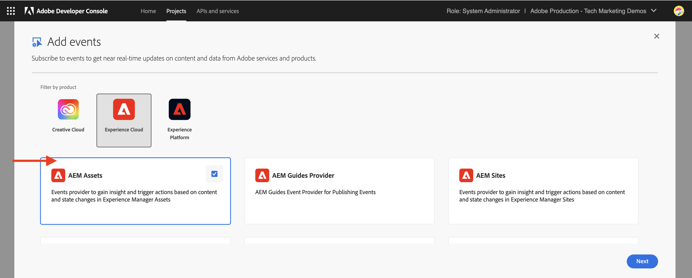

# Événements AEM Assets pour l’intégration PIM

>[!IMPORTANT]
>
>Ce tutoriel utilise les API expérimentales AEM as a Cloud Service. Pour accéder à ces API, vous devez accepter un contrat pour le logiciel en version préliminaire et faire activer manuellement ces API pour votre environnement par l’équipe d’ingénierie Adobe. Pour demander l’accès, contactez l’assistance Adobe.

Découvrez comment intégrer AEM Assets à un système tiers, tel qu’un système PIM ou PLM, pour mettre à jour les métadonnées des ressources **à l’aide des événements AEM I/O natifs**. Dès réception d’un événement AEM Assets, les métadonnées des ressources peuvent être mises à jour dans AEM, le PIM ou les deux systèmes, en fonction des exigences de l’entreprise. Cependant, cet exemple illustre la mise à jour des métadonnées des ressources dans AEM.

>[!VIDEO](https://video.tv.adobe.com/v/3427592?quality=12&learn=on)

Pour exécuter le **code de la mise à jour des métadonnées des ressources en dehors d’AEM**, [Adobe I/O Runtime](https://developer.adobe.com/runtime/docs/guides/overview/what_is_runtime/), une plateforme sans serveur, est utilisé.

Le flux de traitement des événements est le suivant :


1. Le service de création AEM déclenche un événment _Traitement des ressources terminé_ lorsqu’un chargement de ressources est terminé et que toutes les activités de traitement de ressources sont terminées. Attendre la fin du traitement garantit que tout traitement prêt à l’emploi, tel que l’extraction de métadonnées, est terminé.
1. L’événement est envoyé au service [Événements Adobe I/O](https://developer.adobe.com/events/).
1. Le service Événements Adobe I/O transmet l’événement à l’[action Adobe I/O Runtime](https://developer.adobe.com/runtime/docs/guides/using/creating_actions/) pour traitement.
1. L’action Adobe I/O Runtime appelle l’API du système PIM pour récupérer des métadonnées supplémentaires telles que le SKU, les informations sur le fournisseur ou d’autres détails.
1. Les métadonnées supplémentaires extraites du PIM sont ensuite mises à jour dans AEM Assets à l’aide de l’[API de création Assets](https://developer.adobe.com/experience-cloud/experience-manager-apis/api/experimental/assets/author/).

## Conditions préalables

Les éléments suivants sont requis afin de terminer ce tutoriel :

- Environnement AEM as a Cloud Service avec [AEM Eventing activé](https://developer.adobe.com/experience-cloud/experience-manager-apis/guides/events/#enable-aem-events-on-your-aem-cloud-service-environment). L’exemple de projet [Sites WKND](https://github.com/adobe/aem-guides-wknd?#aem-wknd-sites-project) doit être déployé dessus.

- Accès à [Adobe Developer Console](https://developer.adobe.com/developer-console/docs/guides/getting-started/).

- [Interface de ligne de commande d’Adobe Developer](https://developer.adobe.com/runtime/docs/guides/tools/cli_install/) installée sur votre ordinateur local.

## Étapes de développement

Les étapes de développement générales sont les suivantes :

1. [Créer un projet dans Adobe Developer Console (ADC)](./runtime-action.md#Create-project-in-Adobe-Developer-Console)
1. [Initialiser le projet de développement local](./runtime-action.md#initialize-project-for-local-development)
1. Configurer le projet dans ADC
1. Configurer le service de création AEM pour activer la communication du projet ADC
1. Développer une action Runtime qui orchestre la récupération et la mise à jour des métadonnées
1. Charger une ressource sur le service de création AEM et vérifier que les métadonnées ont été mises à jour.

Pour plus de détails sur les étapes 1 et 2, reportez-vous à l’exemple d’[action Adobe I/O Runtime et d’événements AEM](./runtime-action.md#), et pour les étapes 3 à 6, reportez-vous aux sections suivantes.

### Configurer le projet dans Adobe Developer Console (ADC)

Pour recevoir les événements AEM Assets et exécuter l’action Adobe I/O Runtime créée à l’étape précédente, configurez le projet dans ADC.

- Dans ADC, accédez au[projet](https://developer.adobe.com/console/projects). Sélectionnez l’espace de travail `Stage`, c’est là que l’action Runtime a été déployée.

- Cliquez sur le bouton **Ajouter un service** et sélectionnez l’option **Événement**. Dans la boîte de dialogue **Ajouter des événements**, sélectionnez **Experience Cloud** > **AEM Assets** et cliquez sur **Suivant**. Suivez les étapes de configuration supplémentaires, sélectionnez l’instance AEMCS, l’événement _Traitement des ressources terminé_, le type d’authentification OAuth de serveur à serveur et d’autres détails.

  

- Enfin, à l’étape **Comment recevoir des événements**, développez l’option **Action Runtime** et sélectionnez l’action _générique_ créée à l’étape précédente. Cliquez sur **Enregistrer les événements configurés**.

  

- De même, cliquez sur le bouton **Ajouter un service** et sélectionnez l’option **API**. Dans la boîte de dialogue modale **Ajouter une API**, sélectionnez **Experience Cloud** > **API AEM as a Cloud Service** et cliquez sur **Suivant**.

  

- Sélectionnez ensuite **OAuth de serveur à serveur** comme type d’authentification et cliquez sur **Suivant**.

- Sélectionnez ensuite le profil de produit **Administrateurs et administratrices-XXX AEM** et cliquez sur **Enregistrer l’API configurée**. Pour mettre à jour la ressource en question, le profil de produit sélectionné doit être associé à l’environnement AEM Assets à partir duquel l’événement est produit et disposer d’un accès suffisant pour y mettre à jour les ressources.

  

### Configurer le service de création AEM pour activer la communication du projet ADC

Pour mettre à jour les métadonnées des ressources dans AEM à partir du projet ADC ci-dessus, configurez le service de création AEM avec l’ID client du projet ADC. L’_ID client_ est ajouté comme variable d’environnement à l’aide de l’interface utilisateur [Adobe Cloud Manager](https://experienceleague.adobe.com/docs/experience-manager-cloud-service/content/implementing/using-cloud-manager/environment-variables.html?lang=fr#add-variables).

- Connectez-vous à [Adobe Cloud Manager](https://my.cloudmanager.adobe.com/), sélectionnez l’onglet **Programme** > **Environnement** > **Points de suspension** > **Afficher les détails** > **Configuration**.

  

- Sélectionnez ensuite le bouton **Ajouter une configuration** et saisissez les détails de la variable en tant que :

  | Nom | Valeur | Service AEM | Type |
  | ----------- | ----------- | ----------- | ----------- |
  | ADOBE_PROVIDED_CLIENT_ID | &lt;COPY_FROM_ADC_PROJECT_CREDENTIALS> | Création | Variable |

  

- Cliquez sur **Ajouter** et **enregistrez** la configuration.

### Développer une action Runtime

Pour effectuer la récupération et la mise à jour des métadonnées, commencez par mettre à jour le code d’action _générique_ créé automatiquement dans le dossier `src/dx-excshell-1/actions/generic`.

Consultez le fichier [WKND-Assets-PIM-Integration.zip](../assets/examples/assets-pim-integration/WKND-Assets-PIM-Integration.zip) ci-joint pour obtenir le code complet. La section ci-dessous met en évidence les fichiers clés.

- Le fichier `src/dx-excshell-1/actions/generic/mockPIMCommunicator.js` imite l’appel de l’API PIM pour récupérer des métadonnées supplémentaires telles que le SKU et le nom du fournisseur. Ce fichier est utilisé à des fins de démonstration. Une fois que le flux de bout en bout fonctionne, remplacez cette fonction par un appel à votre véritable système PIM pour récupérer les métadonnées de la ressource.

  ```javascript
  /**
   * Mock PIM API to get the product data such as SKU, Supplier, etc.
   *
   * In a real-world scenario, this function would call the PIM API to get the product data.
   * For this example, we are returning mock data.
   *
   * @param {string} assetId - The assetId to get the product data.
   */
  module.exports = {
      async getPIMData(assetId) {
          if (!assetId) {
          throw new Error('Invalid assetId');
          }
          // Mock response data for demo purposes
          const data = {
          SKUID: 'MockSKU 123',
          SupplierName: 'mock-supplier',
          // ... other product data
          };
          return data;
      },
  };
  ```

- Le fichier `src/dx-excshell-1/actions/generic/aemCommunicator.js` met à jour les métadonnées de la ressource dans AEM à l’aide de l’[API de création Assets](https://developer.adobe.com/experience-cloud/experience-manager-apis/api/experimental/assets/author/).

  ```javascript
  const fetch = require('node-fetch');
  
  ...
  
  /**
  *  Get IMS Access Token using Client Credentials Flow
  *
  * @param {*} clientId - IMS Client ID from ADC project's OAuth Server-to-Server Integration
  * @param {*} clientSecret - IMS Client Secret from ADC project's OAuth Server-to-Server Integration
  * @param {*} scopes - IMS Meta Scopes from ADC project's OAuth Server-to-Server Integration as comma separated strings
  * @returns {string} - Returns the IMS Access Token
  */
  async function getIMSAccessToken(clientId, clientSecret, scopes) {
    const adobeIMSV3TokenEndpointURL = 'https://ims-na1.adobelogin.com/ims/token/v3';
  
    const options = {
      method: 'POST',
      headers: {
        'Content-Type': 'application/x-www-form-urlencoded',
      },
      body: `grant_type=client_credentials&client_id=${clientId}&client_secret=${clientSecret}&scope=${scopes}`,
    };
  
    const response = await fetch(adobeIMSV3TokenEndpointURL, options);
    const responseJSON = await response.json();
  
    return responseJSON.access_token;
  }    
  
  async function updateAEMAssetMetadata(metadataDetails, aemAssetEvent, params) {
    ...
    // Transform the metadata details to JSON Patch format,
    // see https://developer.adobe.com/experience-cloud/experience-manager-apis/api/experimental/assets/author/#operation/patchAssetMetadata
    const transformedMetadata = Object.keys(metadataDetails).map((key) => ({
      op: 'add',
      path: `wknd-${key.toLowerCase()}`,
      value: metadataDetails[key],
    }));
  
    ...
  
    // Get ADC project's OAuth Server-to-Server Integration credentials
    const clientId = params.ADC_CECREDENTIALS_CLIENTID;
    const clientSecret = params.ADC_CECREDENTIALS_CLIENTSECRET;
    const scopes = params.ADC_CECREDENTIALS_METASCOPES;
  
    // Get IMS Access Token using Client Credentials Flow
    const access_token = await getIMSAccessToken(clientId, clientSecret, scopes);
  
    // Call AEM Author service to update the metadata using Assets Author API
    // See https://developer.adobe.com/experience-cloud/experience-manager-apis/api/experimental/assets/author/
    const res = await fetch(`${aemAuthorHost}/adobe/assets/${assetId}/metadata`, {
      method: 'PATCH',
      headers: {
        'Content-Type': 'application/json-patch+json',
        'If-Match': '*',
        'X-Adobe-Accept-Experimental': '1',
        'X-Api-Key': 'aem-assets-management-api', // temporary value
        Authorization: `Bearer ${access_token}`,
      },
      body: JSON.stringify(transformedMetadata),
    });
  
    ...
  }
  
  module.exports = { updateAEMAssetMetadata };
  ```

  Le fichier `.env` stocke les détails des informations d’identification OAuth de serveur à serveur du projet ADC. Ceux-ci sont transmis en tant que paramètres à l’action à l’aide du fichier `ext.config.yaml`. Consultez également les [fichiers de configuration du créateur d’applications](https://developer.adobe.com/app-builder/docs/guides/configuration/) pour la gestion des secrets et des paramètres d’action.

- Le dossier `src/dx-excshell-1/actions/model` contient les fichiers `aemAssetEvent.js` et `errors.js`, qui sont utilisés par l’action pour analyser l’événement reçu et gérer les erreurs, respectivement.

- Le fichier `src/dx-excshell-1/actions/generic/index.js` utilise les modules mentionnés précédemment pour orchestrer la récupération et la mise à jour des métadonnées.

  ```javascript
  ...
  
  let responseMsg;
  // handle the challenge probe request, they are sent by I/O to verify the action is valid
  if (params.challenge) {
    logger.info('Challenge probe request detected');
    responseMsg = JSON.stringify({ challenge: params.challenge });
  } else {
    logger.info('AEM Asset Event request received');
  
    // create AEM Asset Event object from request parameters
    const aemAssetEvent = new AEMAssetEvent(params);
  
    // Call mock PIM API to get the product data such as SKU, Supplier, etc.
    const mockPIMData = await mockPIMAPI.getPIMData(
      aemAssetEvent.getAssetName(),
    );
    logger.info('Mock PIM API response', mockPIMData);
  
    // Update PIM received data in AEM as Asset metadata
    const aemUpdateStatus = await updateAEMAssetMetadata(
      mockPIMData,
      aemAssetEvent,
      params,
    );
    logger.info('AEM Asset metadata update status', aemUpdateStatus);
  
    if (aemUpdateStatus) {
      // create response message
      responseMsg = JSON.stringify({
        message:
          'AEM Asset Event processed successfully, updated the asset metadata with PIM data.',
        assetdata: {
          assetName: aemAssetEvent.getAssetName(),
          assetPath: aemAssetEvent.getAssetPath(),
          assetId: aemAssetEvent.getAssetId(),
          aemHost: aemAssetEvent.getAEMHost(),
          pimdata: mockPIMData,
        },
      });
    } 
  
    // response object
    const response = {
      statusCode: 200,
      body: responseMsg,
    };
  
    // Return the response to the caller
    return response;
  
    ...
  }
  ```

Déployez l’action mise à jour sur Adobe I/O Runtime à l’aide de la commande suivante :

```bash
$ aio app deploy
```

### Chargement de ressources et vérification des métadonnées

Pour vérifier l’intégration d’AEM Assets et du PIM, procédez comme suit :

- Pour afficher les métadonnées fournies par le PIM fictif telles que le SKU et le nom du fournisseur, créez un schéma de métadonnées dans AEM Assets (voir [Schéma de métadonnées](https://experienceleague.adobe.com/docs/experience-manager-learn/assets/configuring/metadata-schemas.html?lang=fr)) qui affiche les propriétés des métadonnées du SKU et du nom du fournisseur.

- Chargez une ressource dans le service de création AEM et vérifiez la mise à jour des métadonnées.

  

## Concept et principaux points à retenir

La synchronisation des métadonnées des ressources entre AEM et d’autres systèmes comme PIM est souvent requise dans l’entreprise. Grâce à AEM Eventing, ces exigences peuvent être satisfaites.

- Le code de récupération des métadonnées des ressources est exécuté en dehors d’AEM, évitant ainsi la charge sur le service de création AEM, ce qui permet une architecture basée sur les événements qui évolue de manière indépendante.
- La nouvelle API de création Assets est utilisée pour mettre à jour les métadonnées des ressources dans AEM.
- L’authentification API utilise OAuth de serveur à serveur (c’est-à-dire le flux d’informations d’identification du client). Consultez le [guide de mise en œuvre des informations d’identification OAuth de serveur à serveur](https://developer.adobe.com/developer-console/docs/guides/authentication/ServerToServerAuthentication/implementation/).
- Au lieu des actions Adobe I/O Runtime, d’autres webhooks ou Amazon EventBridge peuvent être utilisés pour recevoir l’événement AEM Assets et traiter la mise à jour des métadonnées.
- Les événements de ressources via AEM Eventing permettent aux entreprises d’automatiser et de rationaliser les processus critiques, favorisant ainsi l’efficacité et la cohérence dans l’ensemble de l’écosystème de contenu.
