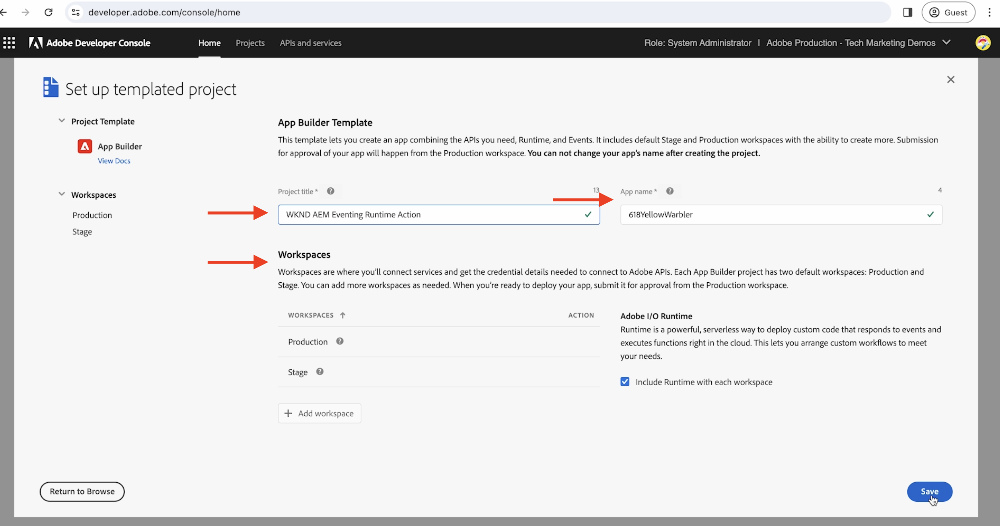

# Action Adobe I/O Runtime et événements AEM

Découvrez comment recevoir des événements AEM à l’aide d’une action [Adobe I/O Runtime ](https://developer.adobe.com/runtime/docs/guides/overview/what_is_runtime/) et consulter les détails de l’événement, tels que la payload, les en-têtes et les métadonnées.

>[!VIDEO](https://video.tv.adobe.com/v/3427053?quality=12&learn=on)

Adobe I/O Runtime est une plateforme sans serveur qui permet l’exécution de code en réponse aux événements d’Adobe I/O. Cela vous permet de créer des applications basées sur des événements sans vous soucier des infrastructures.

Dans cet exemple, vous créez une [action](https://developer.adobe.com/runtime/docs/guides/using/creating_actions/) Adobe I/O Runtime qui reçoit les événements AEM et consigne les détails d’événement.
https://developer.adobe.com/runtime/docs/guides/overview/what_is_runtime/

Les étapes générales sont les suivantes :

- Créer un projet dans Adobe Developer Console
- Initialiser le projet de développement local
- Configurer le projet dans Adobe Developer Console
- Déclencher un événement AEM et vérifier l’exécution de l’action

## Conditions préalables

Les éléments suivants sont requis afin de terminer ce tutoriel :

- Environnement AEM as a Cloud Service avec [AEM Eventing activé](https://developer.adobe.com/experience-cloud/experience-manager-apis/guides/events/#enable-aem-events-on-your-aem-cloud-service-environment).

- Accédez à [Adobe Developer Console](https://developer.adobe.com/developer-console/docs/guides/getting-started).

- [Interface de ligne de commande d’Adobe Developer](https://developer.adobe.com/runtime/docs/guides/tools/cli_install/) installée sur votre ordinateur local.

## Créer un projet dans Adobe Developer Console

Pour créer un projet dans Adobe Developer Console, procédez comme suit :

- Accédez à [Adobe Developer Console](https://developer.adobe.com/) et cliquez sur le bouton **Console**.

- Dans la section **Démarrage rapide**, cliquez sur **Créer un projet à partir d’un modèle**. Ensuite, dans la boîte de dialogue **Parcourir les modèles**, sélectionnez le modèle **Créateur d’applications**.

- Si nécessaire, mettez à jour le titre du projet et le nom de l’application, et ajoutez un espace de travail. Cliquez ensuite sur **Enregistrer**.

  


## Initialiser le projet de développement local

Pour ajouter une action Adobe I/O Runtime au projet, vous devez initialiser le projet de développement local. Sur le terminal d’ouverture de l’ordinateur local, accédez à l’emplacement où vous souhaitez initialiser votre projet et procédez comme suit :

- Initialisez le projet en exécutant

  ```bash
  aio app init
  ```

- Sélectionnez l’`Organization`, le `Project` que vous avez créé à l’étape précédente et l’espace de travail. Dans l’étape `What templates do you want to search for?`, sélectionnez l’option `All Templates`.

  

- Dans la liste des modèles, sélectionnez l’option `@adobe/generator-app-excshell`.

  

- Ouvrez le projet dans votre IDE favori, par exemple VSCode.

- Le _Modèle d’extensibilité_ (`@adobe/generator-app-excshell`) sélectionné fournit une action Runtime générique. Le code se trouve dans le fichier `src/dx-excshell-1/actions/generic/index.js`. Mettons-le à jour afin de rester simple, consignons les détails de l’événement et renvoyons une réponse de succès. Cependant, dans l’exemple suivant, il est amélioré pour traiter les événements AEM reçus.

  ```javascript
  const fetch = require("node-fetch");
  const { Core } = require("@adobe/aio-sdk");
  const {
  errorResponse,
  getBearerToken,
  stringParameters,
  checkMissingRequestInputs,
  } = require("../utils");
  
  // main function that will be executed by Adobe I/O Runtime
  async function main(params) {
  // create a Logger
  const logger = Core.Logger("main", { level: params.LOG_LEVEL || "info" });
  
  try {
      // 'info' is the default level if not set
      logger.info("Calling the main action");
  
      // log parameters, only if params.LOG_LEVEL === 'debug'
      logger.debug(stringParameters(params));
  
      const response = {
      statusCode: 200,
      body: {
          message: "Received AEM Event, it will be processed in next example",
      },
      };
  
      // log the response status code
      logger.info(`${response.statusCode}: successful request`);
      return response;
  } catch (error) {
      // log any server errors
      logger.error(error);
      // return with 500
      return errorResponse(500, "server error", logger);
  }
  }
  
  exports.main = main;
  ```

- Enfin, déployez l’action mise à jour sur Adobe I/O Runtime en l’exécutant.

  ```bash
  aio app deploy
  ```

## Configurer le projet dans Adobe Developer Console

Pour recevoir des événements AEM et exécuter l’action Adobe I/O Runtime créée à l’étape précédente, configurez le projet dans Adobe Developer Console.

- Dans Adobe Developer Console, accédez au [projet](https://developer.adobe.com/console/projects) créé à l’étape précédente et cliquez pour l’ouvrir. Sélectionnez l’espace de travail `Stage`, c’est là que l’action a été déployée.

- Cliquez sur le bouton **Ajouter un service** et sélectionnez l’option **API**. Dans la boîte de dialogue modale **Ajouter une API**, sélectionnez **Services Adobe** > **API de gestion I/O** et cliquez sur **Suivant**. Suivez les étapes de configuration supplémentaires, puis cliquez sur **Enregistrer l’API configurée**.

  

- De même, cliquez sur le bouton **Ajouter un service** et sélectionnez l’option **Événement**. Dans la boîte de dialogue **Ajouter des événements**, sélectionnez **Experience Cloud** > **AEM Sites**, puis cliquez sur **Suivant**. Suivez les étapes de configuration supplémentaires, sélectionnez l’instance AEMCS, les types d’événement et d’autres détails.

- Enfin, dans l’étape **Comment recevoir des événements**, développez l’option **Action Runtime** et sélectionnez l’action _générique_ créée à l’étape précédente. Cliquez sur **Enregistrer les événements configurés**.

  

- Consultez les détails de l’enregistrement de l’événement, ainsi que l’onglet **Suivi du débogage** et vérifiez la requête et la réponse **Sonde de test**.

  


## Déclencher des événements AEM

Pour déclencher des événements AEM à partir de votre environnement AEM as a Cloud Service qui a été enregistré dans le projet Adobe Developer Console ci-dessus, procédez comme suit :

- Accédez à votre environnement de création AEM as a Cloud Service via [Cloud Manager](https://my.cloudmanager.adobe.com/) et connectez-vous.

- Selon vos **Événements abonnés**, créez, mettez à jour, supprimez, publiez ou annulez la publication d’un fragment de contenu.

## Vérifier les détails de l’événement

Après avoir effectué les étapes ci-dessus, vous devriez voir les événements AEM diffusés à l’action générique.

Vous pouvez consulter les détails de l’événement dans la section **Suivi du débogage** de l’onglet Détails de l’enregistrement d’événement.


## Étapes suivantes

Dans l’exemple suivant, améliorons cette action pour traiter les événements AEM : rappelez le service de création AEM pour obtenir les détails du contenu, stockez les détails dans le stockage Adobe I/O Runtime et affichez-les via l’application monopage (SPA).
