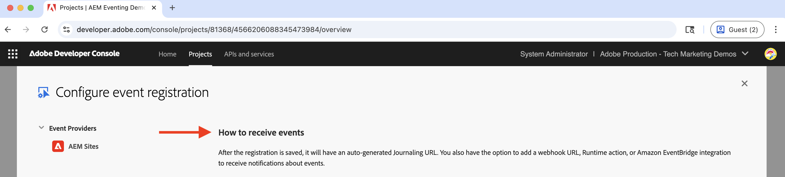
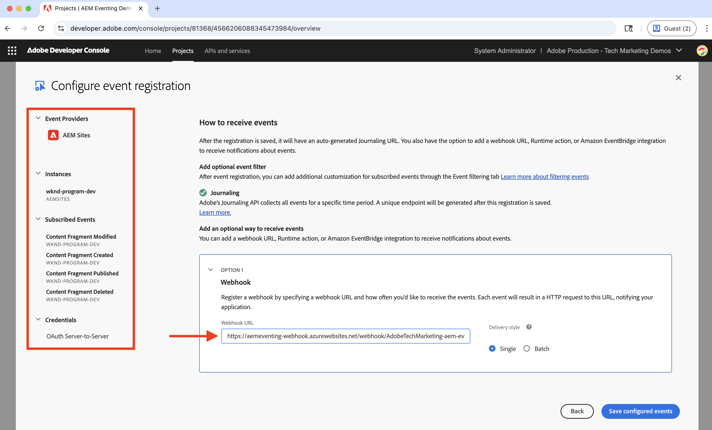

# Webhooks et événements AEM

Découvrez comment recevoir des événements AEM sur un webhook et consulter les détails de l’événement tels que la charge utile, les en-têtes et les métadonnées.

Dans cet exemple, en utilisant un Adobe fourni _webhook hébergé_ vous permet de recevoir des événements AEM sans avoir à configurer votre propre webhook. Ce webhook fourni par l’Adobe est hébergé sur [Glitch](https://glitch.com/), une plateforme connue pour proposer un environnement web propice à la création et au déploiement d’applications web. Cependant, l’option permettant d’utiliser votre propre webhook est également disponible si vous le souhaitez.

## Conditions préalables

Pour suivre ce tutoriel, vous devez :

- AEM environnement as a Cloud Service avec [AEM Eventing activé](https://developer.adobe.com/experience-cloud/experience-manager-apis/guides/events/#enable-aem-events-on-your-aem-cloud-service-environment).

- [Projet de console Adobe Developer configuré pour les événements AEM](https://developer.adobe.com/experience-cloud/experience-manager-apis/guides/events/#how-to-subscribe-to-aem-events-in-the-adobe-developer-console).

## Accès au webhook

Pour accéder au webhook fourni par l’Adobe, procédez comme suit :

- Vérifiez que vous pouvez accéder au [Glitch - webhook hébergé](https://lovely-ancient-coaster.glitch.me/) dans un nouvel onglet du navigateur.

  

- Saisissez un nom unique pour votre webhook, par exemple `<YOUR_PETS_NAME>-aem-eventing` et cliquez sur **Connexion**. Vous devriez voir `Connected to: ${YOUR-WEBHOOK-URL}` message s’affichant à l’écran.

  

- Notez que la variable **URL du webhook**. Vous en aurez besoin plus loin dans ce tutoriel.

## Configuration du webhook dans le projet de console Adobe Developer

Pour recevoir des événements AEM sur l’URL du webhook ci-dessus, procédez comme suit :

- Dans le [Console Adobe Developer](https://developer.adobe.com), accédez à votre projet et cliquez pour l’ouvrir.

- Sous **Produits et services** , cliquez sur ellipses `...` en regard de la carte d’événements de votre choix qui doit envoyer des événements AEM au webhook et sélectionnez **Modifier**.

  

- Dans le **Configuration de l’enregistrement d’événement** boîte de dialogue, cliquez **Suivant** pour passer à **Comment recevoir des événements** étape .

  

- Dans le **Comment recevoir des événements** étape, sélectionnez **Webhook** et collez le **URL du webhook** Vous avez copié précédemment à partir du webhook hébergé Glitch et cliquez sur **Enregistrement des événements configurés**.

  

- Sur la page du notebook Glitch, une requête de GET doit s’afficher. Il s’agit d’une requête de défi envoyée par les événements d’Adobe I/O pour vérifier l’URL du webhook.

  


## Déclencher des événements AEM

Pour déclencher des événements AEM de votre environnement as a Cloud Service AEM qui a été enregistré dans le projet de console Adobe Developer ci-dessus, procédez comme suit :

- Accès et connexion à votre environnement de création as a Cloud Service AEM via [Cloud Manager](https://my.cloudmanager.adobe.com/).

- Selon votre **Événements abonnés**, créer, mettre à jour, supprimer, publier ou annuler la publication d’un fragment de contenu.

## Vérification des détails d’événement

Après avoir effectué les étapes ci-dessus, vous devriez voir les événements AEM distribués au webhook. Recherchez la demande du POST dans la page du webhook Glitch.


Voici les détails clés de la demande de POST :

- path: `/webhook/${YOUR-WEBHOOK-URL}`, par exemple `/webhook/AdobeTM-aem-eventing`

- headers : en-têtes de requête envoyés par les événements d’Adobe I/O, par exemple :

```json
{
"connection": "close",
"x-forwarded-for": "34.205.178.127,::ffff:10.10.10.136,::ffff:10.10.84.114",
"x-forwarded-proto": "https,http,http",
"x-forwarded-port": "443,80,80",
"host": "lovely-ancient-coaster.glitch.me",
"content-length": "826",
"x-adobe-public-key2-path": "/prod/keys/pub-key-IkpzhSpTw0.pem",
"x-adobe-delivery-id": "18abfb47-d24a-4684-ade8-f442a3444033",
"x-adobe-provider": "aemsites_7ABB3E6A5A7491460A495D61@AdobeOrg_acct-aem-p46652-e1074060@adobe.com",
"x-adobe-public-key1-path": "/prod/keys/pub-key-Ptc2pD9vT9.pem",
"x-adobe-event-id": "a0f3fb7d-b02c-4612-aac6-e472b80af793",
"x-adobe-event-code": "aem.sites.contentFragment.modified",
"user-agent": "Adobe/1.0",
"x-adobe-digital-signature-2": "zGLso15+6PV6X6763/x6WqgxDlEXpkv5ty8q4njaq3aUngAI9VCcYonbScEjljRluzjZ05uMJmRfNxwjj60syxEJPuc0dpmMU635gfna7I4T7IaHs496wx4m2E5mvCM+aKbNQ+NPOutyTqI8Ovq29P2P87GIgMlGhAtOaxRVGNc6ksBxc2tCWbrKUhW8hPJ0sHphU499dN4TT32xrZaiRw4akT3M/hYydsA8dcWpJ7S4dpuDS21YyDHAB8s9Dawtr3fyPEyLgZzpwZDfCqQ8gdSCGqKscE4pScwqPkKOYCHDnBvDZVe583jhcZbHGjk7Ncp/FrgQk7avWsk5XlzcuA==",
"x-adobe-digital-signature-1": "QD7THFJ1vmJqD/BatIpzO6+ACQ9cSKPR7XVaW0LI7cN/xs7ucyri6dmkerOPe9EJpjGoqCg8rxWedrIRQB3lgVskChbHH3Ujx5YG0aTQLSd1Lsn5CFbW1U0l0GqId9Cnd6MccrqSznZXcdW1rMFuRk8+gqwabBifSaLbu3r30G5hmqQd72VtiYTE4m23O3jYIMiv62pRP+a+p4NjNj1XG320uRSry+BPniTjDJ6oN/Ng7aUEKML8idZ/ZTqeh/rJSrVO95UryUolFDRwDkRn5zKonbvhSLAeXzaPhvimWUHtldq9M1WTyRMpsBk8BRzaklxlq+woJ2UjYPUIEzjotw==",
"accept-encoding": "deflate,compress,identity",
"content-type": "application/cloudevents+json; charset=UTF-8",
"x-forwarded-host": "lovely-ancient-coaster.glitch.me",
"traceparent": "00-c27558588d994f169186ca6a3c6607d4-a7e7ee36625488d4-01"
}
```

- body/payload : corps de la requête envoyé par les événements d’Adobe I/O, par exemple :

```json
{
  "specversion": "1.0",
  "type": "aem.sites.contentFragment.modified",
  "source": "acct:aem-p46652-e1074060@adobe.com",
  "id": "bf922a49-9db4-4377-baf4-70e96e15c45f",
  "time": "2023-12-12T20:36:43.583228Z",
  "dataschema": "https://ns.adobe.com/xdm/aem/sites/events/content-fragment-modified.json",
  "datacontenttype": "application/json",
  "data": {
    "user": {
      "imsUserId": "933E1F8A631CAA0F0A495E53@80761f6e631c0c7d495fb3.e",
      "principalId": "xxx@adobe.com",
      "displayName": "First LastName",
    },
    "path": "/content/dam/wknd-shared/en/adventures/beervana-portland/beervana-in-portland",
    "model": {
      "id": "/conf/wknd-shared/settings/dam/cfm/models/adventure"
    },
    "id": "9a2d3e6a-efda-4079-a86e-0ef2ede692da",
    "properties": [
      {
        "name": "groupSize",
        "changeType": "modified"
      }
    ]
  },
  "event_id": "a0f3fb7d-b02c-4612-aac6-e472b80af793",
  "recipient_client_id": "f51ea733ba404db299fefbf285dc1c42"
}
```

Vous pouvez constater que les détails de l’événement AEM disposent de toutes les informations nécessaires pour traiter l’événement dans le webhook. Par exemple, le type d’événement (`type`), source d’événement (`source`), identifiant d’événement (`event_id`), heure de l’événement (`time`) et les données d’événement (`data`).

## Ressources supplémentaires

- [Glitter le code source webhook](https://glitch.com/edit/#!/adorable-antique-coaster) est disponible à titre de référence.
