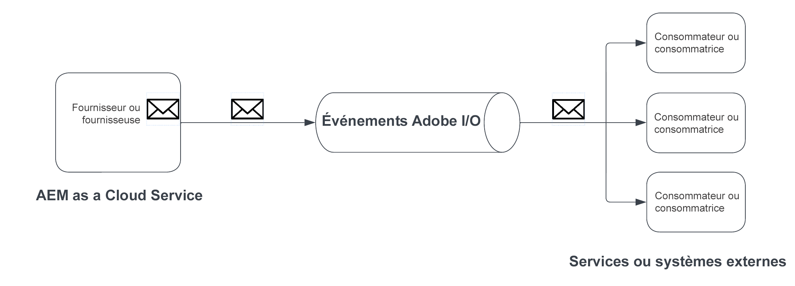

# AEM

Découvrez AEM événement, ce qu’il est, pourquoi et quand l’utiliser et des exemples.

>[!VIDEO](https://video.tv.adobe.com/v/3426686?quality=12&learn=on)

>[!IMPORTANT]
>
>AEM Eventing as a Cloud Service n’est disponible que pour les utilisateurs enregistrés en mode de version préliminaire. Pour activer AEM événements dans votre environnement AEM as a Cloud Service, contactez [AEM Eventing Team](mailto:grp-aem-events@adobe.com).

## Qu’est-ce que c’est ?

AEM Eventing est un système d’événement natif dans le cloud qui permet aux abonnements à des événements AEM pour traitement dans des systèmes externes. Un événement AEM est une notification de changement d’état envoyée par AEM chaque fois qu’une action spécifique se produit. Par exemple, cela peut inclure des événements lorsqu’un fragment de contenu est créé, mis à jour ou supprimé.

Le diagramme ci-dessus a visualisé la manière dont AEM as a Cloud Service génère des événements et les envoie aux événements d’Adobe I/O, ce qui, à son tour, les expose aux abonnés d’événement.

En résumé, il existe trois composants principaux :

1. **Fournisseur d’événements :** AEM as a Cloud Service.
1. **Événements d’Adobe I/O :** Plateforme de développement pour l’intégration, l’extension et la création d’applications et d’expériences en fonction des produits et des technologies de l’Adobe.
1. **Consommateur d’événement :** Systèmes appartenant au client qui s’abonnent aux événements AEM. Par exemple, un CRM (Customer Relationship Management), PIM (Product Information Management), OMS (Order Management System) ou une application personnalisée.

### En quoi est-ce différent ?

La variable [Événement Apache Sling](https://sling.apache.org/documentation/bundles/apache-sling-eventing-and-job-handling.html), événement OSGi et [observation JCR](https://jackrabbit.apache.org/oak/docs/features/observation.html) tous les mécanismes d’offre pour s’abonner aux événements et les traiter. Toutefois, elles sont distinctes de l’AEM Eventing, comme décrit dans cette documentation.

Les principales distinctions de AEM Eventing sont les suivantes :

- Le code du consommateur d’événement est exécuté en dehors d’AEM et ne s’exécute pas dans la même JVM qu’AEM.
- AEM code de produit est chargé de définir les événements et de les envoyer aux événements d’Adobe I/O.
- Les informations sur les événements sont normalisées et envoyées au format JSON. Pour plus d’informations, voir [cloudevants](https://cloudevents.io/).
- Pour communiquer de nouveau avec AEM, le consommateur d’événement utilise l’API as a Cloud Service AEM.

## Pourquoi et quand l’utiliser

AEM Eventing offre de nombreux avantages en termes d’architecture du système et d’efficacité opérationnelle. Les principales raisons d’utiliser AEM Eventing sont les suivantes :

- **Pour créer des architectures pilotées par les événements**: facilite la création de systèmes à couplage faible, capables de s’adapter indépendamment et résistants aux défaillances.
- **Faible code et coûts opérationnels réduits**: évite les personnalisations dans AEM, ce qui se traduit par des systèmes plus faciles à gérer et à étendre, ce qui réduit les dépenses opérationnelles.
- **Simplification de la communication entre AEM et les systèmes externes**: élimine les connexions point à point en permettant aux événements d’Adobe I/O de gérer les communications, comme déterminer les événements d’AEM qui doivent être diffusés à des systèmes ou services spécifiques.
- **Durabilité plus élevée des événements**: les événements d’Adobe I/O sont un système hautement disponible et évolutif, conçu pour gérer de grands volumes d’événements et les diffuser de manière fiable aux abonnés.
- **Traitement parallèle des événements**: permet la diffusion simultanée d’événements à plusieurs abonnés, ce qui permet le traitement distribué des événements sur plusieurs systèmes.
- **Développement d’applications sans serveur**: prend en charge le déploiement du code de consommateur d’événement en tant qu’application sans serveur, améliorant ainsi la flexibilité et l’évolutivité du système.

### Limites

AEM Eventing, bien que puissant, présente certaines limites à prendre en compte :

- **Disponibilité limitée à AEM as a Cloud Service**: actuellement, AEM Eventing est exclusivement disponible pour AEM as a Cloud Service.
- **Prise en charge limitée des événements**: à ce jour, seuls les événements de fragment de contenu AEM sont pris en charge. Toutefois, la portée devrait s’étendre avec l’ajout d’autres événements à l’avenir.

## Comment activer

AEM Eventing est activé par environnement as a Cloud Service et disponible uniquement pour les environnements en mode de version préliminaire. Contact [AEM Eventing Team](mailto:grp-aem-events@adobe.com) pour activer votre environnement AEM avec AEM Eventing.

Si elle est déjà activée, voir [Activation des événements AEM dans votre environnement AEM Cloud Service](https://developer.adobe.com/experience-cloud/experience-manager-apis/guides/events/#enable-aem-events-on-your-aem-cloud-service-environment) pour les étapes suivantes.

## Comment s’abonner

Pour vous abonner aux événements AEM, il n’est pas nécessaire d’écrire du code dans AEM, mais plutôt une [Console Adobe Developer](https://developer.adobe.com/) Le projet est configuré. La console Adobe Developer est une passerelle vers les API, SDK, événements, Runtime et App Builder Adobe.

Dans ce cas, une _project_ dans la console Adobe Developer, vous permet de vous abonner aux événements émis à partir des environnements as a Cloud Service AEM et de configurer la diffusion des événements sur des systèmes externes.

Pour plus d’informations, voir [Comment s’abonner aux événements AEM dans la console Adobe Developer](https://developer.adobe.com/experience-cloud/experience-manager-apis/guides/events/#how-to-subscribe-to-aem-events-in-the-adobe-developer-console).

## Comment consommer

Il existe deux méthodes principales pour utiliser les événements AEM : la variable _push_ et la méthode _pull_ .

- **Méthode push**: dans cette approche, le consommateur d’événement est informé de manière proactive par les événements d’Adobe I/O lorsqu’un événement devient disponible. Les options d’intégration incluent Webhooks, Adobe I/O Runtime et Amazon EventBridge.
- **Méthode de tirage**: ici, le consommateur d’événement interroge activement les événements d’Adobe I/O pour rechercher de nouveaux événements. L’option d’intégration principale de cette méthode est l’API de journalisation d’Adobe I/O.

Pour plus d’informations, voir [Traitement des événements AEM via des événements Adobe I/O](https://developer.adobe.com/experience-cloud/experience-manager-apis/guides/events/#aem-events-processing-via-adobe-io).

## Exemples

<table>
  <tr>
    <td>
        
        
<strong><a href="./examples/webhook.md">Réception d’événements AEM sur un webhook</a></strong>

        

          Utilisez le webhook fourni par Adobe pour recevoir AEM événements et consulter les détails de l’événement.
        

      </td>
      <td>
        
        
<strong><a href="./examples/journaling.md">Chargement du journal des événements AEM</a></strong>

        

          Utilisez l’application web fournie par Adobe pour charger AEM événements à partir du journal et consulter les détails de l’événement.
        

      </td>
    </tr>
</table>
