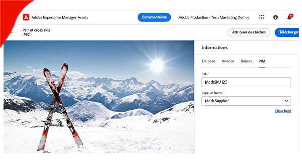

# AEM Eventing

Découvrez AEM Eventing, en quoi cela consiste, pourquoi et quand l’utiliser, avec des exemples.

>[!VIDEO](https://video.tv.adobe.com/v/3426686?quality=12&learn=on)

## Présentation

AEM Eventing est un système d’événements natif dans le cloud qui permet de traiter des abonnements à des événements AEM dans des systèmes externes. Un événement AEM est une notification de changement d’état envoyée par AEM chaque fois qu’une action spécifique se produit. Par exemple, cela peut inclure des événements lorsqu’un fragment de contenu est créé, mis à jour ou supprimé.

Le diagramme ci-dessus représente la manière dont AEM as a Cloud Service génère des événements et les envoie aux événements Adobe I/O qui, à leur tour, les envoient aux personnes abonnées aux événements.

En résumé, il existe trois composants principaux :

1. **Fournisseur d’événements :** AEM as a Cloud Service.
1. **Événements Adobe I/O :** plateforme de développement pour l’intégration, l’extension et la création d’applications et d’expériences basées sur les produits et les technologies Adobe.
1. **Consommateur d’événements :** systèmes appartenant au client ou à la cliente qui s’abonnent aux événements AEM. Par exemple, un CRM (gestion de la relation client), un PIM (gestion d’informations sur les produits), un OMS (système de gestion des commandes) ou une application personnalisée.

### Présentation des différences

[Apache Sling Eventing](https://sling.apache.org/documentation/bundles/apache-sling-eventing-and-job-handling.html), OSGi Eventing et l’[observation JCR](https://jackrabbit.apache.org/oak/docs/features/observation.html) offrent tous des dispositifs pour s’abonner aux événements et pour les traiter. Toutefois, ceux-ci sont distincts d’AEM Eventing, comme décrit dans cette documentation.

Les principales distinctions d’AEM Eventing incluent :

- Le code consommateur d’événement est exécuté en dehors d’AEM et ne s’exécute pas dans la même JVM qu’AEM.
- Le code de produit AEM est chargé de définir les événements et de les envoyer aux événements d’Adobe I/O.
- Les informations sur les événements sont normalisées et envoyées au format JSON. Pour plus d’informations, reportez-vous à [cloudevents](https://cloudevents.io/).
- Pour communiquer avec AEM, le consommateur d’événement utilise l’API d’AEM as a Cloud Service.

## Comprendre pourquoi et comment l’utiliser

AEM Eventing offre de nombreux avantages en termes d’architecture système et d’efficacité opérationnelle. Les principales raisons d’utiliser AEM Eventing incluent les suivantes :

- **Création d’architectures pilotées par des événements** : facilite la création de systèmes à couplage léger, capables de s’adapter de manière indépendante et résistants aux défaillances.
- **Code réduit et faibles coûts opérationnels** : évite les personnalisations dans AEM, ce qui se traduit par des systèmes plus faciles à gérer et à étendre, réduisant ainsi les dépenses opérationnelles.
- **Simplification de la communication entre AEM et les systèmes externes** : élimine les connexions point à point en permettant aux événements d’Adobe I/O de gérer des communications, par exemple, déterminer quels événements AEM doivent être diffusés à des systèmes ou des services spécifiques.
- **Meilleure durabilité des événements** : les événements d’Adobe I/O constituent un système hautement disponible et évolutif, conçu pour gérer de grands volumes d’événements et les diffuser de manière fiable aux personnes abonnées.
- **Traitement parallèle des événements** : permet la diffusion simultanée d’événements à plusieurs personnes abonnées, ce qui permet un traitement distribué des événements sur plusieurs systèmes.
- **Développement d’applications sans serveur** : prend en charge le déploiement du code du consommateur d’événement en tant qu’application sans serveur, améliorant ainsi la flexibilité et l’évolutivité du système.

### Limites

AEM Eventing, bien que puissant, présente certaines limites à prendre en compte :

- **Disponibilité limitée à AEM as a Cloud Service** : actuellement, AEM Eventing est exclusivement disponible pour AEM as a Cloud Service.
- **Prise en charge limitée des événements** : à ce jour, seuls les événements de fragment de contenu AEM sont pris en charge. Toutefois, la gamme devrait s’élargir avec l’ajout d’événements supplémentaires dans le futur.

## Activation

L’activation AEM Eventing s’effectue pour chaque environnement AEM as a Cloud Service et est disponible uniquement pour les environnements en mode de version préliminaire. Contactez l’ <a href="mailto:grp-aem-events@adobe.com">équipe AEM-Eventing</a> pour activer votre environnement AEM avec l’événement d’AEM.

S’il est déjà activé, consultez [Activer les événements AEM dans votre environnement AEM Cloud Service](https://developer.adobe.com/experience-cloud/experience-manager-apis/guides/events/#enable-aem-events-on-your-aem-cloud-service-environment) pour les étapes suivantes.

## Abonnement

Pour vous abonner aux événements AEM, il n’est pas nécessaire d’écrire du code dans AEM, mais un projet [Adobe Developer Console](https://developer.adobe.com/) est plutôt configuré. L’Adobe Developer Console est une passerelle vers les API, les SDK, les événements, Runtime et le créateur d’applications d’Adobe.

Dans ce cas, un _projet_ dans Adobe Developer Console vous permet de vous abonner aux événements émis à partir d’un environnement AEM as a Cloud Service et de configurer la diffusion des événements vers des systèmes externes.

Pour plus d’informations, consulter [Abonnement aux événements AEM dans l’Adobe Developer Console](https://developer.adobe.com/experience-cloud/experience-manager-apis/guides/events/#how-to-subscribe-to-aem-events-in-the-adobe-developer-console).

## Utilisation

Il existe deux méthodes principales pour utiliser les événements AEM : la méthode _push_ (pousser) et la méthode _pull_ (tirer).

- **Méthode push** : dans cette approche, l’utilisateur ou l’utilisatrice d’événement reçoit une notification de manière proactive par les événements d’Adobe I/O lorsqu’un événement devient disponible. Les options d’intégration incluent des webhooks, Adobe I/O Runtime et Amazon EventBridge.
- **Méthode pull** : ici, l’utilisateur ou l’utilisatrice d’événement interroge activement les événements d’Adobe I/O pour rechercher de nouveaux événements. L’option d’intégration principale de cette méthode est l’API de journalisation d’Adobe Developer.

Pour plus d’informations, consultez [Traitement des événements AEM via des événements Adobe I/O](https://developer.adobe.com/experience-cloud/experience-manager-apis/guides/events/#aem-events-processing-via-adobe-io).

## Exemples

<table>
  <tr>
    <td>
        
        
<strong><a href="./examples/webhook.md">Récevoir des événements AEM sur un webhook</a></strong>

        

          Utilisez le webhook fourni par Adobe pour recevoir des événements AEM et consulter les détails de l’événement.
        

      </td>
      <td>
        
        
<strong><a href="./examples/journaling.md">Charger le journal des événements AEM</a></strong>

        

          Utilisez l’application web fournie par Adobe pour charger des événements AEM à partir du journal et consulter les détails des événements.
        

      </td>
    </tr>
  <tr>
    <td>
        
        
<strong><a href="./examples/runtime-action.md">Recevoir des événements AEM sur une action Adobe I/O Runtime</a></strong>

        

          Recevez des événements AEM et passez en revue les détails de l’événement.
        

      </td>
      <td>
        
        
<strong><a href="./examples/event-processing-using-runtime-action.md">Traitement des événements AEM à l’aide de l’action Adobe I/O Runtime</a></strong>

        

          Découvrez comment traiter les événements AEM reçus à l’aide de l’action Adobe I/O Runtime. Le traitement des événements comprend le rappel AEM, la persistance des données d’événement et leur affichage dans la SPA.
        

      </td>
  </tr>    
  <tr>
    <td>
        
        
<strong><a href="./examples/assets-pim-integration.md">Événements AEM Assets pour l’intégration PIM</a></strong>

        

          Découvrez comment intégrer AEM Assets et les systèmes PIM pour les mises à jour de métadonnées.
        

      </td>
  </tr>  
</table>
