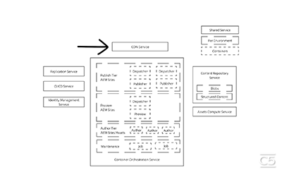

# Saison 1 de Cloud 5

## Présentation

Bienvenue dans la série Cloud 5 des équipes d’ingénierie d’AEM. L’un des principaux problèmes de la phase de mise en œuvre d’un produit est de disposer de suffisamment d’exemples de code et/ou de démonstrations en direct de ces exemples, outils ou API. L’objectif de cette série est de fournir des informations utiles sur AEM as a Cloud Service en 5 minutes ou moins.

Consultez la [zone de suggestion](https://forms.office.com/r/74P5Xz4UH0) pour soumettre des idées de sujet.

## Saison 1

Chaque saison varie en longueur et est diffusée selon un planning fixe. Les sujets de la saison 1 proviennent principalement des demandes antérieures issues de nos interactions quotidiennes avec des clientes et clients et des partenaires. Consultez cette page pour des mises à jour hebdomadaires ou suivez-nous sur le réseau social de votre choix.

<table>
  <tr>
   <td>
      
      

         <a href="./cloud5-aem-cdn-part1.md"><strong>Analyse approfondie du réseau CDN d’AEM (partie 1)</strong></a>
 <em>avec Darin Kuntze et James Talbot, architectes cloud senior</em>
      

      

         
La partie 1 porte sur le réseau CDN d’AEM as a Cloud Service et sur la manière de l’utiliser dans votre implémentation.
      

     </td>   
     <td>
      
      

         <a href="./cloud5-aem-cdn-part2.md"><strong>Analyse approfondie du réseau CDN d’AEM (partie 2)</strong></a>
 <em>avec Darin Kuntze et James Talbot, architectes cloud senior</em>
      

      

         
La partie 2 est la suite de notre analyse du réseau CDN d’AEM as a Cloud Service. Nous répondons aux questions et mythes les plus courants sur les fonctionnalités que vous obtenez avec le nouveau réseau CDN.
      

   </td>
     <td>
        
      

         <a href="./cloud5-aem-log-files.md"><strong>Fichiers journaux et journalisation</strong></a>
 <em>avec Darin Kuntze et James Talbot, architectes cloud senior</em>
      

      

         
Il s’agit d’un aperçu de la manière d’accéder aux journaux dans AEM as a Cloud Service, à partir de l’interface utilisateur ainsi que depuis les API.
      

   </td> 
  </tr>
  <tr>
   <td>
        
      

        <a href="./cloud5-getting-login-token-integrations.md"><strong>Intégration des jetons d’accès</strong></a>
 <em>avec Darin Kuntze et James Talbot, architectes cloud senior</em>
      

      

         
Vue d’ensemble rapide et démonstration de l’interaction avec les jetons de connexion pour le travail d’intégration dans les environnements de service cloud.
      

     </td>   
     <td>
        
      

        <a href="./cloud5-aem-dispatcher-cloud.md"><strong>Dispatcher en mode cloud</strong></a>
 <em>avec Darin Kuntze et James Talbot, architectes cloud senior</em>
      

      

         
Darin et James parlent du Dispatcher dans le cloud AEM, notamment de certaines bonnes pratiques et différences par rapport à AMS/On-Prem. 
      

   </td>
     <td>
        
      

         <a href="./cloud5-aem-content-migration-part-1.md"><strong>Migration (partie 1)</strong></a>
 <em>avec Darin Kuntze et James Talbot, architectes cloud senior, et Dr Applesmith</em>
      

      

         
Partie 1 (sur deux) de nos conseils et astuces pour la migration vers le cloud. Dans la première partie, nous nous concentrons sur les bonnes pratiques et la préparation qui vous permettent de migrer.
      

   </td> 
  </tr>
    <tr>
        <td>
            
            

                <a href="./cloud5-adobe-app-builder.md"><strong>Créateur d’applications Adobe</strong></a> 
<em>avec Darin Kuntze et James Talbot, architectes cloud senior, et Amol Anand</em>
            

            
 
                Observez des choses intéressantes que vous pouvez faire avec le créateur d’applications Adobe et découvrez quelque chose de nouveau sur l’avenir des personnalisations dans le cloud.
            

        </td>
        <td></td>
        <td></td>
    </tr>
</table>
