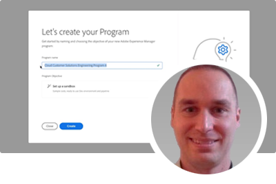

# AEM as a Cloud Service Experts Series

Découvrez Adobe Experience Manager (AEM) as a Cloud Service grâce aux ingénieures et ingénieurs experts d’Adobe qui se chargent de sa conception et à l’équipe de services professionnels qui l’implémente. Rejoignez les personnes expertes d’Adobe pour explorer AEM as a Cloud Service, les similitudes et les différences par rapport à AEM 6, et découvrir comment passer d’AEM 6 à AEM as a Cloud Service.

  
 

## Prise en main d’AEM as a Cloud Service

Découvrez les principes de base d’AEM as a Cloud Service et en quoi il diffère d’AEM 6, avec les personnes chargées de l’architecture cloud de l’équipe d’ingénierie d’Adobe.

<table>
  <tr>
   <td>
      
      

         <a href="../../migration/moving-to-aem-as-a-cloud-service/introduction.md"><strong>Penser différemment</strong></a>
 <em>avec Darin Kuntze, architecte cloud senior</em>
      

      

         
Un coup d’œil à l’architecture d’AEM as a Cloud Service et à la manière de penser différemment les implémentations d’AEM as a Cloud Service.
      

     </td>   
     <td>
      
      

         <a href="../../migration/moving-to-aem-as-a-cloud-service/onboarding.md"><strong>Intégration à AEM as a Cloud Service</strong></a>
 <em>avec Damian Langsweirdt, architecte cloud senior</em>
      

      

         
Découvrez l’intégration à AEM as a Cloud Service, en commençant par la phase de contrat pour configurer des environnements en libre-service à l’aide de Cloud Manager.
      

   </td>     
   </td>   
     <td>
      
      

         <a href="../../migration/moving-to-aem-as-a-cloud-service/cloud-manager.md"><strong>Cloud Manager pour AEM as a Cloud Service</strong></a>
 <em>avec Bryan Stopp, architecte cloud senior</em>
      

      

         
Découvrez Cloud Manager pour AEM as a Cloud Service et ses différences avec Cloud Manager pour AEM sur Adobe Manage Services (AMS).
      

   </td> 
  </tr>
</table>

## Passer à AEM as a Cloud Service ?

Vous envisagez de passer d’AEM 6 à AEM as a Cloud Service ? Découvrez la méthodologie d’Adobe pour passer à AEM as a Cloud Service, ainsi que les divers outils et fonctionnalités qui font de cette transition un processus fluide.

<table>
  <tr>
   <td>
      
      

         <a href="../../migration/moving-to-aem-as-a-cloud-service/bpa-and-cam.md" target="_aem-experts-series-video"><strong>Méthodologie de migration</strong></a>
 <em>avec Roger Blanton, architecte technique des services de conseil Adobe</em>
      

      

         
Découvrez la méthodologie de migration des bonnes pratiques pour passer d’AEM 6 à AEM as a Cloud Service à l’aide du Best Practices Analyzer (BPA) et du Cloud Acceleration Manager (CAM) d’AEM.
      

   </td>   
     <td>
      
      

         <a href="../../migration/moving-to-aem-as-a-cloud-service/aem-modernization-tools.md" target="_aem-experts-series-video"><strong>Moderniser le contenu</strong></a>
 <em>avec Bryan Stopp, architecte cloud senior</em>
      

      

         
Découvrez comment moderniser automatiquement votre contenu AEM pour tirer parti des dernières fonctionnalités d’AEM as a Cloud Service.
      

   </td>     
   </td>   
     <td>
      
      

         <a href="../../migration/moving-to-aem-as-a-cloud-service/repository-modernization.md" target="_aem-experts-series-video"><strong>Moderniser un projet Maven AEM</strong></a>
 <em>avec Varun Mitra, architecte cloud</em>
      

      

         
Découvrez comment moderniser automatiquement la structure et l’organisation du projet Maven de votre application AEM personnalisée pour la rendre compatible avec AEM as a Cloud Service et conforme aux bonnes pratiques d’Adobe les plus récentes.
      

   </td> 
  </tr>
  <tr>
   <td>
      
      

         <a href="../../migration/moving-to-aem-as-a-cloud-service/search-and-indexing.md" target="_aem-experts-series-video"><strong>Moderniser les index Oak</strong></a>
 <em>avec Darin Kuntze, architecte cloud senior</em>
      

      

         
Découvrez comment convertir automatiquement les définitions d’index Oak AEM 6 pour les rendre compatibles avec AEM as a Cloud Service, et comment continuer à utiliser les index Oak dans AEM as a Cloud Service.
      

   </td>   
     <td>
      
      

         <a href="../../migration/moving-to-aem-as-a-cloud-service/dispatcher.md" target="_aem-experts-series-video"><strong>Moderniser la configuration de Dispatcher</strong></a>
 <em>avec Bryan Stopp, architecte cloud senior</em>
      

      

         
Découvrez le Dispatcher AEM pour AEM as a Cloud Service, en vous concentrant sur les principales différences par rapports au Dispatcher version 6, l’outil de conversion du Dispatcher et sur l’utilisation du SDK des outils du Dispatcher.
      

   </td>     
   </td>   
     <td>
      
      

         <a href="../../migration/moving-to-aem-as-a-cloud-service/content-migration/content-transfer-tool.md" target="_aem-experts-series-video"><strong>Transférer le contenu vers AEM as a Cloud Service</strong></a>
 <em>avec Kiran Murugulla, architecte cloud senior</em>
      

      

         
Découvrez comment l’outil de transfert de contenu vous aide à migrer le contenu vers AEM as a Cloud Service à partir d’AEM 6.3 et ultérieure.
      

   </td> 
  </tr>  
</table>

## Fonctionnalités d’AEM as a Cloud Service

Découvrez les fonctionnalités uniques d’AEM as a Cloud Service grâce aux personnes expertes d’Adobe.

<table>
  <tr>
   <td>
      
      

         <a href="../../migration/moving-to-aem-as-a-cloud-service/asset-compute-microservices.md" target="_aem-experts-series-video"><strong>Microservices Asset Compute</strong></a>
 <em>avec Amol Anand, architecte cloud principal</em>
      

      

         
Découvrez les microservices Asset Compute d’AEM Assets, en quoi ils remplacent le traitement des ressources d’AEM 6 et comment ils peuvent être étendus pour générer des rendus de ressources personnalisés.
      

   </td>   
   <td>
      
      

         <a href="../../migration/moving-to-aem-as-a-cloud-service/content-migration/bulk-import-service.md" target="_aem-experts-series-video"><strong>Importer du contenu en bloc</strong></a>
 <em>avec Kiran Murugulla, architecte cloud senior</em>
      

      

         
Découvrez comment importer du contenu en bloc de manière sécurisée et efficace vers AEM as a Cloud Service à l’aide du service d’import en bloc et du gestionnaire de packages d’AEM.
      

   </td> 
    <td></td>
  </tr>
</table>

## Besoin d’aide avec AEM as a Cloud Service ?

Découvrez comment déboguer et dépanner AEM as a Cloud Service et le SDK AEM grâce à nos personnes expertes.

<table>
  <tr>
   <td>
      
      

         <a href="../../migration/moving-to-aem-as-a-cloud-service/troubleshooting.md" 
         target="_aem-experts-series-video"><strong>Dépannage d’AEM as a Cloud Service</strong></a>
 <em>avec Kunwar Saluja, architecte cloud</em>
      

      

         
Découvrez comment résoudre différents aspects d’AEM as a Cloud Service, allant du débogage du SDK AEM et d’AEM as a Cloud Service aux échecs de création et de déploiement de Cloud Manager.
      

   </td>   
    <td></td>
    <td></td>
  </tr>
</table>
