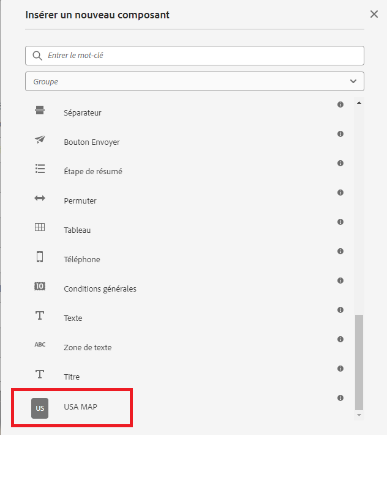

# Création d’un composant

Cet article suppose que vous avez une certaine expérience du développement pour AEM Forms CS. Il est également supposé que vous avez créé un projet d’archétype AEM Forms.

Ouvrez votre projet AEM Forms dans IntelliJ ou tout autre IDE de votre choix. Créez un nœud appelé svg sous

```
apps\corecomponent\components\adaptiveForm
```

>[!NOTE]
>
> ``corecomponent`` est l’appId fourni lors de la création du projet Maven. Cet appId peut être différent dans votre environnement.


## Création d’un fichier .content.xml

Créez un fichier appelé content.xml sous le nœud svg. Ajoutez le contenu suivant dans le fichier que vous venez de créer. Vous pouvez modifier les éléments jcr:description, jcr:title et componentGroup selon vos besoins.

```xml
<?xml version="1.0" encoding="UTF-8"?>
<jcr:root xmlns:jcr="http://www.jcp.org/jcr/1.0" xmlns:cq="http://www.day.com/jcr/cq/1.0" xmlns:sling="http://sling.apache.org/jcr/sling/1.0"
    jcr:description="USA MAP"
    jcr:primaryType="cq:Component"
    jcr:title="USA MAP"
    sling:resourceSuperType="wcm/foundation/components/responsivegrid"
    componentGroup="CustomCoreComponent - Adaptive Form"/>
```

## Création de svg.html

Créez un fichier appelé svg.html. Ce fichier va rendre le SVG de la carte USA. Copiez le contenu de [svg.html](assets/svg.html) dans le fichier nouvellement créé. Ce que vous avez copié est le SVG de la carte USA. Enregistrez le fichier.

## Déploiement du projet

Déployez le projet sur votre instance locale prête pour le cloud afin de tester le composant.

Pour déployer le projet, vous devez accéder au dossier racine du projet dans la fenêtre d’invite de commande et exécuter la commande suivante.

```
mvn clean install -PautoInstallSinglePackage
```

Le projet sera alors déployé sur votre instance AEM Forms locale et le composant pourra être inclus dans votre formulaire adaptatif.


