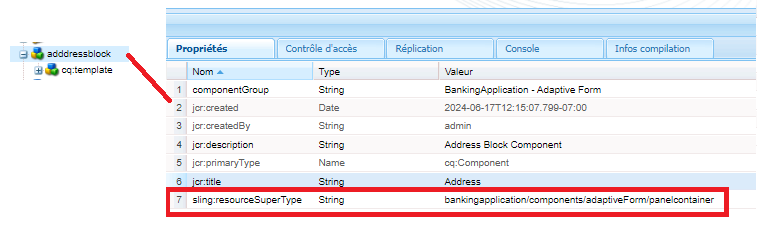
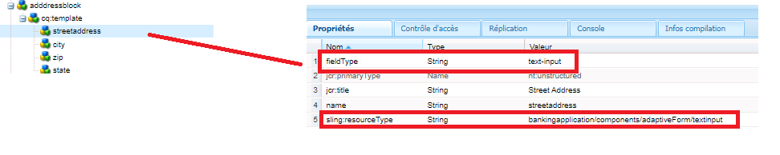
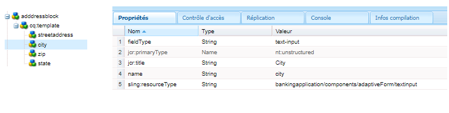
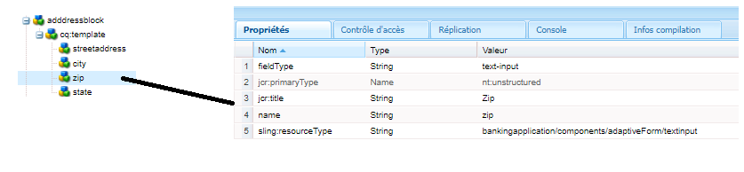

# Création d’un composant d’adresse

Connectez-vous à CRXDE sur votre instance locale prête pour le cloud d’AEM Forms.

Effectuez une copie du nœud ``/apps/bankingapplication/components/adaptiveForm/button`` et renommez-le addressblock. Sélectionnez le nœud addressblock et définissez ses propriétés comme illustré ci-dessous.

>[!NOTE]
>
> ``bankingapplication`` est l’appId fourni lors de la création du projet Maven. Cet appId peut être différent dans votre environnement. Vous pouvez effectuer une copie de n’importe quel composant, j’ai ici choisi de faire une copie du composant de bouton.

## Propriétés du nœud cq-template

Sélectionnez le nœud ``cq-template`` sous le nœud ``addressblock`` et définissez ses propriétés comme illustré ci-dessous. Notez que le fieldType est défini sur panel.

## Ajout de nœuds sous cq-template

Ajoutez les nœuds suivants de type ``nt:unstructured`` sous ``cq-template`` :

* streetaddress
* city
* zip
* state

Ces nœuds représentent les champs du composant de bloc d’adresse. Les champs streetaddress, city et zip seront un champ de saisie de texte et le champ state un champ de liste déroulante.

## Définition des propriétés du nœud streetaddress

>[!NOTE]
>
> La partie **_bankingapplication_** du chemin d’accès fait référence à l’appId du projet Maven. Cela peut être différent dans votre environnement.

Sélectionnez le nœud ``streetaddress`` et définissez ses propriétés comme illustré ci-dessous.

## Définition des propriétés du nœud city

Sélectionnez le nœud ``city`` et définissez ses propriétés comme illustré ci-dessous.

## Définition des propriétés du nœud zip

Sélectionnez le nœud ``zip`` et définissez ses propriétés comme illustré ci-dessous.

## Définition des propriétés du nœud state

Sélectionnez le nœud ``state`` et définissez ses propriétés comme illustré ci-dessous. Remarquez le fieldType du champ state : il est défini comme une liste déroulante.

## Définition des options du champ d’état

Sélectionnez le nœud ``state`` et ajoutez les propriétés suivantes.

| Nom | Type | Valeur |
|----------|----------|---------------------|
| enum | String[] | CA,NY |
| enumNames | String[] | Californie, New York |

Le résultat final du composant addressblock ressemblera à celui-ci :

## Étapes suivantes

[Déploiement du projet](./deploy-your-project.md)
