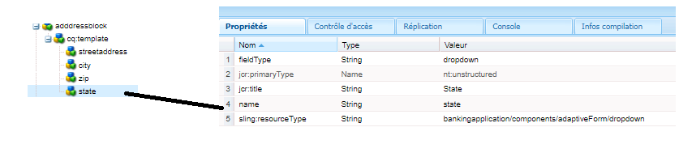

# Créer un composant Adresse

Connectez-vous à CRXDE de votre instance locale prête pour le cloud d’AEM Forms.

Effectuez une copie du noeud ``/apps/bankingapplication/components/adaptiveForm/button`` et renommez-le en bloc d’adresse. Sélectionnez le noeud address block et définissez ses propriétés comme illustré ci-dessous.

>[!NOTE]
>
> ``bankingapplication`` est l’appId fourni lors de la création du projet Maven. Cet appId peut être différent dans votre environnement. Vous pouvez faire une copie de n&#39;importe quel composant. Il se trouve que je fais une copie du composant de bouton.

## Propriétés du noeud cq-template

Sélectionnez le noeud ``cq-template`` sous le noeud ``addressblock`` et définissez ses propriétés comme illustré ci-dessous. Notez que le champType est défini sur panneau.

## Ajout de noeuds sous cq-template

Ajoutez les noeuds suivants de type ``nt:unstructured`` sous ``cq-template``

* streetaddress
* city
* zip
* state

Ces noeuds représentent les champs du composant de bloc d’adresse. Les champs streetaddress, city et zip seront un champ de saisie de texte et le champ state un champ de liste déroulante.

## Définir les propriétés du noeud streetaddress

>[!NOTE]
>
> L’ **_application bancaire_** du chemin d’accès fait référence à l’appId du projet Maven. Cela peut être différent dans votre environnement.

Sélectionnez le noeud ``streetaddress`` et définissez ses propriétés comme illustré ci-dessous.

## Définition des propriétés du noeud city

Sélectionnez le noeud ``city`` et définissez ses propriétés comme illustré ci-dessous.

## Définition des propriétés du noeud zip

Sélectionnez le noeud ``zip`` et définissez ses propriétés comme illustré ci-dessous.

## Définition des propriétés du noeud d’état

Sélectionnez le noeud ``state`` et définissez ses propriétés comme illustré ci-dessous. Remarquez le champType d’état : il est défini comme une liste déroulante.

## Définition des valeurs par défaut du champ d’état

Sélectionnez le noeud ``state`` et ajoutez les propriétés suivantes.

| Nom | Type | Valeur |
|----------|----------|---------------------|
| enum | Chaîne[] | CA,NY |
| enumNames | Chaîne[] | Californie, New York |

Le composant de bloc d’adresse final ressemblera à ceci :

## Étapes suivantes

[Déploiement du projet](./deploy-your-project.md)
