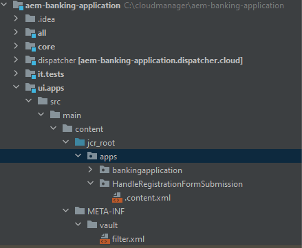
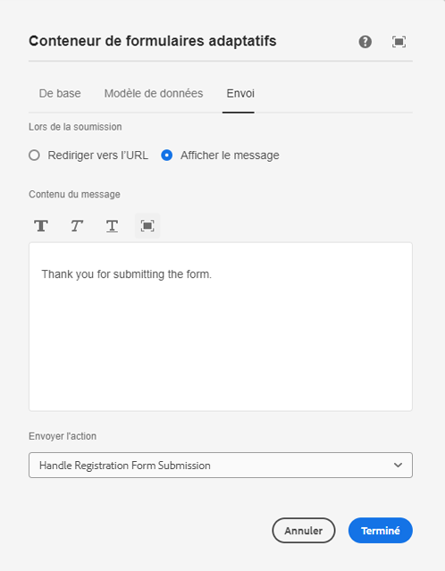

# Créer un envoi personnalisé

AEM Forms fournit un certain nombre d’options d’envoi prêtes à l’emploi qui répondent à la plupart des cas d’utilisation. Outre ces actions d’envoi prédéfinies, AEM Forms vous permet d’écrire votre propre gestionnaire d’envoi personnalisé pour traiter l’envoi du formulaire selon vos besoins.

Pour créer un service d’envoi personnalisé, procédez comme suit :

## Créer un projet AEM

Si vous disposez déjà d’un projet AEM Forms Cloud Service, [passez à l’écriture d’un service d’envoi personnalisé](#Write-the-custom-submit-service).

* Créez un dossier appelé « cloudmanager » sur le lecteur C.
* Accédez à ce dossier.
* Copiez et collez le contenu de [ce fichier texte](./assets/creating-maven-project.txt) dans la fenêtre de l’invite de commande. Vous devrez peut-être modifier DarchetypeVersion=41 en fonction de la [dernière version](https://github.com/adobe/aem-project-archetype/releases) disponible. La version 41 était la plus récente au moment de la rédaction de cet article.
* Exécutez la commande en appuyant sur la touche Entrée. Si tout se passe correctement, le message de réussite de la création s’affiche.

## Écrire le service d’envoi personnalisé{#Write-the-custom-submit-service}

Lancez IntelliJ et ouvrez le projet AEM. Créez une nouvelle classe java appelée **HandleRegistrationFormSubmission**, comme illustré dans la copie d’écran ci-dessous.


Le code suivant permet d’implémenter le service.

```java
package com.aem.bankingapplication.core;
import java.util.HashMap;
import java.util.Map;
import com.google.gson.Gson;
import org.osgi.service.component.annotations.Component;
import com.adobe.aemds.guide.model.FormSubmitInfo;
import com.adobe.aemds.guide.service.FormSubmitActionService;
import com.adobe.aemds.guide.utils.GuideConstants;
import com.google.gson.JsonObject;
import org.slf4j.*;

@Component(
        service=FormSubmitActionService.class,
        immediate = true
)
public class HandleRegistrationFormSubmission implements FormSubmitActionService {
    private static final String serviceName = "Core Custom AF Submit";
    private static Logger logger = LoggerFactory.getLogger(HandleRegistrationFormSubmission.class);


    @Override
    public String getServiceName() {
        return serviceName;
    }

    @Override
    public Map<String, Object> submit(FormSubmitInfo formSubmitInfo) {
        logger.error("in my custom submit service");
        Map<String, Object> result = new HashMap<>();
        logger.error("in my custom submit service");
        String data = formSubmitInfo.getData();
        JsonObject formData = new Gson().fromJson(data,JsonObject.class);
        logger.error("The form data is "+formData);
        JsonObject jsonObject = new JsonObject();
        jsonObject.addProperty("firstName",formData.get("firstName").getAsString());
        jsonObject.addProperty("lastName",formData.get("lastName").getAsString());
        result.put(GuideConstants.FORM_SUBMISSION_COMPLETE, Boolean.TRUE);
        result.put("json",jsonObject.toString());
        return result;
    }

}
```

## Créer un nœud CRX sous apps

Développez le nœud ui.apps et créez un package du nom **HandleRegistrationFormSubmission** sous le nœud apps, comme illustré dans la copie d’écran ci-dessous.

Créez un fichier du nom .content.xml sous **HandleRegistrationFormSubmission**. Copiez et collez le code suivant dans le fichier .content.xml.

```xml
<?xml version="1.0" encoding="UTF-8"?>
<jcr:root xmlns:jcr="http://www.jcp.org/jcr/1.0" xmlns:sling="http://sling.apache.org/jcr/sling/1.0"
    jcr:description="Handle Registration Form Submission"
    jcr:primaryType="sling:Folder"
    guideComponentType="fd/af/components/guidesubmittype"
    guideDataModel="xfa,xsd,basic"
    submitService="Core Custom AF Submit"/>
```

La valeur de l’élément **submitService** doit correspondre à celle de **serviceName = &quot;Core Custom AF Submit&quot;** dans l’implémentation de FormSubmitActionService.

## Déployez le code sur votre instance AEM Forms locale.

Avant d’envoyer les modifications au référentiel Cloud Manager, il est recommandé de déployer le code sur votre instance de création locale prête pour le cloud afin de tester le code. Assurez-vous que l’instance de création est en cours d’exécution.
Pour déployer le code vers votre instance de création prête pour le cloud, accédez au dossier racine de votre projet AEM et exécutez la commande suivante :

```
mvn clean install -PautoInstallSinglePackage
```

Le code est alors déployé sous la forme d’un package unique sur votre instance de création.

## Envoyez le code à Cloud Manager et déployez-le.

Après vérification du code sur votre instance locale, transmettez-le sur votre instance cloud.
Envoyez les modifications à votre référentiel Git local, puis au référentiel Cloud Manager. Pour en savoir plus, consultez les articles [Configuration de Git](https://experienceleague.adobe.com/docs/experience-manager-learn/cloud-service/forms/developing-for-cloud-service/setup-git.html?lang=fr), [Envoyer le projet AEM vers le référentiel Cloud Manager](https://experienceleague.adobe.com/docs/experience-manager-learn/cloud-service/forms/developing-for-cloud-service/push-project-to-cloud-manager-git.html?lang=fr) et [Déployer sur l’environnement de développement](https://experienceleague.adobe.com/docs/experience-manager-learn/cloud-service/forms/developing-for-cloud-service/deploy-to-dev-environment.html?lang=fr).

Une fois le pipeline exécuté correctement, vous pouvez associer l’action d’envoi de votre formulaire au gestionnaire d’envoi personnalisé, comme illustré dans la copie d’écran ci-dessous.


## Étapes suivantes

[Afficher la réponse personnalisée dans votre application React](./handle-response-react-app.md)
